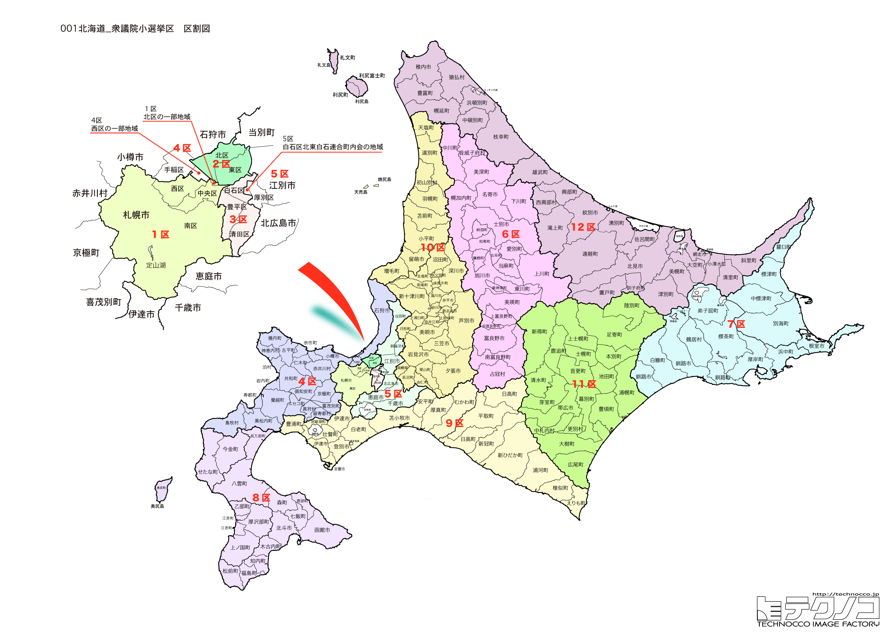

# 北海道



---

## 基本情報

北海道は日本最北の都道府県であり、面積は約8.3万平方キロメートルで国土の約22%を占める日本最大の都道府県である。人口は約520万人で、その約4割が札幌市に集中している。

歴史的には、アイヌ民族が先住し独自の文化を築いてきた地である。明治時代以降、開拓使の設置により本格的な開発が始まり、屯田兵制度などによって全国各地から入植者が集まった。このため、本州以南の地域と比べて地縁・血縁による政治的なしがらみが薄い。

経済的には農業、漁業、観光業が主要産業である。十勝平野では大規模畑作農業が行われ、小麦、馬鈴薯、甜菜などの生産量は日本一。酪農も盛んで、生乳生産量は全国の半分以上を占める。漁業では、サケ、ホタテ、カニ、ウニなどが特産品。観光では、札幌の雪まつり、富良野のラベンダー畑、知床の世界自然遺産など、年間を通じて国内外から多くの観光客が訪れる。

---

## 北海道の政治的争点

### 人口減少と地方消滅

北海道の人口減少は全国平均より10年先行しており、2045年までに8割以上の市町村で人口が3割以上減少すると予測されている。特に農村部・漁村部での過疎化が深刻で、医療・介護・交通などの生活インフラ維持が課題となっている。

### 農業・漁業の振興

北海道は日本の食料基地であり、農業・漁業政策は選挙の重要争点。TPPや日欧EPAなどの貿易自由化への対応、担い手不足、気候変動への適応などが課題。

### エネルギー政策

泊原発の再稼働問題、再生可能エネルギー（風力、太陽光）の推進、冬季の暖房費高騰への対策などが議論されている。

### 2026年選挙の特徴

2月の投票は36年ぶりの冬季選挙となり、厳寒期の投票率低下が懸念されている。特に高齢者や遠隔地の有権者への影響が注目される。

---

## 選挙の特徴

北海道の衆議院小選挙区は12。広大な面積を持つため、1選挙区あたりの面積は全国最大級となる地域もある。

かつては革新勢力が強い「革新王国」と呼ばれた時期もあったが、近年は自民党と立憲民主党が拮抗する激戦区が多い。地縁・血縁による政治的なしがらみが薄く、選挙においても無党派層の動向が結果を左右しやすい傾向がある。

2024年の衆院選では、裏金問題の影響で立憲民主党が躍進し、12選挙区中9選挙区で勝利した。

**2026年選挙の構図**: 立憲民主党と公明党が合流した「中道改革連合」vs「自民党・維新連立」の対決が軸。道内12選挙区すべてで両者が激突。中道は全12区に現職を擁立し、自民は前職5人・元職4人・新人3人で挑む。5区・7区・8区・10区・12区は一騎打ちの公算。

---

## 第1区

### 地域構成

北海道1区は札幌市の中央区、南区、西区の一部で構成される。

- **札幌市中央区**: 道庁、市役所、大通公園、すすきの歓楽街を擁する北海道の心臓部。時計台や赤れんが庁舎（北海道庁旧本庁舎）は札幌を象徴する観光スポットである。大通公園では毎年2月にさっぽろ雪まつりが開催され、200万人以上の観光客が訪れる。

- **札幌市南区**: 面積が札幌市全体の約6割を占める広大な区で、定山渓温泉や札幌国際スキー場などの観光地を含む。藻岩山からの夜景は「日本新三大夜景」に選ばれている。

### 選挙区の特徴

北海道の政治・経済の中心地であり、都市型選挙区の典型。無党派層が多く、風向きによって結果が変わりやすい。2024年は立憲が勝利したが、2026年は国民民主党の参入で野党票の分散が懸念されている。

### 2024年選挙結果

```
道下大樹（立憲）         ██████████████░░░░░░  43.3%  108,394票 ✅当選
加藤貴弘（自民）         ██████████░░░░░░░░░░  32.0%   80,133票 
千葉尚子（共産）         ██░░░░░░░░░░░░░░░░░░   8.6%   21,451票 
田中義人（参政）         ██░░░░░░░░░░░░░░░░░░   8.0%   20,097票 
小林悟（維新）          ██░░░░░░░░░░░░░░░░░░   8.0%   20,000票 
──────────────────────────────────────────────────────────
投票率: 56.5% ｜ 票差: 28,261票（11.3pt差）
```

### 2026年選挙の構図

```
道下大樹（中道改革連合・前職、50歳）      当選3回
かとう貴弘（自民・新人、43歳）
森つねと（共産・新人、48歳）
加納ちずこ（参政・新人、50歳）
臼木ひでたけ（国民・前職、44歳）         当選1回
```

2024年に小選挙区で勝利した道下大樹(中道改革連合)が再選を目指す。自民の新人かとう貴弘、共産の森つねと、参政党の加納ちずこ、国民の臼木ひでたけ(前職)の5人の争い。国民民主党の参入で野党票の分散が懸念される。

---

## 第2区

### 地域構成

北海道2区は札幌市北区、東区で構成される。住宅地と工業地帯が混在する地域。

- **札幌市北区**: 人口約29万人で札幌市内最多。北海道大学のキャンパスがあり、ポプラ並木やクラーク像が有名。麻生地区は商業施設が集積している。

- **札幌市東区**: サッポロビール園やアリオ札幌などがある。モエレ沼公園は彫刻家イサム・ノグチが設計した広大な公園で、ガラスのピラミッドが象徴的。

### 選挙区の特徴

住宅地と工業地帯が混在する都市型選挙区。立憲と自民が接戦を繰り広げる激戦区で、維新・参政党も候補を擁立予定。

### 2024年選挙結果

```
松木謙公（立憲）         █████████████░░░░░░░  40.0%   94,002票 ✅当選
髙橋祐介（自民）         ██████████░░░░░░░░░░  32.7%   76,835票 
山崎泉（維新）          ████░░░░░░░░░░░░░░░░  13.7%   32,073票 
宮内史織（共産）         ████░░░░░░░░░░░░░░░░  13.6%   31,855票 
──────────────────────────────────────────────────────────
投票率: 52.6% ｜ 票差: 17,167票（7.3pt差）
```

### 2026年選挙の構図

```
松木けんこう（中道改革連合・前職、66歳）      当選7回
髙橋ゆうすけ（自民・元職、45歳）          当選1回
山崎泉（維新・新人、52歳）             会社役員
中田あやこ（参政・新人、49歳）           学童支援員
平岡だいすけ（共産・新人、37歳）          党政策委員長
```

2024年に小選挙区で勝利した松木けんこう(中道改革連合)が再選を目指す。元職の髙橋ゆうすけ(自民)が雪辱を狙い、維新の山崎泉、参政党の中田あやこ(学童支援員)、共産の平岡だいすけの5人の争い。

---

## 第3区

### 地域構成

北海道3区は札幌市白石区、豊平区、清田区で構成される。

- **札幌市豊平区**: 札幌ドームの所在地。羊ヶ丘展望台にはクラーク博士像があり、「Boys, be ambitious（少年よ、大志を抱け）」の言葉で有名。

- **札幌市白石区**: 交通の要衝で、JR・地下鉄・バスのターミナルがある。

- **札幌市清田区**: 1997年に豊平区から分区した比較的新しい区で、住宅地が広がる。

### 選挙区の特徴

札幌市南東部の住宅地を含む都市型選挙区。立憲と自民の一騎打ちが続く激戦区。

### 2024年選挙結果

```
荒井優（立憲）          █████████████░░░░░░░  41.7%  100,136票 ✅当選
高木宏壽（自民）         ███████████░░░░░░░░░  34.6%   83,089票 
伊藤理智子（共産）        ███░░░░░░░░░░░░░░░░░   9.6%   22,915票 
鳥越良孝（維新）         ███░░░░░░░░░░░░░░░░░   9.1%   21,802票 
増田健治（無所属）        █░░░░░░░░░░░░░░░░░░░   5.0%   11,972票 
──────────────────────────────────────────────────────────
投票率: 53.6% ｜ 票差: 17,047票（7.1pt差）
```

### 2026年選挙の構図

```
荒井ゆたか（中道改革連合・前職、50歳）      当選2回
高木ひろひさ（自民・元職、65歳）          当選3回
まるこゆう子（共産・新人、62歳）          政党役員
中島よしき（参政・新人、47歳）           会社員
```

2024年に小選挙区で勝利した荒井ゆたか(中道改革連合・学校法人役員)が再選を目指す。元職の高木ひろひさ(自民)が雪辱を狙い、共産のまるこゆう子、参政党の中島よしきの4人の争い。

---

## 第4区

### 地域構成

北海道4区は札幌市手稲区、小樽市、石狩市、後志総合振興局管内で構成される。都市部から農村・観光地まで多様な地域を含む。

- **小樽市**: かつて「北のウォール街」と呼ばれた港湾都市。小樽運河は明治・大正期の石造り倉庫群が立ち並ぶ観光名所。寿司屋通り、ガラス工芸、オルゴール堂なども有名。ニシン漁で栄えた歴史があり、鰊御殿が残る。

- **ニセコ**（後志管内）: 世界的に有名なスキーリゾート。パウダースノーを求めて海外からのスキーヤーが多く訪れ、外国人観光客・移住者が増加している。羊蹄山は「蝦夷富士」と呼ばれる美しい円錐形の山。

- **余市町**: ニッカウヰスキー余市蒸留所の所在地。宇宙飛行士・毛利衛の出身地でもある。

### 選挙区の特徴

札幌近郊から観光地ニセコまで、都市部と農村が混在する選挙区。立憲と自民が接戦を繰り広げる激戦区で、2024年は立憲が勝利。

### 2024年選挙結果

```
大築紅葉（立憲）         ███████████████░░░░░  45.1%  101,484票 ✅当選
中村裕之（自民）         █████████████░░░░░░░  41.8%   94,090票 🔄比例
佐々木明美（共産）        ██░░░░░░░░░░░░░░░░░░   8.5%   19,063票 
斎藤佳代（無所属）        █░░░░░░░░░░░░░░░░░░░   4.6%   10,322票 
──────────────────────────────────────────────────────────
投票率: 57.3% ｜ 票差: 7,394票（3.3pt差）
```

### 2026年選挙の構図

```
おおつきくれは（中道改革連合・前職、42歳）    当選2回
中村ひろゆき（自民・前職、64歳）          当選5回
佐々木あけみ（共産・新人、65歳）          党政策委員長
たかはし翔太（参政・新人、37歳）          公認心理師
```

2024年に小選挙区で勝利したおおつきくれは(中道改革連合・政党役員)が再選を目指す。前職の中村ひろゆき(自民)が再挑戦、共産の佐々木あけみ、参政党のたかはし翔太(公認心理師)の4人の争い。接戦が予想される。

---

## 第5区

### 地域構成

北海道5区は札幌市厚別区、江別市、千歳市、恵庭市、北広島市、石狩振興局管内の一部で構成される。札幌近郊のベッドタウンと空の玄関口を含む。

- **千歳市**: 新千歳空港の所在地で、北海道の空の玄関口。支笏湖は日本有数の透明度を誇るカルデラ湖で、支笏洞爺国立公園に含まれる。自衛隊の駐屯地もあり、防衛関連の雇用も多い。

- **北広島市**: 2023年に北海道日本ハムファイターズの本拠地「エスコンフィールドHOKKAIDO」が開業し、注目を集めている。ボールパーク周辺の開発が進む。

- **江別市**: 酪農学園大学や北翔大学などがある学園都市。レンガ生産が盛んで「レンガのまち」としても知られる。

### 選挙区の特徴

自衛隊駐屯地を含む保守的な土壌だが、2024年は裏金問題で和田義明が比例重複を認められず、立憲が大勝。2026年は自民が比例重複復活で再挑戦。

### 2024年選挙結果

```
池田真紀（立憲）         █████████████████░░░  51.7%  125,444票 ✅当選
和田義明（自民）         █████████████░░░░░░░  41.6%  100,893票 
鈴木龍次（共産）         ██░░░░░░░░░░░░░░░░░░   6.8%   16,399票 
──────────────────────────────────────────────────────────
投票率: 58.2% ｜ 票差: 24,551票（10.1pt差）
```

### 2026年選挙の構図

```
池田まき（中道改革連合・前職、53歳）       政党役員、当選2回
和田よしあき（自民・元職、54歳）          選挙区支部長、当選3回
```

2024年に小選挙区で大勝した池田まき(中道改革連合)と、元職の和田よしあき(自民)の再戦。一騎打ちとなる。2026年選挙では、自民党は裏金問題に関与した候補者にも比例重複を認める方針に転換しており、和田にとっては「前回の選挙で禊は済んだ」との主張で再挑戦。

---

## 第6区

### 地域構成

北海道6区は旭川市、上川総合振興局管内で構成される。北海道第二の都市と広大な農村・山岳地帯を含む。

- **旭川市**: 人口約33万人で北海道第二の都市。旭山動物園は「行動展示」で全国的に有名になり、年間約140万人が訪れる。旭川ラーメンは醤油ベースのスープが特徴。旭川家具は高い品質で知られる。上川盆地に位置し、夏は暑く冬は厳寒で、日本の最低気温（-41℃）を記録したこともある。

- **富良野市**: ラベンダー畑で有名な観光地。ドラマ「北の国から」のロケ地としても知られる。スキーリゾートとしても人気。

- **大雪山国立公園**: 北海道の屋根と呼ばれる大雪山系を含み、日本最大の国立公園。高山植物や紅葉が美しい。

### 選挙区の特徴

北海道第二の都市・旭川を中心とする選挙区。2024年は自民党が勝利した数少ない選挙区の一つで、自民が比較的強い地盤を持つ。立憲との接戦が続く。

### 2024年選挙結果

```
東国幹（自民）          ███████████████░░░░░  46.9%  100,694票 ✅当選
西川将人（立憲）         ██████████████░░░░░░  43.9%   94,193票 🔄比例
荻生和敏（共産）         ███░░░░░░░░░░░░░░░░░   9.3%   19,909票 
──────────────────────────────────────────────────────────
投票率: 55.3% ｜ 票差: 6,501票（3.0pt差）
```

### 2026年選挙の構図

```
東くによし（自民・前職、57歳）           選挙区支部長、当選2回
にしかわ将人（中道改革連合・前職、57歳）    政党役員、当選1回
おぎう和敏（共産・新人、76歳）           党事務所長
```

2024年に小選挙区で勝利した東くによし(自民)と、比例復活したにしかわ将人(中道改革連合)の再戦。共産のおぎう和敏(76歳)も加わる3人の争い。接戦が予想される。

---

## 第7区

### 地域構成

北海道7区は釧路市、根室市、釧路総合振興局管内、根室振興局管内で構成される。日本最東端の地域を含む広大な選挙区。

- **釧路市**: 道東の中核都市で、かつては石炭産業と製紙業で栄えた。釧路湿原国立公園は日本最大の湿原で、タンチョウの生息地として知られる。和商市場の「勝手丼」は観光名所。

- **根室市**: 日本最東端の都市で、北方領土返還運動の拠点。納沙布岬からは歯舞群島を望むことができる。花咲ガニの産地として有名。

- **知床半島**（羅臼町、斜里町）: 2005年に世界自然遺産に登録された。流氷や野生動物（ヒグマ、オオワシなど）が見られる手つかずの自然が魅力。

### 選挙区の特徴

鈴木宗男から娘の鈴木貴子が地盤を引き継ぎ、自民党が強い選挙区。北方領土返還運動の拠点であり、対ロシア外交が争点になりやすい。

### 2024年選挙結果

```
鈴木貴子（自民）         ███████████████████░  58.4%   77,189票 ✅当選
篠田奈保子（立憲）        █████████████░░░░░░░  41.6%   54,888票 🔄比例
──────────────────────────────────────────────────────────
投票率: 56.6% ｜ 票差: 22,301票（16.9pt差）
```

### 2026年選挙の構図

```
篠田奈保子（中道改革連合・前職、54歳）      当選1回、弁護士
鈴木たかこ（自民・前職、40歳）           当選5回、党広報本部長
```

2024年に一騎打ちで敗れた篠田奈保子(中道改革連合・弁護士)が再挑戦。鈴木たかこ(自民)は父・宗男氏から地盤を継承し、強固な支持基盤を持つ。北方領土返還運動の拠点であり対ロシア外交も争点。

---

## 第8区

### 地域構成

北海道8区は函館市、渡島総合振興局管内、檜山振興局管内で構成される。道南の中核都市と農漁村地帯を含む。

- **函館市**: 人口約25万人の道南の中心都市。函館山からの夜景は「100万ドルの夜景」として世界的に有名。五稜郭は幕末の箱館戦争の舞台となった星形の西洋式城郭。赤レンガ倉庫群、朝市、温泉など観光資源が豊富。北海道新幹線の北の終着駅（新函館北斗駅）がある。

- **松前町**: 北海道唯一の城下町で、松前城と桜で知られる。

- **大沼国定公園**: 駒ヶ岳の噴火によってできた湖沼群で、四季折々の美しい景観が楽しめる。

### 選挙区の特徴

道南の中心・函館を含む選挙区。逢坂誠二（元ニセコ町長）が強い地盤を持ち、立憲が優勢。住民参加型のまちづくりで知られる逢坂の手法が支持を集める。

### 2024年選挙結果

```
逢坂誠二（立憲）         ████████████████░░░░  50.8%   97,758票 ✅当選
向山淳（自民）          ██████████████░░░░░░  43.1%   83,006票 🔄比例
本間勝美（共産）         ██░░░░░░░░░░░░░░░░░░   6.1%   11,708票 
──────────────────────────────────────────────────────────
投票率: 57.0% ｜ 票差: 14,752票（7.7pt差）
```

### 2026年選挙の構図

```
おおさか誠二（中道改革連合・前職、66歳）    当選6回
向山じゅん（自民・前職、42歳）           当選1回
```

2024年に小選挙区で勝利したおおさか誠二(中道改革連合・元ニセコ町長)が再選を目指す。向山じゅん(自民)が比例復活から再挑戦。逢坂氏の住民参加型まちづくりの手法が支持される選挙区。

---

## 第9区

### 地域構成

北海道9区は室蘭市、苫小牧市、胆振総合振興局管内、日高振興局管内で構成される。工業都市と牧場地帯を含む。

- **苫小牧市**: 紙パルプ産業と港湾物流が主要産業。苫小牧港は北海道最大の物流拠点で、フェリーが本州各地を結ぶ。アイスホッケーが盛んで、多くのオリンピック選手を輩出している。

- **室蘭市**: 「鉄のまち」として知られ、日本製鉄（旧新日鐵住金）の製鉄所がある。地球岬は断崖絶壁の景勝地。工場夜景が観光資源として注目されている。

- **日高地方**: 競走馬の生産地として日本一。社台ファームなど有名な牧場が集中し、多くの名馬を輩出している。日高昆布の産地でもある。

### 選挙区の特徴

2024年に堀井学（自民）が政治資金法違反・公選法違反で逮捕・起訴され、自民は壊滅的な敗北。立憲・山岡達丸が大差で勝利。堀井事件の影響が残る選挙区。

### 2024年選挙結果

```
山岡達丸（立憲）         ██████████████████░░  56.1%  106,007票 ✅当選
松下英樹（自民）         ███████████░░░░░░░░░  33.0%   62,328票 
立野広志（共産）         ███░░░░░░░░░░░░░░░░░  10.9%   20,557票 
──────────────────────────────────────────────────────────
投票率: 53.4% ｜ 票差: 43,679票（23.1pt差）
```

### 2026年選挙の構図

```
山岡達丸（中道改革連合・前職、46歳）      当選4回、政党役員
松下ひでき（自民・新人、35歳）           選挙区支部長
たつの広志（共産・新人、68歳）           政治団体職員
かんのみほ（参政・新人、36歳）           パート
```

2024年に大勝した山岡達丸(中道改革連合)が再選を目指す。自民は新人の松下ひでき(35歳)を擁立し世代交代。共産のたつの広志、参政党のかんのみほも加わる4人の争い。2024年の堀井事件の影響が残る選挙区。

---

## 第10区

### 地域構成

北海道10区は夕張市、岩見沢市、留萌市、空知総合振興局管内、留萌振興局管内で構成される。旧産炭地と農業地帯を含む広大な選挙区。

- **夕張市**: かつて炭鉱で栄えたが、閉山後に過疎化が進み、2007年に財政破綻した。現在は「夕張メロン」のブランド化や観光振興で再生を図っている。映画祭「ゆうばり国際ファンタスティック映画祭」も開催されている。

- **岩見沢市**: 空知地方の中心都市。豪雪地帯として知られ、冬期間の除雪が課題。

- **留萌市**: 日本海側の港町で、ニシンそばやカズノコで知られる。

### 選挙区の特徴

立憲と公明が激突した珍しい選挙区。2024年は僅差で立憲・神谷裕が勝利。中道改革連合結成により、両者が同じ党になる可能性があり、候補者調整が焦点。

### 2024年選挙結果

```
神谷裕（立憲）          ████████████████░░░░  50.8%   78,362票 ✅当選
稲津久（公明）          ████████████████░░░░  49.2%   75,990票 
──────────────────────────────────────────────────────────
投票率: 59.9% ｜ 票差: 2,372票（1.5pt差）
```

### 2026年選挙の構図

```
神谷ひろし（中道改革連合・前職、57歳）    当選3回、政党役員
わたなべ孝一（自民・元職、68歳）         当選4回、前衆議院議員
```

2024年に僅差で勝利した神谷ひろし(中道改革連合)が再選を目指す。自民は元職のわたなべ孝一(68歳)を擁立し再挑戦。元公明の稲津久氏は中道改革連合の方針により小選挙区から撤退、比例北海道ブロック上位で処遇される。一騎打ちの激戦が予想される。

---

## 第11区

### 地域構成

北海道11区は帯広市、十勝総合振興局管内で構成される。日本有数の農業地帯。

- **帯広市**: 十勝平野の中心都市で人口約17万人。ばんえい競馬は世界唯一の競技で、巨大な馬がソリを引いて坂を登る。スイーツの町としても知られ、六花亭、柳月などの菓子メーカーが本社を置く。豚丼は帯広発祥のご当地グルメ。

- **十勝平野**: 日本最大級の畑作地帯で、小麦、馬鈴薯、甜菜、豆類の生産量は日本一。大規模機械化農業が行われ、「日本の穀倉地帯」と呼ばれる。ワイン用ブドウの栽培や、十勝ワインの生産も盛ん。

### 選挙区の特徴

元農林水産大臣・中川昭一の地盤だったが、立憲・石川香織が2期連続で勝利。2026年は自民が中川郁子ではなく甥の中川浩一（35歳）を擁立し世代交代を図る。農業政策が重要な争点。

### 2024年選挙結果

```
石川香織（立憲）         █████████████████░░░  52.2%   84,522票 ✅当選
中川郁子（自民）         █████████████░░░░░░░  41.3%   66,877票 
佐藤耕平（共産）         ██░░░░░░░░░░░░░░░░░░   6.4%   10,367票 
──────────────────────────────────────────────────────────
投票率: 59.9% ｜ 票差: 17,645票（10.9pt差）
```

### 2026年選挙の構図

```
石川かおり（中道改革連合・前職、41歳）    当選3回、政党役員
中川こういち（自民・新人、35歳）         選挙区支部長
うとたかし（参政・新人、51歳）          参議院議員神谷宗幣事務所勤務
```

2024年に勝利した石川かおり(中道改革連合)が再選を目指す。自民は中川郁子の甥・中川こういち(35歳・新人)を擁立し世代交代を図る。参政党のうとたかし(元自衛官)も加わる3人の争い。元農水大臣・中川昭一の地盤で農業政策が重要争点。

---

## 第12区

### 地域構成

北海道12区は北見市、網走市、稚内市、オホーツク総合振興局管内、宗谷総合振興局管内で構成される。日本最北端を含む広大な選挙区。

- **北見市**: 面積が香川県とほぼ同じという広大な市。たまねぎ生産量日本一。カーリングの町としても知られ、「ロコ・ソラーレ」の本拠地。

- **網走市**: 流氷観光で有名。網走監獄は明治時代の監獄を博物館として公開しており、北海道開拓の歴史を伝える。

- **稚内市**: 日本最北端の都市で、宗谷岬がある。サハリン（樺太）との交流の歴史があり、現在もフェリー航路がある（運休中の時期もあり）。

### 選挙区の特徴

元幹事長・武部勤から息子の武部新が地盤を引き継ぎ、自民党が維持した数少ない選挙区。日本最北端を含む広大な選挙区で、農業・漁業政策が重要。

### 2024年選挙結果

```
武部新（自民）          █████████████████░░░  52.3%   78,645票 ✅当選
川原田英世（立憲）        ███████████████░░░░░  47.7%   71,608票 🔄比例
──────────────────────────────────────────────────────────
投票率: 57.0% ｜ 票差: 7,037票（4.7pt差）
```

### 2026年選挙の構図

```
武部あらた（自民・前職、55歳）          当選5回、選挙区支部長
かわはらだ英世（中道改革連合・前職、43歳）  当選1回、政党役員
```

2024年に小選挙区で勝利した武部あらた(自民)と、比例復活したかわはらだ英世(中道改革連合)の再戦。元幹事長・武部勤氏から地盤を継承した武部氏が優位だが、一騎打ちで激戦が予想される。日本最北端を含む広大な選挙区。

---
