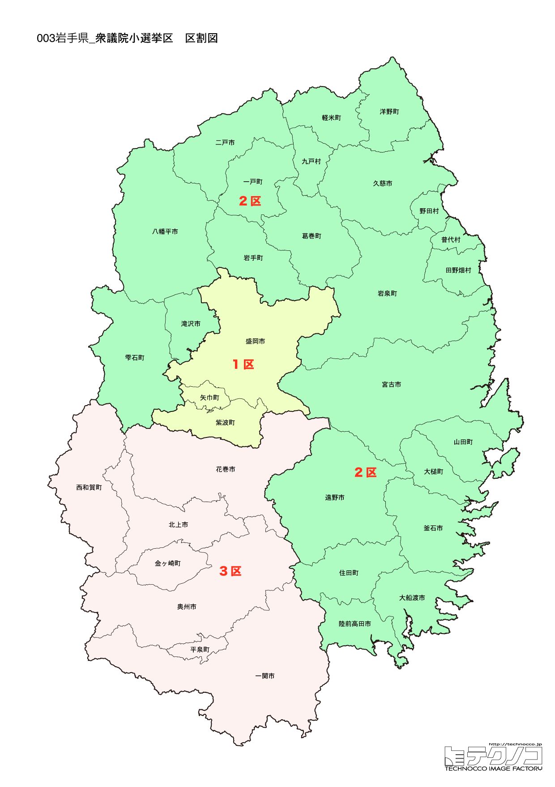

# 岩手県



---

## 基本情報

岩手県は東北地方の太平洋側に位置し、面積は北海道に次いで全国第2位の約1.5万平方キロメートル。人口は約118万人で、県庁所在地は盛岡市。

歴史的には、平安時代末期に奥州藤原氏が平泉に拠点を置き、独自の仏教文化を花開かせた。中尊寺金色堂に代表される平泉の文化遺産は2011年に世界文化遺産に登録された。江戸時代には南部藩の領地として発展。宮沢賢治、石川啄木など多くの文学者を輩出した文化県でもある。

2011年の東日本大震災では沿岸部が壊滅的な被害を受け、現在も復興が続いている。三陸海岸のリアス式海岸は波静かな入り江が多く、養殖漁業が盛ん。わかめ、牡蠣、ホタテなどの生産量は全国トップクラス。

---

## 岩手県の政治的争点

### 東日本大震災からの復興

発災から15年が経過するが、人口流出、産業再建、心のケアなど課題は多い。復興庁の存続や支援継続が議論されている。

### 人口減少対策

県全体で人口減少が進み、特に沿岸部・山間部での過疎化が深刻。若者の県外流出を食い止める施策が求められている。

### ILC（国際リニアコライダー）誘致

北上山地へのILC（素粒子物理学の大型実験施設）誘致が長年の課題。実現すれば世界中から研究者が集まり、地域経済に大きな影響を与える。

---

## 選挙の特徴

岩手県の衆議院小選挙区は3つ。

小沢一郎の地盤として知られ、立憲民主党（旧民主党系）が強い地域。1区と3区は立憲が強く、2区は自民党の鈴木俊一（元財務大臣）が盤石な地盤を持つ。沿岸部と内陸部で政治傾向が異なる。

**2026年選挙の構図**: 中道改革連合（立憲+公明の新党）vs 自民党・維新連立の対決構図。岩手では1区に階猛（現職）、3区に小沢一郎（現職）が中道改革連合から出馬。特に3区は政界の重鎮・小沢一郎（83歳）の選挙区として全国的な注目を集める。

---

## 第1区

### 地域構成

岩手1区は盛岡市、八幡平市、滝沢市、紫波郡、岩手郡で構成される。県庁所在地と周辺の内陸部。

- **盛岡市**: 人口約29万人の県庁所在地。盛岡城跡公園の石垣、岩手銀行赤レンガ館、啄木新婚の家など歴史的建造物が残る。盛岡冷麺、わんこそば、じゃじゃ麺の「盛岡三大麺」はご当地グルメとして人気。小岩井農場は明治時代に開かれた日本最大級の民間農場で、観光牧場としても有名。

- **八幡平市**: 八幡平アスピーテラインで知られる高原リゾート。温泉、スキー場が多く、四季を通じて観光客が訪れる。安比高原は東北最大級のスキーリゾート。

### 選挙区の特徴

県庁所在地・盛岡市を中心とする選挙区。立憲・階猛が7期連続当選と強固な地盤を持つ。2026年は自民党が若手の新人を擁立し、世代交代を争点に挑む。

### 2024年選挙結果

```
階猛（立憲）           ████████████████████  61.5%   94,409票 ✅当選
米内紘正（自民）         █████████░░░░░░░░░░░  28.4%   43,623票 
吉田恭子（共産）         ███░░░░░░░░░░░░░░░░░  10.0%   15,367票 
──────────────────────────────────────────────────────────
投票率: 54.4% ｜ 票差: 50,786票（33.1pt差）
```

### 2026年選挙の構図

```
階猛（中道改革連合・前職、59歳）          当選7回
米内紘正（自民・新人、38歳）             維新推薦
吉田恭子（共産・新人、45歳）
佐々木大成（参政・新人、47歳）
小笠原勇治（無所属・新人、62歳）
```

2024年に小選挙区で勝利した階猛(中道改革連合)が8選を目指す。自民は新人の米内紘正(維新推薦)、共産の吉田恭子、参政党の佐々木大成、無所属の小笠原勇治の5人の争い。

---

## 第2区

### 地域構成

岩手2区は花巻市、北上市、遠野市、一関市、奥州市、西磐井郡、胆沢郡、和賀郡で構成される。県南部の内陸地域。

- **花巻市**: 宮沢賢治の故郷として知られる。宮沢賢治記念館、イーハトーブ館、賢治が設計した花壇「ポランの広場」など、賢治ゆかりのスポットが点在する。花巻温泉郷は大沢温泉、鉛温泉など個性的な温泉が集まる。花巻空港は岩手県唯一の空港。

- **北上市**: 工業都市として発展し、自動車関連産業が集積。展勝地は「みちのく三大桜名所」の一つで、約2kmの桜並木が美しい。

- **遠野市**: 「遠野物語」で知られる民話の里。柳田国男が収集した妖怪や伝承の舞台で、カッパ淵、千葉家の曲り家など民話の世界を体験できる。

- **平泉町**（一関市隣接）: 中尊寺、毛越寺を擁する世界遺産の地。中尊寺金色堂は奥州藤原氏の栄華を今に伝える。

### 選挙区の特徴

世界遺産・平泉を含む県南内陸部の選挙区。自民・鈴木俊一（元財務大臣、11期連続当選）が盤石の地盤を持つ。国民民主が若手新人（29歳）を擁立し世代交代を訴える。

### 2024年選挙結果

```
鈴木俊一（自民）         ████████████████████  62.1%  115,772票 ✅当選
中村起子（立憲）         ████████████░░░░░░░░  37.9%   70,716票 
──────────────────────────────────────────────────────────
投票率: 55.1% ｜ 票差: 45,056票（24.2pt差）
```

### 2026年選挙の構図

```
鈴木俊一（自民・前職、72歳）            当選11回
佐々木真琴（国民・新人、29歳）
```

2024年に小選挙区で勝利した鈴木俊一(自民・元財務大臣)が12選を目指す。国民民主党が新人の佐々木真琴(29歳)を擁立し世代交代を訴える。一騎打ちの構図。

---

## 第3区

### 地域構成

岩手3区は宮古市、大船渡市、久慈市、陸前高田市、釜石市、二戸市、上閉伊郡、下閉伊郡、九戸郡で構成される。三陸海岸と県北部の広大な地域。

- **三陸海岸**: リアス式海岸が続く風光明媚な地域。2011年の東日本大震災で甚大な被害を受けたが、復興が進んでいる。浄土ヶ浜（宮古市）は白い岩と青い海のコントラストが美しい景勝地。龍泉洞（岩泉町）は日本三大鍾乳洞の一つで、地底湖の透明度は世界有数。

- **釜石市**: 「鉄と魚とラグビーのまち」。明治時代に日本初の近代製鉄所が操業した。釜石鵜住居復興スタジアムは2019年ラグビーワールドカップの会場となった。

- **陸前高田市**: 震災で壊滅的被害を受け、「奇跡の一本松」が復興のシンボルとなっている。

- **久慈市**: 琥珀の産地として知られ、久慈琥珀博物館がある。NHK連続テレビ小説「あまちゃん」の舞台となった。

### 選挙区の特徴

衆院当選19回の日本記録保持者・小沢一郎（83歳）の地盤。2021年は自民・藤原崇に敗れ比例復活したが、2024年は雪辱。高齢の小沢と若手の藤原（42歳）、世代交代が最大の焦点。震災復興も重要争点。

### 2024年選挙結果

```
小沢一郎（立憲）         ███████████████████░  57.8%  115,364票 ✅当選
藤原崇（自民）          ██████████████░░░░░░  42.2%   84,347票 
──────────────────────────────────────────────────────────
投票率: 56.9% ｜ 票差: 31,017票（15.5pt差）
```

### 2026年選挙の構図

```
小沢一郎（中道改革連合・前職、83歳）      当選19回
藤原崇（自民・元職、42歳）              当選4回
及川泰輔（参政・新人、47歳）             会社員
```

2024年に小選挙区で勝利した小沢一郎(中道改革連合)が20選を目指す。藤原崇(自民・元職)が雪辱を狙い、参政党の及川泰輔(会社員)も加わる3人の争い。高齢の小沢(83歳)と若手の藤原(42歳)、世代交代が最大の焦点。

---
