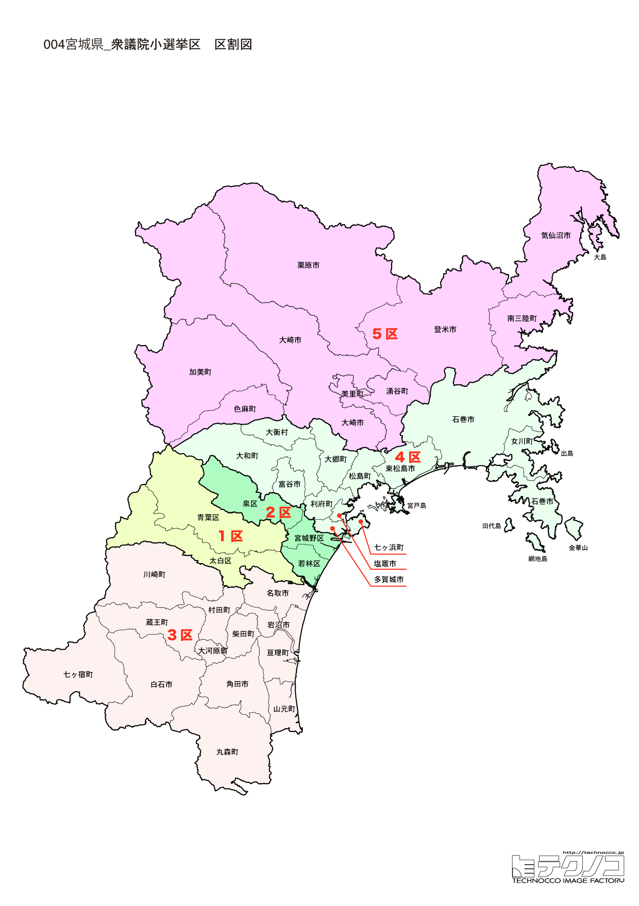

# 宮城県



---

## 基本情報

宮城県は東北地方の太平洋側に位置し、人口は約229万人で東北最多。県庁所在地の仙台市は人口約109万人の政令指定都市で、「杜の都」と呼ばれる緑豊かな都市である。

歴史的には、戦国時代に伊達政宗が仙台藩を開いて以来、東北の中心として発展してきた。政宗は「独眼竜」の異名を持つ名将で、仙台城（青葉城）を築き、城下町を整備した。松島は日本三景の一つとして古くから知られる景勝地である。

2011年の東日本大震災では沿岸部が津波で壊滅的な被害を受けた。石巻市、気仙沼市、南三陸町などで多くの犠牲者が出た。現在も復興が続いているが、産業再建や人口流出などの課題が残る。

経済的には東北最大の経済圏を形成し、商業・サービス業が発達。牛タン、笹かまぼこ、ずんだ餅などの食文化でも知られる。

---

## 宮城県の政治的争点

### 東日本大震災からの復興

沿岸部の復興は進んでいるが、人口流出、産業再建、コミュニティ再生など課題は多い。震災の記憶の伝承も重要なテーマ。

### 仙台経済圏の活性化

東北唯一の政令市として、仙台市の発展が地域全体に波及することが期待されている。一方で、仙台一極集中への懸念もある。

### 女川原発の再稼働

東北電力女川原発2号機が2024年に再稼働。安全対策と地域経済への影響が議論されている。

---

## 選挙の特徴

宮城県の衆議院小選挙区は5つ（2022年の区割り変更で6から5に減少）。

2024年の衆院選で立憲民主党が5選挙区中4選挙区を制し、野党が強い地域となった。唯一自民が守った5区は小野寺五典（元防衛大臣）の地盤。震災復興が引き続き重要争点。

**2026年選挙の構図**: 中道改革連合（立憲+公明の新党）vs 自民党・維新連立の対決構図。宮城では2024年に立憲が4選挙区を獲得しており、中道改革連合として議席維持を目指す。自民・維新連立は5区の小野寺五典を軸に巻き返しを図る。

---

## 第1区

### 地域構成

宮城1区は仙台市青葉区、太白区で構成される。仙台市の中心部と南西部。

- **仙台市青葉区**: 仙台駅、県庁、市役所がある仙台の中心。青葉通りや定禅寺通りのケヤキ並木が美しく、「杜の都」の象徴となっている。仙台城跡（青葉城址）からは市街地を一望できる。国分町は東北最大の歓楽街。

- **仙台市太白区**: 長町副都心があり、商業施設が集積。秋保温泉は仙台の奥座敷として知られる名湯で、秋保大滝は「日本の滝百選」に選ばれている。

### 選挙区の特徴

仙台市中心部を含む都市型選挙区。立憲・岡本章子が勝利したが、2026年は自民・土井亨が再挑戦し、維新・共産・参政も参戦する5人の激戦区に。

### 2024年選挙結果

```
岡本章子（立憲）         █████████████████░░░  51.6%  115,142票 ✅当選
土井亨（自民）          ████████████░░░░░░░░  36.8%   81,924票 
高橋浩司（維新）         ███░░░░░░░░░░░░░░░░░  11.6%   25,852票 
──────────────────────────────────────────────────────────
投票率: 51.2% ｜ 票差: 33,218票（14.9pt差）
```

### 2026年選挙の構図

```
岡本あき子（中道改革連合・前職、61歳）     当選3回
土井とおる（自民・元職、67歳）           当選5回
高橋こうじ（維新・新人、62歳）          選挙区支部長
中嶋れん（共産・新人、73歳）           政党役員
ローレンス綾子（参政・新人、55歳）       党県連副会長
```

2024年に小選挙区で勝利した岡本あき子(中道改革連合・NPO法人理事)が再選を目指す。元職の土井とおる(自民)が雪辱を狙い、維新の高橋こうじ、共産の中嶋れん、参政党のローレンス綾子の5人の争い。仙台市中心部を含む都市型選挙区で激戦が予想される。

---

## 第2区

### 地域構成

宮城2区は仙台市宮城野区、若林区、泉区で構成される。仙台市の東部・北部。

- **仙台市宮城野区**: 仙台駅東口、楽天モバイルパーク宮城（東北楽天ゴールデンイーグルスの本拠地）がある。仙台うみの杜水族館も人気スポット。

- **仙台市泉区**: 住宅地と商業施設が発展した新興エリア。泉パークタウンは大規模ニュータウン。

### 選挙区の特徴

仙台市東部・北部の住宅地。元自民党参院議員の和田政宗が参政党から出馬を表明しており、保守票の分散が焦点。立憲・鎌田さゆりが有利な情勢。

### 2024年選挙結果

```
鎌田さゆり（立憲）        █████████████████░░░  53.1%  116,390票 ✅当選
秋葉賢也（自民）         ██████████░░░░░░░░░░  32.7%   71,633票 
早坂敦（維新）          ████░░░░░░░░░░░░░░░░  14.1%   30,967票 
──────────────────────────────────────────────────────────
投票率: 50.0% ｜ 票差: 44,757票（20.4pt差）
```

### 2026年選挙の構図

```
鎌田さゆり（中道改革連合・前職、61歳）    当選4回
渡辺かつゆき（自民・新人、50歳）        選挙区支部長
和田政宗（参政・新人、51歳）           会社代表
早坂あつし（維新・元職、54歳）         当選1回
佐藤りりか（国民・新人、25歳）         政党役員
```

2024年に小選挙区で勝利した鎌田さゆり(中道改革連合・政党役員)が再選を目指す。自民の新人渡辺かつゆき、元自民党参院議員で参政党から出馬する和田政宗、元職の早坂あつし(維新)、国民の佐藤りりか(25歳)の5人の争い。保守票の分散が焦点となる。

---

## 第3区

### 地域構成

宮城3区は白石市、名取市、角田市、岩沼市、柴田郡、伊具郡、亘理郡で構成される。県南部地域。

- **名取市**: 仙台空港の所在地。震災で大きな被害を受けた閖上（ゆりあげ）地区は復興が進み、朝市が再開されている。

- **白石市**: 白石城（片倉小十郎の居城）と白石温麺（うーめん）で知られる城下町。蔵王連峰の麓に位置する。

- **蔵王町・川崎町**: 蔵王連峰の観光拠点。御釜（火口湖）、樹氷、温泉などが魅力。

### 選挙区の特徴

仙台空港を含む県南部の選挙区。立憲・柳沢剛が勝利。震災復興と農業政策が重要な争点。

### 2024年選挙結果

```
柳沢剛（立憲）          ██████████████████░░  55.2%   82,566票 ✅当選
西村明宏（自民）         ██████████████░░░░░░  44.8%   66,906票 
──────────────────────────────────────────────────────────
投票率: 55.0% ｜ 票差: 15,660票（10.5pt差）
```

### 2026年選挙の構図

```
柳沢つよし（中道改革連合・前職、62歳）    当選1回
西村あきひろ（自民・元職、65歳）        当選6回
林もえこ（参政・新人、27歳）           ウェブマーケティング
ゆうきたかし（無所属・新人、41歳）      会社役員
浅田こうじ（無所属・新人、79歳）        農業
```

2024年に小選挙区で勝利した柳沢つよし(中道改革連合・政党役員)が再選を目指す。元職の西村あきひろ(自民)が雪辱を狙い、参政党の林もえこ(27歳・ウェブマーケティング)、無所属2人(ゆうきたかし・浅田こうじ)も加わる5人の争い。仙台空港を含む県南部の選挙区。

---

## 第4区

### 地域構成

宮城4区は塩竈市、多賀城市、東松島市、富谷市、宮城郡、黒川郡で構成される。仙台近郊と三陸海岸の一部。

- **松島町**: 日本三景「松島」の所在地。260余りの島々が浮かぶ風景は絶景。瑞巌寺は伊達政宗が再建した禅寺で国宝に指定されている。

- **塩竈市**: 塩竈神社の門前町として発展。マグロの水揚げで知られ、寿司店が多い。

- **多賀城市**: 奈良時代に東北支配の拠点「多賀城」が置かれた歴史ある地。

### 選挙区の特徴

日本三景・松島を含む選挙区。衆議院副議長に就任した安住淳（立憲）の地盤で、副議長としての立場もあり注目される。

### 2024年選挙結果

```
安住淳（立憲）          █████████████████░░░  52.1%  102,229票 ✅当選
伊藤信太郎（自民）        ███████████░░░░░░░░░  33.4%   65,616票 
佐藤雄一（維新）         ██░░░░░░░░░░░░░░░░░░   7.9%   15,581票 
大林正英（れいわ）        ██░░░░░░░░░░░░░░░░░░   6.6%   12,913票 
──────────────────────────────────────────────────────────
投票率: 52.4% ｜ 票差: 36,613票（18.6pt差）
```

### 2026年選挙の構図

```
安住淳（中道改革連合・前職、64歳）      当選10回
もりした千里（自民・前職、44歳）        当選1回
佐野誠（参政・新人、41歳）            私立学校職員
```

2024年に小選挙区で勝利した安住淳(中道改革連合・政党役員)が再選を目指す。衆議院副議長経験者として注目される。前職のもりした千里(自民)、参政党の佐野誠(私立学校職員)の3人の争い。日本三景・松島を含む選挙区。

---

## 第5区

### 地域構成

宮城5区は石巻市、気仙沼市、登米市、栗原市、大崎市、遠田郡、本吉郡、加美郡で構成される。県北部と三陸沿岸の広大な地域。

- **石巻市**: 震災で最も多くの犠牲者を出した自治体。石ノ森萬画館は漫画家・石ノ森章太郎の記念館。復興が進み、新しいまちづくりが進行中。

- **気仙沼市**: フカヒレの生産量日本一。漁港として栄え、カツオ、サンマの水揚げも多い。震災復興のシンボルとして「海の市」などの施設が再建された。

- **南三陸町**: 震災で壊滅的被害を受けた。防災対策庁舎は震災遺構として保存され、語り部による伝承活動が行われている。

- **大崎市**: 鳴子温泉郷で知られる。鳴子こけしは伝統工芸品として有名。

### 選挙区の特徴

震災で最大の被害を受けた石巻市・気仙沼市を含む選挙区。自民・小野寺五典（元防衛大臣、政調会長）が9期連続当選と盤石の地盤を持ち、宮城県で唯一自民が守る選挙区。

### 2024年選挙結果

```
小野寺五典（自民）        ████████████████████  74.7%  132,361票 ✅当選
境恒春（維新）          ████░░░░░░░░░░░░░░░░  14.9%   26,502票 
中嶋廉（共産）          ███░░░░░░░░░░░░░░░░░  10.4%   18,413票 
──────────────────────────────────────────────────────────
投票率: 53.7% ｜ 票差: 105,859票（59.7pt差）
```

### 2026年選挙の構図

```
小野寺五典（自民・前職、65歳）         当選9回
さかいつねはる（中道改革連合・新人、46歳） 前宮城県議会議員
ゆうき豊（共産・新人、66歳）           建築士
```

2024年に圧倒的な強さで勝利した小野寺五典(自民・選挙区支部長)が再選を目指す。元防衛大臣として盤石の地盤を持つ。中道改革連合はさかいつねはる(前宮城県議会議員)を擁立、共産のゆうき豊(建築士)も加わる3人の争い。震災で最大の被害を受けた石巻市・気仙沼市を含む選挙区。

---
