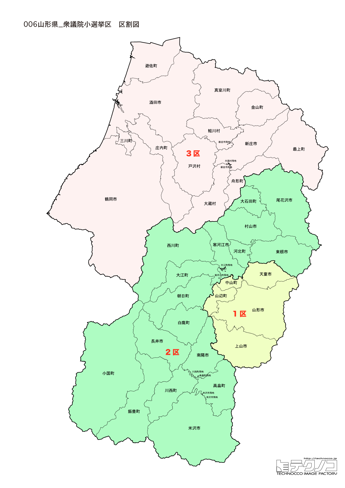

# 山形県



---

## 基本情報

山形県は東北地方の日本海側に位置し、人口は約104万人。県庁所在地は山形市。県の形が人の横顔に似ていることから「人面県」と呼ばれることもある。

歴史的には、最上義光が山形城を拠点に最上藩を治めた。出羽三山（月山、羽黒山、湯殿山）は古来より山岳信仰の聖地で、修験道の霊場として知られる。松尾芭蕉が「奥の細道」で訪れ、「閑さや岩にしみ入る蝉の声」と詠んだ山寺（立石寺）も有名。

経済的にはさくらんぼ（佐藤錦）の生産量が日本一で、全国の約7割を占める。ラ・フランス、米沢牛、芋煮など食の魅力も豊富。温泉も多く、蔵王温泉、銀山温泉、かみのやま温泉など個性的な温泉地がある。

---

## 山形県の政治的争点

### 人口減少と地域振興

山形県も人口減少が進み、特に庄内地方や最上地方での過疎化が深刻。若者の県外流出を食い止める施策が求められている。

### 農業振興

さくらんぼ、米、牛肉など農業が基幹産業。担い手不足、気候変動への対応、輸出拡大などが課題。

### 庄内空港・山形空港の活用

2つの空港を持つ山形県だが、利用促進と路線維持が課題となっている。

---

## 選挙の特徴

山形県の衆議院小選挙区は3つ。

自民党が強い保守的な地域で、2024年の衆院選でも自民党が3選挙区すべてで勝利した（東北で唯一の自民全勝県）。ただし1区では遠藤利明が引退し、息子への世襲選挙となる2026年は変化の可能性も。

---

## 第1区

### 地域構成

山形1区は山形市、上山市、天童市、山辺町、中山町で構成される。県庁所在地と周辺地域。

- **山形市**: 人口約24万人の県庁所在地。山形城跡（霞城公園）は桜の名所。山形花笠まつりは毎年8月に開催され、「ヤッショ、マカショ」の掛け声と花笠を持った踊り手が市内を練り歩く。山形は「ラーメン消費量日本一」の都市で、冷やしラーメンは山形発祥。

- **山寺**（山形市）: 正式名称を宝珠山立石寺といい、860年に慈覚大師円仁が開山。1,015段の石段を登った先にある五大堂からの眺望は絶景。

- **天童市**: 将棋駒の生産量日本一（全国の約95%）。毎年春には人間将棋が開催され、甲冑姿の武者が駒となって対局する。天童温泉は将棋のまちにふさわしく、温泉旅館で将棋を楽しめる。

- **上山市**: かみのやま温泉で知られる城下町。上山城は「羽州の名城」と呼ばれた。

### 選挙区の特徴

2026年に注目の世襲選挙区。元五輪担当大臣・遠藤利明（76歳）が引退を表明し、息子の遠藤宏明（39歳）が後継として出馬。中道改革連合、参政党も候補を擁立し、世代交代が争点に。

### 2024年選挙結果

```
遠藤利明（自民）         ██████████████████░░  55.5%   92,238票 ✅当選
原田和広（立憲）         ████████████░░░░░░░░  38.9%   64,717票 
三井寺修（共産）         █░░░░░░░░░░░░░░░░░░░   5.6%    9,293票 
──────────────────────────────────────────────────────────
投票率: 57.6% ｜ 票差: 27,521票（16.5pt差）
```

### 2026年選挙の構図

注目すべきは、遠藤利明（76歳）が引退を表明し、息子の遠藤宏明（39歳）が後継として出馬すること。世襲選挙となる。中道改革連合の原田和宏（比例現職）、参政党の桜田恭子も出馬予定。

---

## 第2区

### 地域構成

山形2区は米沢市、新庄市、寒河江市、村山市、長井市、東根市、尾花沢市、南陽市、西村山郡、北村山郡、最上郡、東置賜郡、西置賜郡で構成される。県の内陸部の広大な地域。

- **米沢市**: 上杉謙信、直江兼続ゆかりの城下町。上杉神社は上杉謙信を祀り、戦国ファンの聖地。米沢牛は日本三大和牛の一つで、すき焼き、ステーキ、牛肉どまん中（駅弁）が人気。

- **銀山温泉**（尾花沢市）: 大正ロマン漂う温泉街。木造多層建築の旅館が立ち並ぶ風景は、冬の雪景色とガス灯の光で幻想的な雰囲気になる。NHK連続テレビ小説「おしん」の舞台としても知られる。

- **新庄市**: 新庄まつりで有名。豪華な山車（やたい）が市内を練り歩く祭りは、ユネスコ無形文化遺産に登録されている。

- **さくらんぼ産地**（東根市、寒河江市など）: 佐藤錦を中心にさくらんぼ栽培が盛ん。6月のシーズンにはさくらんぼ狩りが楽しめる。

### 選挙区の特徴

米沢牛・銀山温泉・さくらんぼ産地など観光資源豊富な内陸部の選挙区。自民・鈴木憲和が56.6%の得票率で圧勝し、盤石の地盤を持つ。農業政策が重要争点。

### 2024年選挙結果

```
鈴木憲和（自民）         ██████████████████░░  56.6%  105,416票 ✅当選
菊池大二郎（国民）        ██████████░░░░░░░░░░  30.3%   56,359票 🔄比例
二藤部冬馬（れいわ）       ██░░░░░░░░░░░░░░░░░░   8.5%   15,811票 
岩本康嗣（共産）         █░░░░░░░░░░░░░░░░░░░   4.6%    8,496票 
──────────────────────────────────────────────────────────
投票率: 62.7% ｜ 票差: 49,057票（26.4pt差）
```

### 2026年選挙の構図

鈴木憲和（自民・現職）、菊池大二郎（国民・比例現職）、岩本康嗣（共産・新人）の3人が争う。

---

## 第3区

### 地域構成

山形3区は鶴岡市、酒田市、東田川郡、飽海郡で構成される。日本海側の庄内地方。

- **鶴岡市**: 出羽三山の玄関口。羽黒山の五重塔は国宝で、杉並木の参道は神秘的。加茂水族館は「クラゲ水族館」として世界一のクラゲ展示数を誇る。鶴岡は「ユネスコ食文化創造都市」に認定され、在来野菜など独自の食文化を持つ。

- **酒田市**: 江戸時代に北前船の寄港地として栄えた港町。山居倉庫は明治時代に建てられた米の保管倉庫で、ケヤキ並木とともに酒田のシンボル。本間家旧本邸は「本間様には及びもないが、せめてなりたや殿様に」と言われた豪商・本間家の屋敷。

- **出羽三山**: 月山、羽黒山、湯殿山の総称で、古来より修験道の聖地。現在も白装束の山伏が修行を行っている。羽黒山の石段は2,446段あり、国宝の五重塔が中腹に建つ。

### 選挙区の特徴

出羽三山・酒田港など歴史ある庄内地方の選挙区。自民・加藤鮎子（元こども政策担当大臣、加藤紘一元幹事長の娘）が56.1%の得票率で勝利。2026年は若手候補（28歳、36歳）も参入し、世代間対決の様相。

### 2024年選挙結果

```
加藤鮎子（自民）         ██████████████████░░  56.1%   93,909票 ✅当選
石黒覚（立憲）          ████████████░░░░░░░░  37.7%   63,102票 
山田守（共産）          ██░░░░░░░░░░░░░░░░░░   6.2%   10,372票 
──────────────────────────────────────────────────────────
投票率: 62.2% ｜ 票差: 30,807票（18.4pt差）
```

### 2026年選挙の構図

加藤鮎子（自民・現職、46歳）、落合拓真（中道改革連合・新人、28歳）、北崎幸介（国民・新人、36歳）、遠藤和文（参政・新人、60歳）の4人が争う。若手候補が多いのが特徴。

---
