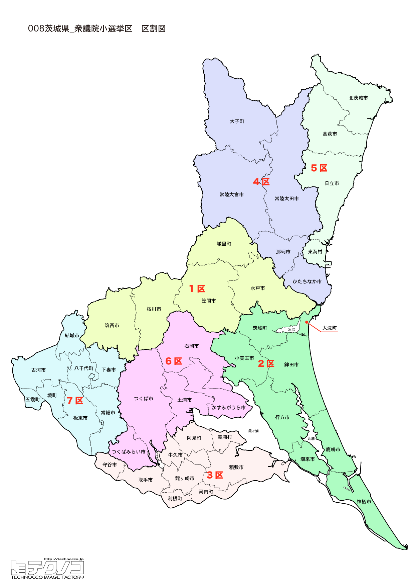

# 茨城県



---

## 基本情報

茨城県は関東地方の北東部に位置し、人口は約286万人で全国11位。県庁所在地は水戸市。太平洋に面した長い海岸線を持ち、霞ヶ浦は琵琶湖に次ぐ日本第2位の面積を誇る湖である。

歴史的には、水戸徳川家の城下町として発展した水戸市が政治・文化の中心であった。水戸黄門（徳川光圀）は全国的に知られ、「大日本史」の編纂や水戸学の発展に貢献した。幕末には水戸藩から多くの志士が輩出され、尊王攘夷運動の中心地の一つとなった。

経済的には、農業産出額が全国2位で、メロン、栗、レンコン、ピーマンなど多くの品目で全国一の生産量を誇る。鹿島臨海工業地帯は日本有数の重化学工業地帯。つくば市は筑波研究学園都市として世界的な研究機関が集積し、つくばエクスプレスの開通で東京へのアクセスも向上した。

---

## 茨城県の政治的争点

### 東海第二原発の再稼働問題

日本原子力発電東海第二原発の再稼働をめぐり、周辺6市村の同意が必要とされているが、水戸市など複数の自治体が慎重姿勢を示しており、再稼働の見通しは立っていない。

### つくばエクスプレス沿線開発

TX沿線の人口増加と開発が進む一方で、県北・県西部の人口減少が課題。県内格差の是正が求められている。

### 農業振興

全国2位の農業県として、担い手不足への対応、スマート農業の推進、海外輸出の拡大などが課題。

---

## 選挙の特徴

茨城県の衆議院小選挙区は7つ。

自民党が強い保守的な地域だが、2024年の衆院選では立憲民主党や国民民主党が躍進し、自民党は7選挙区中3選挙区の勝利にとどまった。特に3区では28歳の国民民主新人が元法務大臣を破る金星を挙げた。東海第二原発の再稼働問題が重要な争点。

**2026年選挙の構図**: 中道改革連合（立憲+公明の新党）vs 自民党・維新連立の対決構図。茨城県では東海第二原発問題を巡り両陣営の主張が対立。都市部のつくば・土浦エリアでは中道改革連合が優勢だが、県北・県西部では自民党・維新連立が地盤を固める構図となっている。

---

## 第1区

### 地域構成

茨城1区は水戸市、笠間市、筑西市、桜川市、城里町で構成される。県庁所在地と周辺地域。

- **水戸市**: 人口約27万人の県庁所在地。偕楽園は日本三名園の一つで、約100品種3,000本の梅が咲く梅の名所として知られる。毎年2月から3月にかけて水戸の梅まつりが開催される。弘道館は水戸藩の藩校で、水戸学の中心地であった。納豆は水戸の名物として全国的に有名。

- **笠間市**: 笠間焼の産地として知られ、約300人の陶芸家が活動する。笠間稲荷神社は日本三大稲荷の一つに数えられる。

### 選挙区の特徴

県庁所在地・水戸市を中心とする選挙区。無所属の福島伸享（立憲推薦）が自民・田所嘉徳を破り当選。福島は中道改革連合には参加せず無所属を維持しており、その動向が注目される。

### 2024年選挙結果

```
福島伸享（無所属）        ███████████████░░░░░  45.0%   94,243票 ✅当選
田所嘉徳（自民）         ████████████░░░░░░░░  36.8%   76,960票 🔄比例
武藤優子（維新）         ███░░░░░░░░░░░░░░░░░  11.3%   23,619票 
高橋誠一郎（共産）        ██░░░░░░░░░░░░░░░░░░   7.0%   14,565票 
──────────────────────────────────────────────────────────
投票率: 51.3% ｜ 票差: 17,283票（8.3pt差）
```

### 2026年選挙の構図

福島伸享（無所属・現職）と田所嘉徳（自民・比例現職）の再戦。福島は2024年に立憲推薦で当選したが、中道改革連合には参加せず無所属を維持。

---

## 第2区

### 地域構成

茨城2区は鹿嶋市、潮来市、神栖市、行方市、鉾田市、小美玉市、茨城町、大洗町で構成される。県南東部の鹿行地域と県央の一部。

- **鹿嶋市**: 鹿島神宮の門前町として発展。鹿島神宮は常陸国一宮で、武道の神として信仰を集める。鹿島アントラーズの本拠地でもあり、サッカーのまちとして知られる。

- **大洗町**: アクアワールド茨城県大洗水族館があり、サメの飼育種類数日本一を誇る。大洗磯前神社は海に浮かぶ鳥居が印象的。アニメ「ガールズ&パンツァー」の舞台としても人気を集めている。

### 選挙区の特徴

衆議院議長・額賀福志郎（82歳、14期連続当選）の選挙区。議長として盤石だが、高齢のため後継問題も注目される。鹿島アントラーズの本拠地を含む。

### 2024年選挙結果

```
額賀福志郎（自民）        ███████████████████░  59.0%   80,875票 ✅当選
今村敏昭（維新）         █████░░░░░░░░░░░░░░░  17.9%   24,577票 
川井宏子（共産）         ████░░░░░░░░░░░░░░░░  12.9%   17,613票 
大高伸一（無所属）        ███░░░░░░░░░░░░░░░░░  10.2%   13,902票 
──────────────────────────────────────────────────────────
投票率: 47.7% ｜ 票差: 56,298票（41.1pt差）
```

### 2026年選挙の構図

額賀福志郎（自民・現職、82歳）は議長として出馬。高齢のため後継問題も注目される。

---

## 第3区

### 地域構成

茨城3区は龍ケ崎市、取手市、牛久市、守谷市、稲敷市、美浦村、阿見町、河内町、利根町で構成される。県南部で、つくばエクスプレス沿線を含む。

- **守谷市**: つくばエクスプレス開通後に人口が急増した新興住宅地。秋葉原まで最速32分という利便性から、若いファミリー層に人気。

- **牛久市**: 牛久大仏で知られる。高さ120mは青銅製立像として世界一の高さで、ギネス世界記録に認定されている。

### 選挙区の特徴

2024年に28歳の国民民主新人・岸野智康が元法務大臣・葉梨康弘を破る大金星。TX沿線の人口増加で若い世代の票が増え、選挙区の構造が変化。2026年も若手同士の対決に注目。

### 2024年選挙結果

```
葉梨康弘（自民）         ██████████████░░░░░░  42.1%   83,667票 ✅当選
梶岡博樹（立憲）         ██████████░░░░░░░░░░  31.8%   63,273票 
橋口奈保（維新）         ███░░░░░░░░░░░░░░░░░  11.9%   23,741票 
加川裕美（れいわ）        ██░░░░░░░░░░░░░░░░░░   7.4%   14,783票 
大内久美子（共産）        ██░░░░░░░░░░░░░░░░░░   6.7%   13,235票 
──────────────────────────────────────────────────────────
投票率: 53.1% ｜ 票差: 20,394票（10.3pt差）
```

### 2026年選挙の構図

岸野智康（国民・現職）に自民党が新人を擁立し挑戦。若手同士の対決に注目。

---

## 第4区

### 地域構成

茨城4区は常陸太田市、ひたちなか市、常陸大宮市、那珂市、大子町で構成される。県北部の内陸地域。

- **ひたちなか市**: 国営ひたち海浜公園で有名。春のネモフィラ、秋のコキアは絶景として知られ、毎年多くの観光客が訪れる。勝田駅前から延びるひたちなか海浜鉄道は、終点の阿字ヶ浦まで海沿いを走るローカル線。

- **大子町**: 袋田の滝で知られる。高さ120m、幅73mの滝は日本三名瀑の一つに数えられ、冬には氷瀑となる。奥久慈りんご、こんにゃくも名産。

### 選挙区の特徴

自民・梶山弘志（元経済産業大臣、梶山静六元官房長官の息子）が9期連続当選と安定した地盤を持つ。野党の候補者擁立が課題。

### 2024年選挙結果

```
梶山弘志（自民）         ████████████████████  68.3%   91,019票 ✅当選
武藤博光（維新）         ██████░░░░░░░░░░░░░░  19.0%   25,263票 
吉田翔（共産）          ████░░░░░░░░░░░░░░░░  12.7%   16,927票 
──────────────────────────────────────────────────────────
投票率: 52.1% ｜ 票差: 65,756票（49.4pt差）
```

### 2026年選挙の構図

梶山弘志（自民・現職）は安定した地盤を持つ。野党の候補者擁立が焦点。

---

## 第5区

### 地域構成

茨城5区は日立市、高萩市、北茨城市、東海村で構成される。県北部の太平洋沿岸地域。

- **日立市**: 日立製作所発祥の地で、企業城下町として発展した。かみね動物園、日立シビックセンターなどがある。日立駅は太平洋を一望できるガラス張りの駅舎が美しい。

- **東海村**: 日本原子力発電東海発電所がある原子力の町。1999年にJCO臨界事故が発生し、原子力安全への意識が高い地域。

### 選挙区の特徴

日立製作所の企業城下町と東海村の原子力施設を含む選挙区。国民・浅野哲（日立製作所出身）が労組票を固めて勝利。原子力政策が重要争点。

### 2024年選挙結果

```
浅野哲（国民）          █████████████████░░░  53.7%   64,351票 ✅当選
石川昭政（自民）         ████████████░░░░░░░░  39.0%   46,717票 
千葉達夫（共産）         ██░░░░░░░░░░░░░░░░░░   7.3%    8,781票 
──────────────────────────────────────────────────────────
投票率: 52.6% ｜ 票差: 17,634票（14.7pt差）
```

### 2026年選挙の構図

浅野哲（国民・現職）と自民党候補の対決。企業城下町での労組票の行方が焦点。

---

## 第6区

### 地域構成

茨城6区は土浦市、石岡市、つくば市、かすみがうら市、つくばみらい市で構成される。県南部の学園都市地域。

- **つくば市**: 筑波研究学園都市として、JAXA筑波宇宙センター、産業技術総合研究所など300以上の研究機関が集積する。筑波大学は国内有数の総合大学。筑波山は「西の富士、東の筑波」と称される名山で、ケーブルカーやロープウェイで山頂に登れる。

- **土浦市**: 霞ヶ浦に面した水郷都市。土浦全国花火競技大会は日本三大花火大会の一つに数えられる。れんこんの生産量は日本一。

### 選挙区の特徴

筑波研究学園都市を含む選挙区。自民・国光文乃（元厚生労働省官僚）が勝利。研究者・高学歴層が多い選挙区で、政策論争が注目される。

### 2024年選挙結果

```
青山大人（立憲）         ████████████████░░░░  49.3%  120,434票 ✅当選
国光文乃（自民）         ██████████████░░░░░░  43.9%  107,305票 🔄比例
間宮美知子（共産）        ██░░░░░░░░░░░░░░░░░░   6.8%   16,586票 
──────────────────────────────────────────────────────────
投票率: 56.1% ｜ 票差: 13,129票（5.4pt差）
```

### 2026年選挙の構図

国光文乃（自民・現職）に中道改革連合が候補を擁立。研究学園都市での政策論争に注目。

---

## 第7区

### 地域構成

茨城7区は古河市、結城市、下妻市、常総市、坂東市、八千代町、五霞町、境町で構成される。県西部の農業地域。

- **結城市**: 結城紬の産地として知られる。結城紬は2,000年の歴史を持つ絹織物で、ユネスコ無形文化遺産に登録されている。蔵造りの街並みも美しい。

- **古河市**: 古河公方ゆかりの歴史ある街。古河桃まつりは関東最大級の桃の花の祭典。

### 選挙区の特徴

立憲・中村喜四郎（元建設大臣、衆院当選15回）の地盤。かつて自民党だったが現在は立憲所属。76歳と高齢で後継問題も注目される。

### 2024年選挙結果

| 候補者 | 党派 | 結果 |
|--------|------|------|
| 中村喜四郎 | 立憲 | **当選**（15選） |

中村喜四郎は元建設大臣で、衆院当選15回のベテラン。かつては自民党だったが、現在は立憲民主党に所属。

### 2026年選挙の構図

中村喜四郎（立憲→中道改革連合・現職、76歳）と自民党候補の対決。中村の高齢と後継問題も注目される。

---
