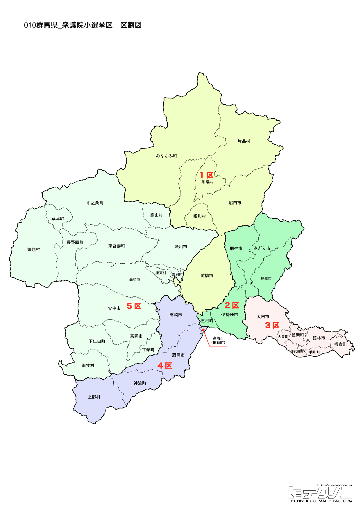

# 群馬県



---

## 基本情報

群馬県は関東地方の北西部に位置し、人口は約192万人。県庁所在地は前橋市。海のない内陸県で、上毛三山（赤城山、榛名山、妙義山）に囲まれた風光明媚な地域である。

歴史的には、古代から交通の要衝として栄え、上野国として発展した。中山道の宿場町が多く、碓氷峠は江戸と信州を結ぶ重要な関所であった。富岡製糸場は明治時代に官営模範工場として設立され、日本の近代化を支えた。2014年に世界遺産に登録されている。

経済的には、自動車産業が盛んでSUBARU（旧富士重工業）の本社・工場がある。こんにゃくの生産量は全国の9割以上を占め、下仁田ねぎ、嬬恋キャベツなど農産物も有名。草津温泉、伊香保温泉、水上温泉など温泉資源も豊富。

---

## 群馬県の政治的争点

### 世襲政治

群馬県は中曽根家、福田家、小渕家と首相経験者の世襲が続く「保守王国」。世襲の是非が議論されることも。

### 温泉観光の振興

草津、伊香保、水上など温泉資源が豊富だが、コロナ後の観光回復とインバウンド対応が課題。

### 自動車産業の転換

SUBARUを中心とする自動車産業が盛んだが、EV化への対応が今後の課題となっている。

---

## 選挙の特徴

群馬県の衆議院小選挙区は5つ。

自民党が圧倒的に強い保守王国で、中曽根康弘、福田赳夫・康夫父子、小渕恵三と4人の首相を輩出。2024年の衆院選でも5選挙区すべてで自民党が勝利。中曽根家、福田家、小渕家と首相経験者の世襲が続く「世襲王国」でもある。

---

## 第1区

### 地域構成

群馬1区は前橋市、沼田市、みなかみ町、昭和村、片品村、川場村、玉村町で構成される。県庁所在地と利根沼田地域。

- **前橋市**: 人口約33万人の県庁所在地。萩原朔太郎の故郷として知られ、「詩のまち」を標榜する。臨江閣は明治時代に建てられた迎賓施設で、国の重要文化財。前橋まつりは毎年10月に開催される。

- **みなかみ町**: 水上温泉郷で知られる温泉地。谷川岳は標高1,977mで、「魔の山」と呼ばれる険しい山だが、ロープウェイで手軽に絶景を楽しめる。ラフティング、バンジージャンプなどアウトドアスポーツも人気。

### 選挙区の特徴

中曽根康弘元首相の孫・中曽根康隆が地盤を継承。3期連続当選と中曽根家の地盤は堅い。県庁所在地・前橋市と谷川岳のある水上エリアを含む。

### 2024年選挙結果

```
中曽根康隆（自民）        █████████████████░░░  51.9%   82,455票 ✅当選
白井桂子（立憲）         ███████████░░░░░░░░░  35.3%   56,031票 
店橋世津子（共産）        ████░░░░░░░░░░░░░░░░  12.8%   20,330票 
──────────────────────────────────────────────────────────
投票率: 49.0% ｜ 票差: 26,424票（16.6pt差）
```

### 2026年選挙の構図

中曽根康隆（自民・現職、42歳）と中道改革連合などの野党候補の対決。中曽根家の地盤は堅い。

---

## 第2区

### 地域構成

群馬2区は桐生市、伊勢崎市、みどり市で構成される。県東部の織物産業地域。

- **桐生市**: 「織物のまち」として知られ、桐生織は1,300年の歴史を持つ。のこぎり屋根の工場が残る街並みは近代化遺産として注目される。桐生が岡動物園・遊園地は入場無料で市民に親しまれている。

- **伊勢崎市**: 人口約21万人で県内4位。もんじゃ焼きの発祥地という説がある。伊勢崎銘仙は大正から昭和にかけて流行した絹織物。

### 選挙区の特徴

桐生織など織物産業が盛んな県東部の選挙区。自民・井野俊郎が5期連続当選。野党の候補者擁立が課題。

### 2024年選挙結果

```
井野俊郎（自民）         █████████████████░░░  53.2%   78,416票 ✅当選
石関貴史（無所属）        ██████████░░░░░░░░░░  32.8%   48,251票 
高橋保（共産）          ████░░░░░░░░░░░░░░░░  14.0%   20,626票 
──────────────────────────────────────────────────────────
投票率: 47.2% ｜ 票差: 30,165票（20.5pt差）
```

### 2026年選挙の構図

井野俊郎（自民・現職）と野党候補の対決。

---

## 第3区

### 地域構成

群馬3区は太田市、館林市、邑楽郡で構成される。県南東部の工業地域。

- **太田市**: 人口約22万人でSUBARUの本社・工場があり、「自動車のまち」として発展。金山城跡は日本100名城に選定された山城。八瀬川沿いの「太田さくらまつり」は桜の名所。

- **館林市**: 日本一暑い街として知られ、40度を超える気温を記録することも。つつじが岡公園は約10,000株のツツジが咲き誇る名所。分福茶釜の伝説が伝わる茂林寺もある。

### 選挙区の特徴

SUBARU本社・工場がある「自動車のまち」太田市を含む選挙区。自民・笹川博義（笹川良一の孫）が5期連続当選。EV化への対応が今後の争点に。

### 2024年選挙結果

```
笹川博義（自民）         ████████████████░░░░  50.1%   74,930票 ✅当選
長谷川嘉一（立憲）        ████████████████░░░░  49.9%   74,716票 🔄比例
──────────────────────────────────────────────────────────
投票率: 49.5% ｜ 票差: 214票（0.1pt差）
```

### 2026年選挙の構図

笹川博義（自民・現職）と野党候補の対決。

---

## 第4区

### 地域構成

群馬4区は高崎市の大部分、藤岡市、多野郡で構成される。県最大都市と県南西部。

- **高崎市**: 人口約37万人で県内最大の都市。商業・交通の中心で、高崎駅は上越・北陸新幹線の分岐点。高崎だるまは全国シェア8割を誇り、選挙の必勝祈願に欠かせない縁起物。高崎白衣大観音は高さ41.8mの観音像で市のシンボル。パスタのまちとしても知られ、「キングオブパスタ」が毎年開催される。

- **藤岡市**: 桜山公園の冬桜が有名。冬と春の二度咲きする珍しい桜で、11月から12月にも花見ができる。

### 選挙区の特徴

福田赳夫・康夫元首相の地盤を孫の福田達夫が継承。5期連続当選と盤石。県内最大都市・高崎市を含み、高崎だるまの産地として有名。

### 2024年選挙結果

```
福田達夫（自民）         ██████████████████░░  56.0%   80,130票 ✅当選
山田博規（立憲）         ██████████░░░░░░░░░░  32.7%   46,740票 
萩原貞夫（共産）         ███░░░░░░░░░░░░░░░░░  11.3%   16,128票 
──────────────────────────────────────────────────────────
投票率: 51.5% ｜ 票差: 33,390票（23.4pt差）
```

### 2026年選挙の構図

福田達夫（自民・現職、57歳）は福田家の地盤を継承。盤石の選挙区。

---

## 第5区

### 地域構成

群馬5区は高崎市の一部、渋川市、富岡市、安中市、榛東村、吉岡町、下仁田町、南牧村、甘楽町で構成される。上毛三山を含む県央・県西部。

- **草津町**: 草津温泉で世界的に知られる。自然湧出量日本一を誇り、湯畑は温泉街のシンボル。湯もみショーは草津の伝統。

- **富岡市**: 富岡製糸場で知られる。明治5年に設立された官営模範工場で、フランスの技術を導入して日本の製糸業近代化を牽引した。世界遺産に登録されている。

- **伊香保温泉**（渋川市）: 365段の石段街が有名。黄金の湯、白銀の湯の2種類の温泉がある。竹久夢二伊香保記念館もある。

- **妙義山**: 日本三大奇勝の一つで、奇岩がそびえる独特の景観。上毛三山の一つに数えられる。

### 選挙区の特徴

小渕恵三元首相の娘・小渕優子（自民党選挙対策委員長）の地盤。9期連続当選と盤石だが、過去の政治資金問題が尾を引く可能性も。世界遺産・富岡製糸場と草津温泉を含む。

### 2024年選挙結果

```
小渕優子（自民）         ████████████████████  61.9%   96,580票 ✅当選
中島由美子（維新）        ███████░░░░░░░░░░░░░  23.6%   36,928票 
伊藤達也（共産）         ████░░░░░░░░░░░░░░░░  14.5%   22,655票 
──────────────────────────────────────────────────────────
投票率: 52.8% ｜ 票差: 59,652票（38.2pt差）
```

### 2026年選挙の構図

小渕優子（自民・現職、51歳）は小渕家の地盤を継承。盤石の選挙区だが、過去の政治資金問題が尾を引く可能性も。

---
