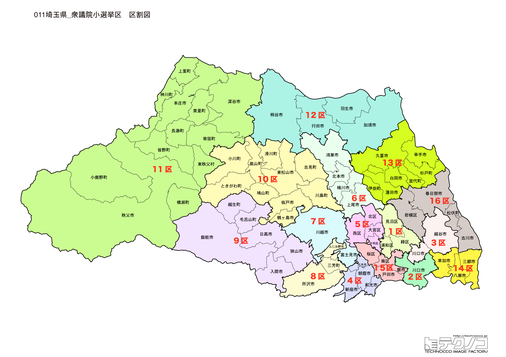

# 埼玉県



---

## 基本情報

埼玉県は関東地方の中央部に位置し、人口は約734万人で全国5位。県庁所在地はさいたま市。東京のベッドタウンとして発展し、人口増加が続いている。海のない内陸県である。

歴史的には、江戸時代に中山道や日光街道の宿場町として栄えた。川越は「小江戸」と呼ばれる蔵造りの街並みが残る。秩父は古くから絹織物産業で発展し、秩父夜祭は日本三大曳山祭の一つとして知られる。

経済的には、東京近郊の立地を活かし、物流拠点や商業施設が集積。深谷市は渋沢栄一の出身地として注目を集めた。草加せんべい、深谷ねぎ、狭山茶などの特産品がある。

---

## 埼玉県の政治的争点

### 首都圏のベッドタウンとしての課題

人口増加が続く一方で、通勤混雑、保育施設不足、道路渋滞などの課題がある。

### 災害対策

荒川、利根川の洪水対策、地下神殿など治水インフラの整備が重要な課題。

### 多文化共生

川口市、蕨市など外国人住民が多い地域での共生施策が求められている。

---

## 選挙の特徴

埼玉県の衆議院小選挙区は15（2022年の区割り変更で16から15に減少）。

東京のベッドタウンとして無党派層が多い傾向がある。2024年の衆院選では自民党が15選挙区中5選挙区で勝利するにとどまり、野党が躍進。特に14区では公明党代表・石井啓一が落選する大波乱があった。枝野幸男（立憲元代表）など野党重鎮も多い。

**2026年選挙の構図**: 中道改革連合（立憲+公明の新党）vs 自民党・維新連立の対決構図。埼玉は16選挙区で大宮・浦和などの都市部が激戦区となる。枝野幸男を擁する5区を筆頭に、中道改革連合は都市部で優勢。一方、県北・県西部では自民党・維新連立が地盤を維持し、15選挙区全体で接戦が続く見込み。

---

## 第1区

### 地域構成

埼玉1区はさいたま市見沼区、浦和区、緑区で構成される。旧浦和市域の一部。

- **浦和区**: 埼玉県庁所在地の中心。浦和レッズの本拠地があり、サッカーのまちとして知られる。うなぎの蒲焼きは江戸時代から続く名物。調神社（つきじんじゃ）は狛犬の代わりにウサギがいる珍しい神社。

### 選挙区の特徴

旧浦和市域を含む選挙区。立憲・武正公一と自民・村井英樹が接戦を繰り広げる激戦区。サッカーのまち・浦和を含む。

### 2024年選挙結果

```
村井英樹（自民）         █████████████░░░░░░░  41.5%   85,347票 ✅当選
武正公一（立憲）         █████████████░░░░░░░  39.9%   82,134票 🔄比例
浅野目義英（維新）        ███░░░░░░░░░░░░░░░░░   9.2%   19,039票 
矢野由紀子（共産）        ██░░░░░░░░░░░░░░░░░░   7.3%   15,106票 
三上恭平（みんなでつくる党）   ░░░░░░░░░░░░░░░░░░░░   2.1%    4,234票 
──────────────────────────────────────────────────────────
投票率: 54.8% ｜ 票差: 3,213票（1.6pt差）
```

### 2026年選挙の構図

武正公一（立憲→中道改革連合・現職）と村井英樹（自民・比例現職）の再戦。接戦区。

---

## 第2区

### 地域構成

埼玉2区は川口市の大部分で構成される。東京に隣接する人口約60万人の大都市。

- **川口市**: 鋳物のまちとして発展し、現在は住宅都市として人口が増加。外国人住民が多く、多文化共生が課題。SKIPシティは映像産業の拠点。荒川河川敷は市民の憩いの場。

### 選挙区の特徴

人口約60万人の川口市を中心とする選挙区。自民・新藤義孝（元総務大臣、経済安全保障担当大臣）が9期連続当選と安定。外国人住民が多く、多文化共生が争点に。

### 2024年選挙結果

```
新藤義孝（自民）         █████████████░░░░░░░  39.7%   72,467票 ✅当選
高橋英明（維新）         ███████░░░░░░░░░░░░░  23.6%   43,164票 🔄比例
松浦玄嗣（立憲）         ██████░░░░░░░░░░░░░░  18.8%   34,327票 
奥田智子（共産）         ████░░░░░░░░░░░░░░░░  12.8%   23,317票 
津村大作（川口自警団）      █░░░░░░░░░░░░░░░░░░░   5.1%    9,348票 
──────────────────────────────────────────────────────────
投票率: 48.5% ｜ 票差: 29,303票（16.0pt差）
```

### 2026年選挙の構図

新藤義孝（自民・現職）と野党候補の対決。

---

## 第3区

### 地域構成

埼玉3区は川口市の一部、越谷市で構成される。東武スカイツリーライン沿線。

- **越谷市**: 人口約34万人で県内4位。越谷レイクタウンは日本最大級のショッピングモール。久伊豆神社は地域の総鎮守。

### 選挙区の特徴

日本最大級のショッピングモール・越谷レイクタウンを含む選挙区。立憲・山川百合子が勝利。人口増加地域で無党派層が多い。

### 2024年選挙結果

```
黄川田仁志（自民）        ██████████████░░░░░░  42.0%   76,239票 ✅当選
竹内千春（立憲）         ████████████░░░░░░░░  36.4%   66,103票 🔄比例
石川隆美（維新）         ████░░░░░░░░░░░░░░░░  13.5%   24,442票 
馬場浩（共産）          ██░░░░░░░░░░░░░░░░░░   8.1%   14,731票 
──────────────────────────────────────────────────────────
投票率: 49.2% ｜ 票差: 10,136票（5.6pt差）
```

### 2026年選挙の構図

山川百合子（立憲→中道改革連合・現職）と自民党候補の対決。

---

## 第4区

### 地域構成

埼玉4区は朝霞市、志木市、和光市、新座市で構成される。東京に隣接するベッドタウン。

- **和光市**: 理化学研究所、本田技術研究所など研究機関が集積。東武東上線と副都心線の直通で都心へのアクセスが良い。

- **朝霞市**: 自衛隊朝霞駐屯地があり、朝霞の森は市民の憩いの場。

### 選挙区の特徴

東京に隣接するベッドタウン。国民・浅野克彦が勝利。理化学研究所など研究機関が集積する和光市を含み、高学歴層が多い。

### 2024年選挙結果

```
穂坂泰（自民）          █████████████░░░░░░░  41.8%   82,125票 ✅当選
岸田光広（国民）         ████████░░░░░░░░░░░░  26.8%   52,728票 🔄比例
渡辺泰之（維新）         █████░░░░░░░░░░░░░░░  17.3%   34,048票 
工藤薫（共産）          ████░░░░░░░░░░░░░░░░  14.1%   27,763票 
──────────────────────────────────────────────────────────
投票率: 52.0% ｜ 票差: 29,397票（14.9pt差）
```

### 2026年選挙の構図

浅野克彦（国民・現職）と自民党候補の対決。

---

## 第5区

### 地域構成

埼玉5区はさいたま市西区、北区、大宮区、中央区で構成される。旧大宮市域の大部分。

- **大宮区**: 大宮駅を中心とする商業地域。氷川神社は武蔵国一宮で、初詣には200万人以上が参拝する。鉄道博物館は鉄道ファンの聖地。大宮アルディージャの本拠地でもある。

### 選挙区の特徴

立憲民主党元代表・枝野幸男（10期連続当選）の盤石の地盤。武蔵国一宮・氷川神社と鉄道博物館を含む大宮エリアの選挙区。

### 2024年選挙結果

```
枝野幸男（立憲）         ████████████████░░░░  51.0%  107,778票 ✅当選
牧原秀樹（自民）         ████████████░░░░░░░░  37.0%   78,250票 
辻村千尋（れいわ）        ██░░░░░░░░░░░░░░░░░░   7.2%   15,295票 
山本悠子（共産）         █░░░░░░░░░░░░░░░░░░░   4.8%   10,098票 
──────────────────────────────────────────────────────────
投票率: 54.8% ｜ 票差: 29,528票（14.0pt差）
```

### 2026年選挙の構図

枝野幸男（立憲→中道改革連合・現職）は盤石の地盤を持つ。

---

## 第6区

### 地域構成

埼玉6区は鴻巣市、上尾市、桶川市、北本市、伊奈町で構成される。JR高崎線沿線。

- **鴻巣市**: 鴻巣びっくりひな祭りで知られ、日本一高いピラミッドひな壇が有名。免許センターがあることでも知られる。

### 選挙区の特徴

JR高崎線沿線のベッドタウン。立憲・大島敦が9期連続当選と安定した地盤を持つ。

### 2024年選挙結果

```
大島敦（立憲）          █████████████████░░░  51.3%  104,836票 ✅当選
中根一幸（無所属）        ████████░░░░░░░░░░░░  24.7%   50,425票 
秋山もえ（共産）         ████░░░░░░░░░░░░░░░░  12.1%   24,735票 
細谷美恵子（維新）        ███░░░░░░░░░░░░░░░░░  11.9%   24,341票 
──────────────────────────────────────────────────────────
投票率: 51.5% ｜ 票差: 54,411票（26.6pt差）
```

### 2026年選挙の構図

大島敦（立憲→中道改革連合・現職）と自民党候補の対決。

---

## 第7区

### 地域構成

埼玉7区は川越市、富士見市、ふじみ野市で構成される。小江戸・川越を含む。

- **川越市**: 人口約35万人で県内3位。「小江戸」と呼ばれる蔵造りの街並みは観光名所。時の鐘は川越のシンボル。川越まつりは関東三大祭りの一つで、ユネスコ無形文化遺産に登録されている。サツマイモが名産で、芋菓子が有名。

### 選挙区の特徴

「小江戸」川越を含む観光地を含む選挙区。自民・神山佐市が4期連続当選。川越まつりはユネスコ無形文化遺産。

### 2024年選挙結果

```
小宮山泰子（立憲）        █████████████░░░░░░░  39.7%   73,293票 ✅当選
中野英幸（自民）         ████████████░░░░░░░░  36.0%   66,498票 🔄比例
伊勢田享子（維新）        ████░░░░░░░░░░░░░░░░  14.8%   27,266票 
佐藤一馬（共産）         ███░░░░░░░░░░░░░░░░░   9.5%   17,541票 
──────────────────────────────────────────────────────────
投票率: 49.3% ｜ 票差: 6,795票（3.7pt差）
```

### 2026年選挙の構図

神山佐市（自民・現職）と中道改革連合候補の対決。

---

## 第8区

### 地域構成

埼玉8区は所沢市、三芳町で構成される。西武線沿線の住宅都市。

- **所沢市**: 人口約34万人で県内5位。日本初の飛行場が開設された「航空発祥の地」。西武ライオンズの本拠地ベルーナドームがある。となりのトトロの舞台となった狭山丘陵の自然が残る。

### 選挙区の特徴

西武ライオンズの本拠地・所沢を含む選挙区。自民・柴山昌彦（元文部科学大臣）が8期連続当選。「航空発祥の地」でもある。

### 2024年選挙結果

```
柴山昌彦（自民）         ██████████████░░░░░░  43.4%   93,223票 ✅当選
市來伴子（立憲）         ████████████░░░░░░░░  36.1%   77,580票 🔄比例
市野一馬（維新）         ███░░░░░░░░░░░░░░░░░  11.1%   23,810票 
平井明美（共産）         ███░░░░░░░░░░░░░░░░░   9.4%   20,305票 
──────────────────────────────────────────────────────────
投票率: 53.1% ｜ 票差: 15,643票（7.3pt差）
```

### 2026年選挙の構図

柴山昌彦（自民・現職）と野党候補の対決。

---

## 第9区

### 地域構成

埼玉9区は飯能市、狭山市、入間市、日高市で構成される。県南西部の住宅・工業地域。

- **飯能市**: ムーミンバレーパークがオープンし、観光地として注目。奥武蔵の自然が豊か。

- **狭山市**: 狭山茶の産地として知られる。「夏も近づく八十八夜」の茶摘み歌で有名。

### 選挙区の特徴

狭山茶の産地とムーミンバレーパークがある飯能市を含む選挙区。立憲・杉村慎治が勝利。

### 2024年選挙結果

```
杉村慎治（立憲）         █████████████░░░░░░░  41.6%   83,107票 ✅当選
大塚拓（自民）          █████████████░░░░░░░  39.4%   78,811票 
近藤秀将（維新）         ███░░░░░░░░░░░░░░░░░  10.8%   21,680票 
猪股嘉直（共産）         ██░░░░░░░░░░░░░░░░░░   8.2%   16,293票 
──────────────────────────────────────────────────────────
投票率: 51.8% ｜ 票差: 4,296票（2.1pt差）
```

### 2026年選挙の構図

杉村慎治（立憲→中道改革連合・現職）と自民党候補の対決。

---

## 第10区

### 地域構成

埼玉10区は東松山市、坂戸市、鶴ヶ島市、比企郡、秩父郡の一部で構成される。県央から秩父にかけての地域。

- **東松山市**: 焼き鳥（豚のカシラ肉）が名物。「辛味噌をつけて食べる焼き鳥」は独特の食文化。こども動物自然公園がある。

### 選挙区の特徴

県央から秩父方面にかけての広域選挙区。自民・山口晋が勝利。秩父夜祭で有名な秩父地域を含む。

### 2024年選挙結果

```
坂本祐之輔（立憲）        ███████████████████░  59.0%   97,591票 ✅当選
山口晋（自民）          █████████████░░░░░░░  41.0%   67,764票 
──────────────────────────────────────────────────────────
投票率: 53.4% ｜ 票差: 29,827票（18.0pt差）
```

### 2026年選挙の構図

山口晋（自民・現職）と野党候補の対決。

---

## 第11区

### 地域構成

埼玉11区は熊谷市、深谷市、本庄市、児玉郡、大里郡で構成される。県北部の農業地域。

- **熊谷市**: 「日本一暑い街」として知られ、最高気温41.1度を記録した。熊谷うちわ祭りは関東一の祇園祭と称される。ラグビーワールドカップ2019の会場にもなった。

- **深谷市**: 渋沢栄一の出身地。NHK大河ドラマ「青天を衝け」の舞台となり、渋沢栄一記念館への観光客が増加した。深谷ねぎは全国的に有名。

### 選挙区の特徴

渋沢栄一の出身地・深谷市と「日本一暑い街」熊谷市を含む県北部の選挙区。自民・小泉龍司（元法務大臣）が8期連続当選。

### 2024年選挙結果

```
小泉龍司（自民）         ███████████████████░  58.1%   91,681票 ✅当選
島田誠（立憲）          ██████████░░░░░░░░░░  31.4%   49,557票 
柿沼遥輝（共産）         ███░░░░░░░░░░░░░░░░░  10.5%   16,636票 
──────────────────────────────────────────────────────────
投票率: 49.3% ｜ 票差: 42,124票（26.7pt差）
```

### 2026年選挙の構図

小泉龍司（自民・現職）と野党候補の対決。

---

## 第12区

### 地域構成

埼玉12区は行田市、加須市、羽生市、久喜市、蓮田市、白岡市で構成される。県北東部の平野部。

- **行田市**: 忍城で知られる。映画「のぼうの城」の舞台となった。古代蓮の里では2,000年前の蓮が咲く。

- **久喜市**: 鷲宮神社がアニメ「らき☆すた」の聖地として有名になり、聖地巡礼の先駆けとなった。

### 選挙区の特徴

アニメ「らき☆すた」の聖地・鷲宮神社と映画「のぼうの城」の舞台・忍城を含む選挙区。自民・野中厚が4期連続当選。

### 2024年選挙結果

```
森田俊和（立憲）         ███████████████████░  57.5%  103,324票 ✅当選
野中厚（自民）          ██████████████░░░░░░  42.5%   76,395票 🔄比例
──────────────────────────────────────────────────────────
投票率: 50.4% ｜ 票差: 26,929票（15.0pt差）
```

### 2026年選挙の構図

野中厚（自民・現職）と野党候補の対決。

---

## 第13区

### 地域構成

埼玉13区は春日部市、草加市で構成される。東武スカイツリーライン沿線。

- **春日部市**: 「クレヨンしんちゃん」の舞台として全国的に有名。首都圏外郭放水路（地下神殿）は巨大な地下放水路で、見学ツアーが人気。

- **草加市**: 草加せんべいの発祥地。草加松原は日光街道の松並木が残る。

### 選挙区の特徴

「クレヨンしんちゃん」の舞台・春日部市と草加せんべい発祥の地・草加市を含む選挙区。自民・三ツ林裕巳が5期連続当選。地下神殿（首都圏外郭放水路）も有名。

### 2024年選挙結果

```
橋本幹彦（国民）         ███████████░░░░░░░░░  34.1%   61,436票 ✅当選
三ッ林裕巳（無所属）       █████████░░░░░░░░░░░  29.6%   53,382票 
高井崇志（れいわ）        ████░░░░░░░░░░░░░░░░  12.3%   22,237票 🔄比例
中原由棟（維新）         ███░░░░░░░░░░░░░░░░░  12.0%   21,561票 
沢口千枝子（共産）        ███░░░░░░░░░░░░░░░░░   9.5%   17,099票 
橋本勉（自民党を終わらせる党）  ░░░░░░░░░░░░░░░░░░░░   2.5%    4,424票 
──────────────────────────────────────────────────────────
投票率: 50.9% ｜ 票差: 8,054票（4.5pt差）
```

### 2026年選挙の構図

三ツ林裕巳（自民・現職）と野党候補の対決。

---

## 第14区

### 地域構成

埼玉14区は八潮市、三郷市、吉川市、松伏町で構成される。県南東部、つくばエクスプレス沿線を含む。

- **三郷市**: 三郷中央駅周辺がつくばエクスプレス開業で発展。ららぽーと新三郷、IKEA新三郷など大型商業施設が集積。

### 選挙区の特徴

2024年に公明党代表・石井啓一が落選するという大波乱があった選挙区。国民・鈴木義弘が「アリが象を倒した」と報じられた勝利。前回の雪辱を期す公明党の動向が注目される。

### 2024年選挙結果

```
鈴木義弘（国民）         ████████████░░░░░░░░  37.0%   70,608票 ✅当選
石井啓一（公明）         ██████████░░░░░░░░░░  31.6%   60,249票 
加来武宜（維新）         █████░░░░░░░░░░░░░░░  15.1%   28,792票 
苗村京子（共産）         ███░░░░░░░░░░░░░░░░░   9.4%   17,981票 
関根和也（無所属）        █░░░░░░░░░░░░░░░░░░░   3.9%    7,486票 
──────────────────────────────────────────────────────────
投票率: 49.2% ｜ 票差: 10,359票（5.4pt差）
```

### 2026年選挙の構図

鈴木義弘（国民・現職）と公明党・自民党の候補との対決。前回の雪辱を期す公明党の動向が注目。

---

## 第15区

### 地域構成

埼玉15区はさいたま市桜区、南区、戸田市、蕨市で構成される。東京に隣接する地域。

- **戸田市**: 戸田ボートレース場で知られる。東京オリンピック（1964年）のボート競技会場となった。

- **蕨市**: 面積5.1平方キロメートルで日本一小さい市。外国人住民が多く、多文化共生のまちとして知られる。

### 選挙区の特徴

日本一面積が小さい市・蕨市を含む東京隣接地域。自民・田中良生が6期連続当選。外国人住民が多く、多文化共生が争点に。

### 2024年選挙結果

```
田中良生（自民）         ███████████░░░░░░░░░  35.6%   73,973票 ✅当選
高木錬太郎（立憲）        █████████░░░░░░░░░░░  29.0%   60,356票 
沢田良（維新）          ██████░░░░░░░░░░░░░░  19.2%   39,858票 
守谷千津子（共産）        ██░░░░░░░░░░░░░░░░░░   8.5%   17,683票 
──────────────────────────────────────────────────────────
投票率: 51.8% ｜ 票差: 13,617票（6.6pt差）
```

### 2026年選挙の構図

田中良生（自民・現職）と野党候補の対決。

---
