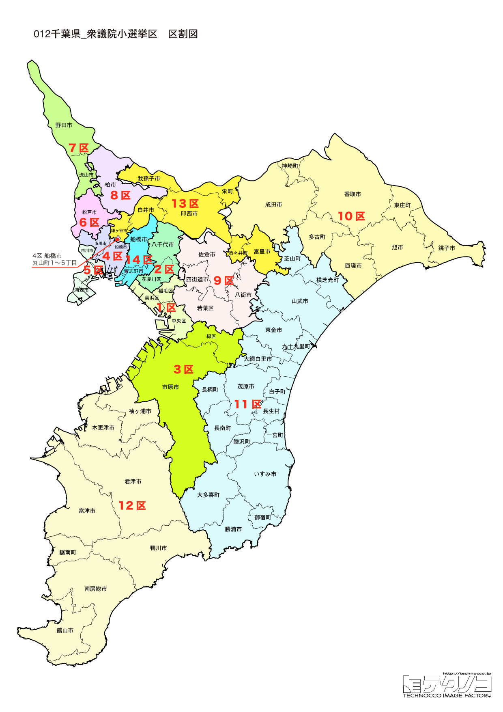

# 千葉県



---

## 基本情報

千葉県は関東地方の南東部に位置し、人口は約628万人で全国6位。県庁所在地は千葉市。三方を海に囲まれた半島県で、太平洋と東京湾に面している。

歴史的には、房総半島として古くから漁業と農業が盛んであった。成田山新勝寺は真言宗智山派の大本山で、年間1,000万人以上の参拝者が訪れる。佐倉藩、館山藩など江戸時代には多くの藩が存在した。

経済的には、成田国際空港が日本の玄関口として機能し、東京ディズニーリゾートは国内最大のテーマパーク。落花生の生産量は全国の約8割を占め、醤油（野田市、銚子市）の生産も盛ん。京葉工業地域は石油化学コンビナートが集積する。

---

## 千葉県の政治的争点

### 成田空港の機能強化

滑走路の増設や運用時間の拡大が計画されているが、騒音問題で地元との調整が続いている。

### 災害対策

2019年の台風15号、19号で大きな被害を受けた経験から、電力インフラの強靭化が課題。

### 東京湾アクアライン

料金の引き下げにより利用が増加したが、渋滞問題が深刻化している。

---

## 選挙の特徴

千葉県の衆議院小選挙区は14（2022年の区割り変更で13から14に増加）。

東京のベッドタウンとして無党派層が多く、選挙結果が流動的な選挙区が多い。野田佳彦元首相（現・中道改革連合共同代表）の地盤があり、立憲民主党の拠点の一つとなっている。

2024年の衆院選では、裏金問題の影響で立憲民主党が躍進し、14選挙区中9選挙区で勝利した。自民党は5選挙区の勝利にとどまり、特に北西部の都市部で苦戦した。

**2026年選挙の構図**: 中道改革連合の野田佳彦共同代表の地元として全国的に注目。中道は12人が出馬し、自民党・維新連立との全面対決。元れいわの多ケ谷亮が中道に合流し、11区から出馬。

---

## 第1区

### 地域構成

千葉1区は千葉市中央区、稲毛区、美浜区で構成される。県庁所在地の中心部と臨海部。

- **千葉市中央区**: 千葉駅周辺の商業地域と県庁所在地の中心。千葉ポートタワーは千葉港のシンボル。

- **美浜区**: 幕張新都心があり、幕張メッセは国内最大級の展示会場。千葉マリンスタジアム（ZOZOマリンスタジアム）は千葉ロッテマリーンズの本拠地。

### 選挙区の特徴

県庁所在地の中心部を含む都市型選挙区。田嶋要が8期連続当選と強い地盤を持ち、立憲が優勢。幕張新都心の発展に伴い、若い世代の有権者も増加傾向。

### 2024年選挙結果

```
田嶋要（立憲）          ███████████████░░░░░  47.3%  107,439票 ✅当選
門山宏哲（自民）         █████████░░░░░░░░░░░  29.7%   67,432票 
依田和孝（維新）         ███░░░░░░░░░░░░░░░░░  10.5%   23,770票 
上田敦広（参政）         ██░░░░░░░░░░░░░░░░░░   6.9%   15,703票 
渡部雅士（共産）         █░░░░░░░░░░░░░░░░░░░   5.6%   12,662票 
──────────────────────────────────────────────────────────
投票率: 53.2% ｜ 票差: 40,007票（17.6pt差）
```

### 2026年選挙の構図

```
田嶋要（中道改革連合・前職）             当選8回、重複
門山宏哲（自民推薦/維新・元職）           重複
上田敦広（参政・新人）
```

田嶋要（中道改革連合）が9期目を目指す。元職の門山宏哲（自民推薦/維新）が再挑戦、参政党の上田敦広も加わる3人の争い。

---

## 第2区

### 地域構成

千葉2区は千葉市花見川区、八千代市で構成される。千葉市北部とベッドタウン。

- **八千代市**: 人口約20万人で、東葉高速鉄道沿線の住宅都市として発展。

### 選挙区の特徴

2024年自民党総裁選に出馬した小林鷹之の地盤。若手のホープとして全国的な知名度を上げており、自民党が安定した強さを持つ選挙区。総裁選での露出が次回選挙にどう影響するか注目。

### 2024年選挙結果

```
小林鷹之（自民）         ████████████████████  68.1%  103,690票 ✅当選
白石ちよ（共産）         ██████████░░░░░░░░░░  31.9%   48,500票 
──────────────────────────────────────────────────────────
投票率: 50.9% ｜ 票差: 55,190票（36.3pt差）
```

### 2026年選挙の構図

```
小林鷹之（自民推薦/維新・前職）          当選5回、重複
佐藤由美（中道改革連合・新人）           重複
白石ちよ（共産・新人）
```

2024年総裁選に出馬した小林鷹之（自民推薦/維新）が再選を目指す。中道改革連合は新人の佐藤由美を擁立、共産の白石ちよも加わる3人の争い。

---

## 第3区

### 地域構成

千葉3区は千葉市緑区、市原市で構成される。千葉市南部と工業都市。

- **市原市**: 石油化学コンビナートが集積する工業都市。養老渓谷は紅葉の名所で、粟又の滝が見どころ。ゴルフ場の数は日本一。

### 選挙区の特徴

工業都市・市原市を含む選挙区。2024年は立憲が勝利したが、京葉工業地域の労働者票と郊外住宅地の無党派層の動向が結果を左右する。

### 2024年選挙結果

```
松野博一（自民）         █████████████░░░░░░░  41.2%   67,308票 ✅当選
岡島一正（立憲）         █████████████░░░░░░░  39.2%   64,169票 🔄比例
大薄裕也（無所属）        ████░░░░░░░░░░░░░░░░  13.9%   22,717票 
加藤和夫（共産）         █░░░░░░░░░░░░░░░░░░░   5.7%    9,297票 
──────────────────────────────────────────────────────────
投票率: 50.8% ｜ 票差: 3,139票（1.9pt差）
```

### 2026年選挙の構図

```
松野博一（自民推薦/維新・前職）          当選10回、重複
岡島一正（中道改革連合・前職）           当選2回、重複
山本政幸（参政・新人）
渡部公美子（共産・新人）
```

2024年に僅差で敗れた松野博一（自民推薦/維新）が再挑戦。岡島一正（中道改革連合）が再選を目指す。参政党の山本政幸、共産の渡部公美子も加わる4人の争い。接戦が予想される。

---

## 第4区

### 地域構成

千葉4区は船橋市の大部分で構成される。県内第2の都市。

- **船橋市**: 人口約65万人で県内2位、全国でも有数の人口を誇る。船橋市場は東京湾の海の幸が集まる。ふなっしーは船橋市の非公認キャラクターとして全国的に有名。ららぽーとTOKYO-BAYは日本初の大型ショッピングモール。

### 選挙区の特徴

野田佳彦元首相（中道改革連合代表）の牙城。10期連続当選と圧倒的な強さを誇り、全国でも最も安定した選挙区の一つ。党代表として2026年選挙を戦う注目の選挙区。

### 2024年選挙結果

```
水沼秀幸（立憲）         ██████████████░░░░░░  43.3%   90,011票 ✅当選
木村哲也（自民）         ██████████░░░░░░░░░░  32.1%   66,629票 
雨宮京子（維新）         ████░░░░░░░░░░░░░░░░  12.6%   26,222票 
工藤聖子（参政）         ██░░░░░░░░░░░░░░░░░░   6.6%   13,736票 
八鎌謙太（共産）         █░░░░░░░░░░░░░░░░░░░   5.4%   11,131票 
──────────────────────────────────────────────────────────
投票率: 52.6% ｜ 票差: 23,382票（11.3pt差）
```

### 2026年選挙の構図

```
水沼秀幸（中道改革連合・前職）          当選2回、重複
鹿嶋祐介（自民推薦/維新・新人）         重複
工藤聖子（参政・新人）                 重複
高橋宏（減税日本・ゆうこく連合・新人）   重複
玉堀里衣（共産・新人）
```

水沼秀幸（中道改革連合）が3期目を目指す。自民推薦/維新は新人の鹿嶋祐介を擁立。参政党の工藤聖子、減税日本・ゆうこく連合の高橋宏、共産の玉堀里衣も加わる5人の争い。

---

## 第5区

### 地域構成

千葉5区は市川市、浦安市で構成される。東京に隣接する住宅都市。

- **浦安市**: 東京ディズニーリゾートがあることで有名。埋立地に新しい住宅街が広がり、若いファミリー層が多い。

- **市川市**: 人口約50万人で県内4位。市川駅周辺は商業地域として発展。葛飾八幡宮は千本イチョウで知られる。

### 選挙区の特徴

東京ディズニーリゾートを抱える浦安市を含む選挙区。2024年は政治資金問題で自民を離党した薗浦健太郎が無所属で当選するなど、混乱した選挙区。2026年は複数候補の乱立で混戦が予想される。

### 2024年選挙結果

```
矢崎堅太郎（立憲）        ██████████░░░░░░░░░░  30.6%   66,031票 ✅当選
英利アルフィヤ（自民）      █████████░░░░░░░░░░░  27.6%   59,636票 🔄比例
岡野純子（国民）         ███████░░░░░░░░░░░░░  23.6%   51,033票 🔄比例
岡野純子（国民）         █████░░░░░░░░░░░░░░░  15.0%   24,842票 
岸野智康（維新）         ████░░░░░░░░░░░░░░░░  13.9%   22,952票 
岸野智康（維新）         ██░░░░░░░░░░░░░░░░░░   8.2%   17,615票 
斉藤和子（共産）         ██░░░░░░░░░░░░░░░░░░   7.5%   12,360票 
桜井雅人（共産）         █░░░░░░░░░░░░░░░░░░░   5.1%   11,015票 
宮路純一（参政）         █░░░░░░░░░░░░░░░░░░░   4.9%   10,490票 
織田三江（政治家女子48党）   ░░░░░░░░░░░░░░░░░░░░   1.5%    2,463票 
──────────────────────────────────────────────────────────
投票率: 53.2% ｜ 票差: 6,395票（3.0pt差）
```

### 2026年選挙の構図

```
矢崎堅太郎（中道改革連合・前職）        当選2回、重複
英利アルフィヤ（自民推薦/維新・前職）    当選1回、重複
岡野純子（国民・前職）                 当選1回、重複
小林修平（チームみらい・新人）          重複
宮路純一（参政・新人）
```

2024年に小選挙区で勝利した矢崎堅太郎（中道改革連合）が再選を目指す。英利アルフィヤ（自民推薦/維新）、岡野純子（国民）の前職2人が再挑戦。チームみらいの小林修平、参政党の宮路純一も加わる5人の混戦模様。

---

## 第6区

### 地域構成

千葉6区は松戸市、鎌ケ谷市で構成される。常磐線・新京成線沿線。

- **松戸市**: 人口約50万人で県内3位。常盤平団地は日本初の大規模団地として知られる。矢切の渡しは松尾芭蕉ゆかりの地で、演歌「矢切の渡し」で有名。

### 選挙区の特徴

渡辺博道が9期連続当選と自民党の牙城。松戸市という大都市を抱えながらも保守的な傾向が続く選挙区。高齢化が進む常盤平団地などの票の動向に注目。

### 2024年選挙結果

```
安藤淳子（立憲）         ███████████░░░░░░░░░  34.4%   71,555票 ✅当選
渡辺博道（自民）         ███████████░░░░░░░░░  33.8%   70,215票 
藤巻健太（維新）         ████░░░░░░░░░░░░░░░░  14.7%   30,472票 🔄比例
原田慎太郎（参政）        ██░░░░░░░░░░░░░░░░░░   8.1%   16,752票 
浦野真（共産）          ██░░░░░░░░░░░░░░░░░░   6.8%   14,136票 
原田義康（社民）         ░░░░░░░░░░░░░░░░░░░░   2.3%    4,705票 
──────────────────────────────────────────────────────────
投票率: 51.7% ｜ 票差: 1,340票（0.6pt差）
```

### 2026年選挙の構図

```
安藤淳子（中道改革連合・前職）          当選2回、重複
渡辺博道（自民推薦/維新・元職）         当選9回
武藤雄大（国民・新人）                 重複
出羽幹子（参政・新人）
浦野真（共産・新人）
```

2024年に僅差で勝利した安藤淳子（中道改革連合）が再選を目指す。元職の渡辺博道（自民推薦/維新）が雪辱を狙う。国民の武藤雄大、参政党の出羽幹子、共産の浦野真も加わる5人の争い。接戦が予想される。

---

## 第7区

### 地域構成

千葉7区は松戸市の一部、流山市、野田市で構成される。つくばエクスプレス沿線を含む。

- **流山市**: つくばエクスプレス開通後に人口が急増。「母になるなら、流山市。」のキャッチフレーズで子育て世代に人気。

- **野田市**: キッコーマンの本社があり、醤油のまちとして知られる。清水公園はアスレチックが有名。

### 選挙区の特徴

つくばエクスプレス開通で人口急増中の流山市を含む選挙区。若いファミリー層が多く、子育て政策への関心が高い。2024年は立憲が勝利し、新興住宅地の無党派層の取り込みが鍵。

### 2024年選挙結果

```
齋藤健（自民）          ██████████████████░░  54.2%   82,606票 ✅当選
平戸航太（国民）         ███████████░░░░░░░░░  33.9%   51,749票 
徳増記代子（共産）        ███░░░░░░░░░░░░░░░░░  11.9%   18,127票 
──────────────────────────────────────────────────────────
投票率: 52.7% ｜ 票差: 30,857票（20.2pt差）
```

### 2026年選挙の構図

```
斎藤健（自民推薦/維新・前職）           当選7回、重複
林田章裕（国民・新人）                 重複
川田龍平（減税日本・ゆうこく連合・新人） 重複
```

元農林水産大臣の斎藤健（自民推薦/維新）が再選を目指す。国民の林田章裕、減税日本・ゆうこく連合の川田龍平（元参議院議員）も加わる3人の争い。

---

## 第8区

### 地域構成

千葉8区は柏市、我孫子市で構成される。常磐線沿線の住宅都市。

- **柏市**: 人口約43万人で県内5位。柏駅周辺は商業地域として発展し、「東の渋谷」と呼ばれることも。柏レイソルの本拠地。

- **我孫子市**: 手賀沼のほとりにある住宅都市。白樺派の作家たちが住んだ「北の鎌倉」。

### 選挙区の特徴

元五輪担当大臣の桜田義孝が8期連続当選と自民が強い。ただし失言問題などで知名度が高く、野党の攻勢次第では波乱も。柏市の「東の渋谷」と呼ばれる若者が集まるエリアの票が注目。

### 2024年選挙結果

```
本庄知史（立憲）         ██████████████░░░░░░  42.9%   78,678票 ✅当選
松本泉（自民）          ██████████░░░░░░░░░░  32.2%   59,070票 
石塚貞通（維新）         ███░░░░░░░░░░░░░░░░░  11.1%   20,338票 
宮本寛之（参政）         ██░░░░░░░░░░░░░░░░░░   7.6%   13,872票 
高橋敏（共産）          ██░░░░░░░░░░░░░░░░░░   6.2%   11,296票 
──────────────────────────────────────────────────────────
投票率: 52.4% ｜ 票差: 19,608票（10.7pt差）
```

### 2026年選挙の構図

```
本庄知史（中道改革連合・前職）          当選2回、重複
松本泉（自民・新人）                   重複
石塚貞通（維新・新人）                 重複
宮本寛之（参政・新人）                 重複
```

2024年に小選挙区で勝利した本庄知史（中道改革連合）が再選を目指す。自民は新人の松本泉を擁立し世代交代。維新の石塚貞通、参政党の宮本寛之も加わる4人の争い。

---

## 第9区

### 地域構成

千葉9区は佐倉市、四街道市、八街市、印西市、白井市、富里市、印旛郡、山武郡の一部で構成される。北総地域。

- **佐倉市**: 佐倉藩の城下町で、武家屋敷が残る。国立歴史民俗博物館は日本の歴史を総合的に展示する博物館。

- **印西市**: 千葉ニュータウンの一部で、データセンターが集積する「データセンター銀座」として知られる。

### 選挙区の特徴

千葉ニュータウンや印西市のデータセンター集積地を含む選挙区。2024年は立憲が勝利。人口増加地域と歴史ある城下町・佐倉が混在し、新旧住民の票の動向が鍵。

### 2024年選挙結果

```
奥野総一郎（立憲）        ██████████████░░░░░░  43.9%   86,335票 ✅当選
田宮寿人（自民）         ███████████░░░░░░░░░  33.5%   65,963票 
田沼隆志（維新）         █████░░░░░░░░░░░░░░░  16.8%   33,034票 
山崎温之（共産）         █░░░░░░░░░░░░░░░░░░░   5.8%   11,385票 
──────────────────────────────────────────────────────────
投票率: 50.6% ｜ 票差: 20,372票（10.4pt差）
```

### 2026年選挙の構図

```
奥野総一郎（中道改革連合・前職）        当選5回、重複
田宮寿人（自民・新人）                 重複
田沼隆志（維新・元職）                 当選1回、重複
前田裕介（参政・新人）
```

2024年に小選挙区で勝利した奥野総一郎（中道改革連合）が再選を目指す。自民は新人の田宮寿人を擁立。元職の田沼隆志（維新）が再挑戦、参政党の前田裕介も加わる4人の争い。

---

## 第10区

### 地域構成

千葉10区は成田市、銚子市、旭市、匝瑳市、香取市、香取郡で構成される。成田空港周辺と銚子方面。

- **成田市**: 成田国際空港があり、日本の空の玄関口。成田山新勝寺は真言宗智山派の大本山で、年間1,000万人以上が参拝する。うなぎが名物。

- **銚子市**: 日本有数の漁港で、水揚げ量日本一を誇る年も多い。犬吠埼灯台は関東最東端の灯台。銚子電鉄は経営難を乗り越えるために「ぬれ煎餅」を販売して話題に。

### 選挙区の特徴

成田国際空港と銚子漁港を抱える広域選挙区。空港関連産業と農漁業が混在し、地域によって争点が異なる。2024年は自民が勝利したが、空港機能強化への地元の賛否が今後の争点に。

### 2024年選挙結果

```
小池正昭（自民）         ██████████████░░░░░░  43.8%   69,563票 ✅当選
谷田川元（立憲）         ██████████████░░░░░░  42.8%   67,920票 🔄比例
椎名亮太（参政）         ██░░░░░░░░░░░░░░░░░░   7.2%   11,494票 
仲幸子（共産）          █░░░░░░░░░░░░░░░░░░░   5.0%    8,018票 
今留尚人（無所属）        ░░░░░░░░░░░░░░░░░░░░   1.2%    1,852票 
──────────────────────────────────────────────────────────
投票率: 50.8% ｜ 票差: 1,643票（1.0pt差）
```

### 2026年選挙の構図

```
小池正昭（自民推薦/維新・前職）         当選2回、重複
谷田川元（中道改革連合・前職）          当選3回、重複
田村理江（共産・新人）
```

2024年に僅差で勝利した小池正昭（自民推薦/維新）と、比例復活した谷田川元（中道改革連合）の再戦。共産の田村理江も加わる3人の争い。接戦が予想される。

---

## 第11区

### 地域構成

千葉11区は茂原市、勝浦市、いすみ市、長生郡、夷隅郡で構成される。外房地域。

- **勝浦市**: 勝浦朝市が400年以上の歴史を持つ。勝浦タンタンメンはご当地グルメとして人気。

- **茂原市**: 七夕まつりで知られる。

### 選挙区の特徴

元法務大臣の森英介が12期連続当選と自民の牙城。しかし77歳と高齢であり、引退・後継問題が浮上。外房地域の過疎化対策、漁業振興が争点となる。

### 2024年選挙結果

```
森英介（自民）          ███████████████████░  57.4%   92,187票 ✅当選
多ケ谷亮（れいわ）        █████████░░░░░░░░░░░  28.4%   45,616票 🔄比例
椎名史明（共産）         ████░░░░░░░░░░░░░░░░  14.2%   22,720票 
──────────────────────────────────────────────────────────
投票率: 49.4% ｜ 票差: 46,571票（29.0pt差）
```

### 2026年選挙の構図

```
森英介（自民推薦/維新・前職）           当選12回
多ケ谷亮（中道改革連合・前職）          当選1回、重複
椎名史明（共産・新人）
```

元法務大臣の森英介（自民推薦/維新）が13期目を目指す。2024年にれいわで比例復活した多ケ谷亮が中道改革連合に合流し再挑戦。共産の椎名史明も加わる3人の争い。

---

## 第12区

### 地域構成

千葉12区は木更津市、君津市、富津市、袖ケ浦市で構成される。内房地域。

- **木更津市**: 東京湾アクアラインの開通で東京へのアクセスが向上。三井アウトレットパーク木更津は人気の商業施設。

- **君津市**: 日本製鉄君津製鉄所がある工業都市。亀山湖は紅葉の名所。

### 選挙区の特徴

元防衛大臣の浜田靖一が10期連続当選と圧倒的強さを誇る自民の牙城。アクアライン開通で東京との距離が縮まり、木更津周辺は人口増加傾向。防衛政策にも精通した重鎮の選挙区。

### 2024年選挙結果

```
浜田靖一（自民）         ███████████████████░  56.5%  105,510票 ✅当選
樋高剛（立憲）          ████████░░░░░░░░░░░░  24.1%   45,098票
地引直輝（維新）         █████░░░░░░░░░░░░░░░  13.9%   25,882票
葛原茂（共産）          ██░░░░░░░░░░░░░░░░░░   5.5%   10,243票
──────────────────────────────────────────────────────────
投票率: 51.1% ｜ 票差: 60,412票（32.4pt差）
```

### 2026年選挙の構図

```
浜田靖一（自民推薦/維新・前職）         当選10回、重複
大薄裕也（無所属・新人）
葛原茂（共産・新人）
```

元防衛大臣の浜田靖一（自民推薦/維新）が11期目を目指す。無所属の大薄裕也、共産の葛原茂も加わる3人の争い。浜田氏の盤石の地盤が続くか注目。

---

## 第13区

### 地域構成

千葉13区は習志野市、船橋市の一部で構成される。

- **習志野市**: 自衛隊の駐屯地があり、谷津干潟は野鳥の楽園としてラムサール条約に登録されている。

### 選挙区の特徴

船橋市の一部と習志野市を含む都市型選挙区。2024年は立憲が勝利。自衛隊駐屯地がある一方、谷津干潟など環境意識の高い地域もあり、多様な票が混在。

### 2024年選挙結果

```
松本尚（自民）          ██████████████░░░░░░  43.8%   96,024票 ✅当選
宮川伸（立憲）          ██████████████░░░░░░  42.2%   92,501票 🔄比例
中谷めぐみ（参政）        ██░░░░░░░░░░░░░░░░░░   8.9%   19,582票 
柏崎末人（共産）         █░░░░░░░░░░░░░░░░░░░   5.1%   11,287票 
──────────────────────────────────────────────────────────
投票率: 54.0% ｜ 票差: 3,523票（1.6pt差）
```

### 2026年選挙の構図

```
松本尚（自民推薦/維新・前職）           当選3回、重複
宮川伸（中道改革連合・前職）            当選2回、重複
中谷めぐ（参政・新人）                 重複
```

2024年に僅差で勝利した松本尚（自民推薦/維新）と、比例復活した宮川伸（中道改革連合）の再戦。参政党の中谷めぐも加わる3人の争い。接戦が予想される。

---

## 第14区

### 地域構成

千葉14区は南房総市、館山市、鴨川市、安房郡で構成される。南房総地域。

- **館山市**: 南房総の中心都市で、温暖な気候から花の栽培が盛ん。城山公園からは東京湾を一望できる。

- **鴨川市**: 鴨川シーワールドがあり、シャチのショーが人気。安房鴨川駅は外房線と内房線の終着駅。

### 選挙区の特徴

2022年の区割り変更で新設された選挙区。南房総の観光地を含み、過疎化と観光振興のバランスが争点。温暖な気候を活かした花卉栽培など農業政策も重要。新設選挙区のため、地盤形成が進行中。

### 2024年選挙結果

```
野田佳彦（立憲）         ████████████████████  66.4%  145,821票 ✅当選
高橋恭介（自民）         ███████░░░░░░░░░░░░░  23.6%   51,723票 
坂井洋介（共産）         █░░░░░░░░░░░░░░░░░░░   5.2%   11,505票 
ミサオ・レッドウルフ（れいわ）  █░░░░░░░░░░░░░░░░░░░   4.8%   10,547票 
──────────────────────────────────────────────────────────
投票率: 54.6% ｜ 票差: 94,098票（42.9pt差）
```

### 2026年選挙の構図

```
野田佳彦（中道改革連合・前職）          当選11回、共同代表
長野春信（自民推薦/維新・新人）         重複
中村愛（参政・新人）
八鎌健太（共産・新人）
```

中道改革連合共同代表の野田佳彦（元総理大臣）が12期目を目指す。自民推薦/維新は新人の長野春信を擁立。参政党の中村愛、共産の八鎌健太も加わる4人の争い。新党を率いる党首選挙区として全国的に注目される。

---
