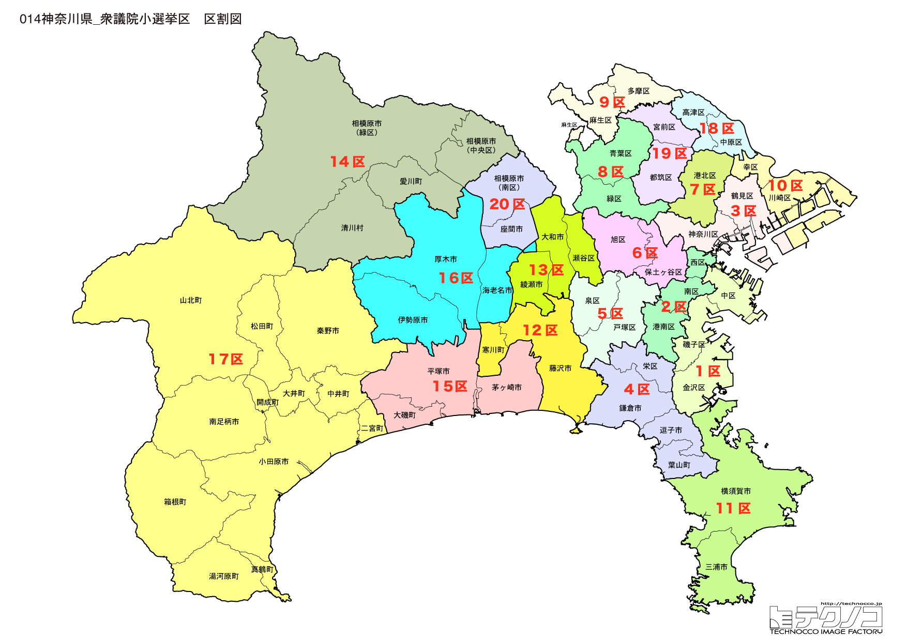

# 神奈川県

---

## 基本情報

神奈川県は関東地方の南西部に位置し、人口は約924万人で全国2位。県庁所在地は横浜市。東京に隣接し、横浜市、川崎市、相模原市の3つの政令指定都市を擁する。

歴史的には、鎌倉幕府が置かれた鎌倉は日本の政治の中心であった。幕末には横浜が開港し、日本の近代化の窓口となった。箱根は東海道の難所として知られ、温泉保養地として発展した。

経済的には、横浜港は日本有数の貿易港で、みなとみらい21地区は横浜のシンボル。川崎市は京浜工業地帯の中核で、先端技術産業も集積。湘南地域はマリンスポーツのメッカとして若者に人気。

---

## 神奈川県の政治的争点

### 米軍基地問題

横須賀、座間など米軍基地を抱える自治体では、基地の存在と地域振興のバランスが課題。

### 人口増加地域の課題

武蔵小杉など人口急増地域では、インフラ整備、保育施設不足などが課題。

### 観光振興

箱根、鎌倉、湘南など観光資源が豊富だが、オーバーツーリズム対策も必要。

---

## 選挙の特徴

神奈川県の衆議院小選挙区は20（2022年の区割り変更で18から20に増加）。全国で東京に次ぐ選挙区数を持つ。

東京のベッドタウンとして無党派層が非常に多く、選挙ごとに結果が大きく変動する傾向がある。菅義偉前首相、河野太郎、小泉進次郎など自民党の有力政治家の地盤がある一方、都市部では立憲民主党も強い。

2024年の衆院選では、裏金問題の影響で野党が躍進し、自民党は20選挙区中7選挙区の勝利にとどまった。特に甘利明元幹事長が20区で落選するなど、自民党への逆風が顕著だった。

---

## 第1区

### 地域構成

神奈川1区は横浜市中区、磯子区、金沢区で構成される。横浜港周辺と南部。

- **中区**: 横浜の中心で、みなとみらい21、横浜中華街、山下公園がある。赤レンガ倉庫は歴史的建造物を活用した商業施設。

- **金沢区**: 八景島シーパラダイスがあり、海の公園は潮干狩りが楽しめる。

### 選挙区の特徴

横浜港周辺の都心部を含む選挙区。観光地や商業地域が多く、無党派層が多い都市型選挙区。2024年は立憲が勝利し、野党優勢の傾向が続く。

### 2024年選挙結果

| 候補者 | 党派 | 結果 |
|--------|------|------|
| 篠原豪 | 立憲 | **当選** |

### 2026年選挙の構図

篠原豪（立憲→中道改革連合・現職）と自民党候補の対決。

---

## 第2区

### 地域構成

神奈川2区は横浜市西区、南区、港南区で構成される。横浜駅周辺と南部住宅地。

- **西区**: 横浜駅周辺の商業地域。横浜高島屋、そごう横浜店など大型百貨店が集積。

### 選挙区の特徴

菅義偉前首相の牙城。10期連続当選と圧倒的な強さを誇り、自民党内でも最も安定した選挙区の一つ。77歳と高齢だが、首相経験者として全国的な影響力を持つ。

### 2024年選挙結果

| 候補者 | 党派 | 結果 |
|--------|------|------|
| 菅義偉 | 自民 | **当選**（10選） |

菅義偉は元内閣総理大臣で、自民党の重鎮。

### 2026年選挙の構図

菅義偉（自民・現職、77歳）は盤石の地盤を持つ。

---

## 第3区

### 地域構成

神奈川3区は横浜市鶴見区、神奈川区で構成される。京浜工業地帯と臨海部。

- **鶴見区**: 総持寺（曹洞宗大本山）があり、沖縄出身者が多く住む「リトル沖縄」としても知られる。

### 選挙区の特徴

京浜工業地帯を含む工業地域と住宅地が混在。沖縄出身者が多く住む「リトル沖縄」もあり、多様な有権者層を持つ。2024年は自民が勝利したが、接戦が続く。

### 2024年選挙結果

| 候補者 | 党派 | 結果 |
|--------|------|------|
| 中西健治 | 自民 | **当選** |

### 2026年選挙の構図

中西健治（自民・現職）と野党候補の対決。

---

## 第4区

### 地域構成

神奈川4区は横浜市栄区、鎌倉市、逗子市、三浦郡で構成される。湘南の海沿い。

- **鎌倉市**: 鎌倉幕府の所在地で、鶴岡八幡宮、高徳院の大仏など歴史的名所が多い。江ノ電は観光客に人気のローカル線。

- **逗子市**: 海水浴場があり、葉山町は御用邸がある高級別荘地。

### 選挙区の特徴

鎌倉・逗子・葉山という歴史と高級別荘地を含む湘南エリア。文化的・知的な有権者が多く、環境問題や歴史保全への関心が高い。2024年は立憲が勝利。

### 2024年選挙結果

| 候補者 | 党派 | 結果 |
|--------|------|------|
| 早稲田ゆき | 立憲 | **当選** |

### 2026年選挙の構図

早稲田ゆき（立憲→中道改革連合・現職）と自民党候補の対決。

---

## 第5区

### 地域構成

神奈川5区は横浜市戸塚区、泉区、瀬谷区で構成される。横浜市西部の住宅地。

### 選挙区の特徴

横浜市西部の住宅地。元官房副長官の坂井学が6期連続当選と自民が安定した強さを持つ。郊外型住宅地で、子育て世代の動向が鍵。

### 2024年選挙結果

| 候補者 | 党派 | 結果 |
|--------|------|------|
| 坂井学 | 自民 | **当選**（6選） |

坂井学は元官房副長官。

### 2026年選挙の構図

坂井学（自民・現職）と中道改革連合候補の対決。

---

## 第6区

### 地域構成

神奈川6区は横浜市保土ケ谷区、旭区で構成される。横浜市中西部の住宅地。

- **旭区**: よこはま動物園ズーラシアがあり、「生命の共生・自然との調和」をテーマにした動物園。

### 選挙区の特徴

横浜市中西部の住宅地。2024年は立憲が勝利。ズーラシアなど家族向け施設が多く、子育て世代の票が重要。無党派層が多く結果が流動的。

### 2024年選挙結果

| 候補者 | 党派 | 結果 |
|--------|------|------|
| 青柳陽一郎 | 立憲 | **当選** |

### 2026年選挙の構図

青柳陽一郎（立憲→中道改革連合・現職）と自民党候補の対決。

---

## 第7区

### 地域構成

神奈川7区は横浜市港北区、都筑区で構成される。新横浜駅周辺と港北ニュータウン。

- **港北区**: 新横浜駅があり、日産スタジアム（横浜国際総合競技場）は2002年FIFAワールドカップ決勝の会場。

- **都筑区**: 港北ニュータウンがあり、計画的に開発された新興住宅地。

### 選挙区の特徴

新横浜と港北ニュータウンを含む新興住宅地。人口増加が続き、若い世代の有権者が多い。2024年は立憲が勝利し、都市型選挙区として野党優勢の傾向。

### 2024年選挙結果

| 候補者 | 党派 | 結果 |
|--------|------|------|
| 中谷一馬 | 立憲 | **当選** |

### 2026年選挙の構図

中谷一馬（立憲→中道改革連合・現職）と自民党候補の対決。

---

## 第8区

### 地域構成

神奈川8区は横浜市青葉区、緑区で構成される。田園都市線沿線の高級住宅地。

- **青葉区**: たまプラーザ、あざみ野など東急田園都市線沿線の人気住宅地。

### 選挙区の特徴

田園都市線沿線の高級住宅地。元みんなの党代表の江田憲司が8期連続当選と強固な地盤を持つ。高学歴・高所得層が多く、政策志向の有権者が多い。

### 2024年選挙結果

| 候補者 | 党派 | 結果 |
|--------|------|------|
| 江田憲司 | 立憲 | **当選**（8選） |

江田憲司は元みんなの党代表で、立憲民主党の重鎮。

### 2026年選挙の構図

江田憲司（立憲→中道改革連合・現職）は安定した地盤を持つ。

---

## 第9区

### 地域構成

神奈川9区は川崎市多摩区、麻生区で構成される。小田急線沿線の住宅地。

- **麻生区**: 新百合ヶ丘が中心で、昭和音楽大学、日本映画大学など文化施設が集積。

- **多摩区**: 藤子・F・不二雄ミュージアム（ドラえもんミュージアム）がある。

### 選挙区の特徴

川崎市北部の小田急線沿線。文化施設が集積し、ドラえもんミュージアムなど家族向けスポットも多い。2024年は立憲が勝利し、野党優勢の傾向。

### 2024年選挙結果

| 候補者 | 党派 | 結果 |
|--------|------|------|
| 笠浩史 | 立憲 | **当選** |

### 2026年選挙の構図

笠浩史（立憲→中道改革連合・現職）と自民党候補の対決。

---

## 第10区

### 地域構成

神奈川10区は川崎市川崎区、幸区、中原区で構成される。川崎駅周辺と武蔵小杉。

- **川崎区**: 川崎駅周辺の商業地域と川崎大師。川崎大師は厄除けで有名で、初詣には300万人以上が参拝。

- **中原区**: 武蔵小杉駅周辺がタワーマンションの林立で「ムサコ」として人気に。

### 選挙区の特徴

川崎駅周辺と武蔵小杉を含む。タワーマンションの林立で人口急増中の武蔵小杉は、若いファミリー層が多い。2024年は立憲が勝利し、都市型選挙区として野党が強い。

### 2024年選挙結果

| 候補者 | 党派 | 結果 |
|--------|------|------|
| 城井崇 | 立憲 | **当選** |

### 2026年選挙の構図

城井崇（立憲→中道改革連合・現職）と自民党候補の対決。

---

## 第11区

### 地域構成

神奈川11区は横須賀市、三浦市で構成される。三浦半島の先端部。

- **横須賀市**: 米海軍横須賀基地があり、海軍カレーが名物。記念艦三笠は日露戦争の旗艦。

- **三浦市**: マグロで有名な三崎港があり、「三崎のマグロ」は全国的なブランド。

### 選挙区の特徴

小泉進次郎の牙城。父・小泉純一郎から引き継いだ圧倒的な地盤を持ち、6期連続当選。自民党の次期リーダー候補として全国的に注目される。横須賀の米軍基地問題も争点。

### 2024年選挙結果

| 候補者 | 党派 | 結果 |
|--------|------|------|
| 小泉進次郎 | 自民 | **当選**（6選） |

小泉進次郎は小泉純一郎元首相の息子で、環境大臣を務めた。自民党のホープとして注目。

### 2026年選挙の構図

小泉進次郎（自民・現職、44歳）は盤石の地盤を持つ。党内での立場と総裁候補としての動向に注目。

---

## 第12区

### 地域構成

神奈川12区は藤沢市、寒川町で構成される。湘南の中心都市。

- **藤沢市**: 湘南海岸、江の島があり、サーフィンのメッカ。新江ノ島水族館は人気の観光スポット。

### 選挙区の特徴

湘南の中心・藤沢市と江の島を含む。小児科医出身の阿部知子が8期連続当選と立憲が強い地盤を持つ。サーフィン文化など若者の街であり、環境問題への関心も高い。

### 2024年選挙結果

| 候補者 | 党派 | 結果 |
|--------|------|------|
| 阿部知子 | 立憲 | **当選**（8選） |

阿部知子は小児科医出身で、医療政策に詳しい。

### 2026年選挙の構図

阿部知子（立憲→中道改革連合・現職）と自民党候補の対決。

---

## 第13区

### 地域構成

神奈川13区は大和市、海老名市、座間市、綾瀬市で構成される。相鉄線・小田急線沿線。

- **海老名市**: 海老名駅周辺が再開発で発展。ビナウォークは大型商業施設。

- **座間市**: 米軍キャンプ座間がある。ひまわりまつりは55万本のひまわりが咲く。

### 選挙区の特徴

相鉄線・小田急線沿線の住宅都市。2024年は甘利明元幹事長が20区から移動予定で、立憲との激戦が予想される。米軍キャンプ座間もあり、基地問題も争点に。

### 2024年選挙結果

| 候補者 | 党派 | 結果 |
|--------|------|------|
| 太栄志 | 立憲 | **当選** |

### 2026年選挙の構図

太栄志（立憲→中道改革連合・現職）と自民党・甘利明元幹事長の対決。

---

## 第14区

### 地域構成

神奈川14区は相模原市緑区、中央区で構成される。相模原市の中心部と山間部。

- **相模原市**: 人口約72万人の政令指定都市。JAXA相模原キャンパスは「はやぶさ」などの宇宙探査の拠点。

### 選挙区の特徴

相模原市の中心部とJAXA相模原キャンパスを含む。宇宙開発の拠点として科学技術への関心が高い。赤間二郎が6期連続当選と自民が安定した強さを持つ。

### 2024年選挙結果

| 候補者 | 党派 | 結果 |
|--------|------|------|
| 赤間二郎 | 自民 | **当選**（6選） |

### 2026年選挙の構図

赤間二郎（自民・現職）と野党候補の対決。

---

## 第15区

### 地域構成

神奈川15区は平塚市、茅ヶ崎市、大磯町、二宮町で構成される。湘南西部。

- **茅ヶ崎市**: サザンオールスターズの桑田佳祐の出身地で、サザンビーチちがさきは聖地。

- **平塚市**: 七夕まつりで有名。湘南ベルマーレの本拠地。

### 選挙区の特徴

河野太郎の牙城。10期連続当選で首相候補の一人として全国的な知名度を持つ。サザンオールスターズの聖地・茅ヶ崎を含み、若者文化と地元愛が強い選挙区。

### 2024年選挙結果

| 候補者 | 党派 | 結果 |
|--------|------|------|
| 河野太郎 | 自民 | **当選**（10選） |

河野太郎は元外務大臣、元デジタル大臣で、首相候補の一人。

### 2026年選挙の構図

河野太郎（自民・現職、62歳）は盤石の地盤を持つ。党内での立場に注目。

---

## 第16区

### 地域構成

神奈川16区は厚木市、伊勢原市、愛川町、清川村で構成される。丹沢山地の麓。

- **厚木市**: 本厚木駅周辺が商業地域。厚木シロコロ・ホルモンはB-1グランプリで優勝。

- **伊勢原市**: 大山阿夫利神社があり、大山詣りは江戸時代から続く信仰。

### 選挙区の特徴

丹沢山地の麓の厚木・伊勢原を含む。大山詣りの歴史を持つ信仰の地。2024年は立憲が勝利し、接戦区として注目。B級グルメ「シロコロ・ホルモン」の地元愛も強い。

### 2024年選挙結果

| 候補者 | 党派 | 結果 |
|--------|------|------|
| 後藤祐一 | 立憲 | **当選** |

### 2026年選挙の構図

後藤祐一（立憲→中道改革連合・現職）と自民党候補の対決。

---

## 第17区

### 地域構成

神奈川17区は小田原市、南足柄市、中井町、大井町、松田町、山北町、開成町、箱根町、真鶴町、湯河原町で構成される。県西部の観光地。

- **小田原市**: 小田原城の城下町で、かまぼこ、干物が名産。

- **箱根町**: 温泉リゾートとして全国的に有名。芦ノ湖、大涌谷、箱根駅伝など見どころ多数。

### 選挙区の特徴

小田原城下町と箱根温泉を含む県西部の観光地。元デジタル大臣の牧島かれんが5期連続当選と自民が強い。観光業の振興と箱根駅伝で知名度の高い地域。

### 2024年選挙結果

| 候補者 | 党派 | 結果 |
|--------|------|------|
| 牧島かれん | 自民 | **当選**（5選） |

牧島かれんは元デジタル大臣。

### 2026年選挙の構図

牧島かれん（自民・現職）と野党候補の対決。

---

## 第18区

### 地域構成

神奈川18区は川崎市高津区、宮前区で構成される。田園都市線沿線。

- **宮前区**: 東急田園都市線沿線の住宅地。

- **高津区**: 二子新地、溝の口など商業地域がある。

### 選挙区の特徴

田園都市線沿線の川崎市南部。山際大志郎が7期連続当選だが、旧統一教会問題で辞任した経緯があり、その影響が残る。高所得層の住宅地で政治への関心が高い。

### 2024年選挙結果

| 候補者 | 党派 | 結果 |
|--------|------|------|
| 山際大志郎 | 自民 | **当選**（7選） |

山際大志郎は元経済再生担当大臣だが、旧統一教会問題で辞任した経緯がある。

### 2026年選挙の構図

山際大志郎（自民・現職）と中道改革連合候補の対決。旧統一教会問題の影響に注目。

---

## 第19区

### 地域構成

神奈川19区は相模原市南区で構成される。

- **相模原市南区**: 相模大野駅周辺が商業地域。小田急線沿線の住宅地。

### 選挙区の特徴

相模原市南部の小田急線沿線。2024年はペルー出身の帰化日本人・深作ヘススが当選し、初の外国生まれの衆議院議員として全国的に注目された。多様性を象徴する選挙区。

### 2024年選挙結果

| 候補者 | 党派 | 結果 |
|--------|------|------|
| 深作ヘスス | 立憲 | **当選** |

深作ヘススはペルー出身の帰化日本人で、初の外国生まれの衆議院議員として注目された。

### 2026年選挙の構図

深作ヘスス（立憲→中道改革連合・現職）と自民党候補の対決。

---

## 第20区

### 地域構成

神奈川20区は相模原市の一部、秦野市で構成される。

- **秦野市**: 丹沢登山の玄関口。秦野盆地は落花生の産地。弘法山公園は桜の名所。

### 選挙区の特徴

2022年の区割り変更で新設。2024年は甘利明元幹事長が落選する大波乱があった選挙区。甘利は13区に移動予定で、2026年は新たな構図での戦いとなる。

### 2024年選挙結果

| 候補者 | 党派 | 結果 |
|--------|------|------|
| 甘利明 | 自民 | 落選 |

甘利明元幹事長が落選する波乱。2021年に続く2度目の小選挙区敗北。

### 2026年選挙の構図

新設選挙区で激戦が予想される。甘利明は13区に移動して出馬予定。

---
