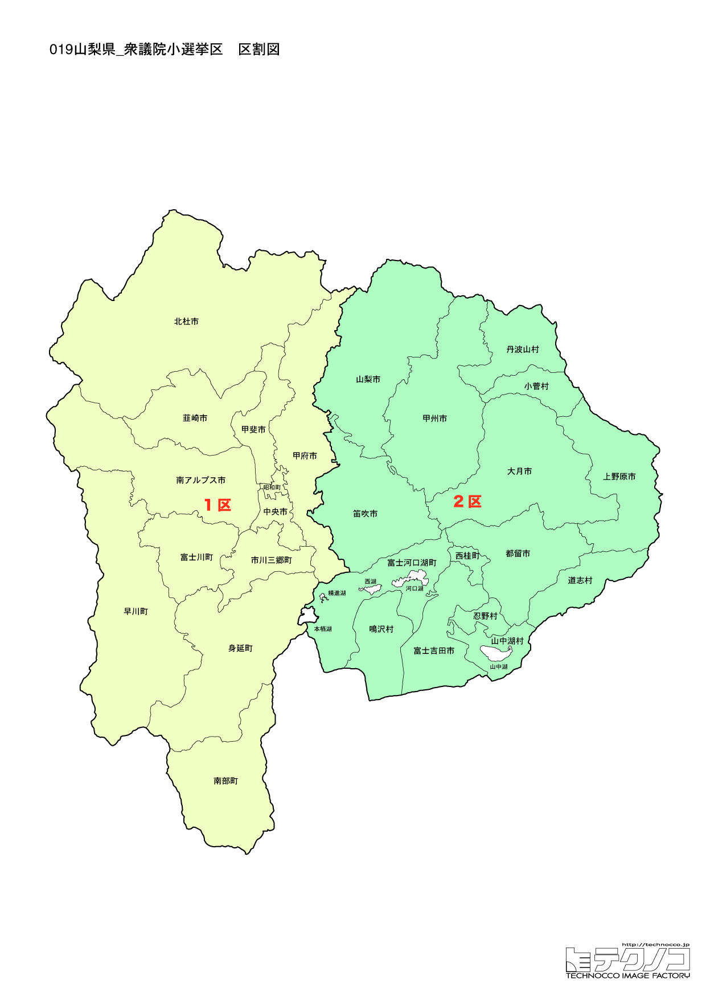

# 山梨県



---

## 基本情報

山梨県は関東地方の西部（中部地方に含められることも）に位置し、人口は約80万人で全国42位。県庁所在地は甲府市。周囲を山に囲まれた盆地県で、富士山の北側に位置する。

歴史的には、戦国時代に武田信玄が甲斐国を治め、「甲斐の虎」として名を馳せた。武田氏滅亡後は徳川家康の領地となり、甲府は城下町として発展した。富士山信仰の拠点としても重要な地域であった。

経済的には、ぶどう、もも、すももの生産量が日本一で、「フルーツ王国」として知られる。ワインの生産も盛んで、勝沼は日本ワイン発祥の地。宝石、印章の加工も地場産業として有名。甲府盆地は夏の暑さが厳しいことでも知られる。

---

## 山梨県の政治的争点

### 富士山の世界遺産保全

2013年に世界文化遺産に登録された富士山だが、オーバーツーリズムによる環境悪化が懸念されている。入山規制や弾丸登山対策が課題。

### リニア中央新幹線

2027年開業予定だったリニア中央新幹線は静岡県の反対で遅延しているが、山梨県内では駅設置への期待が高い。

### 人口減少と観光振興

県全体で人口減少が進むが、観光資源を活かした地域振興が期待されている。インバウンド対応も課題。

---

## 選挙の特徴

山梨県の衆議院小選挙区は2つ。人口が少ないため選挙区数も少なく、県全体で2人の衆議院議員を選出する。

伝統的に保守的な土壌を持ち、自民党が強い地域である。地縁・血縁による組織選挙の傾向が残り、無党派層よりも固定票の動向が重要となる。

2024年の衆院選でも2選挙区とも自民党が勝利し、全国的な自民党への逆風の中でも保守王国の強さを示した。リニア中央新幹線の山梨県内駅設置への期待も、地域振興の観点から政治的争点となっている。

---

## 第1区

### 地域構成

山梨1区は甲府市、韮崎市、南アルプス市、北杜市、甲斐市、中央市、市川三郷町、早川町、身延町、南部町、富士川町、昭和町で構成される。県西部の甲府盆地と南アルプス方面。

- **甲府市**: 人口約19万人の県庁所在地。武田信玄の本拠地であった躑躅ヶ崎館跡（武田神社）は信玄を祀る。甲府城跡（舞鶴城公園）は桜の名所。ほうとうは山梨を代表する郷土料理で、かぼちゃなどの野菜と太い麺を味噌仕立ての汁で煮込む。

- **北杜市**: 八ヶ岳南麓に位置し、清里高原はリゾート地として人気。サントリー白州蒸溜所では工場見学ができる。日照時間が日本一長い。

- **南アルプス市**: 南アルプス（赤石山脈）の登山口。さくらんぼ狩りも人気。

- **身延町**: 日蓮宗総本山の身延山久遠寺がある。しだれ桜は天然記念物。

### 選挙区の特徴

県庁所在地・甲府市を含む県西部の選挙区。中谷真一が5期連続当選と自民党が安定した強さを持つ。中道改革連合の中島克仁（比例現職）との対決が予想されるが、保守地盤は堅い。

### 2024年選挙結果

```
中島克仁（立憲）         ███████████████░░░░░  45.9%  107,050票 ✅当選
中谷真一（自民）         ██████████████░░░░░░  42.5%   99,129票 🔄比例
高田晃宏（参政）         ██░░░░░░░░░░░░░░░░░░   6.2%   14,597票 
早田記史（共産）         █░░░░░░░░░░░░░░░░░░░   5.4%   12,601票 
──────────────────────────────────────────────────────────
投票率: 56.7% ｜ 票差: 7,921票（3.4pt差）
```

### 2026年選挙の構図

中谷真一（自民・現職）と中道改革連合・中島克仁（比例現職）の対決。

---

## 第2区

### 地域構成

山梨2区は富士吉田市、都留市、山梨市、大月市、笛吹市、上野原市、甲州市、道志村、西桂町、忍野村、山中湖村、鳴沢村、富士河口湖町で構成される。県東部の富士五湖地域と郡内地方。

- **富士吉田市**: 富士山の登山口として有名。浅間神社は富士山信仰の中心。吉田のうどんは硬い麺と馬肉、キャベツが特徴的なご当地グルメ。富士急ハイランドは絶叫マシンで人気の遊園地。

- **富士五湖**（山中湖、河口湖、西湖、精進湖、本栖湖）: 富士山を映す絶景スポット。河口湖は観光地として最も発展しており、温泉や美術館が点在する。本栖湖は千円札の富士山の撮影地。

- **笛吹市**: 桃、ぶどうの生産が盛んで、石和温泉は首都圏からのアクセスが良い温泉地。

**甲州市**の勝沼はぶどうとワインの産地。日本ワイン発祥の地で、ワイナリーが点在する。

- **大月市**: 猿橋が日本三奇橋の一つとして知られる。

### 選挙区の特徴

富士山北麓と富士五湖を含む観光地域。堀内詔子が5期連続当選で自民党が強い。富士急行創業者一族という地元財界との結びつきが強固。富士山の世界遺産保全やオーバーツーリズム対策が地域の重要課題。

### 2024年選挙結果

```
堀内詔子（自民）         ████████████████████  73.6%   99,080票 ✅当選
大久保令子（共産）        ████████░░░░░░░░░░░░  26.4%   35,569票 
──────────────────────────────────────────────────────────
投票率: 56.9% ｜ 票差: 63,511票（47.2pt差）
```

### 2026年選挙の構図

堀内詔子（自民・現職、59歳）と野党候補の対決。富士急行グループとの関係も注目される。

---
