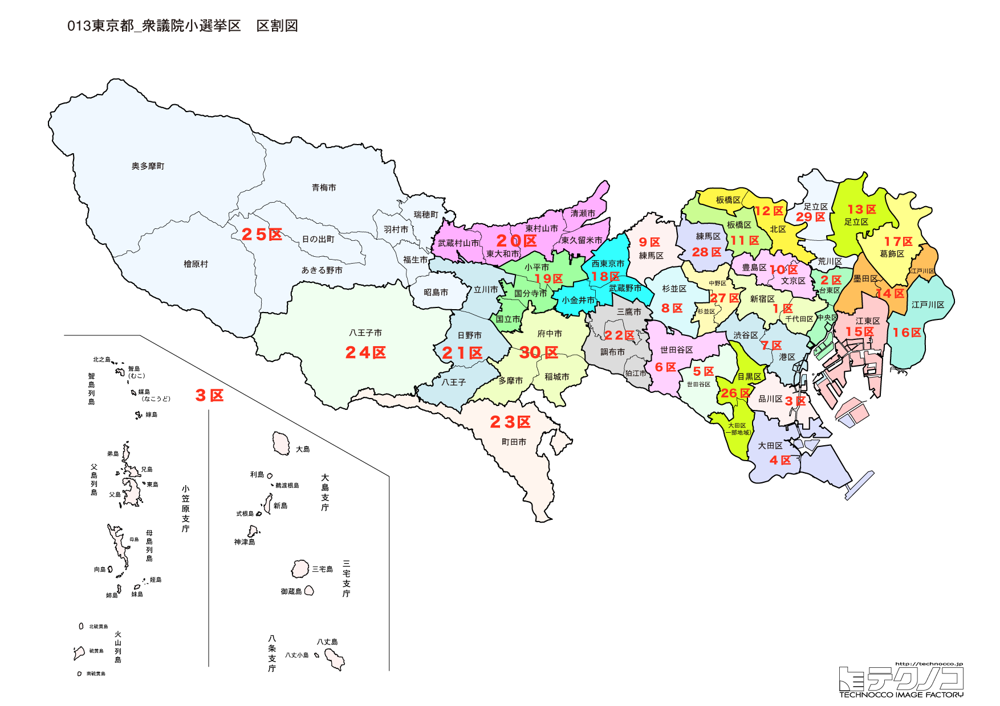

# 東京都



---

## 基本情報

東京都は日本の首都で、人口は約1,400万人で全国1位。23の特別区、26の市、5の町、8の村で構成される。日本の政治、経済、文化の中心であり、世界有数のメガシティである。

歴史的には、徳川家康が1603年に江戸幕府を開いて以来、日本の中心として発展した。明治維新後に東京と改称され、皇居が置かれた。関東大震災（1923年）と東京大空襲（1945年）で壊滅的な被害を受けたが、復興を遂げた。2020年には東京オリンピック・パラリンピックが開催された。

経済的には、日本のGDPの約2割を占め、世界有数の経済都市。東京証券取引所は世界三大証券取引所の一つ。渋谷、新宿、池袋など複数の副都心が発展している。

---

## 東京都の政治的争点

### 首都機能と一極集中

東京一極集中の是非が議論される一方、首都直下地震への備えも課題。

### 少子化対策

東京都独自の子育て支援策（018サポート等）の評価と国政への波及。

### 2020年東京オリンピック・パラリンピックのレガシー

大会後の施設活用、選手村跡地の再開発などが進行中。

---

## 選挙の特徴

東京都の衆議院小選挙区は30（2022年の区割り変更で25から30に増加）。全国最多の選挙区数を誇り、日本の政治動向を左右する最重要地域である。

無党派層が非常に多く、政治への「風」が最も影響しやすい地域。選挙ごとに結果が大きく変動し、全国の選挙結果を占う指標となる。都心部は立憲・野党が強く、多摩地域は自民と野党が拮抗する傾向がある。

2024年の衆院選では、裏金問題の影響で立憲民主党が30選挙区中15選挙区で勝利し、自民党は11選挙区にとどまった。萩生田光一、平沢勝栄など自民党有力者が非公認となりながらも当選するなど、複雑な結果となった。

---

## 第1区

### 地域構成

東京1区は千代田区、港区、新宿区の一部で構成される。皇居周辺と都心部。

- **千代田区**: 皇居、国会議事堂、霞が関の官庁街がある日本の政治の中心。東京駅、秋葉原も区内にある。

- **港区**: 六本木、赤坂、虎ノ門など商業・ビジネス地区。東京タワー、増上寺がある。

### 選挙区の特徴

皇居、国会議事堂、霞が関を含む日本の政治の中心地。元経済産業大臣・民主党代表の海江田万里が8期連続当選と立憲が強い地盤を持つ。76歳と高齢であり、後継問題も浮上。

### 2024年選挙結果

```
海江田万里（立憲）        ██████████░░░░░░░░░░  32.0%   56,979票 ✅当選
山田美樹（自民）         ██████████░░░░░░░░░░  30.9%   55,040票 
音喜多駿（維新）         █████░░░░░░░░░░░░░░░  16.3%   29,002票 
佐藤沙織里（無所属）       ██░░░░░░░░░░░░░░░░░░   6.9%   12,255票 
中野顕（共産）          ██░░░░░░░░░░░░░░░░░░   6.7%   11,889票 
桜井祥子（参政）         █░░░░░░░░░░░░░░░░░░░   6.0%   10,636票 
高木寛史（みんなでつくる党）   ░░░░░░░░░░░░░░░░░░░░   0.5%      951票 
新垣宏（無所属）         ░░░░░░░░░░░░░░░░░░░░   0.4%      716票 
新藤伸夫（お金をみんなへ シン独立党） ░░░░░░░░░░░░░░░░░░░░   0.3%      530票 
──────────────────────────────────────────────────────────
投票率: 55.6% ｜ 票差: 1,939票（1.1pt差）
```

### 2026年選挙の構図

海江田万里（立憲→中道改革連合・現職、76歳）と自民党候補の対決。

---

## 第2区

### 地域構成

東京2区は中央区、文京区、台東区の一部で構成される。下町と文教地区。

- **中央区**: 銀座、日本橋など商業の中心。築地市場跡地の再開発が進行中。

- **文京区**: 東京大学、お茶の水女子大学など文教施設が集積。

### 選挙区の特徴

銀座、日本橋、東京大学を含む都心部と文教地区。2024年は自民が勝利したが、接戦区として注目。高学歴・高所得層が多く政策志向の有権者が多い。

### 2024年選挙結果

```
辻清人（自民）          ████████████░░░░░░░░  37.1%   66,050票 ✅当選
鳩山紀一郎（国民）        █████████░░░░░░░░░░░  27.2%   48,527票 🔄比例
今村充（維新）          █████░░░░░░░░░░░░░░░  16.8%   29,860票 
細野真理（共産）         ████░░░░░░░░░░░░░░░░  12.5%   22,316票 
最上佳則（参政）         ██░░░░░░░░░░░░░░░░░░   6.4%   11,322票 
──────────────────────────────────────────────────────────
投票率: 57.1% ｜ 票差: 17,523票（9.8pt差）
```

### 2026年選挙の構図

辻清人（自民・現職）と中道改革連合候補の対決。

---

## 第3区

### 地域構成

東京3区は品川区、大田区の一部、島嶼部で構成される。臨海部と伊豆・小笠原諸島。

- **品川区**: 品川駅周辺が再開発で発展。天王洲アイル、大井競馬場がある。

- **伊豆諸島・小笠原諸島**: 東京都に属する島々。小笠原諸島は世界自然遺産。

### 選挙区の特徴

品川区と伊豆・小笠原諸島を含む珍しい構成。石原慎太郎元都知事の三男・石原宏高が6期連続当選と自民党が安定。都心部と離島という対照的な地域を抱える。

### 2024年選挙結果

```
石原宏高（自民）         ██████████░░░░░░░░░░  30.6%   61,660票 ✅当選
阿部祐美子（立憲）        ████████░░░░░░░░░░░░  26.9%   54,178票 🔄比例
奥本有里（国民）         █████░░░░░░░░░░░░░░░  15.1%   30,351票 
吉平敏孝（維新）         ████░░░░░░░░░░░░░░░░  12.8%   25,745票 
香西克介（共産）         █░░░░░░░░░░░░░░░░░░░   6.0%   12,056票 
川口めぐみ（無所属）       █░░░░░░░░░░░░░░░░░░░   4.4%    8,822票 
植木洋貴（参政）         █░░░░░░░░░░░░░░░░░░░   4.3%    8,731票 
──────────────────────────────────────────────────────────
投票率: 56.8% ｜ 票差: 7,482票（3.7pt差）
```

### 2026年選挙の構図

石原宏高（自民・現職）と野党候補の対決。

---

## 第4区

### 地域構成

東京4区は大田区の大部分で構成される。羽田空港を含む臨海工業地域。

- **大田区**: 羽田空港があり、日本の空の玄関口。蒲田、大森は下町情緒が残る。町工場が集積する「ものづくりのまち」としても知られる。

### 選挙区の特徴

羽田空港と町工場の街・大田区を中心とする選挙区。元デジタル副大臣の平将明が7期連続当選と自民が安定。中小企業・ものづくり政策が争点となりやすい。

### 2024年選挙結果

```
平将明（自民）          █████████████░░░░░░░  40.2%   86,773票 ✅当選
井戸正枝（国民）         ████████░░░░░░░░░░░░  24.0%   51,810票 
谷川智行（共産）         █████░░░░░░░░░░░░░░░  15.2%   32,909票 
石川雅俊（維新）         ████░░░░░░░░░░░░░░░░  14.9%   32,063票 
塩寺勇太（参政）         █░░░░░░░░░░░░░░░░░░░   5.6%   12,176票 
──────────────────────────────────────────────────────────
投票率: 52.3% ｜ 票差: 34,963票（16.2pt差）
```

### 2026年選挙の構図

平将明（自民・現職）と野党候補の対決。

---

## 第5区

### 地域構成

東京5区は目黒区、世田谷区の一部で構成される。高級住宅地。

- **目黒区**: 自由が丘、中目黒など人気の住宅地。目黒川の桜並木は花見の名所。

### 選挙区の特徴

自由が丘、中目黒など人気住宅地を含む高級住宅地。2024年は立憲が勝利。若い世代やクリエイティブ層が多く、都市型リベラルの傾向が強い。

### 2024年選挙結果

```
手塚仁雄（立憲）         █████████████░░░░░░░  39.4%   83,016票 ✅当選
若宮健嗣（自民）         ██████████░░░░░░░░░░  32.7%   69,024票 
稲葉太郎（維新）         █████░░░░░░░░░░░░░░░  17.3%   36,493票 
塗木洋平（参政）         ██░░░░░░░░░░░░░░░░░░   6.6%   13,910票 
林理麻（無所属）         ░░░░░░░░░░░░░░░░░░░░   2.5%    5,364票 
松本健太（無所属）        ░░░░░░░░░░░░░░░░░░░░   0.9%    1,889票 
福井健太（無所属）        ░░░░░░░░░░░░░░░░░░░░   0.5%    1,136票 
──────────────────────────────────────────────────────────
投票率: 58.4% ｜ 票差: 13,992票（6.6pt差）
```

### 2026年選挙の構図

手塚仁雄（立憲→中道改革連合・現職）と自民党候補の対決。

---

## 第6区

### 地域構成

東京6区は世田谷区の大部分で構成される。閑静な住宅地。

- **世田谷区**: 人口約92万人で東京23区最多。下北沢、三軒茶屋、二子玉川など個性的な街が点在。

### 選挙区の特徴

東京23区最大の人口を持つ世田谷区が中心。下北沢、三軒茶屋など若者文化の発信地を含む。2024年は立憲が勝利し、都市型リベラルの傾向が続く。

### 2024年選挙結果

```
落合貴之（立憲）         ███████████████░░░░░  47.4%  107,222票 ✅当選
土屋美和（自民）         █████████░░░░░░░░░░░  28.2%   63,899票 
河村建一（維新）         ████░░░░░░░░░░░░░░░░  14.5%   32,887票 
望月正謹（参政）         ███░░░░░░░░░░░░░░░░░   9.8%   22,179票 
──────────────────────────────────────────────────────────
投票率: 58.8% ｜ 票差: 43,323票（19.1pt差）
```

### 2026年選挙の構図

落合貴之（立憲→中道改革連合・現職）と自民党候補の対決。

---

## 第7区

### 地域構成

東京7区は渋谷区、中野区の一部で構成される。若者文化の発信地。

- **渋谷区**: スクランブル交差点、ハチ公像で世界的に有名。原宿、表参道はファッションの発信地。

- **中野区**: 中野ブロードウェイがサブカルチャーの聖地。

### 選挙区の特徴

渋谷のスクランブル交差点と中野ブロードウェイを含む若者文化の発信地。2024年は立憲が勝利。IT企業やスタートアップが集積し、デジタル政策への関心が高い。

### 2024年選挙結果

```
松尾明弘（立憲）         █████████████░░░░░░░  41.9%   86,252票 ✅当選
丸川珠代（自民）         █████████░░░░░░░░░░░  27.1%   55,848票 
小野泰輔（維新）         ███████░░░░░░░░░░░░░  22.9%   47,196票 
石川友梨香（参政）        ██░░░░░░░░░░░░░░░░░░   8.1%   16,588票 
──────────────────────────────────────────────────────────
投票率: 53.3% ｜ 票差: 30,404票（14.8pt差）
```

### 2026年選挙の構図

松尾明弘（立憲→中道改革連合・現職）と自民党候補の対決。

---

## 第8区

### 地域構成

東京8区は杉並区で構成される。閑静な住宅地と商店街。

- **杉並区**: 高円寺、阿佐ヶ谷、荻窪など個性的な商店街が並ぶ。高円寺阿波おどりは都内最大規模。

### 選挙区の特徴

2021年に吉田晴美が石原伸晃元幹事長を破った注目選挙区。2024年も立憲が勝利し、自民党重鎮が敗北した象徴的な選挙区として全国的に注目される。高円寺など個性的な商店街を抱える。

### 2024年選挙結果

```
吉田晴美（立憲）         █████████████████░░░  51.0%  116,426票 ✅当選
門寛子（自民）          ██████████░░░░░░░░░░  32.9%   74,963票 
南北ちとせ（維新）        ██░░░░░░░░░░░░░░░░░░   8.9%   20,342票 
大森紀明（参政）         ██░░░░░░░░░░░░░░░░░░   7.2%   16,310票 
──────────────────────────────────────────────────────────
投票率: 60.0% ｜ 票差: 41,463票（18.2pt差）
```

### 2026年選挙の構図

吉田晴美（立憲→中道改革連合・現職）と自民党候補の対決。

---

## 第9区

### 地域構成

東京9区は練馬区の大部分で構成される。緑豊かな住宅地。

- **練馬区**: 人口約74万人で23区2位。としまえん跡地にはハリー・ポッター スタジオツアー東京がオープン。

### 選挙区の特徴

ハリー・ポッター スタジオツアー東京がオープンした練馬区が中心。2024年は立憲が勝利。緑豊かな住宅地で、ファミリー層が多い。

### 2024年選挙結果

```
山岸一生（立憲）         ██████████████░░░░░░  44.1%   75,474票 ✅当選
大河内茂太（維新）        ████░░░░░░░░░░░░░░░░  13.7%   23,488票 
大津綾香（みんなでつくる党）   █░░░░░░░░░░░░░░░░░░░   4.2%    7,245票 
──────────────────────────────────────────────────────────
投票率: 57.9% ｜ 票差: 51,986票（30.4pt差）
```

### 2026年選挙の構図

山岸一生（立憲→中道改革連合・現職）と自民党候補の対決。

---

## 第10区

### 地域構成

東京10区は豊島区、練馬区の一部で構成される。池袋を含む。

- **豊島区**: 池袋駅周辺が巨大ターミナル。サンシャインシティ、雑司が谷鬼子母神がある。

### 選挙区の特徴

池袋駅周辺を含む巨大ターミナル駅の選挙区。2024年は自民が勝利。サンシャインシティなど商業施設が集積し、若者から高齢者まで多様な有権者が混在。

### 2024年選挙結果

```
鈴木隼人（自民）         ████████████░░░░░░░░  38.6%   93,490票 ✅当選
鈴木庸介（立憲）         ████████████░░░░░░░░  38.4%   92,899票 🔄比例
永野裕子（維新）         █████░░░░░░░░░░░░░░░  16.4%   39,555票 
安田伸（参政）          ██░░░░░░░░░░░░░░░░░░   6.6%   15,970票 
──────────────────────────────────────────────────────────
投票率: 59.6% ｜ 票差: 591票（0.2pt差）
```

### 2026年選挙の構図

鈴木隼人（自民・現職）と中道改革連合候補の対決。

---

## 第11区

### 地域構成

東京11区は板橋区で構成される。下町と住宅地。

- **板橋区**: 東京大仏（乗蓮寺）、板橋区立熱帯環境植物館がある。石神井川沿いの桜が美しい。

### 選挙区の特徴

板橋区の下町と住宅地。2024年は立憲が勝利。東京大仏など歴史的スポットもあり、庶民的な雰囲気の選挙区。無党派層の動向が結果を左右。

### 2024年選挙結果

```
阿久津幸彦（立憲）        █████████████░░░░░░░  41.0%   80,947票 ✅当選
下村博文（無所属）        █████████░░░░░░░░░░░  29.0%   57,275票 
大豆生田実（維新）        █████░░░░░░░░░░░░░░░  16.8%   33,103票 
伊波政昇（共産）         ██░░░░░░░░░░░░░░░░░░   8.9%   17,607票 
斎藤孝幸（無所属）        █░░░░░░░░░░░░░░░░░░░   4.2%    8,316票 
──────────────────────────────────────────────────────────
投票率: 54.0% ｜ 票差: 23,672票（12.0pt差）
```

### 2026年選挙の構図

阿久津幸彦（立憲→中道改革連合・現職）と自民党候補の対決。

---

## 第12区

### 地域構成

東京12区は北区、足立区の一部で構成される。下町。

- **北区**: 飛鳥山公園は桜の名所で、渋沢栄一ゆかりの地。王子駅周辺が中心。

### 選挙区の特徴

北区と足立区の一部を含む下町。渋沢栄一ゆかりの飛鳥山公園があり、新紙幣発行で注目。2024年は自民が勝利したが、接戦区として注目される。

### 2024年選挙結果

```
高木啓（自民）          ███████████░░░░░░░░░  33.2%   68,878票 ✅当選
阿部司（維新）          ████████░░░░░░░░░░░░  25.2%   52,233票 🔄比例
大熊利昭（国民）         ███████░░░░░░░░░░░░░  21.5%   44,524票 
田原聖子（共産）         ██████░░░░░░░░░░░░░░  20.0%   41,504票 
──────────────────────────────────────────────────────────
投票率: 57.1% ｜ 票差: 16,645票（8.0pt差）
```

### 2026年選挙の構図

高木啓（自民・現職）と中道改革連合候補の対決。

---

## 第13区

### 地域構成

東京13区は足立区の大部分で構成される。下町。

- **足立区**: 北千住が「穴場な街」として人気上昇中。西新井大師は厄除けで有名。

### 選挙区の特徴

足立区が中心の下町。北千住が「穴場な街」として人気上昇中。2024年は自民が勝利。西新井大師など下町情緒が残る庶民的な選挙区。

### 2024年選挙結果

```
土田慎（自民）          █████████████░░░░░░░  39.6%   75,050票 ✅当選
森洋介（国民）          ██████████░░░░░░░░░░  30.8%   58,385票 🔄比例
沢田真吾（共産）         █████░░░░░░░░░░░░░░░  15.3%   29,004票 
重田惇平（維新）         ████░░░░░░░░░░░░░░░░  14.2%   26,989票 
──────────────────────────────────────────────────────────
投票率: 50.7% ｜ 票差: 16,665票（8.8pt差）
```

### 2026年選挙の構図

土田慎（自民・現職）と野党候補の対決。

---

## 第14区

### 地域構成

東京14区は墨田区、荒川区で構成される。下町情緒が残る地域。

- **墨田区**: 東京スカイツリー、両国国技館がある。すみだ水族館、江戸東京博物館も人気。

- **荒川区**: 都電荒川線（東京さくらトラム）が走る。

### 選挙区の特徴

東京スカイツリー、両国国技館を含む下町情緒あふれる選挙区。松島みどりが8期連続当選と自民が安定。観光地としての発展と下町の伝統が共存する地域。

### 2024年選挙結果

```
松島みどり（自民）        ████████████░░░░░░░░  36.4%   75,862票 ✅当選
伊藤菜々（国民）         ████████░░░░░░░░░░░░  25.5%   53,211票 
櫛渕万里（れいわ）        ████░░░░░░░░░░░░░░░░  12.1%   25,328票 🔄比例
斉藤佳代（維新）         ███░░░░░░░░░░░░░░░░░  10.4%   21,628票 
原努（共産）           ███░░░░░░░░░░░░░░░░░  10.1%   20,987票 
大賀靖郎（参政）         █░░░░░░░░░░░░░░░░░░░   4.9%   10,210票 
大塚紀久雄（無所属）       ░░░░░░░░░░░░░░░░░░░░   0.7%    1,481票 
──────────────────────────────────────────────────────────
投票率: 53.6% ｜ 票差: 22,651票（10.9pt差）
```

### 2026年選挙の構図

松島みどり（自民・現職）と野党候補の対決。

---

## 第15区

### 地域構成

東京15区は江東区で構成される。臨海副都心を含む。

- **江東区**: お台場、豊洲市場、有明アリーナなど臨海部の施設が集積。門前仲町、亀戸は下町情緒。

### 選挙区の特徴

お台場、豊洲市場を含む臨海副都心。2024年は補欠選挙で当選した酒井菜摘がそのまま本選でも勝利。タワーマンションが林立し、若いファミリー層が増加中。

### 2024年選挙結果

```
酒井菜摘（立憲）         █████████░░░░░░░░░░░  27.5%   66,791票 ✅当選
須藤元気（無所属）        █████████░░░░░░░░░░░  27.1%   65,666票 
大空幸星（自民）         ████████░░░░░░░░░░░░  25.9%   62,771票 🔄比例
金澤結衣（無所属）        ████░░░░░░░░░░░░░░░░  13.4%   32,442票 
須藤元気（無所属）        █████░░░░░░░░░░░░░░░  17.4%   29,669票 
金澤結衣（維新）         █████░░░░░░░░░░░░░░░  16.7%   28,461票 
飯山陽（保守党）         ████░░░░░░░░░░░░░░░░  14.2%   24,264票 
乙武洋匡（無所属）        ███░░░░░░░░░░░░░░░░░  11.5%   19,655票 
小堤東（共産）          ██░░░░░░░░░░░░░░░░░░   6.2%   15,049票 
吉川里奈（参政）         █░░░░░░░░░░░░░░░░░░░   5.1%    8,639票 
秋元司（無所属）         █░░░░░░░░░░░░░░░░░░░   4.7%    8,061票 
福永活也（NHKから国民を守る党） ░░░░░░░░░░░░░░░░░░░░   0.8%    1,410票 
根本良輔（つばさの党）      ░░░░░░░░░░░░░░░░░░░░   0.7%    1,110票 
──────────────────────────────────────────────────────────
投票率: 57.6% ｜ 票差: 1,125票（0.5pt差）
```

### 2026年選挙の構図

酒井菜摘（立憲→中道改革連合・現職）と自民党・維新などの対決。

---

## 第16区

### 地域構成

東京16区は江戸川区で構成される。都内最東端の区。

- **江戸川区**: 葛西臨海公園、葛西臨海水族園がある。インド人コミュニティが形成され「リトル・インディア」と呼ばれる地域も。

### 選挙区の特徴

都内最東端の江戸川区。インド人コミュニティ「リトル・インディア」があり、多文化共生が進む地域。2024年は自民が勝利。葛西臨海公園など家族向けスポットが多い。

### 2024年選挙結果

```
大西洋平（自民）         ████████████░░░░░░░░  37.3%   71,728票 ✅当選
柴田勝之（立憲）         ██████████░░░░░░░░░░  31.6%   60,714票 🔄比例
中津川博郷（維新）        ████░░░░░░░░░░░░░░░░  14.9%   28,538票 
有田正寿（参政）         ██░░░░░░░░░░░░░░░░░░   8.7%   16,636票 
宮本栄（共産）          ██░░░░░░░░░░░░░░░░░░   7.5%   14,464票 
──────────────────────────────────────────────────────────
投票率: 51.4% ｜ 票差: 11,014票（5.7pt差）
```

### 2026年選挙の構図

大西洋平（自民・現職）と中道改革連合候補の対決。

---

## 第17区

### 地域構成

東京17区は葛飾区で構成される。下町。

- **葛飾区**: 「男はつらいよ」の柴又帝釈天、「こちら葛飾区亀有公園前派出所」の舞台として有名。

### 選挙区の特徴

「男はつらいよ」「こち亀」の舞台として全国的に知られる葛飾区。平沢勝栄が10期連続当選だが、裏金問題で自民非公認に。79歳と高齢であり、今後の動向に注目。

### 2024年選挙結果

```
円より子（国民）         █████████░░░░░░░░░░░  28.0%   51,975票 🔄比例
猪口幸子（維新）         ███████░░░░░░░░░░░░░  22.9%   42,420票 🔄比例
新井杉生（共産）         ████░░░░░░░░░░░░░░░░  14.3%   26,564票 
──────────────────────────────────────────────────────────
投票率: 52.2% ｜ 票差: 9,555票（5.2pt差）
```

### 2026年選挙の構図

平沢勝栄（無所属・現職、79歳）と各党候補の対決。自民党復党の可能性も。

---

## 第18区

### 地域構成

東京18区は武蔵野市、府中市、小金井市で構成される。住みたい街上位の地域。

- **武蔵野市**: 吉祥寺が「住みたい街ランキング」で常に上位。井の頭公園は桜の名所。

- **府中市**: 大國魂神社、東京競馬場がある。

### 選挙区の特徴

「住みたい街ランキング」常連の吉祥寺を含む人気エリア。2024年は福田かおるが菅直人元首相を破り自民が奪取。菅直人落選は全国的なニュースとなった象徴的な選挙区。

### 2024年選挙結果

```
福田かおる（自民）        ██████████████░░░░░░  42.3%   99,002票 ✅当選
松下玲子（立憲）         █████████████░░░░░░░  41.4%   96,820票 🔄比例
徳永由紀子（参政）        ██░░░░░░░░░░░░░░░░░░   8.3%   19,496票 
樋口亮（共産）          ██░░░░░░░░░░░░░░░░░░   7.9%   18,512票 
──────────────────────────────────────────────────────────
投票率: 60.1% ｜ 票差: 2,182票（0.9pt差）
```

### 2026年選挙の構図

福田かおる（自民・現職）と野党候補の対決。

---

## 第19区

### 地域構成

東京19区は小平市、国分寺市、国立市、西東京市で構成される。文教都市。

- **国分寺市・国立市**: 一橋大学など文教施設が集積。国立駅前の大学通りは桜並木が美しい。

### 選挙区の特徴

一橋大学など文教施設が集積する多摩東部の文教都市。2024年は立憲が勝利。国立駅前の桜並木で知られる落ち着いた住宅地で、教育熱心な有権者が多い。

### 2024年選挙結果

```
末松義規（立憲）         █████████████░░░░░░░  39.4%   76,899票 ✅当選
松本洋平（自民）         ████████████░░░░░░░░  38.2%   74,435票 🔄比例
吉田圭一郎（維新）        ███░░░░░░░░░░░░░░░░░  11.9%   23,289票 
井手重美津子（共産）       ███░░░░░░░░░░░░░░░░░  10.5%   20,417票 
──────────────────────────────────────────────────────────
投票率: 60.2% ｜ 票差: 2,464票（1.3pt差）
```

### 2026年選挙の構図

末松義規（立憲→中道改革連合・現職）と自民党候補の対決。

---

## 第20区

### 地域構成

東京20区は東村山市、東大和市、清瀬市、東久留米市、武蔵村山市で構成される。多摩北部。

- **東村山市**: 志村けんの出身地として「志村けんの木」がある。

### 選挙区の特徴

志村けん出身地の東村山市を含む多摩北部。元官房副長官の木原誠二が6期連続当選と自民が安定。郊外型住宅地で、子育て世代と高齢者が混在。

### 2024年選挙結果

```
木原誠二（自民）         ██████████████░░░░░░  43.0%   93,390票 ✅当選
大西健太郎（国民）        ██████████░░░░░░░░░░  30.1%   65,435票 
宮本徹（共産）          ████████░░░░░░░░░░░░  26.8%   58,215票 
──────────────────────────────────────────────────────────
投票率: 54.6% ｜ 票差: 27,955票（12.9pt差）
```

### 2026年選挙の構図

木原誠二（自民・現職）と野党候補の対決。

---

## 第21区

### 地域構成

東京21区は立川市、昭島市、日野市で構成される。多摩中部。

- **立川市**: 多摩地域の中心都市。国営昭和記念公園は広大な公園。

- **日野市**: 新選組のふるさと。土方歳三の生誕地。

### 選挙区の特徴

多摩地域の中心都市・立川を含む選挙区。昭和記念公園や新選組ゆかりの日野市など歴史と自然が豊か。2024年は立憲が勝利し、多摩地域での野党の強さを示した。

### 2024年選挙結果

```
大河原雅子（立憲）        ██████████████░░░░░░  42.1%   90,724票 ✅当選
小田原潔（無所属）        ██████████░░░░░░░░░░  32.2%   69,421票 
山下容子（維新）         █████░░░░░░░░░░░░░░░  17.0%   36,642票 
森裕一（参政）          ██░░░░░░░░░░░░░░░░░░   8.6%   18,511票 
──────────────────────────────────────────────────────────
投票率: 55.9% ｜ 票差: 21,303票（9.9pt差）
```

### 2026年選挙の構図

大河原雅子（立憲→中道改革連合・現職）と自民党候補の対決。

---

## 第22区

### 地域構成

東京22区は三鷹市、調布市、狛江市で構成される。多摩東部。

- **調布市**: 深大寺、神代植物公園がある。味の素スタジアムはFC東京、東京ヴェルディの本拠地。

- **三鷹市**: ジブリ美術館がある。太宰治ゆかりの地。

### 選挙区の特徴

ジブリ美術館のある三鷹市と深大寺のある調布市を含む。太宰治ゆかりの地で文化的な雰囲気がある。2024年は立憲が勝利。FC東京の本拠地・味の素スタジアムもある。

### 2024年選挙結果

```
山花郁夫（立憲）         █████████████░░░░░░░  40.2%   99,790票 ✅当選
伊藤達也（自民）         █████████████░░░░░░░  39.0%   96,748票 🔄比例
鈴木美香（参政）         ███░░░░░░░░░░░░░░░░░  10.5%   26,005票 
平野義尚（共産）         ███░░░░░░░░░░░░░░░░░  10.3%   25,453票 
──────────────────────────────────────────────────────────
投票率: 59.6% ｜ 票差: 3,042票（1.2pt差）
```

### 2026年選挙の構図

山花郁夫（立憲→中道改革連合・現職）と自民党候補の対決。

---

## 第23区

### 地域構成

東京23区は町田市で構成される。神奈川県に囲まれた地域。

- **町田市**: 小田急線・JR横浜線が交差するターミナル。町田リス園、薬師池公園がある。

### 選挙区の特徴

神奈川県に囲まれた町田市が中心。小田急線とJR横浜線が交差するターミナル都市。2024年は立憲が勝利。東京都でありながら神奈川県との結びつきが強い独特の地域。

### 2024年選挙結果

```
伊藤俊輔（立憲）         ███████████████████░  59.0%  111,851票 ✅当選
吉原修（自民）          ████████████░░░░░░░░  37.5%   71,154票 
AIメイヤー（みんなでつくる党） █░░░░░░░░░░░░░░░░░░░   3.4%    6,475票 
──────────────────────────────────────────────────────────
投票率: 55.7% ｜ 票差: 40,697票（21.5pt差）
```

### 2026年選挙の構図

伊藤俊輔（立憲→中道改革連合・現職）と自民党候補の対決。

---

## 第24区

### 地域構成

東京24区は八王子市の大部分で構成される。多摩最大の都市。

- **八王子市**: 人口約58万人で多摩地域最大。高尾山は年間登山者数世界一のミシュラン三ツ星の山。

### 選挙区の特徴

多摩最大の都市・八王子市と世界一の登山者数を誇る高尾山を含む。萩生田光一が7期連続当選だが、裏金問題で自民非公認に。元政調会長の動向と自民復党問題が全国的に注目される。

### 2024年選挙結果

```
萩生田光一（無所属）       ████████████░░░░░░░░  38.6%   79,216票 ✅当選
有田芳生（立憲）         ███████████░░░░░░░░░  35.0%   71,683票 🔄比例
浦川祐輔（国民）         ████░░░░░░░░░░░░░░░░  12.0%   24,653票 
佐藤由美（維新）         ███░░░░░░░░░░░░░░░░░   9.0%   18,501票 
與倉さゆり（参政）        █░░░░░░░░░░░░░░░░░░░   4.2%    8,678票 
畑尻文夫（無所属）        ░░░░░░░░░░░░░░░░░░░░   1.1%    2,251票 
──────────────────────────────────────────────────────────
投票率: 56.5% ｜ 票差: 7,533票（3.7pt差）
```

### 2026年選挙の構図

萩生田光一（無所属・現職、61歳）と各党候補の対決。自民党復党と党内での立場に注目。

---

## 第25区

### 地域構成

東京25区は青梅市、福生市、羽村市、あきる野市、瑞穂町、日の出町、檜原村、奥多摩町で構成される。多摩西部の山間部。

- **青梅市**: 青梅マラソン、梅の名所として知られる。御岳山は古くからの山岳信仰の地。

- **奥多摩町**: 奥多摩湖、日原鍾乳洞など自然豊かな地域。

### 選挙区の特徴

青梅マラソンの青梅市と奥多摩の山間部を含む多摩西部。元万博担当大臣の井上信治が8期連続当選と自民が安定。自然豊かな地域で、過疎化対策も争点に。

### 2024年選挙結果

```
井上信治（自民）         █████████████████░░░  53.1%  110,488票 ✅当選
宮崎太朗（維新）         ██████░░░░░░░░░░░░░░  19.7%   41,080票 
依田花蓮（れいわ）        ████░░░░░░░░░░░░░░░░  14.0%   29,179票 
池田公三（共産）         ████░░░░░░░░░░░░░░░░  13.1%   27,323票 
──────────────────────────────────────────────────────────
投票率: 52.9% ｜ 票差: 69,408票（33.4pt差）
```

### 2026年選挙の構図

井上信治（自民・現職）と野党候補の対決。

---

## 第26区

### 地域構成

東京26区は新宿区の大部分、中野区の大部分で構成される。繁華街と住宅地。

- **新宿区**: 新宿駅は世界一の乗降客数を誇るターミナル。歌舞伎町は日本最大の歓楽街。新宿御苑は都心のオアシス。

### 選挙区の特徴

世界一の乗降客数を誇る新宿駅と日本最大の歓楽街・歌舞伎町を含む。2024年は立憲を離党した松原仁が無所属で当選。政党への復帰動向が注目される激戦区。

### 2024年選挙結果

```
松原仁（無所属）         ███████████████░░░░░  45.6%  108,174票 ✅当選
今岡植（自民）          ██████████░░░░░░░░░░  28.9%   68,568票 🔄比例
和田正子（共産）         ████░░░░░░░░░░░░░░░░  12.1%   28,819票
藤田久美（参政）         ██░░░░░░░░░░░░░░░░░░   7.3%   17,250票
田淵正文（無所属）        ██░░░░░░░░░░░░░░░░░░   6.2%   14,602票
──────────────────────────────────────────────────────────
投票率: 55.8% ｜ 票差: 39,606票（16.7pt差）
```

### 2026年選挙の構図

松原仁（無所属・現職）と各党候補の対決。政党への復帰の動向に注目。

---

## 第27区

### 地域構成

東京27区は台東区の大部分、江東区の一部で構成される。下町。

- **台東区**: 上野（上野公園、上野動物園、アメ横）、浅草（浅草寺、雷門）と観光名所が集中。

### 選挙区の特徴

上野、浅草という東京を代表する観光地を含む下町。「ミスター年金」長妻昭が9期連続当選と立憲が強固な地盤を持つ。元厚生労働大臣として社会保障政策に強い影響力。

### 2024年選挙結果

```
長妻昭（立憲）          ██████████████████░░  54.6%  112,388票 ✅当選
黒崎祐一（自民）         █████████░░░░░░░░░░░  29.1%   59,952票 
石川芽生子（参政）        ███░░░░░░░░░░░░░░░░░  11.2%   22,947票 
石倉弘次郎（無所属）       █░░░░░░░░░░░░░░░░░░░   5.1%   10,542票 
──────────────────────────────────────────────────────────
投票率: 55.6% ｜ 票差: 52,436票（25.5pt差）
```

### 2026年選挙の構図

長妻昭（立憲→中道改革連合・現職、64歳）は盤石の地盤を持つ。

---

## 第28区

### 地域構成

東京28区は八王子市の一部、多摩市、稲城市で構成される。多摩ニュータウン。

- **多摩市**: 多摩ニュータウンの中心。サンリオピューロランドがある。

### 選挙区の特徴

多摩ニュータウンとサンリオピューロランドを含む多摩南部。2024年は立憲が勝利。ニュータウンの高齢化が進む一方、若いファミリー層も流入し、世代間の政策要求が多様。

### 2024年選挙結果

```
高松智之（立憲）         █████████░░░░░░░░░░░  29.1%   50,626票 ✅当選
安藤高夫（自民）         █████████░░░░░░░░░░░  28.9%   50,290票 🔄比例
奥村祥大（国民）         ██████░░░░░░░░░░░░░░  20.1%   34,930票 
高野直美（共産）         ██░░░░░░░░░░░░░░░░░░   8.4%   14,530票 
藤川隆史（維新）         ██░░░░░░░░░░░░░░░░░░   7.1%   12,344票 
江崎早苗（参政）         ██░░░░░░░░░░░░░░░░░░   6.4%   11,109票 
──────────────────────────────────────────────────────────
投票率: 57.2% ｜ 票差: 336票（0.2pt差）
```

### 2026年選挙の構図

高松智之（立憲→中道改革連合・現職）と自民党候補の対決。

---

## 第29区

### 地域構成

東京29区は荒川区の一部、文京区の一部、品川区の一部、大田区の一部などで構成される。

### 選挙区の特徴

区割り変更で複数の区にまたがる特殊な構成。公明党の岡本三成が5期連続当選で、都内唯一の公明党小選挙区議員。中道改革連合結成による公明党との統合の影響が注目される。

### 2024年選挙結果

```
岡本三成（公明）         ███████████░░░░░░░░░  33.2%   60,100票 ✅当選
木村剛司（立憲）         ████████░░░░░░░░░░░░  26.5%   47,996票 
樽井良和（国民）         █████░░░░░░░░░░░░░░░  17.3%   31,367票 
海老澤由紀（維新）        ████░░░░░░░░░░░░░░░░  13.3%   24,107票 
鈴木賢一（共産）         ███░░░░░░░░░░░░░░░░░   9.6%   17,325票 
──────────────────────────────────────────────────────────
投票率: 53.0% ｜ 票差: 12,104票（6.7pt差）
```

### 2026年選挙の構図

岡本三成（公明→中道改革連合・現職）と他党候補の対決。公明党と立憲の統合による選挙への影響に注目。

---

## 第30区

### 地域構成

東京30区は新宿区の一部、板橋区の一部、杉並区の一部などで構成される。

### 選挙区の特徴

2022年の区割り変更で新設された選挙区。複数の区にまたがる構成。2024年は立憲が勝利。新設選挙区のため地盤形成が進行中で、今後の動向が注目される。

### 2024年選挙結果

```
五十嵐衣里（立憲）        █████████████░░░░░░░  42.0%   98,146票 ✅当選
長島昭久（自民）         █████████████░░░░░░░  39.3%   91,798票 🔄比例
早川寛（共産）          ██░░░░░░░░░░░░░░░░░░   8.2%   19,061票 
武田祐一郎（参政）        ██░░░░░░░░░░░░░░░░░░   7.3%   17,013票 
三井健（みんなでつくる党）    █░░░░░░░░░░░░░░░░░░░   3.3%    7,815票 
──────────────────────────────────────────────────────────
投票率: 57.6% ｜ 票差: 6,348票（2.7pt差）
```

### 2026年選挙の構図

五十嵐衣里（立憲→中道改革連合・現職）と自民党候補の対決。

---
