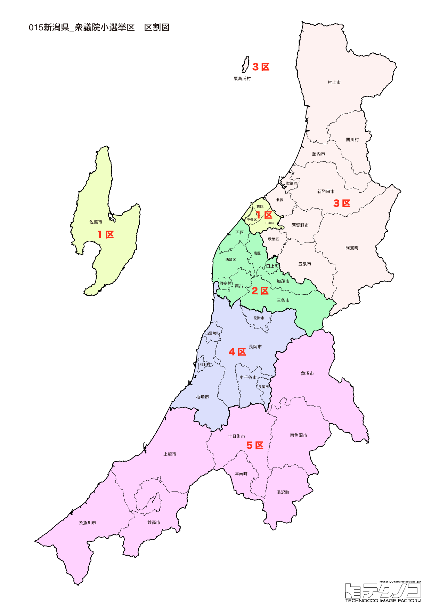

# 新潟県



---

## 基本情報

新潟県は中部地方の日本海側に位置し、人口は約217万人で全国15位。県庁所在地は新潟市。本州日本海側では最大の都市を擁し、米どころとして知られる。

歴史的には、佐渡金山が江戸幕府の財政を支えた。上杉謙信の居城・春日山城があり、戦国時代には「越後の龍」として名を馳せた。北前船の寄港地として栄え、新潟港は開港5港の一つ。

経済的には、コシヒカリをはじめとする米の生産量が日本一。日本酒の蔵元数も全国一で、久保田、八海山、越乃寒梅など銘酒が多い。燕三条は金属加工の一大産地。長岡は花火で有名。

---

## 新潟県の政治的争点

### 柏崎刈羽原発の再稼働問題

東京電力柏崎刈羽原子力発電所の再稼働は県民の意見が分かれる問題。安全対策と地域経済のバランスが議論されている。

### 人口減少と過疎対策

県全体で人口減少が進み、特に中山間地域での過疎化が深刻。若者の県外流出を食い止める施策が求められている。

### 米作りの未来

米どころ新潟の稲作は、米価下落、担い手不足、気候変動への対応など課題を抱えている。

---

## 選挙の特徴

新潟県の衆議院小選挙区は5つ（2022年の区割り変更で6から5に減少）。

田中角栄の地盤として知られ、かつては自民党王国と呼ばれた時代もあったが、近年は野党勢力が強まっている。2024年の衆院選では、裏金問題の影響もあり、立憲民主党が5選挙区すべてで勝利し、自民党は全滅という衝撃的な結果となった。

柏崎刈羽原発の再稼働問題が政治的争点となることが多く、エネルギー政策への関心が高い。また、米どころとして農業政策も重要な争点となる。

**2026年選挙の構図**: 中道改革連合（立憲+公明の新党）vs 自民党・維新連立の対決構図。米山隆一ら中道改革連合所属の現職が5選挙区すべてを制した2024年の流れを維持できるか注目される。新潟は元知事・米山隆一を筆頭に中道勢力が強い地域であり、中道改革連合にとって牙城を守る重要な選挙区となる。

---

## 第1区

### 地域構成

新潟1区は新潟市東区、中央区、江南区、佐渡市で構成される。県庁所在地の中心部と佐渡島。

- **新潟市**: 人口約78万人の政令指定都市。信濃川が流れ、万代橋は市のシンボル。新潟駅周辺は再開発が進む。古町は繁華街で、新潟芸妓の文化が残る。

- **佐渡市**: 佐渡島全域を占める。佐渡金山は2024年に世界遺産に登録された。トキの保護センターがあり、野生復帰が進んでいる。鬼太鼓（おんでこ）や能など伝統芸能が盛ん。

### 選挙区の特徴

県庁所在地・新潟市の中心部と佐渡島を含む都市型選挙区。西村智奈美（立憲→中道改革連合）が7期連続当選を果たしており、野党の牙城となっている。無党派層が多い都市部の特性上、風向きによって票が動きやすい。

### 2024年選挙結果

```
西村智奈美（立憲）        █████████████████░░░  52.7%   99,487票 ✅当選
塚田一郎（自民）         ██████████░░░░░░░░░░  32.4%   61,025票 
石崎徹（維新）          ███░░░░░░░░░░░░░░░░░   9.2%   17,299票 
中村岳夫（共産）         █░░░░░░░░░░░░░░░░░░░   5.8%   10,845票 
──────────────────────────────────────────────────────────
投票率: 54.0% ｜ 票差: 38,462票（20.4pt差）
```

### 2026年選挙の構図

```
西村ちなみ（中道改革連合・前職、59歳）      当選7回
内山こう（自民・新人、44歳）            選挙区支部長
いとう和成（維新・新人、47歳）           会社員
中村たけお（共産・新人、50歳）           党国政対策責任者
小池さちお（参政・新人、53歳）           会社経営
```

2024年に小選挙区で勝利した西村ちなみ(中道改革連合)が8期目を目指す。自民の新人内山こう、維新のいとう和成、共産の中村たけお、参政党の小池さちおの5人の争い。

---

## 第2区

### 地域構成

新潟2区は新潟市南区、西区、西蒲区、三条市、加茂市、燕市、弥彦村、田上町で構成される。県央地域。

- **燕三条**: 金属加工の一大産地。燕市は洋食器、三条市は刃物で知られ、「ものづくりのまち」として世界的に有名。スノーピークなどアウトドアブランドも誕生した。

- **弥彦村**: 弥彦神社の門前町。弥彦山からは日本海と越後平野を一望できる。

### 選挙区の特徴

燕三条の「ものづくりのまち」を含む県央地域。菊田真紀子（立憲→中道改革連合）が7期連続当選と強固な地盤を持つ。製造業が盛んな地域であり、経済・産業政策が重要視される。

### 2024年選挙結果

```
菊田真紀子（立憲）        ██████████████████░░  56.2%  123,334票 ✅当選
細田健一（無所属）        ██████████░░░░░░░░░░  30.6%   67,124票 
井上基之（維新）         ████░░░░░░░░░░░░░░░░  13.2%   29,023票 
──────────────────────────────────────────────────────────
投票率: 57.4% ｜ 票差: 56,210票（25.6pt差）
```

### 2026年選挙の構図

```
菊田まきこ（中道改革連合・前職、56歳）      当選8回
国定勇人（自民・前職、53歳）            当選2回、選挙区支部長
金井のりこ（維新・新人、50歳）           会社員
平井えりこ（参政・新人、47歳）           会社員
```

2024年に小選挙区で勝利した菊田まきこ(中道改革連合)が9期目を目指す。元三条市長で前職の国定勇人(自民)、維新の金井のりこ、参政党の平井えりこの4人の争い。

---

## 第3区

### 地域構成

新潟3区は新潟市北区、秋葉区、新発田市、村上市、五泉市、阿賀野市、胎内市、聖籠町、阿賀町、関川村、粟島浦村で構成される。下越地方。

- **新発田市**: 新発田城の城下町。月岡温泉は美人の湯として知られる。

- **村上市**: 鮭のまちとして有名。町屋の人形さま巡り、屏風まつりなど伝統行事が残る。瀬波温泉は日本海に沈む夕日が美しい。

### 選挙区の特徴

下越地方の広域選挙区。2024年は黒岩宇洋（立憲）が勝利し、斎藤洋明（自民）が比例復活という接戦だった。農村部と都市部が混在し、両者の支持が拮抗する激戦区。

### 2024年選挙結果

```
黒岩宇洋（立憲）         ████████████████░░░░  49.3%  105,275票 ✅当選
斎藤洋明（自民）         ██████████████░░░░░░  44.5%   94,984票 🔄比例
吉村祐一郎（維新）        ██░░░░░░░░░░░░░░░░░░   6.3%   13,370票 
──────────────────────────────────────────────────────────
投票率: 58.8% ｜ 票差: 10,291票（4.8pt差）
```

### 2026年選挙の構図

```
黒岩たかひろ（中道改革連合・現職、59歳）     当選4回
さいとう洋明（自民・現職、49歳）          当選5回、選挙区支部長
さくまけいこ（参政・新人、41歳）          自営業
```

2024年に小選挙区で勝利した黒岩たかひろ(中道改革連合)が5期目を目指す。比例復活したさいとう洋明(自民)が雪辱を狙い、参政党のさくまけいこの3人の争い。前回4.8pt差の接戦を制した黒岩と、5期の実績を持つさいとうの一騎打ちが焦点。

---

## 第4区

### 地域構成

新潟4区は長岡市、柏崎市、小千谷市、見附市、出雲崎町、刈羽村で構成される。中越地方。

- **長岡市**: 長岡まつり大花火大会で有名。正三尺玉、フェニックスなど大型花火が打ち上げられ、日本三大花火大会の一つに数えられる。田中角栄の出身地としても知られる。

- **柏崎市**: 柏崎刈羽原子力発電所がある。2007年の中越沖地震で被災したが、現在も再稼働問題が議論されている。

- **小千谷市**: 錦鯉発祥の地。小千谷縮は伝統的工芸品として知られる。

### 選挙区の特徴

田中角栄の出身地・長岡市を含む中越地方。かつては「角栄王国」だったが、2024年は元知事の米山隆一（立憲）が勝利。柏崎刈羽原発を抱え、原発再稼働問題が最大の争点。裏金問題で非公認となった高鳥修一（自民）を破った注目選挙区。

### 2024年選挙結果

```
米山隆一（立憲）         ██████████████░░░░░░  44.9%   93,764票 ✅当選
鷲尾英一郎（自民）        ███████████░░░░░░░░░  34.3%   71,672票 
泉田裕彦（無所属）        ██████░░░░░░░░░░░░░░  20.8%   43,396票 
──────────────────────────────────────────────────────────
投票率: 60.3% ｜ 票差: 22,092票（10.6pt差）
```

### 2026年選挙の構図

```
米山隆一（中道改革連合・前職、58歳）      当選2回、医師
わしお英一郎（自民・元職、49歳）         当選6回、公認会計士
大矢ひさの（参政・新人、46歳）           老人介助・介護
野村たいき（国民・新人、27歳）           IT会社社長
```

2024年に小選挙区で勝利した元知事・米山隆一(中道改革連合)が3期目を目指す。元職のわしお英一郎(自民)が捲土重来を狙い、参政党の大矢ひさの、国民の野村たいきの4人の争い。柏崎刈羽原発を抱える選挙区で、原発再稼働問題が最大の焦点。

---

## 第5区

### 地域構成

新潟5区は十日町市、糸魚川市、妙高市、上越市、魚沼市、南魚沼市、津南町、湯沢町で構成される。上越・魚沼地方。

- **上越市**: 上杉謙信の居城・春日山城があった。高田は城下町で、高田城址公園の桜は日本三大夜桜の一つ。

- **湯沢町**: 越後湯沢温泉とスキー場で有名。川端康成の小説「雪国」の舞台。

- **南魚沼市**: 魚沼産コシヒカリの産地。八海山は銘酒の名でも知られる。

- **糸魚川市**: フォッサマグナ（糸魚川－静岡構造線）が通る地質学的に重要な地域。ヒスイの産地としても有名。

### 選挙区の特徴

上越・魚沼地方の広域選挙区。豪雪地帯を多く含み、除雪・交通インフラが重要課題。2024年は裏金問題で非公認となった細田健一（自民）が落選し、梅谷守（立憲）が勝利。魚沼産コシヒカリの産地として農業政策への関心も高い。

### 2024年選挙結果

```
梅谷守（立憲）          ██████████████████░░  55.3%  114,429票 ✅当選
高鳥修一（自民）         ██████████████░░░░░░  44.7%   92,589票 
──────────────────────────────────────────────────────────
投票率: 62.6% ｜ 票差: 21,840票（10.5pt差）
```

### 2026年選挙の構図

```
うめたに守（中道改革連合・前職、52歳）      当選2回
たかとり修一（自民・元職、65歳）          当選5回、選挙区支部長
たかの直行（参政・新人、48歳）           会社員
```

2024年に小選挙区で勝利した梅谷守(中道改革連合)が3期目を目指す。裏金問題で非公認となり落選した元職のたかとり修一(自民)が雪辱を狙い、参政党のたかの直行の3人の争い。前回10.5pt差で敗れたたかとりの巻き返しがあるか注目。

---
