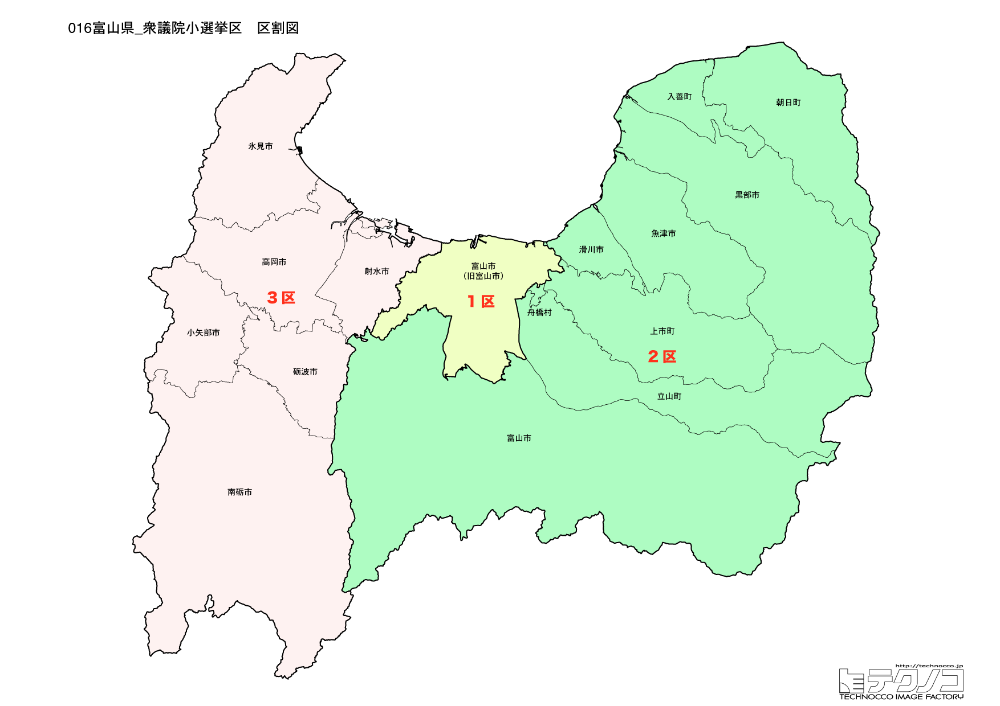

# 富山県



---

## 基本情報

富山県は中部地方の日本海側に位置し、人口は約102万人。県庁所在地は富山市。立山連峰と富山湾に囲まれた自然豊かな県である。

歴史的には、加賀藩の支藩として発展した。薬売りは「越中富山の薬売り」として全国的に知られ、現在も製薬業が盛ん。江戸時代から北前船の寄港地として栄えた。

経済的には、YKK、不二越など製造業が集積。アルミサッシ、ファスナーの生産量は日本一。ホタルイカ、白えび、ズワイガニなど富山湾の海の幸が豊富。黒部ダムは日本一の高さを誇るアーチ式ダム。

---

## 富山県の政治的争点

### 北陸新幹線の延伸

北陸新幹線の敦賀延伸（2024年3月開業）により、富山から関西へのアクセスが改善。さらなる大阪延伸への期待がある。

### 人口減少対策

県全体で人口減少が進み、特に中山間地域での過疎化が課題。Uターン、Iターンの促進が求められている。

### 医薬品産業の振興

「薬都富山」として製薬業の振興が続いている。バイオ医薬品など新分野への展開も期待される。

---

## 選挙の特徴

富山県の衆議院小選挙区は3つ。

自民党が強い「保守王国」の一つで、2024年の衆院選でも3選挙区すべてで自民党が勝利した。しかし、1区では田畑裕明が政治資金問題で比例名簿非登載となりながらも僅差で勝利するなど、裏金問題の影響は一定程度見られた。

北陸新幹線の敦賀延伸（2024年3月）により、さらなる大阪延伸への期待と、地域振興が政治的関心事となっている。製薬業の振興や人口減少対策も重要な争点。

**2026年選挙の構図**: 中道改革連合（立憲+公明の新党）vs 自民党・維新連立の対決構図。富山は伝統的な保守王国だが、1区で山登志浩（中道改革連合）が前回僅差で迫っており、接戦が予想される。自民党の裏金問題の影響が続くか、保守地盤の回復があるかが焦点。

---

## 第1区

### 地域構成

富山1区は富山市で構成される。県庁所在地。

- **富山市**: 人口約41万人の県庁所在地。富山城址公園、富山県美術館がある。路面電車（富山地方鉄道市内線）が市内を走り、コンパクトシティのモデルとして注目される。富山駅北側には環水公園があり、世界一美しいスターバックスがあることでも知られる。

- **立山黒部アルペンルート**: 富山市を起点に、立山ケーブルカー、高原バス、ロープウェイなどを乗り継いで長野県大町市まで抜ける山岳観光ルート。雪の大谷は春の名物。

### 選挙区の特徴

県庁所在地・富山市を含む都市型選挙区。2024年は田畑裕明（自民）が政治資金問題で比例名簿非登載となったが、僅差で勝利。山登志浩（立憲）が比例復活し、2026年は接戦が予想される。立山黒部アルペンルートなど観光資源を活かした地域振興が注目される。

### 2024年選挙結果

```
田畑裕明（自民）         ███████████░░░░░░░░░  35.1%   45,917票 ✅当選
山登志浩（立憲）         ███████████░░░░░░░░░  34.5%   45,179票 🔄比例
吉田豊史（無所属）        █████░░░░░░░░░░░░░░░  15.2%   19,870票 
淺岡弘彦（維新）         ███░░░░░░░░░░░░░░░░░   9.9%   12,995票 
青山了介（共産）         █░░░░░░░░░░░░░░░░░░░   5.3%    6,903票 
──────────────────────────────────────────────────────────
投票率: 51.7% ｜ 票差: 738票（0.6pt差）
```

### 2026年選挙の構図

```
山 としひろ（中道改革連合・前職、46歳）    当選1回
中田 宏（自民・元職、61歳）             当選4回
さいとう 匠（参政・新人、34歳）          会社員
青山 りょうすけ（共産・新人、50歳）       政党役員
```

2024年に小選挙区で僅差で敗れた山 としひろ(中道改革連合)が比例復活から再挑戦。自民は元横浜市長の中田 宏(元職・内閣府大臣補佐官)を擁立し、前回の田畑裕明から候補者を交代。参政党のさいとう 匠、共産の青山 りょうすけも加わる4人の争い。前回僅差の激戦区で、自民党の候補者交代の影響が焦点。

---

## 第2区

### 地域構成

富山2区は小松市、加賀市、白山市、能美市、野々市市、川北町で構成される。県西部。

- **高岡市**: 加賀藩の城下町で、高岡大仏は日本三大大仏の一つに数えられる。高岡銅器は伝統的工芸品として有名で、国内の銅器生産の9割以上を占める。瑞龍寺は国宝に指定されている曹洞宗の名刹。

- **氷見市**: 寒ブリで有名な漁港町。氷見の寒ブリは「ひみ寒ぶり」としてブランド化されている。

- **射水市**: 海王丸パークがあり、帆船海王丸が展示されている。

### 選挙区の特徴

高岡市、氷見市など県西部を含む選挙区。宮腰光寛（自民）が9期連続当選と盤石の地盤を持つ。伝統工芸（高岡銅器）や漁業（氷見の寒ブリ）など地場産業の振興が重要視される。野党の候補擁立状況が2026年選挙の焦点。

### 2024年選挙結果

```
上田英俊（自民）         ███████████████████░  59.3%   73,872票 ✅当選
越川康晴（立憲）         ███████████░░░░░░░░░  33.3%   41,456票 
泉野和之（共産）         ██░░░░░░░░░░░░░░░░░░   7.4%    9,197票 
──────────────────────────────────────────────────────────
投票率: 54.0% ｜ 票差: 32,416票（26.0pt差）
```

### 2026年選挙の構図

```
上田 英俊（自民・前職、61歳）           当選2回
こしかわ 康晴（中道改革連合・新人、61歳）  政党役員
```

2024年に小選挙区で大勝した上田 英俊(自民)と、中道改革連合のこしかわ 康晴(新人・政党役員)の一騎打ち。前回は自民が圧勝したが、中道改革連合の新人候補がどこまで食い込めるかが焦点。高岡市など県西部の伝統工芸や漁業振興が重要な争点。

---

## 第3区

### 地域構成

富山3区は魚津市、滑川市、黒部市、砺波市、小矢部市、南砺市、舟橋村、上市町、立山町、入善町、朝日町で構成される。県東部と砺波平野。

- **黒部市**: 黒部ダム、黒部峡谷トロッコ電車で有名。黒部峡谷は日本一深いV字谷で、トロッコ電車からの景観は絶景。宇奈月温泉は富山県随一の温泉地。

- **砺波市**: チューリップの球根生産量日本一。となみチューリップフェアは毎年4月に開催され、300万本のチューリップが咲き誇る。散居村の景観も美しい。

- **南砺市**: 世界遺産の五箇山合掌造り集落がある。相倉集落、菅沼集落は白川郷とともに世界遺産に登録されている。

### 選挙区の特徴

黒部市、砺波市、南砺市など県東部と砺波平野を含む広域選挙区。橘慶一郎（自民）が6期連続当選と安定した強さを見せる。世界遺産・五箇山合掌造り集落、黒部峡谷など観光資源が豊富で、観光振興と過疎対策が課題。

### 2024年選挙結果

```
橘慶一郎（自民）         ████████████████████  66.6%  131,549票 ✅当選
大久保光太（国民）        ███████░░░░░░░░░░░░░  23.6%   46,676票 
坂本洋史（共産）         ███░░░░░░░░░░░░░░░░░   9.8%   19,272票 
──────────────────────────────────────────────────────────
投票率: 57.4% ｜ 票差: 84,873票（43.0pt差）
```

### 2026年選挙の構図

```
たちばな 慶一郎（自民・前職、65歳）      当選6回
山本 圭太（国民・新人、41歳）           IT会社社長
坂本 ひろし（共産・新人、55歳）         政党役員
じきばら みわこ（参政・新人、41歳）      会社役員
```

2024年に小選挙区で大勝したたちばな 慶一郎(自民)が再選を目指す。野党は国民民主党の山本 圭太(IT会社社長)、共産の坂本 ひろし、参政党のじきばら みわこ(ビジネススクール取締役マネージャー)の3人が挑戦。中道改革連合は候補擁立を見送り、国民民主党が野党第一党として挑む構図。世界遺産・五箇山合掌造り集落や黒部峡谷など観光資源の振興と過疎対策が焦点。

---
