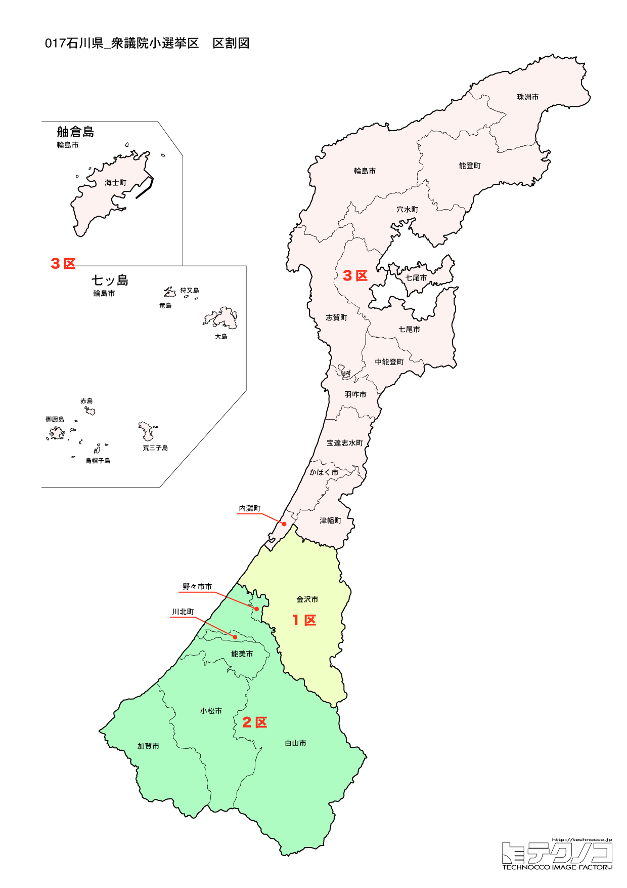

# 石川県



---

## 基本情報

石川県は中部地方の日本海側に位置し、人口は約112万人。県庁所在地は金沢市。能登半島が日本海に突き出た特徴的な形をしている。

歴史的には、加賀百万石の城下町・金沢を中心に発展した。前田利家が加賀藩を治め、武家文化と町人文化が融合した独自の文化が花開いた。兼六園は日本三名園の一つとして知られる。

経済的には、輪島塗、九谷焼、加賀友禅など伝統工芸が盛ん。金箔の生産量は全国の99%を占める。観光業も重要で、金沢、能登、加賀温泉郷などに多くの観光客が訪れる。

2024年1月1日に発生した能登半島地震は県に甚大な被害をもたらし、復興が最大の課題となっている。

---

## 石川県の政治的争点

### 能登半島地震からの復興

2024年1月1日の地震から復興が最優先課題。インフラ復旧、住宅再建、産業復興、人口流出防止など多くの課題がある。

### 北陸新幹線の延伸

2015年に金沢まで開業した北陸新幹線は、2024年3月に敦賀まで延伸。さらなる大阪延伸への期待がある一方、特急廃止による利便性低下も議論されている。

### 伝統工芸の継承

輪島塗、九谷焼、加賀友禅など伝統工芸の後継者不足が課題。能登半島地震で被災した工房の再建も急務。

---

## 選挙の特徴

石川県の衆議院小選挙区は3つ。

自民党が強い「保守王国」で、2024年の衆院選でも3選挙区すべてで自民党が勝利した。能登半島地震からの復興が最大の政治課題であり、国との太いパイプを持つ自民党への支持が継続している背景がある。

北陸新幹線の敦賀延伸（2024年3月）により、金沢から敦賀への接続が改善し、さらなる大阪延伸への期待が高まっている。伝統工芸の継承、特に能登半島地震で被災した輪島塗などの工房再建も重要な課題。

---

## 第1区

### 地域構成

石川1区は金沢市で構成される。県庁所在地。

- **金沢市**: 人口約46万人の県庁所在地で、加賀百万石の城下町として発展した。兼六園は日本三名園の一つで、雪吊りは冬の風物詩。金沢城公園は前田家の居城跡を整備した公園。ひがし茶屋街、にし茶屋街は江戸時代の茶屋街の風情が残る。近江町市場は「金沢の台所」として海鮮が豊富。21世紀美術館は現代アートの美術館として人気。

- **金沢の食文化**: 、加賀料理、金沢おでん、8番らーめんなど多彩。寿司、海鮮丼も絶品。

### 選挙区の特徴

県庁所在地・金沢市全域を含む都市型選挙区。馳浩（自民）が8期連続当選と圧倒的な強さを見せる。元プロレスラーで元文部科学大臣、石川県知事も経験した知名度抜群の候補。能登半島地震からの復興が最大の争点。

### 2024年選挙結果

```
小森卓郎（自民）         ████████████░░░░░░░░  36.3%   64,997票 ✅当選
荒井淳志（立憲）         █████████░░░░░░░░░░░  28.7%   51,506票 
小林誠（維新）          █████░░░░░░░░░░░░░░░  15.2%   27,257票 
小竹凱（国民）          ████░░░░░░░░░░░░░░░░  13.6%   24,324票 🔄比例
村田茂（共産）          █░░░░░░░░░░░░░░░░░░░   5.0%    8,913票 
藤原徳英（無所属）        ░░░░░░░░░░░░░░░░░░░░   1.2%    2,210票 
──────────────────────────────────────────────────────────
投票率: 49.6% ｜ 票差: 13,491票（7.5pt差）
```

### 2026年選挙の構図

馳浩（自民・現職、64歳）は安定した地盤を持つ。能登半島地震からの復興が争点。

---

## 第2区

### 地域構成

石川2区は小松市、加賀市、白山市、能美市、野々市市、川北町で構成される。県南部の加賀地方。

- **加賀市**: 山代温泉、山中温泉、片山津温泉など加賀温泉郷で知られる。山中温泉は松尾芭蕉も訪れた歴史ある温泉。九谷焼の産地としても有名。

- **小松市**: 小松空港があり、こまつの杜ではコマツの建設機械を展示。安宅の関は歌舞伎「勧進帳」の舞台として知られる。

- **白山市**: 白山比咩神社（しらやまひめじんじゃ）の門前町。白山は霊峰として古くから信仰を集めてきた。

### 選挙区の特徴

小松市、加賀市、白山市など県南部の加賀地方を含む選挙区。佐々木紀（自民）が5期連続当選と安定。加賀温泉郷、小松空港など観光・交通インフラを活かした地域振興が課題。北陸新幹線加賀温泉駅の開業効果も注目される。

### 2024年選挙結果

```
佐々木紀（自民）         ███████████████████░  57.8%  100,617票 ✅当選
小山田経子（立憲）        ███████████░░░░░░░░░  36.0%   62,588票 
坂本浩（共産）          ██░░░░░░░░░░░░░░░░░░   6.2%   10,873票 
──────────────────────────────────────────────────────────
投票率: 56.1% ｜ 票差: 38,029票（21.8pt差）
```

### 2026年選挙の構図

佐々木紀（自民・現職）と野党候補の対決。

---

## 第3区

### 地域構成

石川3区は七尾市、輪島市、珠洲市、羽咋市、かほく市、津幡町、内灘町、志賀町、宝達志水町、中能登町、穴水町、能登町で構成される。能登半島全域。

- **能登半島**: 2024年1月1日の能登半島地震で甚大な被害を受けた地域。震度7を記録し、多くの家屋が倒壊、道路が寸断された。復興が最優先課題となっている。

- **輪島市**: 輪島塗の産地として知られる。朝市は日本三大朝市の一つ。白米千枚田は日本海に面した棚田で、世界農業遺産に認定されている。地震で大きな被害を受け、復興途上にある。

- **七尾市**: 和倉温泉で知られる温泉地。能登島は水族館や道の駅がある観光スポット。

- **珠洲市**: 能登半島の先端に位置し、見附島（軍艦島）が有名。塩田も残る。

### 選挙区の特徴

能登半島全域を含む選挙区。2024年1月1日の能登半島地震で甚大な被害を受けた地域であり、復興が最優先課題。西田昭二（自民）が4期連続当選。震災復興への取り組みが最大の評価軸となり、2026年選挙でも復興の進捗状況が争点となる。

### 2024年選挙結果

```
近藤和也（立憲）         ██████████████████░░  54.4%   77,247票 ✅当選
西田昭二（自民）         ██████████████░░░░░░  43.2%   61,308票 🔄比例
南章治（共産）          ░░░░░░░░░░░░░░░░░░░░   2.4%    3,438票 
──────────────────────────────────────────────────────────
投票率: 62.5% ｜ 票差: 15,939票（11.2pt差）
```

### 2026年選挙の構図

西田昭二（自民・現職）と野党候補の対決。震災復興の進捗が最大の争点。

---
