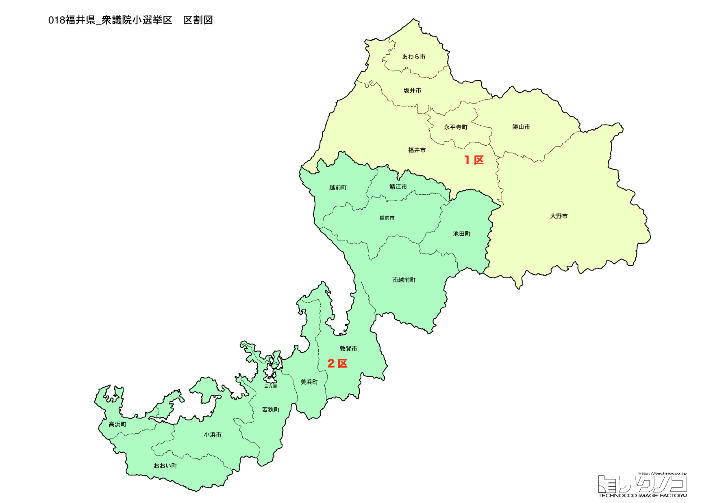

# 福井県



---

## 基本情報

福井県は本州の日本海側、北陸地方の南西部に位置する県である。人口は約75万人で全国43位と少ないが、世帯あたりの住宅面積や持ち家率は全国トップクラスを誇る。県民性は勤勉で堅実と言われ、共働き率や貯蓄率も高い。

歴史的には、戦国時代に朝倉氏が一乗谷に城下町を築き、織田信長に滅ぼされるまで栄えた。江戸時代には越前松平家が福井藩を治め、幕末には松平春嶽が藩主として活躍、橋本左内や由利公正といった人材を輩出した。また、曹洞宗の大本山・永平寺があり、禅の聖地としても知られる。

---

## 福井県の政治的争点

### 原発と地域経済

福井県には13基の商業用原子炉があり（一部は廃炉作業中）、「原発銀座」と呼ばれる。原発は雇用と交付金をもたらす一方、事故リスクへの不安も根強い。2011年の福島第一原発事故以降、県内でも再稼働への賛否が分かれているが、地域経済への影響を考慮して容認する声が多い。2024年の選挙では、中道改革連合が「原発ゼロ」から再稼働容認に転換したことで、原発立地地域での支持獲得を狙う構図となっている。

### 北陸新幹線延伸

2024年3月に北陸新幹線が金沢から敦賀まで延伸開業した。福井県内に芦原温泉駅、福井駅、越前たけふ駅、敦賀駅の4駅が新設され、東京からのアクセスが大幅に向上した。一方で、大阪・京都方面への延伸（小浜・京都ルート）は着工のめどが立っておらず、敦賀での乗り換えが必要な状況が続いている。関西方面への延伸促進は県を挙げての課題であり、選挙でも争点となる。

---

## 選挙の特徴

福井県の衆議院小選挙区は2つ。かつては3選挙区あったが、2022年の区割り変更で2選挙区に減少した。

長らく「保守王国」と呼ばれ、1996年から2024年まで衆議院小選挙区で非自民候補が当選したことがなかった。その背景には、原発立地県として国との関係が深いこと、業界団体と自民党の強い結びつきがある。

しかし2024年の衆院選では、自民党の裏金問題と保守分裂（高木毅と山本拓の対立）により、28年ぶりに非自民候補（立憲民主党・辻英之）が2区で当選し、「保守王国の崩壊」と報じられた。原発と地域経済の関係、北陸新幹線の大阪延伸が重要な政治課題。

**2026年選挙の構図**: 中道改革連合（立憲+公明の新党）vs 自民党・維新連立の対決構図。「原発銀座」を抱える福井では、中道改革連合が「原発ゼロ」から再稼働容認に転換したことで、原発立地地域での支持獲得を狙う。1区は稲田朋美（自民）vs 波多野翼（中道）、2区は斉木武志（自民「支持」）vs 辻英之（中道）の構図で、野党票の分散（国民民主、参政党）が鍵を握る。

---

## 第1区

### 地域構成

福井1区は、県庁所在地の福井市を中心に、大野市、勝山市、あわら市、坂井市、吉田郡（永平寺町）で構成される。県北部から中部にかけての地域で、県の政治・経済の中心地を含む都市型選挙区である。

- **福井市**: 県庁所在地であり、県内企業の本社、福井大学、県立病院などが集中する。戦国時代の朝倉氏の拠点・一乗谷朝倉氏遺跡は、当時の城下町がそのまま発掘された貴重な史跡として知られ、2022年には一乗谷朝倉氏遺跡博物館がオープンした。また、柴田勝家が築いた北ノ庄城の跡地には柴田神社があり、勝家とお市の方を祀っている。養浩館庭園は江戸時代の大名庭園で、アメリカの日本庭園専門誌で高い評価を受けている。

- **大野市**: 越前大野城の城下町として発展した。盆地特有の気象条件により、秋から春にかけて雲海が発生し、「天空の城」として人気を集めている。また、湧水が豊富で「名水のまち」としても知られ、御清水（おしょうず）は環境省の名水百選に選ばれている。

- **勝山市**: 福井県立恐竜博物館の所在地として有名である。同博物館は世界三大恐竜博物館の一つに数えられ、年間90万人以上が訪れる県内最大の観光スポットとなっている。また、白山平泉寺は中世に栄えた宗教都市の遺構で、苔むした境内が美しい。

- **あわら市**: 芦原温泉で知られる温泉観光地である。明治時代に開湯し、「関西の奥座敷」として発展した。2024年3月の北陸新幹線延伸で芦原温泉駅が開業し、アクセスが向上した。

- **坂井市**: 東尋坊で有名である。日本海に面した柱状節理の断崖絶壁は国の天然記念物に指定されており、サスペンスドラマのロケ地としてもおなじみである。また、丸岡城は現存12天守の一つで、日本最古級の天守閣とされる。三国港は江戸時代に北前船の寄港地として栄え、現在も新鮮な越前がにの水揚げで知られる。

**吉田郡永平寺町**には曹洞宗の大本山・永平寺がある。1244年に道元禅師が開いた修行道場で、現在も約150人の修行僧が厳しい修行生活を送っている。参拝客は年間約100万人に上る。

### 選挙区の特徴

県北部から中部にかけての都市型選挙区。稲田朋美（自民）が7期連続当選と強固な地盤を持つが、2024年は裏金問題で比例重複を認められず苦戦。立憲新人の波多野翼が肉薄し比例復活。2026年は野党票が中道改革連合と国民民主に分散する可能性があり、構図が複雑化している。

### 2024年選挙結果

```
稲田朋美（自民）         ██████████████░░░░░░  43.9%   86,906票 ✅当選
波多野翼（立憲）         ███████████░░░░░░░░░  35.5%   70,328票 🔄比例
田中こはる（参政）        ███░░░░░░░░░░░░░░░░░  10.0%   19,716票 
金元幸枝（共産）         █░░░░░░░░░░░░░░░░░░░   5.7%   11,215票 
西山理恵（無所属）        █░░░░░░░░░░░░░░░░░░░   5.0%    9,845票 
──────────────────────────────────────────────────────────
投票率: 55.6% ｜ 票差: 16,578票（8.4pt差）
```

### 2026年選挙の構図

2026年2月の第51回衆議院選挙では、4人が立候補を予定している。

**稲田朋美（自民・前職）** は8選を目指す。防衛大臣や自民党政調会長を歴任した保守派の論客で、安倍政権下で重用された。裏金問題での逆風は続くが、組織力を背景に地盤は固い。

**波多野翼（中道改革連合・前職）** は立憲民主党を離党し、公明党と立憲が結成した新党「中道改革連合」から出馬する。前回選挙で稲田に肉薄した勢いを維持できるかが焦点。公明党・創価学会の支援を受けられるのが強みだが、原発政策での立場変更（「原発ゼロ」から再稼働容認へ）が県内でどう受け止められるかは未知数。

**山中俊祐（国民民主・新人）** は医師で、2025年の参院選福井選挙区にも出馬経験がある。国民民主党の「手取りを増やす」路線で若年層への浸透を狙う。

**藤本一希（参政・新人）** は参政党から出馬。

注目ポイントは、野党票が波多野（中道）と山中（国民）で分散する可能性があること。自民・稲田にとっては漁夫の利を得られる展開かもしれないが、公明票の行方も不透明で、従来の「自公協力」が機能しない初めての選挙となる。

---

## 第2区

### 地域構成

福井2区は、敦賀市、小浜市、鯖江市、越前市、今立郡（池田町）、南条郡（南越前町）、丹生郡（越前町）、三方郡（美浜町）、大飯郡（高浜町、おおい町）、三方上中郡（若狭町）で構成される。日本海沿岸から内陸部まで広がる広域選挙区で、港湾都市、原発立地地域、内陸の製造業都市が点在する多核型の選挙区である。地域ごとに産業構造や利害関心が異なるため、候補者は幅広い政策をアピールする必要がある。

- **敦賀市**: 古くから日本海側有数の港湾都市として栄えた。古代には渤海使の玄関口、中世には日本海交易の拠点、近代には「欧亜国際連絡列車」の発着地として、ウラジオストク経由でヨーロッパへ向かう旅客が利用した。1920年代にはポーランド孤児やユダヤ難民を受け入れた「人道の港」としての歴史もあり、杉原千畝の「命のビザ」に関連した資料館がある。現在は敦賀原発をはじめとする原子力関連施設が立地し、原発関連の雇用や交付金が地域経済を支えている。2024年3月には北陸新幹線が敦賀まで延伸開業し、観光振興への期待が高まっている。気比神宮は北陸道総鎮守として知られ、日本三大木造鳥居の一つがある。

- **小浜市**: 若狭湾に面した歴史都市で、奈良時代から朝廷に食材を献上した「御食国（みけつくに）」の中心地だった。鯖街道の起点として京都との結びつきが深く、「海のある奈良」と呼ばれるほど古い寺社が多い。明通寺の三重塔は国宝に指定されている。また、オバマ大統領の名前にちなんで2008年の米大統領選では「オバマを勝手に応援する会」が発足し、国際的な話題となった。

- **鯖江市**: 眼鏡フレーム生産で国内シェア95%以上を誇る「めがねのまち」である。明治時代に農閑期の副業として始まった眼鏡製造が、現在では世界的なブランドのOEM生産を手がけるまでに発展した。近年は「めがねフェス」などのイベントや、IT企業誘致にも力を入れ、オープンデータ先進都市としても知られる。西山公園はつつじの名所で、園内にはレッサーパンダがいる動物園もある。

- **越前市**: 伝統工芸と製造業が集積する県南部の中核都市。越前和紙は1500年の歴史を持ち、紙幣や証券用紙にも使われている。越前打刃物は700年の伝統があり、包丁やナイフの産地として世界的に評価が高い。また、紫式部が生涯で唯一京都を離れて暮らした地とされ、紫式部公園がある。武生（たけふ）の古い町並みや、蔵の辻と呼ばれるレトロな商店街も見どころ。

- **美浜町・高浜町・おおい町**: 若狭湾沿岸の原発立地自治体である。関西電力の美浜発電所、高浜発電所、大飯発電所が立地し、「原発銀座」と呼ばれることもある。原発関連の雇用と交付金が地域経済に大きな影響を与えており、エネルギー政策は選挙の重要争点となる。一方で、美浜町の三方五湖は五つの湖が異なる色に見えるラムサール条約登録湿地として知られ、レインボーラインからの眺望が美しい。

### 選挙区の特徴

敦賀市、小浜市など「原発銀座」と呼ばれる原発立地地域を含む広域選挙区。2024年は裏金問題で自民・高木毅が非公認となり、さらに山本拓が無所属で出馬して保守分裂。この隙を突いて立憲・辻英之が28年ぶりの非自民当選を果たした。2026年は自民が斉木武志（維新離党）を「支持」とし一本化を図るが、県連との対立も残る注目選挙区。

### 2024年選挙結果

```
辻英之（立憲）          ████████████░░░░░░░░  36.3%   54,100票 ✅当選
斉木武志（維新）         ████████░░░░░░░░░░░░  26.0%   38,749票 🔄比例
高木毅（無所属）         ███████░░░░░░░░░░░░░  22.5%   33,532票 
山本拓（無所属）         ████░░░░░░░░░░░░░░░░  12.5%   18,656票 
小柳茂臣（共産）         ░░░░░░░░░░░░░░░░░░░░   2.6%    3,934票 
──────────────────────────────────────────────────────────
投票率: 60.0% ｜ 票差: 15,351票（10.3pt差）
```

### 2026年選挙の構図

2026年の選挙は、前回以上に複雑な構図となっている。

**辻英之（中道改革連合・現職）** は立憲を離党し、新党「中道改革連合」から出馬する。立憲と公明の両党から支援を受ける形となり、連合福井からの推薦も決定。原発政策について、立憲時代の「原発ゼロ」から中道の「再稼働容認」に立場が変わったが、「将来的に依存しない社会を目指す方針と齟齬はない」と説明している。

**斉木武志（自民「支持」・現職）** は日本維新の会を離党（除名処分）し、自民党会派入りした。自民党本部は斉木を「支持」と決定したが、「公認」ではない点が微妙な立場を示している。高市早苗首相への恩義を強調し、「首相指名選挙で『高市早苗』と書いた責任をともに果たしたい」と述べている。衆院解散後に自民党への入党届を出す意向。

この決定は福井県連の意向と異なるものだった。県連は山本建（山本拓の長男、県議）の公認を全会一致で党本部に申請していたが、党本部は「世襲批判」などを考慮して見送った。山本建は一時、無所属での出馬を表明したが、その後撤回した。

注目ポイントは、自民党本部と県連の対立、そして「公認」ではなく「支持」という斉木の曖昧な立場である。前回は保守分裂で辻が漁夫の利を得たが、今回は自民側が一本化に近づいたことで、辻にとっては厳しい戦いになる可能性がある。一方、中道改革連合として公明票を取り込めれば、新たな支持基盤を得られる。原発立地選挙区における中道の原発政策がどう評価されるかも焦点となる。

---
