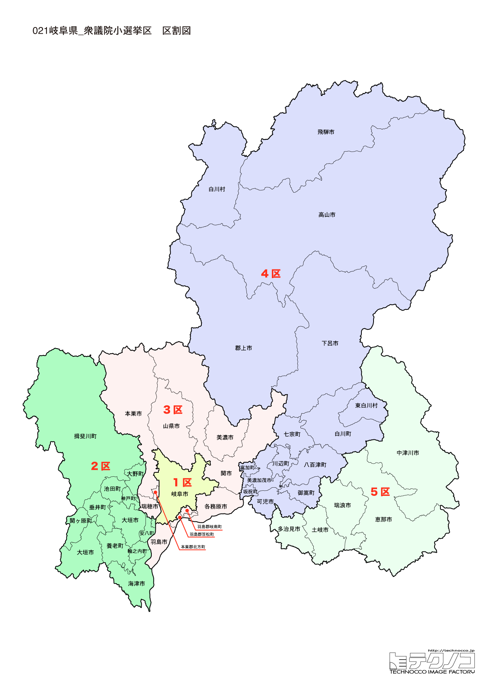

# 岐阜県



---

## 基本情報

岐阜県は中部地方に位置し、人口は約196万人。県庁所在地は岐阜市。海のない内陸県で、飛騨地方と美濃地方に大別される。

歴史的には、織田信長が天下統一の拠点とした岐阜城、関ヶ原の戦いの古戦場など、戦国時代の歴史が色濃く残る。飛騨高山は江戸時代の城下町の風情が残り、「飛騨の小京都」と呼ばれる。

経済的には、関市は刃物の産地として世界的に有名。美濃焼は日本一の陶磁器生産量を誇る。飛騨牛は全国的なブランド牛。白川郷の合掌造り集落は世界遺産に登録されている。

---

## 岐阜県の政治的争点

### リニア中央新幹線

岐阜県内を通過するリニア中央新幹線の建設が進んでいるが、中津川市周辺に駅ができる予定で、地域活性化への期待がある。

### 観光振興

白川郷、高山、下呂温泉など観光資源が豊富だが、インバウンド対応とオーバーツーリズム対策が課題。

### 人口減少と過疎対策

飛騨地方を中心に人口減少が進み、過疎化対策が課題。

---

## 選挙の特徴

岐阜県の衆議院小選挙区は5つ。自民党が強い保守的な地域で、2024年の衆院選では5選挙区中4選挙区で自民党が勝利した。

ただし、4区では25歳の立憲新人・今井瑠々が自民党現職を破る大金星をあげ、岐阜県内で唯一野党が勝利した。飛騨地方を含む広大な選挙区で若手候補が勝利したことは、全国的にも注目された。

---

## 第1区

### 地域構成

岐阜1区は岐阜市で構成される。県庁所在地。

- **岐阜市**: 人口約40万人の県庁所在地。岐阜城は金華山山頂にあり、織田信長が天下統一の拠点とした。長良川では鵜飼が行われ、1,300年以上の歴史がある。川原町は古い町並みが残る風情ある地域。

### 選挙区の特徴

県庁所在地・岐阜市を含む都市型選挙区。野田聖子（元総務大臣）が10期連続当選を果たす強固な地盤を持つ。女性初の自民党総裁候補として注目された野田は、無風区に近い状況が続いている。

### 2024年選挙結果

```
野田聖子（自民）         ████████████████████  67.5%  100,226票 ✅当選
山越徹（共産）          ██████████░░░░░░░░░░  32.5%   48,325票 
──────────────────────────────────────────────────────────
投票率: 48.7% ｜ 票差: 51,901票（34.9pt差）
```

### 2026年選挙の構図

野田聖子（自民・現職、65歳）と中道改革連合候補の対決。

---

## 第2区

### 地域構成

岐阜2区は大垣市、海津市、養老町、垂井町、関ヶ原町、神戸町、輪之内町、安八町、揖斐川町、大野町、池田町で構成される。西濃地方。

- **大垣市**: 「水の都」と呼ばれ、湧水が豊富。松尾芭蕉の「奥の細道」の結びの地として知られる。

- **関ヶ原町**: 1600年の関ヶ原の戦いの古戦場。天下分け目の合戦の舞台として歴史ファンに人気。

### 選挙区の特徴

関ヶ原の戦いの古戦場を含む西濃地方の選挙区。棚橋泰文（元衆議院議長）が10期連続当選を果たす自民党の牙城。安定した保守地盤で、大きな波乱は起きにくい選挙区である。

### 2024年選挙結果

```
棚橋泰文（自民）         ████████████████████  61.9%   91,183票 ✅当選
三尾圭司（共産）         ███████░░░░░░░░░░░░░  22.8%   33,634票 
伊藤あゆみ（無所属）       █████░░░░░░░░░░░░░░░  15.2%   22,456票 
──────────────────────────────────────────────────────────
投票率: 53.1% ｜ 票差: 57,549票（39.1pt差）
```

### 2026年選挙の構図

棚橋泰文（自民・現職、62歳）と野党候補の対決。

---

## 第3区

### 地域構成

岐阜3区は関市、美濃市、羽島市、各務原市、山県市、瑞穂市、本巣市、岐南町、笠松町、北方町で構成される。中濃・岐阜近郊。

- **関市**: 刃物の産地として世界的に有名。「刃物のまち関」としてナイフ、包丁、カミソリなどを生産。

- **各務原市**: 航空自衛隊岐阜基地があり、航空宇宙博物館が人気。

### 選挙区の特徴

刃物の産地・関市や航空自衛隊岐阜基地がある各務原市を含む選挙区。武藤容治（元経済産業大臣）が6期連続当選を果たす自民党優勢の選挙区。製造業が盛んな地域性もあり、保守的な傾向が続いている。

### 2024年選挙結果

```
武藤容治（自民）         ███████████████░░░░░  46.8%   98,370票 ✅当選
仙田晃宏（国民）         ██████████░░░░░░░░░░  30.4%   64,039票 🔄比例
阪口直人（れいわ）        ███████░░░░░░░░░░░░░  22.8%   48,002票 🔄比例
──────────────────────────────────────────────────────────
投票率: 53.2% ｜ 票差: 34,331票（16.3pt差）
```

### 2026年選挙の構図

武藤容治（自民・現職）と野党候補の対決。

---

## 第4区

### 地域構成

岐阜4区は高山市、美濃加茂市、可児市、飛騨市、郡上市、下呂市、白川村、坂祝町、富加町、川辺町、七宗町、八百津町、白川町、東白川村、御嵩町で構成される。飛騨地方と中濃の一部。

- **高山市**: 「飛騨の小京都」と呼ばれる観光都市。古い町並み（三町伝統的建造物群保存地区）、高山祭（ユネスコ無形文化遺産）、飛騨牛などが人気。面積は日本一広い市町村。

- **白川村**: 白川郷合掌造り集落が世界遺産に登録されている。冬のライトアップは幻想的。

- **下呂市**: 下呂温泉で知られる。日本三名泉の一つに数えられる。

### 選挙区の特徴

2024年衆院選で最大の注目区となった選挙区。25歳の立憲新人・今井瑠々が自民党現職を破り、全国最年少の衆議院議員となった。飛騨高山、白川郷など観光地を含む広大な選挙区で、若い候補が勝利したことは大きなインパクトを与えた。2026年選挙では再選を目指す今井に注目が集まる。

### 2024年選挙結果

```
今井雅人（立憲）         ███████████████████░  57.3%  114,032票 ✅当選
金子俊平（自民）         ██████████████░░░░░░  42.7%   85,129票 
──────────────────────────────────────────────────────────
投票率: 63.9% ｜ 票差: 28,903票（14.5pt差）
```

### 2026年選挙の構図

今井瑠々（立憲→中道改革連合・現職）と自民党候補の対決。若手候補の動向に注目。

---

## 第5区

### 地域構成

岐阜5区は多治見市、中津川市、瑞浪市、恵那市、土岐市で構成される。東濃地方。

- **多治見市**: 美濃焼の産地として知られる。夏の暑さでも有名で、日本最高気温40.9度を記録したことがある。

- **中津川市**: 中山道の宿場町・馬籠宿がある。栗きんとんは中津川の名物。

- **恵那市**: 恵那峡が紅葉の名所として知られる。

### 選挙区の特徴

美濃焼の産地や中山道の宿場町を含む東濃地方の選挙区。古屋圭司（元国家公安委員長）が11期連続当選を果たす自民党の金城湯池。高齢の現職のため、後継問題も注目される。

### 2024年選挙結果

```
古屋圭司（自民）         ████████████████░░░░  48.3%   73,679票 ✅当選
眞野哲（立憲）          ████████████░░░░░░░░  38.6%   58,973票 🔄比例
山田良司（維新）         ████░░░░░░░░░░░░░░░░  13.1%   19,973票 
──────────────────────────────────────────────────────────
投票率: 62.7% ｜ 票差: 14,706票（9.6pt差）
```

### 2026年選挙の構図

古屋圭司（自民・現職、72歳）と野党候補の対決。

---
