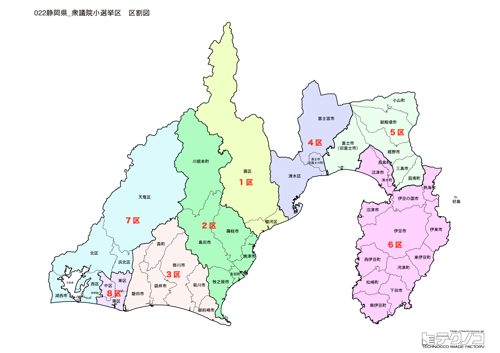

# 静岡県

---

## 基本情報

静岡県は中部地方の太平洋側に位置し、人口は約360万人で全国10位。県庁所在地は静岡市。東西に長い県土を持ち、富士山、伊豆半島、浜名湖など多様な地形を持つ。

歴史的には、徳川家康が隠居した駿府（静岡市）、江戸時代の東海道の宿場町など、歴史的な街並みが残る。伊豆は古くから温泉保養地として栄えた。

経済的には、お茶の生産量日本一、ピアノ・オートバイの生産で知られるヤマハ、スズキ、ホンダなど製造業が盛ん。うなぎ（浜名湖）、桜えび、わさびなど食の魅力も豊富。

---

## 静岡県の政治的争点

### リニア中央新幹線

静岡県内を通過するリニア中央新幹線の建設をめぐり、川勝前知事が大井川の水資源への影響を懸念して着工を認めなかった。知事交代後も議論が続いている。

### 浜岡原発の再稼働問題

中部電力浜岡原子力発電所は2011年から運転停止中。再稼働をめぐる議論が続いている。

### 製造業の転換

自動車、楽器など製造業が盛んだが、EV化などへの対応が課題。

---

## 選挙の特徴

静岡県の衆議院小選挙区は8つ。自民党が強い地域だが、2024年の衆院選では8選挙区中、自民党は4選挙区の勝利にとどまり、立憲民主党が3選挙区、国民民主党が1選挙区を獲得した。

リニア中央新幹線をめぐる川勝前知事の姿勢が全国的に注目された県であり、浜岡原発問題など、エネルギー政策も重要な争点となっている。製造業の県として、EV化への対応も注目される。

---

## 第1区

### 地域構成

静岡1区は静岡市葵区、駿河区で構成される。県庁所在地の中心部。

- **静岡市**: 人口約69万人の政令指定都市。駿府城公園は徳川家康が晩年を過ごした城跡。久能山東照宮は家康を祀る国宝の社殿。静岡おでんは黒はんぺんが特徴的なご当地グルメ。

### 選挙区の特徴

県庁所在地・静岡市の中心部を含む都市型選挙区。上川陽子（外務大臣経験者、2024年自民党総裁選出馬）が8期連続当選を果たす強固な地盤を持つ。自民党総裁候補として名前が挙がる上川の動向は全国的に注目されている。

### 2024年選挙結果

| 候補者 | 党派 | 結果 |
|--------|------|------|
| 上川陽子 | 自民 | **当選**（8選） |

上川陽子は外務大臣を務め、2024年自民党総裁選に出馬した。

### 2026年選挙の構図

上川陽子（自民・現職、71歳）と中道改革連合候補の対決。

---

## 第2区

### 地域構成

静岡2区は島田市、焼津市、藤枝市、牧之原市、榛原郡で構成される。志太榛原地域。

- **焼津市**: 遠洋漁業の基地で、マグロ、カツオの水揚げが多い。焼津さかなセンターは観光名所。

- **藤枝市**: サッカーのまちとして知られ、藤枝東高校は名門。

- **牧之原市**: 牧之原台地でお茶の栽培が盛ん。

### 選挙区の特徴

お茶の産地・牧之原台地やマグロ・カツオの水揚げで知られる焼津市を含む選挙区。井林辰憲が当選を果たす自民党優勢の選挙区。サッカーのまち藤枝など、スポーツ文化も盛んな地域。

### 2024年選挙結果

| 候補者 | 党派 | 結果 |
|--------|------|------|
| 井林辰憲 | 自民 | **当選** |

### 2026年選挙の構図

井林辰憲（自民・現職）と野党候補の対決。

---

## 第3区

### 地域構成

静岡3区は磐田市、掛川市、袋井市、御前崎市、菊川市、周智郡で構成される。中遠・西部地域。

- **磐田市**: ジュビロ磐田の本拠地。ヤマハ発動機の本社がある。

- **掛川市**: 掛川城が「東海の名城」として知られる。掛川茶も有名。

- **御前崎市**: 御前崎灯台が太平洋を望む景勝地。浜岡原子力発電所がある。

### 選挙区の特徴

浜岡原発が立地する御前崎市を含む選挙区。2024年は立憲・小山展弘が勝利し、浜岡原発問題が争点として浮上した。エネルギー政策をめぐる議論が活発な選挙区であり、2026年も原発再稼働問題が大きな焦点となる。

### 2024年選挙結果

| 候補者 | 党派 | 結果 |
|--------|------|------|
| 小山展弘 | 立憲 | **当選** |

### 2026年選挙の構図

小山展弘（立憲→中道改革連合・現職）と自民党候補の対決。浜岡原発問題が焦点。

---

## 第4区

### 地域構成

静岡4区は静岡市清水区、富士宮市、富士市の一部で構成される。清水・富士地域。

- **静岡市清水区**: 清水港があり、ちびまる子ちゃんの舞台として知られる。清水エスパルスの本拠地。三保の松原は富士山を望む景勝地で世界遺産の構成資産。

- **富士宮市**: 富士山本宮浅間大社があり、富士山信仰の中心地。富士宮やきそばはB-1グランプリで優勝。

### 選挙区の特徴

清水港や富士山本宮浅間大社を含む選挙区。2024年は国民民主党・田中健が勝利し、自民・深澤陽一は比例復活にとどまった。野党と自民が接戦を繰り広げる激戦区であり、2026年も注目される。

### 2024年選挙結果

| 候補者 | 党派 | 結果 |
|--------|------|------|
| 田中健 | 国民 | **当選** |
| 深澤陽一 | 自民 | 比例復活 |

### 2026年選挙の構図

田中健（国民・現職）と深澤陽一（自民・比例現職）の再戦。

---

## 第5区

### 地域構成

静岡5区は三島市、富士市の一部、御殿場市、裾野市、田方郡、駿東郡小山町で構成される。東部地域。

- **三島市**: 三嶋大社の門前町。湧水が豊富で、源兵衛川は水の都のシンボル。

- **御殿場市**: 御殿場プレミアム・アウトレットがあり、富士山を望むショッピングスポット。

### 選挙区の特徴

三島市、御殿場市など富士山東麓の地域を含む選挙区。細野豪志（元環境大臣、民主党から自民党に移籍）が当選を果たす選挙区。細野は政界再編の象徴的な人物であり、その動向は注目されている。

### 2024年選挙結果

| 候補者 | 党派 | 結果 |
|--------|------|------|
| 細野豪志 | 自民 | **当選** |

細野豪志は元環境大臣で、民主党から自民党に移籍した。

### 2026年選挙の構図

細野豪志（自民・現職）と野党候補の対決。

---

## 第6区

### 地域構成

静岡6区は沼津市、熱海市、伊東市、下田市、伊豆市、伊豆の国市、賀茂郡、駿東郡清水町、長泉町で構成される。伊豆半島。

- **熱海市**: 温泉リゾートとして有名。MOA美術館、熱海城、起雲閣など見どころが多い。

- **伊東市**: 伊東温泉、大室山、城ヶ崎海岸など観光名所が豊富。

- **下田市**: ペリー来航の地として知られる。白浜海岸は人気のビーチ。

### 選挙区の特徴

伊豆半島全域を含む観光地が集中する選挙区。渡辺周（立憲）が当選を果たし、野党が優勢。温泉リゾートや歴史的な観光地を多く含み、観光業が地域経済の柱となっている。

### 2024年選挙結果

| 候補者 | 党派 | 結果 |
|--------|------|------|
| 渡辺周 | 立憲 | **当選** |

### 2026年選挙の構図

渡辺周（立憲→中道改革連合・現職）と自民党候補の対決。

---

## 第7区

### 地域構成

静岡7区は浜松市の一部（旧西区、旧北区、旧浜北区、天竜区）、湖西市で構成される。浜松市北部。

- **浜松市**: 人口約79万人の政令指定都市。ヤマハ、河合楽器など楽器メーカーの本社があり、「楽器のまち」として知られる。

- **湖西市**: 浜名湖の西側に位置し、うなぎ養殖が盛ん。

### 選挙区の特徴

浜松市北部とうなぎ養殖で有名な湖西市を含む選挙区。城内実（元外務副大臣）が7期連続当選を果たす自民党の地盤。製造業が盛んな地域であり、EV化への対応が地域経済の課題となっている。

### 2024年選挙結果

| 候補者 | 党派 | 結果 |
|--------|------|------|
| 城内実 | 自民 | **当選**（7選） |

城内実は元外務副大臣。

### 2026年選挙の構図

城内実（自民・現職）と野党候補の対決。

---

## 第8区

### 地域構成

静岡8区は浜松市の一部（旧中区、旧東区、旧南区）で構成される。浜松市中心部。

- **浜松市中心部**: 浜松駅周辺の商業地域。アクトシティ浜松、浜松城がある。餃子の消費量日本一を宇都宮市と争っている。

### 選挙区の特徴

浜松市中心部を含む都市型選挙区。2024年は立憲・源馬謙太郎が勝利し、野党が優勢。餃子の消費量日本一を宇都宮市と争う浜松市の中心部であり、都市部の無党派層の動向が鍵を握る。

### 2024年選挙結果

| 候補者 | 党派 | 結果 |
|--------|------|------|
| 源馬謙太郎 | 立憲 | **当選** |

### 2026年選挙の構図

源馬謙太郎（立憲→中道改革連合・現職）と自民党候補の対決。

---
