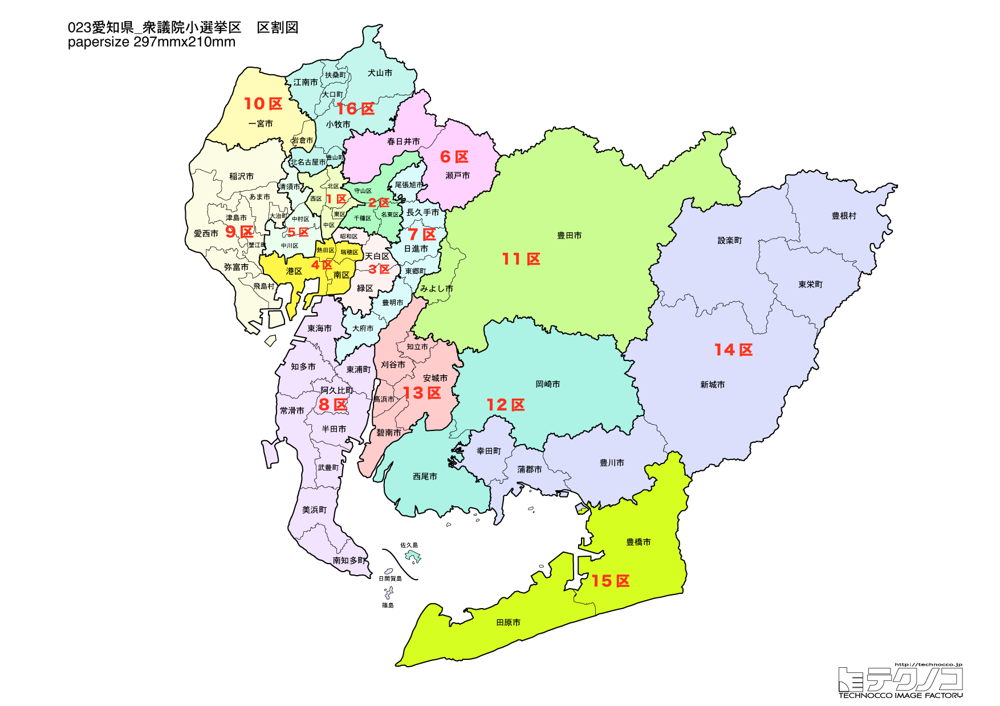

# 愛知県



---

## 基本情報

愛知県は中部地方に位置し、人口は約754万人で全国4位。県庁所在地は名古屋市。日本有数の工業県で、自動車産業を中心に製造業が集積する。

歴史的には、織田信長、豊臣秀吉、徳川家康の三英傑を輩出した「武将のふるさと」。名古屋城は徳川御三家筆頭の尾張藩の居城であった。

経済的には、トヨタ自動車をはじめとする自動車産業が県経済を牽引。製造品出荷額は日本一を誇る。名古屋めし（ひつまぶし、味噌カツ、手羽先など）は全国的に人気。

---

## 愛知県の政治的争点

### 自動車産業のEV転換

トヨタ自動車を中心とする自動車産業のEV化への対応が県経済の将来を左右する。

### リニア中央新幹線

名古屋駅にリニア中央新幹線の駅ができる予定で、開業への期待がある一方、静岡県との調整が課題。

### ジブリパークと観光振興

2022年に開業したジブリパークを核とした観光振興が期待されている。

---

## 選挙の特徴

愛知県の衆議院小選挙区は16（2022年の区割り変更で15から16に増加）。

2024年の衆院選では16選挙区中、自民党は3選挙区の勝利にとどまり、立憲民主党が7選挙区、国民民主党が3選挙区、日本保守党・公明党・維新がそれぞれ1選挙区を獲得した。特に河村たかし前名古屋市長が日本保守党から出馬し1区で圧勝したことが全国的に注目された。

トヨタ自動車の企業城下町である豊田市を含む11区は、国民民主党のトヨタ労組出身候補が強い影響力を持つ特異な選挙区として知られる。

---

## 第1区

### 地域構成

愛知1区は名古屋市東区、北区、西区、中区で構成される。名古屋市の中心部。

- **名古屋市中区**: 名古屋駅、栄など商業・ビジネスの中心。名古屋城は金のしゃちほこで有名。

- **名古屋市東区**: 徳川園、徳川美術館など尾張徳川家ゆかりの施設がある。

### 選挙区の特徴

名古屋市の中心部を含む都市型選挙区。2024年は河村たかし前名古屋市長が日本保守党から出馬し圧勝。自民・立憲の両候補を破る結果となり、全国に衝撃を与えた。日本保守党の動向が2026年選挙でも最大の注目点となる。

### 2024年選挙結果

```
河村たかし（保守党）       ███████████████░░░░░  46.6%   95,613票 ✅当選
吉田統彦（立憲）         ███████░░░░░░░░░░░░░  23.6%   48,304票 
熊田裕通（自民）         ███████░░░░░░░░░░░░░  21.1%   43,381票 
山本耕一（維新）         ██░░░░░░░░░░░░░░░░░░   8.7%   17,810票 
──────────────────────────────────────────────────────────
投票率: 50.8% ｜ 票差: 47,309票（23.1pt差）
```

### 2026年選挙の構図

河村たかし（日本保守党・現職、77歳）と自民党・中道改革連合候補の対決。日本保守党の動向に注目。

---

## 第2区

### 地域構成

愛知2区は名古屋市千種区、守山区、名東区で構成される。名古屋市東部の住宅地。

- **千種区**: 覚王山、本山など閑静な住宅地。

- **名東区**: 名古屋インターチェンジがあり、ベッドタウンとして発展。

### 選挙区の特徴

名古屋市東部の住宅地を含む選挙区。古川元久（元内閣官房副長官、国民民主党重鎮）が10期連続当選を果たす強固な地盤を持つ。国民民主党の牙城として知られ、安定した選挙区である。

### 2024年選挙結果

```
古川元久（国民）         ███████████████████░  58.5%  121,739票 ✅当選
中川貴元（自民）         ████████░░░░░░░░░░░░  24.1%   50,195票 
室園幸志（維新）         ███░░░░░░░░░░░░░░░░░   9.1%   18,864票 
酒井健太朗（共産）        ██░░░░░░░░░░░░░░░░░░   8.4%   17,422票 
──────────────────────────────────────────────────────────
投票率: 52.7% ｜ 票差: 71,544票（34.4pt差）
```

### 2026年選挙の構図

古川元久（国民・現職）と自民党候補の対決。

---

## 第3区

### 地域構成

愛知3区は名古屋市昭和区、緑区、天白区で構成される。名古屋市南東部。

- **緑区**: 名古屋市最大の人口を持つ区。大高緑地がある。

### 選挙区の特徴

名古屋市南東部を含む選挙区。近藤昭一（立憲民主党重鎮）が10期連続当選を果たす強固な地盤を持つ。野党の牙城として知られ、安定した選挙区である。

### 2024年選挙結果

```
近藤昭一（立憲）         ███████████████░░░░░  47.0%  103,624票 ✅当選
水野良彦（自民）         ████████░░░░░░░░░░░░  24.6%   54,199票 
皆川雅一（維新）         ████░░░░░░░░░░░░░░░░  12.3%   27,187票 
大橋享（保守党）         ██░░░░░░░░░░░░░░░░░░   8.3%   18,412票 
杉本純子（参政）         ██░░░░░░░░░░░░░░░░░░   7.8%   17,234票 
──────────────────────────────────────────────────────────
投票率: 54.2% ｜ 票差: 49,425票（22.4pt差）
```

### 2026年選挙の構図

近藤昭一（立憲→中道改革連合・現職）と自民党候補の対決。

---

## 第4区

### 地域構成

愛知4区は名古屋市瑞穂区、熱田区、港区、南区で構成される。名古屋市南部。

- **熱田区**: 熱田神宮があり、三種の神器の一つ草薙剣を祀る。

- **港区**: 名古屋港水族館、レゴランド・ジャパンがある。

### 選挙区の特徴

熱田神宮や名古屋港水族館を含む名古屋市南部の選挙区。牧義夫（立憲）が8期連続当選を果たす野党優勢の選挙区。レゴランド・ジャパンなど観光施設もあり、多様な顔を持つ地域。

### 2024年選挙結果

```
牧義夫（立憲）          ████████████░░░░░░░░  36.4%   63,668票 ✅当選
工藤彰三（自民）         ██████████░░░░░░░░░░  31.1%   54,385票 🔄比例
中田千代（維新）         ████░░░░░░░░░░░░░░░░  12.9%   22,661票 
麻生知沙（保守党）        ███░░░░░░░░░░░░░░░░░  11.3%   19,805票 
高橋祐介（共産）         ██░░░░░░░░░░░░░░░░░░   8.3%   14,453票 
──────────────────────────────────────────────────────────
投票率: 48.8% ｜ 票差: 9,283票（5.3pt差）
```

### 2026年選挙の構図

牧義夫（立憲→中道改革連合・現職）と自民党候補の対決。

---

## 第5区

### 地域構成

愛知5区は名古屋市中村区、中川区で構成される。名古屋駅西側。

- **中村区**: 名古屋駅周辺の再開発が進む。豊臣秀吉生誕の地としても知られる。

### 選挙区の特徴

名古屋駅西側を含む選挙区。赤松広隆（元農林水産大臣、元衆議院副議長）が11期連続当選を果たす立憲民主党の重鎮。豊臣秀吉生誕の地を含む歴史的なエリアでもある。高齢の現職のため後継問題も注目される。

### 2024年選挙結果

```
西川厚志（立憲）         ███████████░░░░░░░░░  34.5%   54,818票 ✅当選
神田憲次（自民）         ███████░░░░░░░░░░░░░  23.1%   36,662票 
岬麻紀（維新）          ███████░░░░░░░░░░░░░  21.2%   33,568票 
田中克和（保守党）        ████░░░░░░░░░░░░░░░░  13.9%   22,007票 
江上博之（共産）         ██░░░░░░░░░░░░░░░░░░   7.3%   11,601票 
──────────────────────────────────────────────────────────
投票率: 47.2% ｜ 票差: 18,156票（11.4pt差）
```

### 2026年選挙の構図

赤松広隆（立憲→中道改革連合・現職、76歳）と自民党候補の対決。

---

## 第6区

### 地域構成

愛知6区は瀬戸市、春日井市、犬山市、小牧市で構成される。尾張北部。

- **犬山市**: 国宝犬山城があり、「尾張の小京都」と呼ばれる。犬山祭の車山はユネスコ無形文化遺産。

- **瀬戸市**: 瀬戸焼の産地。せともの祭りは有名。

### 選挙区の特徴

国宝犬山城や瀬戸焼の産地を含む尾張北部の選挙区。丹羽秀樹（元文部科学副大臣）が6期連続当選を果たす自民党の地盤。愛知県内で自民党が勝利した数少ない選挙区の一つ。

### 2024年選挙結果

```
丹羽秀樹（自民）         █████████████████░░░  51.7%   92,083票 ✅当選
前田雄吉（無所属）        ██████░░░░░░░░░░░░░░  18.3%   32,608票 
大西雅人（社民）         █████░░░░░░░░░░░░░░░  15.1%   26,854票 
原田学（共産）          ████░░░░░░░░░░░░░░░░  14.8%   26,425票 
──────────────────────────────────────────────────────────
投票率: 52.7% ｜ 票差: 59,475票（33.4pt差）
```

### 2026年選挙の構図

丹羽秀樹（自民・現職）と野党候補の対決。

---

## 第7区

### 地域構成

愛知7区は大府市、尾張旭市、豊明市、日進市、長久手市、東郷町で構成される。名古屋市近郊。

- **長久手市**: 愛・地球博記念公園（モリコロパーク）、ジブリパークがある。人口増加率が高い。

### 選挙区の特徴

ジブリパークがある長久手市を含む名古屋近郊の選挙区。鈴木淳司（元総務大臣）が7期連続当選を果たす自民党の地盤。人口増加率が高い長久手市など、発展著しい地域を含む。

### 2024年選挙結果

```
日野紗里亜（国民）        ██████████████████░░  55.9%  111,406票 ✅当選
鈴木淳司（自民）         ███████████░░░░░░░░░  35.7%   71,176票 
鈴木弘一（共産）         ██░░░░░░░░░░░░░░░░░░   8.4%   16,780票 
──────────────────────────────────────────────────────────
投票率: 58.1% ｜ 票差: 40,230票（20.2pt差）
```

### 2026年選挙の構図

鈴木淳司（自民・現職）と野党候補の対決。

---

## 第8区

### 地域構成

愛知8区は半田市、常滑市、東海市、知多市、阿久比町、東浦町、南知多町、美浜町、武豊町で構成される。知多半島。

- **常滑市**: 中部国際空港（セントレア）があり、中部地方の空の玄関口。常滑焼も有名。

- **半田市**: 醸造業が盛んで、ミツカンの本社がある。新美南吉（ごんぎつねの作者）の出身地。

### 選挙区の特徴

中部国際空港（セントレア）を含む知多半島の選挙区。伊藤忠彦が6期連続当選を果たす自民党の地盤。空の玄関口としての重要性と、ミツカン本社がある半田市など製造業も盛んな地域。

### 2024年選挙結果

```
伴野豊（立憲）          ████████████████░░░░  49.7%  115,282票 ✅当選
伊藤忠彦（自民）         █████████████░░░░░░░  41.3%   95,844票 🔄比例
古川大暁（共産）         ██░░░░░░░░░░░░░░░░░░   9.0%   20,799票 
──────────────────────────────────────────────────────────
投票率: 55.4% ｜ 票差: 19,438票（8.4pt差）
```

### 2026年選挙の構図

伊藤忠彦（自民・現職）と野党候補の対決。

---

## 第9区

### 地域構成

愛知9区は津島市、稲沢市、愛西市、弥富市、あま市、大治町、蟹江町、飛島村で構成される。尾張西部。

- **津島市**: 津島神社の門前町。津島天王祭は日本三大川祭りの一つ。

### 選挙区の特徴

津島神社を含む尾張西部の選挙区。岡本充功（立憲）が6期連続当選を果たす野党優勢の選挙区。津島天王祭など伝統文化が息づく地域。

### 2024年選挙結果

```
岡本充功（立憲）         ████████████████░░░░  48.0%   91,152票 ✅当選
長坂康正（自民）         █████████████░░░░░░░  41.5%   78,726票 🔄比例
伊藤恵子（共産）         ███░░░░░░░░░░░░░░░░░  10.5%   19,899票 
──────────────────────────────────────────────────────────
投票率: 52.0% ｜ 票差: 12,426票（6.6pt差）
```

### 2026年選挙の構図

岡本充功（立憲→中道改革連合・現職）と自民党候補の対決。

---

## 第10区

### 地域構成

愛知10区は一宮市、岩倉市で構成される。尾張一宮エリア。

- **一宮市**: 繊維産業で栄えた都市。138タワーパークがある。

### 選挙区の特徴

繊維産業で栄えた一宮市を含む尾張一宮エリア。2024年は元領土問題担当大臣の江崎鉄磨が落選する波乱が起きた選挙区。自民党の地盤が揺らいでおり、2026年も激戦が予想される。

### 2024年選挙結果

```
藤原規眞（立憲）         ███████████░░░░░░░░░  34.7%   59,691票 ✅当選
若山慎司（自民）         ███████████░░░░░░░░░  34.6%   59,529票 🔄比例
杉本和巳（維新）         ██████████░░░░░░░░░░  30.8%   52,957票 🔄比例
──────────────────────────────────────────────────────────
投票率: 50.8% ｜ 票差: 162票（0.1pt差）
```

### 2026年選挙の構図

野党候補と自民党候補の対決。前回の波乱が再現されるか注目。

---

## 第11区

### 地域構成

愛知11区は豊田市、みよし市で構成される。トヨタ自動車の企業城下町。

- **豊田市**: トヨタ自動車の本社がある企業城下町。トヨタ産業技術記念館、トヨタ博物館がある。足助の香嵐渓は紅葉の名所。

### 選挙区の特徴

トヨタ自動車の本社がある豊田市を含む企業城下町。古本伸一郎（国民民主党、トヨタ自動車労組出身）が強い影響力を持ち、自動車産業の動向が選挙結果を左右する特異な選挙区。EV化への対応が地域経済の最大の関心事。

### 2024年選挙結果

```
丹野みどり（国民）        ██████████████████░░  56.9%  134,528票 ✅当選
八木哲也（自民）         ████████████░░░░░░░░  38.4%   90,844票 
植田和男（共産）         █░░░░░░░░░░░░░░░░░░░   4.7%   11,105票 
──────────────────────────────────────────────────────────
投票率: 63.3% ｜ 票差: 43,684票（18.5pt差）
```

### 2026年選挙の構図

古本伸一郎（国民・現職）と自民党候補の対決。

---

## 第12区

### 地域構成

愛知12区は岡崎市、西尾市で構成される。西三河地域。

- **岡崎市**: 徳川家康生誕の地。岡崎城、八丁味噌で有名。

### 選挙区の特徴

徳川家康生誕の地・岡崎市を含む西三河地域の選挙区。重徳和彦（立憲）が勝利し、野党優勢。八丁味噌など伝統的な食文化が息づく歴史ある地域。

### 2024年選挙結果

```
重徳和彦（立憲）         ████████████████░░░░  50.5%  126,940票 ✅当選
青山周平（自民）         ███████████░░░░░░░░░  34.2%   86,025票 
中川博登（維新）         ███░░░░░░░░░░░░░░░░░  11.3%   28,489票 
関久一（共産）          █░░░░░░░░░░░░░░░░░░░   4.0%   10,118票 
──────────────────────────────────────────────────────────
投票率: 58.0% ｜ 票差: 40,915票（16.3pt差）
```

### 2026年選挙の構図

重徳和彦（立憲→中道改革連合・現職）と自民党候補の対決。

---

## 第13区

### 地域構成

愛知13区は碧南市、刈谷市、安城市、知立市、高浜市で構成される。西三河南部。

- **刈谷市**: デンソー、アイシンなどトヨタグループの本社が集積。

- **安城市**: 「日本のデンマーク」と呼ばれた農業先進地。

### 選挙区の特徴

デンソー、アイシンなどトヨタグループの本社が集積する刈谷市を含む西三河南部の選挙区。大西健介（立憲）が勝利し、野党優勢。自動車産業の下請け企業が多く、EV化の影響を最も受ける地域の一つ。

### 2024年選挙結果

```
大西健介（立憲）         ██████████████████░░  56.3%  137,944票 ✅当選
石井拓（自民）          ████████████░░░░░░░░  36.8%   90,214票 
牛田清博（共産）         ██░░░░░░░░░░░░░░░░░░   6.9%   16,818票 
──────────────────────────────────────────────────────────
投票率: 59.9% ｜ 票差: 47,730票（19.5pt差）
```

### 2026年選挙の構図

大西健介（立憲→中道改革連合・現職）と自民党候補の対決。

---

## 第14区

### 地域構成

愛知14区は豊川市、蒲郡市、新城市、田原市、設楽町、東栄町、豊根村で構成される。東三河地域。

- **豊川市**: 豊川稲荷で有名。日本三大稲荷の一つに数えられる。

- **蒲郡市**: ラグーナテンボス、竹島など観光スポットが豊富。

### 選挙区の特徴

豊川稲荷や観光リゾート・蒲郡を含む東三河地域の選挙区。2024年は今枝宗一郎（自民）が落選する波乱が起きた。自民党の地盤が崩れつつあり、2026年も激戦が予想される。

### 2024年選挙結果

```
今枝宗一郎（自民）        ██████████████████░░  54.7%   90,334票 ✅当選
大嶽理恵（立憲）         █████████████░░░░░░░  39.2%   64,763票 🔄比例
浅尾大輔（共産）         ██░░░░░░░░░░░░░░░░░░   6.0%    9,970票 
──────────────────────────────────────────────────────────
投票率: 58.3% ｜ 票差: 25,571票（15.5pt差）
```

### 2026年選挙の構図

野党候補と自民党候補の対決。

---

## 第15区

### 地域構成

愛知15区は豊橋市で構成される。東三河の中心都市。

- **豊橋市**: 人口約37万人で東三河の中心。手筒花火が有名。豊橋カレーうどんはご当地グルメ。

### 選挙区の特徴

東三河の中心都市・豊橋市を含む選挙区。関健一郎（立憲）が勝利し、野党優勢。手筒花火で有名な地域であり、豊橋カレーうどんなど独自の食文化も根付いている。

### 2024年選挙結果

```
根本幸典（自民）         ████████████░░░░░░░░  38.7%   71,012票 ✅当選
関健一郎（維新）         ████████░░░░░░░░░░░░  24.5%   44,945票 
小山千帆（立憲）         ███████░░░░░░░░░░░░░  23.3%   42,837票 🔄比例
辻恵（れいわ）          ███░░░░░░░░░░░░░░░░░   9.6%   17,529票 
髙木繁（共産）          █░░░░░░░░░░░░░░░░░░░   3.9%    7,220票 
──────────────────────────────────────────────────────────
投票率: 55.0% ｜ 票差: 26,067票（14.2pt差）
```

### 2026年選挙の構図

関健一郎（立憲→中道改革連合・現職）と自民党候補の対決。

---

## 第16区

### 地域構成

愛知16区は江南市、清須市、北名古屋市、豊山町、大口町、扶桑町で構成される。尾張北部。

### 選挙区の特徴

2022年の区割り変更で新設された選挙区。犬飼明佳（公明）が勝利し、公明党の地盤となっている。中道改革連合結成後の公明党の動向が注目される。

### 2024年選挙結果

```
福田徹（国民）          ██████████░░░░░░░░░░  32.7%   65,923票 ✅当選
犬飼明佳（公明）         ██████████░░░░░░░░░░  31.3%   63,095票 
松田功（立憲）          ██████████░░░░░░░░░░  30.7%   61,792票 🔄比例
松崎省三（共産）         █░░░░░░░░░░░░░░░░░░░   5.3%   10,634票 
──────────────────────────────────────────────────────────
投票率: 53.6% ｜ 票差: 2,828票（1.4pt差）
```

### 2026年選挙の構図

犬飼明佳（公明→中道改革連合・現職）と自民党・維新候補の対決。

---
