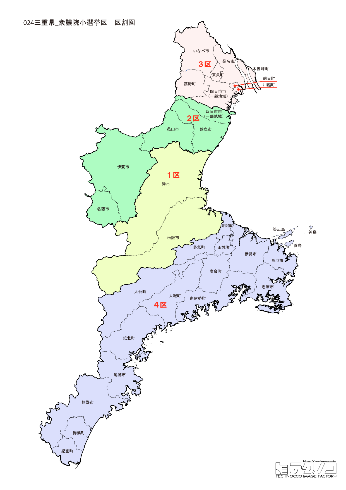

# 三重県



---

## 基本情報

三重県は近畿地方に位置し（東海地方に含められることも）、人口は約174万人。県庁所在地は津市。紀伊半島の東側に位置し、伊勢湾に面している。

歴史的には、伊勢神宮が日本の神道の中心として2,000年以上の歴史を持つ。「お伊勢参り」は江戸時代に庶民の憧れであった。忍者の里・伊賀、松阪牛の産地・松阪など、特色ある地域を持つ。

経済的には、石油化学コンビナートが四日市に集積。伊勢えび、松阪牛、的矢かきなど海の幸・山の幸が豊富。真珠養殖発祥の地でもある。

---

## 三重県の政治的争点

### 伊勢神宮と観光振興

伊勢神宮を核とした観光振興が県経済の重要な柱。インバウンド対応とオーバーツーリズム対策が課題。

### 石油化学産業の転換

四日市の石油化学コンビナートは脱炭素への対応が求められている。

### 人口減少と過疎対策

東紀州地域を中心に人口減少が深刻。医療、交通など生活インフラの維持が課題。

---

## 選挙の特徴

三重県の衆議院小選挙区は4つ（2022年の区割り変更で5から4に減少）。

自民党と野党が拮抗する地域で、2024年の衆院選では4選挙区中、自民党と立憲民主党が2選挙区ずつ勝利した。特に3区の岡田克也（元民主党代表、立憲民主党元幹事長）は盤石の地盤を持ち、野党の重鎮として全国的に知られている。

**2026年選挙の構図**: 中道改革連合（立憲+公明の新党）と自民党・維新連立が拮抗する激戦県。岡田克也の3区は中道の牙城として盤石だが、他の選挙区では接戦が予想される。

---

## 第1区

### 地域構成

三重1区は津市、松阪市で構成される。県庁所在地と松阪牛の産地。

- **津市**: 人口約27万人の県庁所在地。津城跡は藤堂高虎が築いた城。うなぎが名物で、うなぎ消費量日本一とも言われる。

- **松阪市**: 松阪牛の産地として世界的に有名。松阪城跡、本居宣長記念館など歴史的見どころも多い。

### 選挙区の特徴

県庁所在地・津市と松阪牛の産地・松阪市を含む選挙区。田村憲久（元厚生労働大臣、コロナ対策の陣頭指揮を執った）が9期連続当選を果たす自民党の地盤。医療政策に詳しい田村の動向は注目されている。

### 2024年選挙結果

```
田村憲久（自民）         ███████████████████░  57.6%  107,926票 ✅当選
福森和歌子（立憲）        ███████████░░░░░░░░░  34.0%   63,770票 🔄比例
出口洋介（共産）         ██░░░░░░░░░░░░░░░░░░   8.4%   15,776票 
──────────────────────────────────────────────────────────
投票率: 54.9% ｜ 票差: 44,156票（23.5pt差）
```

### 2026年選挙の構図

田村憲久（自民・現職、63歳）と中道改革連合候補の対決。

---

## 第2区

### 地域構成

三重2区は四日市市の一部、鈴鹿市、名張市、亀山市、伊賀市で構成される。北勢・伊賀地域。

- **鈴鹿市**: 鈴鹿サーキットがあり、F1日本グランプリ、鈴鹿8耐など国際的なモータースポーツイベントが開催される。本田技研工業の工場もある。

- **伊賀市**: 伊賀流忍者の里として知られる。伊賀上野城、伊賀流忍者博物館がある。松尾芭蕉の生誕地でもある。

### 選挙区の特徴

F1日本グランプリが開催される鈴鹿サーキットや忍者の里・伊賀市を含む選挙区。川崎秀人（自民）が勝利し、自民党優勢。モータースポーツと忍者という特色ある文化を持つ地域。

### 2024年選挙結果

```
下野幸助（立憲）         ██████████████░░░░░░  42.0%   90,930票 ✅当選
川崎秀人（自民）         █████████████░░░░░░░  39.7%   85,863票 🔄比例
森口あゆみ（維新）        ███░░░░░░░░░░░░░░░░░  11.0%   23,904票 
山本里香（共産）         ██░░░░░░░░░░░░░░░░░░   7.3%   15,753票 
──────────────────────────────────────────────────────────
投票率: 55.7% ｜ 票差: 5,067票（2.3pt差）
```

### 2026年選挙の構図

川崎秀人（自民・現職）と中道改革連合候補の対決。

---

## 第3区

### 地域構成

三重3区は四日市市の大部分、桑名市、いなべ市、木曽岬町、東員町、菰野町、朝日町、川越町で構成される。北勢地域。

- **四日市市**: 人口約31万人で県内最大の都市。石油化学コンビナートがあり、かつては四日市ぜんそくの公害問題があったが、現在は環境改善が進んでいる。

- **桑名市**: 桑名城下町で、しぐれ蛤が名物。なばなの里は花のテーマパークとして人気。長島スパーランドは東海地方最大の遊園地。

- **菰野町**: 御在所岳があり、ロープウェイで山頂に登れる。湯の山温泉は開湯1,300年の歴史を持つ。

### 選挙区の特徴

県内最大の都市・四日市市を含む選挙区。岡田克也（元外務大臣、元民主党代表、立憲民主党元幹事長）が11期連続当選を果たす盤石の地盤を持つ。野党の重鎮として全国的に知られ、無風区に近い状況が続いている。

### 2024年選挙結果

```
岡田克也（立憲）         ████████████████████  60.9%  137,953票 ✅当選
石原正敬（自民）         ████████░░░░░░░░░░░░  25.0%   56,630票 
伊藤昌志（維新）         ████░░░░░░░░░░░░░░░░  14.1%   31,998票 
──────────────────────────────────────────────────────────
投票率: 56.6% ｜ 票差: 81,323票（35.9pt差）
```

### 2026年選挙の構図

岡田克也（立憲→中道改革連合・現職、72歳）は盤石の地盤を持つ。

---

## 第4区

### 地域構成

三重4区は伊勢市、尾鷲市、鳥羽市、熊野市、志摩市、多気町、明和町、大台町、玉城町、度会町、大紀町、南伊勢町、紀北町、御浜町、紀宝町で構成される。伊勢志摩と東紀州地域。

- **伊勢市**: 伊勢神宮の門前町。内宮、外宮は年間約800万人が参拝する。おかげ横丁は江戸時代の町並みを再現した参道で、赤福餅、伊勢うどんが名物。

- **鳥羽市**: 真珠養殖発祥の地。ミキモト真珠島、鳥羽水族館がある。

- **志摩市**: 2016年に伊勢志摩サミットが開催された。英虞湾のリアス式海岸が美しく、真珠養殖が盛ん。

- **熊野市**: 熊野古道の一部が通り、世界遺産に登録されている。花窟神社は日本最古の神社とも言われる。

### 選挙区の特徴

伊勢神宮を含む伊勢志摩と熊野古道が通る東紀州を含む広大な選挙区。中川正春（元文部科学大臣）が9期連続当選を果たす野党優勢の選挙区。観光資源が豊富だが、過疎化が進む地域も含む。

### 2024年選挙結果

```
鈴木英敬（自民）         ████████████████████  60.2%   96,619票 ✅当選
青沼陽一郎（立憲）        ███████████░░░░░░░░░  33.2%   53,360票 
中川民英（共産）         ██░░░░░░░░░░░░░░░░░░   6.6%   10,548票 
──────────────────────────────────────────────────────────
投票率: 58.0% ｜ 票差: 43,259票（26.9pt差）
```

### 2026年選挙の構図

中川正春（立憲→中道改革連合・現職、74歳）と自民党候補の対決。

---
