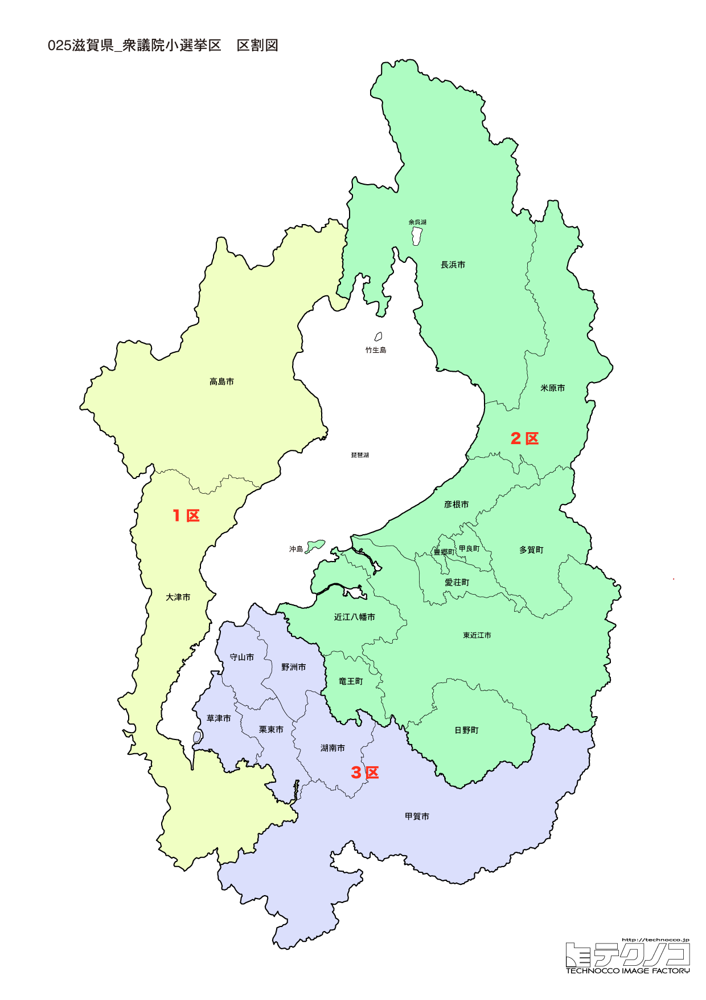

# 滋賀県



---

## 基本情報

滋賀県は近畿地方に位置し、人口は約141万人。県庁所在地は大津市。県の中央に日本最大の湖・琵琶湖があり、県の面積の約6分の1を占める。

歴史的には、東海道・中山道の交通の要衝として栄えた。彦根藩の井伊家、近江商人など、歴史的な遺産が豊富。比叡山延暦寺は天台宗の総本山として1,200年以上の歴史を持つ。

経済的には、京都・大阪のベッドタウンとして人口が増加してきた数少ない県。製造業も盛んで、特に電子部品・デバイス産業が集積。近江牛は日本三大和牛の一つ。

---

## 滋賀県の政治的争点

### 琵琶湖の環境保全

日本最大の湖・琵琶湖の水質保全、外来種対策が重要な課題。京阪神の水がめとしての役割も大きい。

### 交通インフラ

北陸新幹線の敦賀延伸による影響、湖西線の利便性向上などが議論されている。

### ベッドタウンとしての発展

京都・大阪へのアクセスの良さから人口が増加してきたが、今後の発展戦略が課題。

---

## 選挙の特徴

滋賀県の衆議院小選挙区は3つ（2022年の区割り変更で4から3に減少）。自民党と野党が拮抗する地域で、2024年の衆院選では自民党が2選挙区、国民民主党が1選挙区を獲得した。

京都・大阪へのアクセスが良いベッドタウンとして人口が増加してきた県であり、新住民と旧住民の意識の違いが選挙結果に影響することもある。琵琶湖の環境保全は県民共通の関心事となっている。

**2026年選挙の構図**: 2026年1月27日公示、2月8日投票の衆院選では、与党は自民党と日本維新の会の連立（高市早苗首相）に対し、立憲民主党と公明党が合流した「中道改革連合」（共同代表：野田佳彦、斉藤鉄夫）が挑戦者として対峙する。元公明党議員は小選挙区から撤退し比例に専念。滋賀県では国民民主党の斎藤アレックスが1区で地盤を持ち、自民党・維新連立と中道改革連合の三つ巴の構図となる可能性がある。

---

## 第1区

### 地域構成

滋賀1区は大津市、高島市で構成される。県庁所在地と琵琶湖西岸。

- **大津市**: 人口約34万人の県庁所在地。比叡山延暦寺は世界遺産で、最澄が開いた天台宗の総本山。石山寺は紫式部が「源氏物語」を執筆したと伝わる。琵琶湖大橋、びわ湖バレイなど観光スポットも多い。

- **高島市**: メタセコイア並木が人気の撮影スポット。白鬚神社は琵琶湖に浮かぶ鳥居が幻想的。

### 選挙区の特徴

県庁所在地・大津市と琵琶湖西岸を含む選挙区。斎藤アレックス（国民民主党）が勝利し、国民民主党の地盤となっている。比叡山延暦寺など歴史的な観光資源を持ち、京都に隣接するベッドタウンとしての性格も強い。

### 2024年選挙結果

```
斎藤アレックス（維新）      ██████████████░░░░░░  43.0%   74,126票 ✅当選
大岡敏孝（自民）         █████████████░░░░░░░  40.6%   70,033票 🔄比例
黄野瀬明子（共産）        █████░░░░░░░░░░░░░░░  16.4%   28,359票 
──────────────────────────────────────────────────────────
投票率: 55.1% ｜ 票差: 4,093票（2.4pt差）
```

### 2026年選挙の構図

斎藤アレックス（国民・現職）と自民党・中道改革連合候補の対決。

---

## 第2区

### 地域構成

滋賀2区は彦根市、長浜市、米原市、愛荘町、豊郷町、甲良町、多賀町で構成される。湖東・湖北地域。

- **彦根市**: 彦根城の城下町。彦根城は国宝で、ひこにゃんは人気のゆるキャラ。

- **長浜市**: 豊臣秀吉が最初に城を持った地。黒壁スクエアはガラス工芸の街として観光客に人気。

### 選挙区の特徴

国宝・彦根城と長浜市の黒壁スクエアを含む湖東・湖北地域の選挙区。上野賢一郎（元財務副大臣）が6期連続当選を果たす自民党の地盤。観光資源が豊富で、歴史好きに人気のエリア。

### 2024年選挙結果

```
上野賢一郎（自民）        ██████████████░░░░░░  43.7%   99,347票 ✅当選
平尾道雄（立憲）         █████████░░░░░░░░░░░  28.7%   65,324票 
徳永久志（維新）         █████████░░░░░░░░░░░  27.6%   62,646票 
──────────────────────────────────────────────────────────
投票率: 54.0% ｜ 票差: 34,023票（15.0pt差）
```

### 2026年選挙の構図

上野賢一郎（自民・現職）と野党候補の対決。

---

## 第3区

### 地域構成

滋賀3区は草津市、守山市、栗東市、野洲市で構成される。湖南地域。

- **草津市**: 県内最大の人口を持つ都市で、JR草津駅周辺は商業地域として発展。

- **栗東市**: JRA栗東トレーニングセンターがあり、「馬のまち」として知られる。

### 選挙区の特徴

JRA栗東トレーニングセンターがある「馬のまち」栗東市を含む湖南地域の選挙区。武村展英（自民）が勝利し、自民党優勢。県内最大の人口を持つ草津市など、京都・大阪へのベッドタウンとして発展著しい地域。

### 2024年選挙結果

```
武村展英（自民）         ███████████████░░░░░  45.0%   95,874票 ✅当選
出路真吾（維新）         ██████████░░░░░░░░░░  30.4%   64,628票 
北野裕子（参政）         ████░░░░░░░░░░░░░░░░  12.6%   26,862票 🔄比例
佐藤耕平（共産）         ███░░░░░░░░░░░░░░░░░  12.0%   25,446票 
──────────────────────────────────────────────────────────
投票率: 55.8% ｜ 票差: 31,246票（14.7pt差）
```

### 2026年選挙の構図

武村展英（自民・現職）と野党候補の対決。

---
