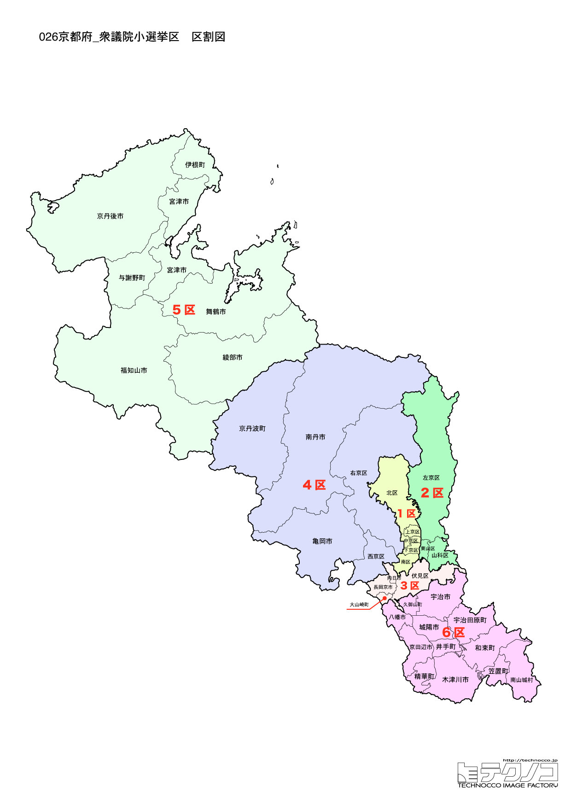

# 京都府



---

## 基本情報

京都府は近畿地方に位置し、人口は約255万人で全国13位。府庁所在地は京都市。794年から1,000年以上にわたって日本の首都であった古都で、世界的な観光地である。

歴史的には、平安京として日本の政治・文化の中心であった。金閣寺、銀閣寺、清水寺、伏見稲荷大社など17の世界遺産を擁する。祇園祭は日本三大祭りの一つ。

経済的には、伝統産業（西陣織、清水焼、京友禅など）と先端産業（京セラ、任天堂、オムロンなど）が共存。観光業も重要で、年間5,000万人以上の観光客が訪れる。

---

## 京都府の政治的争点

### オーバーツーリズム対策

外国人観光客の増加により、一部地域で住民生活への影響が出ている。観光と住民生活の両立が課題。

### 伝統産業の継承

西陣織、清水焼など伝統産業の後継者不足が深刻。文化の継承と産業振興のバランスが求められている。

### 北部地域の振興

京都市に比べて人口減少が進む北部地域（丹後・中丹）の振興策が課題。

---

## 選挙の特徴

京都府の衆議院小選挙区は6つ。共産党が比較的強い地域として知られてきたが、近年は維新の会の進出も見られる。

2024年の衆院選では、自民党が3選挙区、立憲民主党が2選挙区、維新が1選挙区を獲得した。特に2区では前原誠司（元外務大臣、元民主党代表）が国民民主党から維新に移籍して当選し、注目を集めた。3区の泉健太（立憲民主党前代表）は盤石の地盤を持つ。

**2026年選挙の構図**: 2026年1月27日公示、2月8日投票の衆院選では、与党は自民党と日本維新の会の連立（高市早苗首相）に対し、立憲民主党と公明党が合流した「中道改革連合」（共同代表：野田佳彦、斉藤鉄夫）が挑戦者として対峙する。元公明党議員は小選挙区から撤退し比例に専念。京都府は維新が強い近畿地方にあり、前原誠司（維新）と泉健太・山井和則（中道改革連合）の対決が注目される。共産党も一定の支持基盤を持つ地域であり、野党間の票の分散も焦点となる。

---

## 第1区

### 地域構成

京都1区は京都市北区、上京区、中京区、下京区、南区で構成される。京都市の中心部。

- **中京区**: 京都御所、二条城があり、四条河原町は繁華街。錦市場は「京の台所」として知られる。

- **下京区**: 京都駅があり、西本願寺、東本願寺がある。京都タワーは市のシンボル。

### 選挙区の特徴

京都御所、二条城など京都の中心部を含む都市型選挙区。勝目康（自民）が勝利したが、共産党や立憲も一定の支持を持つ激戦区。観光客であふれる繁華街と住民生活の両立が課題となっている地域。

### 2024年選挙結果

```
勝目康（自民）          ██████████░░░░░░░░░░  31.9%   63,057票 ✅当選
堀場幸子（維新）         ██████░░░░░░░░░░░░░░  19.1%   37,876票 
平竹耕三（立憲）         ██████░░░░░░░░░░░░░░  18.3%   36,232票 
井坂博文（共産）         █████░░░░░░░░░░░░░░░  15.2%   29,988票 
安持成美（れいわ）        ██░░░░░░░░░░░░░░░░░░   7.3%   14,531票 
安達悠司（参政）         ██░░░░░░░░░░░░░░░░░░   7.0%   13,825票 
山下博子（無所属）        ░░░░░░░░░░░░░░░░░░░░   1.2%    2,385票 
──────────────────────────────────────────────────────────
投票率: 52.2% ｜ 票差: 25,181票（12.7pt差）
```

### 2026年選挙の構図

勝目康（自民・現職）と中道改革連合・共産党候補との対決。

---

## 第2区

### 地域構成

京都2区は京都市左京区、東山区、山科区で構成される。京都市東部。

- **左京区**: 銀閣寺、南禅寺、平安神宮、下鴨神社など名所が集中。京都大学もある。

- **東山区**: 清水寺、八坂神社、祇園など京都を代表する観光地。

### 選挙区の特徴

銀閣寺、清水寺、祇園など京都を代表する観光地を含む選挙区。前原誠司（元外務大臣、元民主党代表）が国民民主党から維新に移籍して当選し、全国的に注目された。政界再編の象徴的な人物である前原の動向は2026年選挙でも注目される。

### 2024年選挙結果

```
前原誠司（維新）         ███████████████░░░░░  45.9%   60,922票 ✅当選
堀川朗子（共産）         ███████░░░░░░░░░░░░░  23.1%   30,697票 🔄比例
佐野英志（自民）         ███████░░░░░░░░░░░░░  22.3%   29,638票 
小松広明（参政）         ██░░░░░░░░░░░░░░░░░░   6.2%    8,270票 
本田裕典（無所属）        ░░░░░░░░░░░░░░░░░░░░   1.8%    2,450票 
弘田哲雄（無所属）        ░░░░░░░░░░░░░░░░░░░░   0.6%      851票 
──────────────────────────────────────────────────────────
投票率: 53.0% ｜ 票差: 30,225票（22.8pt差）
```

### 2026年選挙の構図

前原誠司（維新・現職、63歳）と中道改革連合・自民党候補の対決。維新の動向に注目。

---

## 第3区

### 地域構成

京都3区は京都市伏見区、向日市、長岡京市、乙訓郡で構成される。京都市南部。

- **伏見区**: 伏見稲荷大社があり、千本鳥居は外国人観光客に最も人気のスポット。伏見は酒どころとしても有名で、月桂冠、黄桜などの蔵元がある。

- **長岡京市**: 長岡天満宮のキリシマツツジが有名。

### 選挙区の特徴

伏見稲荷大社（外国人観光客に最も人気のスポット）を含む京都市南部の選挙区。泉健太（立憲民主党前代表）が8期連続当選を果たす盤石の地盤を持つ。酒どころ伏見を含み、観光と住宅地が混在する地域。

### 2024年選挙結果

```
泉健太（立憲）          ███████████████░░░░░  47.2%   82,823票 ✅当選
森干晟（自民）          ███████░░░░░░░░░░░░░  22.0%   38,632票 
木村元紀（維新）         ████░░░░░░░░░░░░░░░░  14.2%   24,948票 
西山頌秀（共産）         ███░░░░░░░░░░░░░░░░░  10.8%   19,002票 
吉田真由美（参政）        █░░░░░░░░░░░░░░░░░░░   5.7%    9,916票 
──────────────────────────────────────────────────────────
投票率: 51.2% ｜ 票差: 44,191票（25.2pt差）
```

### 2026年選挙の構図

泉健太（立憲→中道改革連合・現職、50歳）は盤石の地盤を持つ。

---

## 第4区

### 地域構成

京都4区は京都市右京区、西京区、亀岡市、南丹市、京丹波町で構成される。京都市西部と丹波地域。

- **右京区**: 嵐山、天龍寺、龍安寺、仁和寺など観光名所が多い。嵯峨野のトロッコ列車は人気。

- **亀岡市**: 保津川下り、湯の花温泉で知られる。

### 選挙区の特徴

嵐山、龍安寺、仁和寺など観光名所が多い京都市西部と丹波地域を含む選挙区。田中英之（自民）が勝利し、自民党優勢。保津川下りで有名な亀岡市など、自然豊かな地域も含む。

### 2024年選挙結果

```
北神圭朗（無所属）        █████████████████░░░  51.2%  102,063票 ✅当選
田中英之（自民）         ██████████░░░░░░░░░░  30.1%   59,897票 
吉田幸一（共産）         ██████░░░░░░░░░░░░░░  18.7%   37,174票 
──────────────────────────────────────────────────────────
投票率: 52.7% ｜ 票差: 42,166票（21.2pt差）
```

### 2026年選挙の構図

田中英之（自民・現職）と中道改革連合候補の対決。

---

## 第5区

### 地域構成

京都5区は福知山市、舞鶴市、綾部市、宮津市、京丹後市、与謝郡で構成される。丹後・中丹地域。

- **舞鶴市**: 海上自衛隊舞鶴地方隊があり、「海軍のまち」として知られる。赤れんが倉庫群が観光名所。舞鶴港は中国・韓国航路がある。

- **天橋立**（宮津市）: 日本三景の一つ。股のぞきで見る景色は絶景。

### 選挙区の特徴

日本三景・天橋立や海上自衛隊舞鶴地方隊がある丹後・中丹地域を含む選挙区。本田太郎（自民）が勝利し、自民党優勢。京都市に比べて人口減少が進む地域であり、地方振興が重要な課題。

### 2024年選挙結果

```
本田太郎（自民）         ███████████████░░░░░  46.3%   57,455票 ✅当選
山本和嘉子（立憲）        ████████░░░░░░░░░░░░  26.1%   32,355票 
道本隆也（維新）         █████░░░░░░░░░░░░░░░  16.4%   20,387票 
山内健（共産）          ███░░░░░░░░░░░░░░░░░  11.2%   13,831票 
──────────────────────────────────────────────────────────
投票率: 55.6% ｜ 票差: 25,100票（20.2pt差）
```

### 2026年選挙の構図

本田太郎（自民・現職）と野党候補の対決。

---

## 第6区

### 地域構成

京都6区は宇治市、城陽市、八幡市、京田辺市、木津川市、久御山町、井手町、宇治田原町、笠置町、和束町、精華町、南山城村で構成される。山城地域。

- **宇治市**: 宇治茶の産地として世界的に有名。平等院鳳凰堂は10円硬貨のデザインで知られる国宝。宇治上神社も世界遺産。

- **木津川市**: 奈良に近く、歴史的な寺社が多い。

### 選挙区の特徴

平等院鳳凰堂（10円硬貨のデザイン）や宇治茶の産地を含む山城地域の選挙区。山井和則（立憲民主党重鎮）が9期連続当選を果たす野党の地盤。奈良に近い歴史的な地域であり、厚生労働政策に詳しい山井の動向は注目されている。

### 2024年選挙結果

```
山井和則（立憲）         █████████████░░░░░░░  40.1%   97,542票 ✅当選
園崎弘道（自民）         ████████░░░░░░░░░░░░  26.8%   65,152票 
中嶋秀樹（維新）         █████░░░░░░░░░░░░░░░  15.9%   38,590票 
上條亮一（共産）         ██░░░░░░░░░░░░░░░░░░   8.8%   21,405票 
安藤裕（参政）          ██░░░░░░░░░░░░░░░░░░   8.4%   20,480票 
──────────────────────────────────────────────────────────
投票率: 54.5% ｜ 票差: 32,390票（13.3pt差）
```

### 2026年選挙の構図

山井和則（立憲→中道改革連合・現職、63歳）と自民党候補の対決。

---
