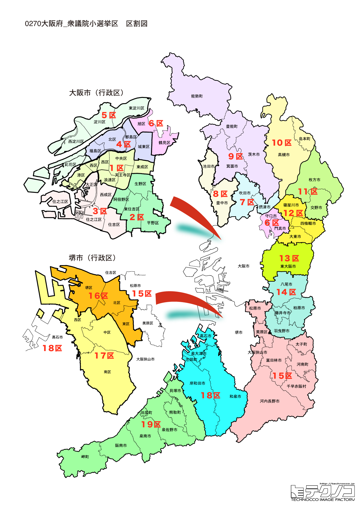

# 大阪府



---

## 基本情報

大阪府は近畿地方に位置し、人口は約880万人で全国3位。府庁所在地は大阪市。「天下の台所」として商業の中心として発展してきた。

歴史的には、豊臣秀吉が大阪城を築いて以来、日本の経済の中心地であった。江戸時代は米相場が立ち、日本経済の要であった。道頓堀、新世界など独特の文化が花開いた。

経済的には、パナソニック、シャープ、サントリーなど大企業の本社が多い。2025年には大阪・関西万博が開催予定。食い倒れの街として、たこ焼き、お好み焼き、串カツなど粉もん文化が有名。

---

## 大阪府の政治的争点

### 2025年大阪・関西万博

2025年4月から10月まで夢洲で開催される万博の成功が最大の課題。費用増大、準備の遅れなどが議論されている。

### 大阪都構想と府市一体

2度の住民投票で否決された大阪都構想だが、府市一体の行政運営は継続されている。

### カジノ・IR（統合型リゾート）

夢洲でのIR開業に向けた準備が進んでいるが、ギャンブル依存症対策などが議論されている。

---

## 選挙の特徴

大阪府の衆議院小選挙区は19。日本維新の会の本拠地として維新が圧倒的に強い。

2024年の衆院選では19選挙区中、維新が13選挙区で勝利し、公明党が3選挙区、自民党が3選挙区にとどまった。大阪都構想を推進してきた維新は、府政・市政でも圧倒的な影響力を持っており、2025年大阪・関西万博を控えて注目が集まっている。

---

## 第1区

### 地域構成

大阪1区は大阪市中央区、西区、港区、天王寺区、浪速区で構成される。大阪市の中心部。

- **中央区**: 大阪城、大阪府庁、心斎橋、道頓堀がある大阪の中心。グリコの看板は道頓堀のシンボル。

- **天王寺区**: 四天王寺、天王寺動物園がある。あべのハルカスは日本一高いビル（300m）。

### 選挙区の特徴

大阪城、道頓堀、心斎橋など大阪の中心部を含む都市型選挙区。井上英孝（維新）が5期連続当選を果たす維新の地盤。観光客で賑わう繁華街を含み、維新の象徴的な選挙区の一つ。

### 2024年選挙結果

```
井上英孝（維新）         ████████████████░░░░  48.2%  102,113票 ✅当選
大西宏幸（自民）         ████████░░░░░░░░░░░░  26.6%   56,347票 
竹内祥倫（共産）         ████░░░░░░░░░░░░░░░░  12.9%   27,312票 
宮出千慧（参政）         ████░░░░░░░░░░░░░░░░  12.2%   25,908票 
──────────────────────────────────────────────────────────
投票率: 49.3% ｜ 票差: 45,766票（21.6pt差）
```

### 2026年選挙の構図

井上英孝（維新・現職）と自民党・中道改革連合候補の対決。

---

## 第2区

### 地域構成

大阪2区は大阪市生野区、阿倍野区、東住吉区、平野区で構成される。大阪市南東部。

- **生野区**: コリアンタウンがあり、多文化共生のまち。

- **阿倍野区**: あべのハルカス、あべのキューズモールなど商業施設が集積。

### 選挙区の特徴

コリアンタウンがある生野区など多文化共生のまちを含む大阪市南東部の選挙区。守島正（維新）が勝利し、維新優勢。あべのハルカス周辺の商業地域も含む。

### 2024年選挙結果

```
守島正（維新）          ██████████████░░░░░░  44.2%   99,277票 ✅当選
左藤章（自民）          ██████████░░░░░░░░░░  30.2%   67,833票 
小川陽太（共産）         ████░░░░░░░░░░░░░░░░  12.4%   27,853票 
藤田美季（参政）         ██░░░░░░░░░░░░░░░░░░   8.9%   19,893票 
堀内孝雄（無所属）        █░░░░░░░░░░░░░░░░░░░   4.4%    9,796票 
──────────────────────────────────────────────────────────
投票率: 52.5% ｜ 票差: 31,444票（14.0pt差）
```

### 2026年選挙の構図

守島正（維新・現職）と各党候補の対決。

---

## 第3区

### 地域構成

大阪3区は大阪市大正区、住之江区、住吉区、西成区で構成される。大阪市南部。

- **住吉区**: 住吉大社があり、初詣には200万人以上が参拝する。

- **西成区**: あいりん地区があり、かつての日雇い労働者の街。近年は観光地化も進む。

### 選挙区の特徴

住吉大社やあいりん地区を含む大阪市南部の選挙区。佐藤茂樹（公明党重鎮）が10期連続当選を果たす公明党の地盤。中道改革連合結成後、維新との関係が注目される。

### 2024年選挙結果

```
東徹（維新）           █████████████░░░░░░░  41.3%   74,546票 ✅当選
佐藤茂樹（公明）         █████████░░░░░░░░░░░  28.9%   52,107票 
萩原仁（立憲）          ████░░░░░░░░░░░░░░░░  12.7%   22,878票 
渡部結（共産）          ████░░░░░░░░░░░░░░░░  12.3%   22,218票 
中条栄太郎（無所属）       █░░░░░░░░░░░░░░░░░░░   4.8%    8,726票 
──────────────────────────────────────────────────────────
投票率: 51.9% ｜ 票差: 22,439票（12.4pt差）
```

### 2026年選挙の構図

佐藤茂樹（公明→中道改革連合・現職）と維新候補の対決。

---

## 第4区

### 地域構成

大阪4区は大阪市北区、都島区、福島区、此花区で構成される。大阪市北部。

- **北区**: 梅田、大阪駅周辺のターミナル。グランフロント大阪、阪急百貨店など商業施設が集積。

- **此花区**: ユニバーサル・スタジオ・ジャパン（USJ）がある。

### 選挙区の特徴

梅田のターミナルやUSJを含む大阪市北部の選挙区。美延映夫（維新）が勝利し、維新優勢。商業の中心地・梅田と観光の目玉・USJを含む、大阪を代表する地域。

### 2024年選挙結果

```
美延映夫（維新）         ██████████████░░░░░░  43.1%   94,129票 ✅当選
中山泰秀（自民）         █████████░░░░░░░░░░░  29.5%   64,424票 
清水忠史（共産）         █████░░░░░░░░░░░░░░░  15.4%   33,585票 
黒川洋司（参政）         ███░░░░░░░░░░░░░░░░░   9.2%   20,038票 
寺川幸生栄（無所属）       ░░░░░░░░░░░░░░░░░░░░   2.8%    6,008票 
──────────────────────────────────────────────────────────
投票率: 54.4% ｜ 票差: 29,705票（13.6pt差）
```

### 2026年選挙の構図

美延映夫（維新・現職）と各党候補の対決。

---

## 第5区

### 地域構成

大阪5区は大阪市西淀川区、淀川区、東淀川区で構成される。大阪市北部。

- **淀川区**: 新大阪駅があり、東海道新幹線の拠点。

### 選挙区の特徴

新大阪駅を含む大阪市北部の選挙区。国重徹（公明党）が5期連続当選を果たす公明党の地盤。中道改革連合結成後、維新との関係が注目される。

### 2024年選挙結果

```
梅村聡（維新）          █████████████░░░░░░░  39.9%   87,100票 ✅当選
國重徹（公明）          ██████████░░░░░░░░░░  30.2%   65,872票 
大石晃子（れいわ）        ████░░░░░░░░░░░░░░░░  12.3%   26,789票 🔄比例
宮本岳志（共産）         ███░░░░░░░░░░░░░░░░░  11.2%   24,480票 
石橋篤史（参政）         ██░░░░░░░░░░░░░░░░░░   6.4%   14,054票 
──────────────────────────────────────────────────────────
投票率: 52.0% ｜ 票差: 21,228票（9.7pt差）
```

### 2026年選挙の構図

国重徹（公明→中道改革連合・現職）と維新候補の対決。

---

## 第6区

### 地域構成

大阪6区は大阪市旭区、城東区、鶴見区で構成される。大阪市東部。

- **鶴見区**: 花博記念公園鶴見緑地がある。

### 選挙区の特徴

花博記念公園鶴見緑地を含む大阪市東部の選挙区。伊東信久（維新）が勝利し、維新優勢。住宅地が広がる地域で、維新支持層が厚い。

### 2024年選挙結果

```
西田薫（維新）          █████████████░░░░░░░  39.3%   77,905票 ✅当選
伊佐進一（公明）         ███████████░░░░░░░░░  34.9%   69,058票 
福留陽子（立憲）         ███░░░░░░░░░░░░░░░░░  10.0%   19,877票 
渡司考一（共産）         ██░░░░░░░░░░░░░░░░░░   8.2%   16,205票 
月足舞子（参政）         ██░░░░░░░░░░░░░░░░░░   7.6%   15,016票 
──────────────────────────────────────────────────────────
投票率: 52.7% ｜ 票差: 8,847票（4.5pt差）
```

### 2026年選挙の構図

伊東信久（維新・現職）と各党候補の対決。

---

## 第7区

### 地域構成

大阪7区は吹田市、摂津市で構成される。北摂地域。

- **吹田市**: 万博記念公園、太陽の塔がある。ガンバ大阪のホームスタジアム（パナソニックスタジアム吹田）もある。

### 選挙区の特徴

万博記念公園と太陽の塔を含む北摂地域の選挙区。奥下剛光（維新）が勝利し、維新優勢。2025年大阪・関西万博を控え、万博記念公園周辺への注目が高まっている。

### 2024年選挙結果

```
奥下剛光（維新）         ██████████████░░░░░░  44.5%   95,367票 ✅当選
渡嘉敷奈緒美（自民）       ██████████░░░░░░░░░░  31.0%   66,435票 
川添健真（共産）         █████░░░░░░░░░░░░░░░  15.1%   32,368票 
池上和日子（参政）        ███░░░░░░░░░░░░░░░░░   9.3%   19,941票 
──────────────────────────────────────────────────────────
投票率: 56.7% ｜ 票差: 28,932票（13.5pt差）
```

### 2026年選挙の構図

奥下剛光（維新・現職）と自民党・中道改革連合候補の対決。

---

## 第8区

### 地域構成

大阪8区は豊中市、池田市で構成される。北摂地域。

- **豊中市**: 大阪国際空港（伊丹空港）の一部がある。服部緑地は大阪を代表する緑地公園。

- **池田市**: チキンラーメン発祥の地。カップヌードルミュージアム大阪池田がある。

### 選挙区の特徴

大阪国際空港（伊丹空港）とチキンラーメン発祥の地・池田市を含む北摂地域の選挙区。漆間譲司（維新）が勝利し、維新優勢。高所得層が多い住宅地として知られる。

### 2024年選挙結果

```
漆間譲司（維新）         ████████████░░░░░░░░  36.6%   84,503票 ✅当選
高麗啓一郎（自民）        █████████░░░░░░░░░░░  28.8%   66,582票 
平岩征樹（国民）         █████░░░░░░░░░░░░░░░  17.6%   40,552票 🔄比例
平川節代（共産）         ███░░░░░░░░░░░░░░░░░  10.5%   24,277票 
谷浩一郎（参政）         ██░░░░░░░░░░░░░░░░░░   6.6%   15,197票 
──────────────────────────────────────────────────────────
投票率: 56.3% ｜ 票差: 17,921票（7.8pt差）
```

### 2026年選挙の構図

漆間譲司（維新・現職）と自民党・中道改革連合候補の対決。

---

## 第9区

### 地域構成

大阪9区は茨木市、箕面市、能勢町、豊能町で構成される。北摂地域。

- **箕面市**: 箕面滝、箕面公園が紅葉の名所。もみじの天ぷらが名物。

- **茨木市**: 大阪モノレール沿線で発展。

### 選挙区の特徴

紅葉の名所・箕面公園を含む北摂地域の選挙区。足立康史（維新の論客）が5期連続当選を果たす維新の地盤。国会質疑で知られる足立の動向は全国的に注目されている。

### 2024年選挙結果

```
萩原佳（維新）          ██████████████░░░░░░  42.6%   84,068票 ✅当選
東田淳平（自民）         ██████████░░░░░░░░░░  31.5%   62,170票 
長崎由美子（社民）        ████░░░░░░░░░░░░░░░░  14.0%   27,617票 
片岡真（参政）          ███░░░░░░░░░░░░░░░░░  10.0%   19,690票 
磯部和哉（無所属）        ░░░░░░░░░░░░░░░░░░░░   2.0%    3,962票 
──────────────────────────────────────────────────────────
投票率: 54.8% ｜ 票差: 21,898票（11.1pt差）
```

### 2026年選挙の構図

足立康史（維新・現職）と自民党・中道改革連合候補の対決。

---

## 第10区

### 地域構成

大阪10区は高槻市、三島郡で構成される。北摂地域。

- **高槻市**: 今城塚古墳、高槻城跡がある。JR新快速が停車し、大阪・京都の中間に位置する。

### 選挙区の特徴

大阪と京都の中間に位置する高槻市を含む北摂地域の選挙区。池下卓（維新）が勝利し、維新優勢。JR新快速が停車する交通の要衝で、ベッドタウンとして発展。

### 2024年選挙結果

```
池下卓（維新）          ██████████████░░░░░░  44.1%   79,621票 ✅当選
尾辻かな子（立憲）        ██████████░░░░░░░░░░  32.7%   58,971票 🔄比例
加納陽之助（自民）        ███████░░░░░░░░░░░░░  23.2%   41,838票 
──────────────────────────────────────────────────────────
投票率: 58.5% ｜ 票差: 20,650票（11.5pt差）
```

### 2026年選挙の構図

池下卓（維新・現職）と各党候補の対決。

---

## 第11区

### 地域構成

大阪11区は枚方市、交野市で構成される。北河内地域。

- **枚方市**: ひらかたパーク（ひらパー）が有名。枚方宿は東海道五十六次の宿場町。

### 選挙区の特徴

ひらかたパーク（ひらパー）で有名な枚方市を含む北河内地域の選挙区。中司宏（維新）が勝利し、維新優勢。大阪市のベッドタウンとして発展した地域。

### 2024年選挙結果

```
中司宏（維新）          ██████████████████░░  55.6%  115,411票 ✅当選
大辻沙耶（自民）         █████████░░░░░░░░░░░  28.7%   59,557票 
北尾学（共産）          █████░░░░░░░░░░░░░░░  15.8%   32,733票 
──────────────────────────────────────────────────────────
投票率: 55.0% ｜ 票差: 55,854票（26.9pt差）
```

### 2026年選挙の構図

中司宏（維新・現職）と各党候補の対決。

---

## 第12区

### 地域構成

大阪12区は寝屋川市、大東市、四條畷市で構成される。北河内地域。

### 選挙区の特徴

寝屋川市を含む北河内地域の選挙区。藤田文武（日本維新の会幹事長）が勝利し、維新の重要拠点。党幹事長として維新の組織運営を担う藤田の動向は全国的に注目されている。

### 2024年選挙結果

```
藤田文武（維新）         █████████████████░░░  52.4%   86,380票 ✅当選
北川晋平（自民）         ███████████░░░░░░░░░  33.7%   55,658票 
太田徹（共産）          ████░░░░░░░░░░░░░░░░  13.9%   22,970票 
──────────────────────────────────────────────────────────
投票率: 51.1% ｜ 票差: 30,722票（18.6pt差）
```

### 2026年選挙の構図

藤田文武（維新・現職、45歳）と各党候補の対決。維新の幹事長として注目。

---

## 第13区

### 地域構成

大阪13区は東大阪市、八尾市の一部で構成される。中河内地域。

- **東大阪市**: 中小企業のものづくりの街。ラグビーの聖地・花園ラグビー場がある。

### 選挙区の特徴

ラグビーの聖地・花園ラグビー場がある東大阪市を含む中河内地域の選挙区。岩谷良平（維新）が勝利し、維新優勢。中小企業のものづくりの街として知られる。

### 2024年選挙結果

```
岩谷良平（維新）         █████████████░░░░░░░  41.9%   79,898票 ✅当選
宗清皇一（自民）         ████████████░░░░░░░░  36.5%   69,600票 
八幡愛（れいわ）         ███░░░░░░░░░░░░░░░░░  11.8%   22,482票 🔄比例
寳井晃美（共産）         ███░░░░░░░░░░░░░░░░░   9.8%   18,657票 
──────────────────────────────────────────────────────────
投票率: 49.5% ｜ 票差: 10,298票（5.4pt差）
```

### 2026年選挙の構図

岩谷良平（維新・現職）と各党候補の対決。

---

## 第14区

### 地域構成

大阪14区は八尾市の大部分、柏原市、羽曳野市、藤井寺市で構成される。中南河内地域。

- **藤井寺市**: 藤井寺球場跡、道明寺天満宮がある。古市古墳群は世界遺産。

### 選挙区の特徴

世界遺産・古市古墳群を含む中南河内地域の選挙区。青柳仁士（維新）が勝利し、維新優勢。歴史的な遺産と住宅地が混在する地域。

### 2024年選挙結果

```
青柳仁士（維新）         ███████████████░░░░░  45.2%   95,362票 ✅当選
塩川憲史（自民）         ███████████░░░░░░░░░  33.9%   71,539票 
内藤耕一（共産）         ████░░░░░░░░░░░░░░░░  12.6%   26,534票 
榮井蘭菜（参政）         ██░░░░░░░░░░░░░░░░░░   8.4%   17,708票 
──────────────────────────────────────────────────────────
投票率: 52.4% ｜ 票差: 23,823票（11.3pt差）
```

### 2026年選挙の構図

青柳仁士（維新・現職）と自民党候補の対決。

---

## 第15区

### 地域構成

大阪15区は堺市堺区、北区、東区、美原区で構成される。堺市北部。

- **堺市**: 人口約83万人の政令指定都市。仁徳天皇陵古墳（大仙古墳）は世界遺産。自転車、刃物、線香など伝統産業がある。

### 選挙区の特徴

世界遺産・仁徳天皇陵古墳（大仙古墳）を含む堺市北部の選挙区。浦野靖人（維新）が5期連続当選を果たす維新の地盤。堺市は維新の大阪都構想で議論の焦点となった地域。

### 2024年選挙結果

```
浦野靖人（維新）         █████████████░░░░░░░  41.3%   77,584票 ✅当選
島田智明（自民）         ███████████░░░░░░░░░  33.2%   62,351票 🔄比例
松浦武志（立憲）         █████░░░░░░░░░░░░░░░  15.4%   28,868票 
仲川学（共産）          ███░░░░░░░░░░░░░░░░░  10.2%   19,133票 
──────────────────────────────────────────────────────────
投票率: 50.9% ｜ 票差: 15,233票（8.1pt差）
```

### 2026年選挙の構図

浦野靖人（維新・現職）と各党候補の対決。

---

## 第16区

### 地域構成

大阪16区は堺市西区、南区、中区で構成される。堺市南部。

### 選挙区の特徴

堺市南部を含む選挙区。北側一雄（公明党重鎮、元国土交通大臣）が11期連続当選を果たす公明党の地盤。中道改革連合結成後、維新との関係が注目される。

### 2024年選挙結果

```
黒田征樹（維新）         ████████████░░░░░░░░  37.3%   63,288票 ✅当選
山本香苗（公明）         ██████████░░░░░░░░░░  32.7%   55,474票 
森山浩行（立憲）         ██████████░░░░░░░░░░  30.0%   50,943票 🔄比例
──────────────────────────────────────────────────────────
投票率: 54.1% ｜ 票差: 7,814票（4.6pt差）
```

### 2026年選挙の構図

北側一雄（公明→中道改革連合・現職、71歳）と維新候補の対決。

---

## 第17区

### 地域構成

大阪17区は堺市の一部、松原市、大阪狭山市、富田林市、河内長野市、太子町、河南町、千早赤阪村で構成される。南河内地域。

- **河内長野市**: 観心寺、金剛寺など古刹が多い。

### 選挙区の特徴

南河内地域を含む選挙区。馬場伸幸（日本維新の会代表）が5期連続当選を果たす維新の象徴的な選挙区。党代表として維新の顔となる馬場の動向は全国的に注目されている。

### 2024年選挙結果

```
馬場伸幸（維新）         █████████████████░░░  52.3%   82,234票 ✅当選
岡下昌平（自民）         █████████░░░░░░░░░░░  29.2%   45,904票 
沢田久美子（共産）        ██████░░░░░░░░░░░░░░  18.5%   29,130票 
──────────────────────────────────────────────────────────
投票率: 50.5% ｜ 票差: 36,330票（23.1pt差）
```

### 2026年選挙の構図

馬場伸幸（維新・現職、59歳）と各党候補の対決。維新代表として注目。

---

## 第18区

### 地域構成

大阪18区は岸和田市、泉大津市、和泉市、高石市、忠岡町で構成される。泉北地域。

- **岸和田市**: だんじり祭りで全国的に有名。勇壮な曳行は毎年多くの見物客を集める。

### 選挙区の特徴

だんじり祭りで全国的に有名な岸和田市を含む泉北地域の選挙区。遠藤敬（日本維新の会国対委員長）が5期連続当選を果たす維新の地盤。国会対策を担う遠藤の動向は注目されている。

### 2024年選挙結果

```
遠藤敬（維新）          █████████████████░░░  51.2%   99,973票 ✅当選
内田隆嗣（自民）         ███████░░░░░░░░░░░░░  23.8%   46,366票 
馬場英樹（共産）         ████░░░░░░░░░░░░░░░░  14.2%   27,675票 
松岡能礼（参政）         ███░░░░░░░░░░░░░░░░░  10.8%   21,086票 
──────────────────────────────────────────────────────────
投票率: 47.7% ｜ 票差: 53,607票（27.5pt差）
```

### 2026年選挙の構図

遠藤敬（維新・現職）と各党候補の対決。

---

## 第19区

### 地域構成

大阪19区は貝塚市、泉佐野市、泉南市、阪南市、熊取町、田尻町、岬町で構成される。泉南地域。

- **泉佐野市**: 関西国際空港の対岸。りんくうプレミアム・アウトレットがある。

### 選挙区の特徴

関西国際空港の対岸に位置する泉南地域の選挙区。谷川とむ（自民）が勝利し、大阪では数少ない自民党勝利の選挙区。維新が圧倒的な大阪で自民党が議席を守った注目区。

### 2024年選挙結果

```
伊東信久（維新）         ███████████████░░░░░  45.1%   65,726票 ✅当選
谷川とむ（自民）         █████████████░░░░░░░  41.8%   60,879票 
北村みき（共産）         ████░░░░░░░░░░░░░░░░  13.0%   18,966票 
──────────────────────────────────────────────────────────
投票率: 50.4% ｜ 票差: 4,847票（3.3pt差）
```

### 2026年選挙の構図

谷川とむ（自民・現職）と維新候補の対決。

---
