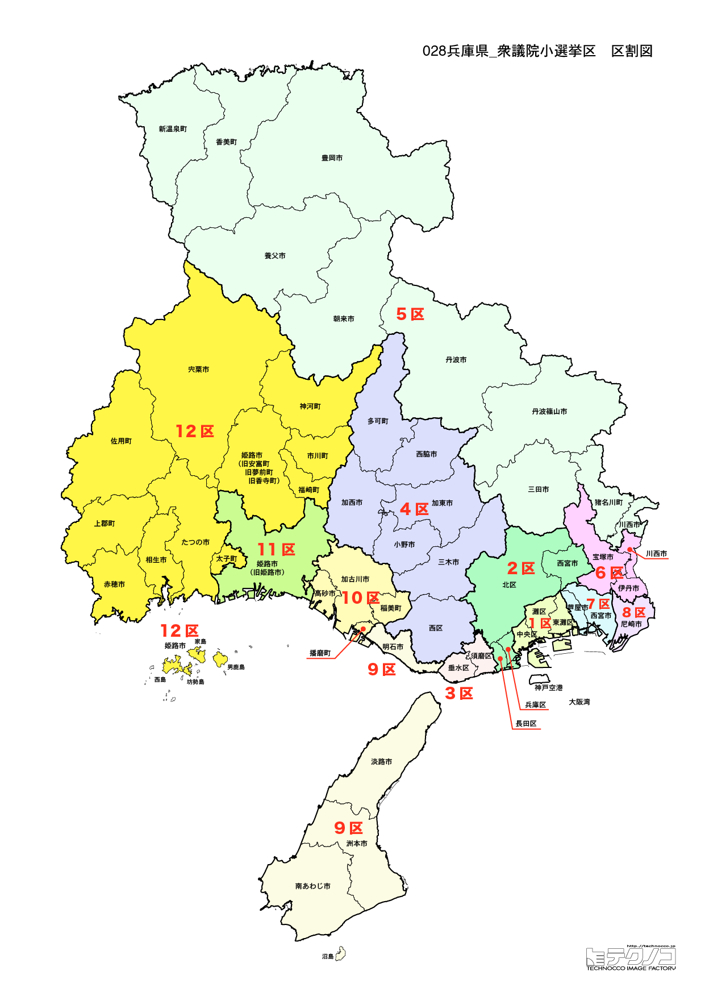

# 兵庫県

---

## 基本情報

兵庫県は近畿地方に位置し、人口は約544万人で全国7位。県庁所在地は神戸市。日本海と瀬戸内海の両方に面する唯一の県で、多様な地域性を持つ。

歴史的には、神戸港は幕末に開港した5港の一つで、異国情緒あふれる街として発展した。姫路城は日本初の世界遺産で、「白鷺城」として知られる。1995年の阪神・淡路大震災は甚大な被害をもたらしたが、復興を遂げた。

経済的には、神戸牛、丹波篠山の黒豆、明石のタコなど食の魅力が豊富。川崎重工業、神戸製鋼所など重工業も盛ん。宝塚歌劇団は世界的に有名なエンターテインメント。

---

## 兵庫県の政治的争点

### 斎藤知事問題

2024年に斎藤元彦知事をめぐるパワハラ疑惑、職員の死亡問題が全国的に注目された。知事不信任決議後の出直し選挙で再選されたが、議論は続いている。

### 阪神・淡路大震災の教訓

1995年の震災から30年近くが経過し、震災の記憶の継承と防災対策の充実が課題。

### 維新の台頭

大阪に隣接する地域を中心に維新が勢力を拡大しており、県政・国政への影響が注目されている。

---

## 選挙の特徴

兵庫県の衆議院小選挙区は12。2024年の衆院選では維新が6選挙区、自民党が4選挙区、立憲民主党が2選挙区を獲得した。

大阪に隣接する地域を中心に維新が勢力を拡大しており、2024年の斎藤元彦知事をめぐる騒動は全国的に注目を集めた。維新と自民党の対立軸が明確になりつつあり、2026年選挙でも両者の勢力争いが焦点となる。

---

## 第1区

### 地域構成

兵庫1区は神戸市東灘区、灘区、中央区で構成される。神戸市の中心部と東部。

**中央区**は三宮、元町、神戸港、メリケンパーク、ポートタワーがある神戸の中心。南京町は日本三大中華街の一つ。

**灘区**は灘の酒蔵が並ぶ酒どころ。王子動物園がある。

### 選挙区の特徴

神戸市の中心部を含む都市型選挙区。盛山正仁（自民、文部科学大臣経験者）が5期連続当選を果たす。旧統一教会問題で話題になったが、議席を守った。維新の台頭を受け、2026年は激戦が予想される。

### 2024年選挙結果

| 候補者 | 党派 | 結果 |
|--------|------|------|
| 盛山正仁 | 自民 | **当選**（5選） |

盛山正仁は文部科学大臣を務めたが、旧統一教会問題で話題になった。

### 2026年選挙の構図

盛山正仁（自民・現職）と維新・中道改革連合候補の対決。

---

## 第2区

### 地域構成

兵庫2区は神戸市兵庫区、北区、長田区で構成される。神戸市北部・西部。

**北区**は有馬温泉があり、日本三古湯の一つとして知られる。六甲山も区内に広がる。

**長田区**はケミカルシューズの産地。阪神・淡路大震災で大きな被害を受けた地域。

### 選挙区の特徴

有馬温泉を含む神戸市北部・西部の選挙区。2024年は元国土交通大臣の赤羽一嘉（公明）が維新候補に敗れる波乱が起きた。公明党の牙城が崩れたことは、維新の勢力拡大を象徴する出来事となった。

### 2024年選挙結果

| 候補者 | 党派 | 結果 |
|--------|------|------|
| 赤羽一嘉 | 公明 | 落選 |

元国土交通大臣の赤羽一嘉が維新候補に敗れる波乱。

### 2026年選挙の構図

維新候補と中道改革連合・自民党候補の対決。

---

## 第3区

### 地域構成

兵庫3区は神戸市須磨区、垂水区で構成される。神戸市西南部。

**須磨区**は須磨海浜公園、須磨離宮公園がある。源平合戦の舞台としても知られる。

**垂水区**は明石海峡大橋のたもとにあり、アウトレットモールが人気。

### 選挙区の特徴

明石海峡大橋を望む神戸市西南部の選挙区。和田有一朗（維新）が勝利し、維新優勢。源平合戦の舞台である須磨を含む歴史的な地域でもある。

### 2024年選挙結果

| 候補者 | 党派 | 結果 |
|--------|------|------|
| 和田有一朗 | 維新 | **当選** |

### 2026年選挙の構図

和田有一朗（維新・現職）と各党候補の対決。

---

## 第4区

### 地域構成

兵庫4区は神戸市西区、西脇市、三木市、小野市、加西市、加東市、多可町で構成される。神戸市西区と東播磨北部。

**三木市**は金物の産地として有名。三木金物まつりは多くの人で賑わう。

### 選挙区の特徴

金物の産地・三木市を含む神戸市西区と東播磨北部の選挙区。藤井比早之（自民）が勝利し、自民党優勢。都市部と農村部が混在する地域で、維新の浸透が進みつつある。

### 2024年選挙結果

| 候補者 | 党派 | 結果 |
|--------|------|------|
| 藤井比早之 | 自民 | **当選** |

### 2026年選挙の構図

藤井比早之（自民・現職）と維新候補の対決。

---

## 第5区

### 地域構成

兵庫5区は豊岡市、養父市、朝来市、香美町、新温泉町で構成される。但馬地域。

**豊岡市**は城崎温泉、コウノトリで有名。城崎温泉は外湯めぐりが楽しめる。

**朝来市**は竹田城跡が「天空の城」として人気。雲海に浮かぶ城跡は絶景。

### 選挙区の特徴

城崎温泉や竹田城跡（「天空の城」）を含む但馬地域の選挙区。谷公一（元復興大臣）が8期連続当選を果たす自民党の地盤。人口減少が進む地方部であり、地域振興が重要な課題。

### 2024年選挙結果

| 候補者 | 党派 | 結果 |
|--------|------|------|
| 谷公一 | 自民 | **当選**（8選） |

谷公一は元復興大臣。

### 2026年選挙の構図

谷公一（自民・現職）と野党候補の対決。

---

## 第6区

### 地域構成

兵庫6区は伊丹市、宝塚市、川西市、猪名川町で構成される。阪神北部。

**宝塚市**は宝塚歌劇団の本拠地。宝塚大劇場での公演は全国からファンが訪れる。手塚治虫記念館もある。

**伊丹市**は大阪国際空港（伊丹空港）がある。清酒発祥の地とも言われる。

### 選挙区の特徴

宝塚歌劇団の本拠地・宝塚市を含む阪神北部の選挙区。市村浩一郎（維新）が勝利し、維新優勢。大阪に隣接する地域であり、維新支持層が厚い。

### 2024年選挙結果

| 候補者 | 党派 | 結果 |
|--------|------|------|
| 市村浩一郎 | 維新 | **当選** |

### 2026年選挙の構図

市村浩一郎（維新・現職）と自民党・中道改革連合候補の対決。

---

## 第7区

### 地域構成

兵庫7区は西宮市、芦屋市で構成される。阪神間の高級住宅地。

**西宮市**は甲子園球場があり、高校野球の聖地。西宮神社は「えべっさん」として知られ、福男選びが有名。

**芦屋市**は日本有数の高級住宅地。六麓荘町は「日本のビバリーヒルズ」とも呼ばれる。

### 選挙区の特徴

甲子園球場がある西宮市と高級住宅地・芦屋市を含む阪神間の選挙区。山田賢司（自民）が勝利し、自民党優勢。高所得層が多い住宅地として知られるが、維新の浸透が進んでいる。

### 2024年選挙結果

| 候補者 | 党派 | 結果 |
|--------|------|------|
| 山田賢司 | 自民 | **当選** |

### 2026年選挙の構図

山田賢司（自民・現職）と維新・中道改革連合候補の対決。

---

## 第8区

### 地域構成

兵庫8区は尼崎市で構成される。大阪に隣接する工業都市。

**尼崎市**は人口約45万人で県内4位。かつては工業都市として発展し、現在は住宅都市への転換が進む。尼崎城は2019年に再建された。

### 選挙区の特徴

大阪に隣接する工業都市・尼崎市を含む選挙区。一谷勇一郎（維新）が勝利し、維新優勢。大阪との結びつきが強く、維新支持層が厚い地域。

### 2024年選挙結果

| 候補者 | 党派 | 結果 |
|--------|------|------|
| 一谷勇一郎 | 維新 | **当選** |

### 2026年選挙の構図

一谷勇一郎（維新・現職）と各党候補の対決。

---

## 第9区

### 地域構成

兵庫9区は明石市、洲本市、南あわじ市、淡路市で構成される。東播磨南部と淡路島。

**明石市**は明石海峡大橋のたもとにあり、明石焼き（玉子焼き）が名物。日本標準時子午線が通る。

**淡路島**は古事記で「国生みの島」とされる神話の島。淡路夢舞台、淡路ファームパークなど観光施設が多い。

### 選挙区の特徴

明石市と淡路島を含む選挙区。西村康稔（元経済産業大臣、元コロナ対策担当大臣）が8期連続当選を果たす自民党の重鎮。経済政策に詳しい西村の動向は全国的に注目されている。

### 2024年選挙結果

| 候補者 | 党派 | 結果 |
|--------|------|------|
| 西村康稔 | 自民 | **当選**（8選） |

西村康稔は元経済産業大臣で、コロナ対策担当大臣を務めた。

### 2026年選挙の構図

西村康稔（自民・現職、62歳）と維新候補の対決。

---

## 第10区

### 地域構成

兵庫10区は加古川市、高砂市、稲美町、播磨町で構成される。東播磨地域。

**加古川市**は加古川の流域に発展した都市。靴下の生産量日本一。

**高砂市**は高砂神社が結婚式の聖地として知られる。「高砂や」の謡曲で有名。

### 選挙区の特徴

加古川市を含む東播磨地域の選挙区。2024年は元文部科学大臣の渡海紀三朗（自民）が維新候補に敗れる波乱が起きた。自民党の地盤が崩れつつあり、維新の勢力拡大が顕著な選挙区。

### 2024年選挙結果

| 候補者 | 党派 | 結果 |
|--------|------|------|
| 渡海紀三朗 | 自民 | 落選 |

元文部科学大臣の渡海紀三朗が維新候補に敗れる。

### 2026年選挙の構図

維新候補と自民党・中道改革連合候補の対決。

---

## 第11区

### 地域構成

兵庫11区は姫路市で構成される。播磨の中心都市。

**姫路市**は人口約53万人で県内2位。姫路城は日本初の世界遺産で、「白鷺城」として知られる。書写山圓教寺は映画「ラストサムライ」のロケ地。

### 選挙区の特徴

世界遺産・姫路城を含む播磨の中心都市・姫路市の選挙区。松本剛明（元外務大臣）が8期連続当選を果たす自民党の地盤。姫路城を核とした観光振興が地域経済の柱となっている。

### 2024年選挙結果

| 候補者 | 党派 | 結果 |
|--------|------|------|
| 松本剛明 | 自民 | **当選**（8選） |

松本剛明は元外務大臣。

### 2026年選挙の構図

松本剛明（自民・現職）と維新候補の対決。

---

## 第12区

### 地域構成

兵庫12区は相生市、たつの市、赤穂市、宍粟市、神崎郡、揖保郡、赤穂郡、佐用町で構成される。西播磨地域。

**赤穂市**は忠臣蔵で有名な赤穂義士のふるさと。赤穂城跡、大石神社がある。赤穂の塩は全国的に知られる。

**たつの市**は醤油の産地。龍野城下町の風情が残る。

### 選挙区の特徴

忠臣蔵で有名な赤穂市や醤油の産地・たつの市を含む西播磨地域の選挙区。山口壮（元環境大臣、立憲）が勝利し、野党優勢。歴史的な地域で、自民党以外の候補が強い珍しい選挙区。

### 2024年選挙結果

| 候補者 | 党派 | 結果 |
|--------|------|------|
| 山口壮 | 立憲 | **当選** |

山口壮は元環境大臣。

### 2026年選挙の構図

山口壮（立憲→中道改革連合・現職）と自民党・維新候補の対決。

---
