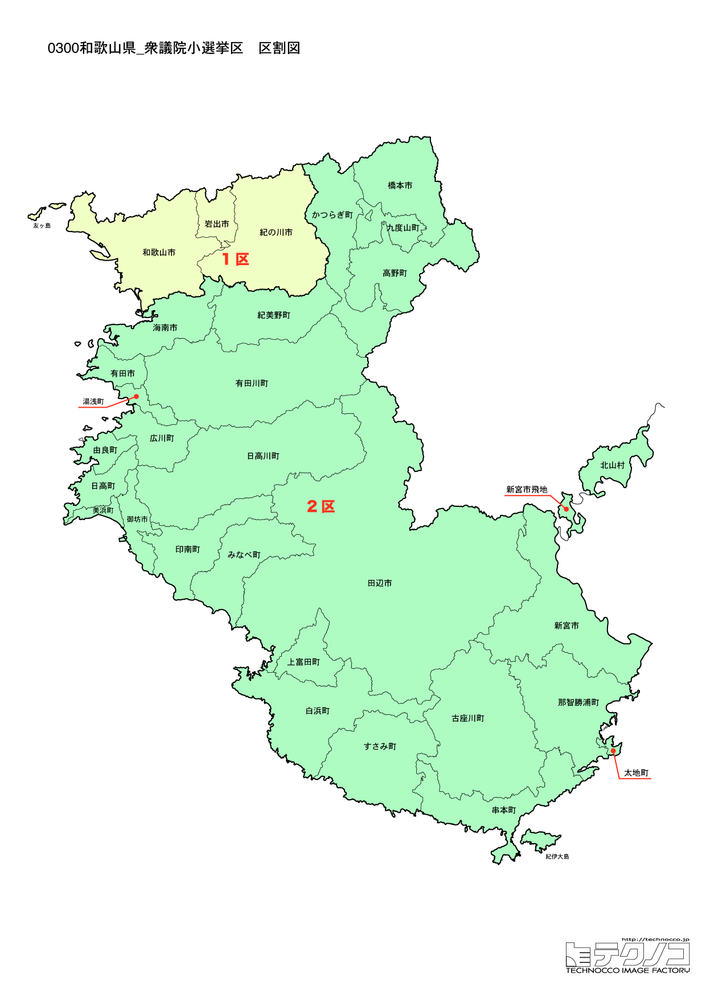

# 和歌山県



---

## 基本情報

和歌山県は近畿地方の南西部に位置し、人口は約91万人。県庁所在地は和歌山市。紀伊半島の南西部を占め、熊野古道など世界遺産を擁する自然豊かな県である。

歴史的には、熊野三山への参詣道「熊野古道」が世界遺産に登録されている。高野山は空海が開いた真言宗の総本山で、1,200年の歴史を持つ。紀州徳川家の城下町として栄えた。

経済的には、みかん、梅（南高梅）、柿の生産量日本一。熊野牛、クエなど食の魅力も豊富。白浜温泉、勝浦温泉など温泉リゾートも人気。

---

## 和歌山県の政治的争点

### 人口減少と過疎対策

県全体で人口減少が進み、特に県南部の熊野地域での過疎化が深刻。若者の県外流出を食い止める施策が求められている。

### 観光振興

熊野古道、高野山、白浜など観光資源が豊富だが、交通アクセスの改善やインバウンド対応が課題。

### 南海トラフ地震対策

南海トラフ地震で大きな被害が予想される地域であり、防災対策が重要な課題。

---

## 選挙の特徴

和歌山県の衆議院小選挙区は2つ（2022年の区割り変更で3から2に減少）。

自民党が強い保守的な地域だが、2024年の衆院選では無所属の岡本周平が1区で勝利し、自民党・二階俊博（元幹事長）が2区で勝利した。二階は87歳で現役最高齢の衆議院議員であり、その去就が2026年選挙の最大の注目点となっている。

**2026年選挙の構図**: 2026年1月27日公示、2月8日投票の衆院選では、与党は自民党と日本維新の会の連立（高市早苗首相）に対し、立憲民主党と公明党が合流した「中道改革連合」（共同代表：野田佳彦、斉藤鉄夫）が挑戦者として対峙する。元公明党議員は小選挙区から撤退し比例に専念。和歌山県は自民党が強い保守地盤だが、維新も近畿地方で勢力を拡大しており、自民・維新連立と中道改革連合の対決となる。2区の二階俊博元幹事長の動向と後継問題が引き続き注目される。

---

## 第1区

### 地域構成

和歌山1区は和歌山市、橋本市、かつらぎ町、九度山町、高野町で構成される。県北部。

- **和歌山市**: 人口約35万人の県庁所在地。和歌山城は紀州徳川家の居城。和歌山ラーメンは豚骨醤油の濃厚なスープが特徴。友ヶ島は「ラピュタの島」として人気の観光スポット。

- **高野山**（高野町）: 空海が開いた真言宗の総本山。金剛峯寺、奥之院など見どころが多く、宿坊体験もできる。世界遺産「紀伊山地の霊場と参詣道」の一部。

- **九度山町**: 真田幸村が隠棲した地として知られる。真田庵、真田ミュージアムがある。

### 選挙区の特徴

県庁所在地・和歌山市と世界遺産・高野山を含む県北部の選挙区。岸本周平（元国民民主党、無所属）が勝利し、既成政党への不満を背景に議席を獲得。高野山への参詣客や和歌山ラーメンで知られる地域。

### 2024年選挙結果

```
山本大地（自民）         ████████████░░░░░░░░  36.2%   70,869票 ✅当選
林佑美（維新）          ████████████░░░░░░░░  36.2%   70,745票 🔄比例
門博文（自民）          ██████████████░░░░░░  42.8%   55,657票 
村上賀厚（立憲）         ████░░░░░░░░░░░░░░░░  12.8%   25,067票 
井本有一（共産）         ██░░░░░░░░░░░░░░░░░░   7.0%   13,665票 
林元将崇（参政）         ██░░░░░░░░░░░░░░░░░░   6.9%   13,422票 
国重秀明（共産）         ██░░░░░░░░░░░░░░░░░░   8.6%   11,178票 
正司武（心の党）         ░░░░░░░░░░░░░░░░░░░░   0.9%    1,749票 
山本貴平（政治家女子48党）   ░░░░░░░░░░░░░░░░░░░░   1.1%    1,476票 
──────────────────────────────────────────────────────────
投票率: 51.3% ｜ 票差: 124票（0.1pt差）
```

### 2026年選挙の構図

```
山本大地（自民・前職、34歳）           当選1回
林ゆみ（国民・前職、44歳）            当選2回
浦平よしひろ（維新・新人、54歳）
かなめゆきこ（中道改革連合・新人、49歳）
前ひさし（共産・新人、69歳）
林元政子（参政・新人、51歳）
正司武（心の党・新人、75歳）
```

2024年に124票差で激戦を制した山本大地（自民）が前職として再選を目指す。比例復活当選した林ゆみが国民民主党から出馬し、維新の浦平よしひろも参戦。中道改革連合はかなめゆきこを擁立。7人の乱戦模様で、自民・国民・維新・中道の四つ巴の様相。

---

## 第2区

### 地域構成

和歌山2区は海南市、有田市、御坊市、田辺市、新宮市、紀の川市、岩出市、有田郡、日高郡、西牟婁郡、東牟婁郡で構成される。県中南部の広大な地域。

- **白浜町**: 白浜温泉、アドベンチャーワールド（パンダで有名）、白良浜など観光リゾート。

- **熊野古道**: 紀伊半島を縦断する参詣道で、世界遺産に登録されている。熊野本宮大社、熊野速玉大社、熊野那智大社の熊野三山を結ぶ。那智の滝は日本三名瀑の一つ。

- **田辺市**: 面積が和歌山県で最大。南方熊楠の故郷としても知られる。

- **南高梅**（みなべ町、田辺市）: 日本一の梅の産地。梅干し、梅酒の原料として全国に出荷される。

### 選挙区の特徴

世界遺産・熊野古道、白浜温泉、アドベンチャーワールド（パンダで有名）など観光資源が豊富な県中南部の広大な選挙区。二階俊博（元自民党幹事長、衆院当選13回）が87歳で現役最高齢の衆議院議員として君臨。引退の可能性も取り沙汰されており、後継問題が2026年選挙の最大の焦点。

### 2024年選挙結果

```
世耕弘成（無所属）        ██████████████░░░░░░  44.0%  101,739票 ✅当選
二階伸康（自民）         ██████████░░░░░░░░░░  30.8%   71,114票 
新古祐子（立憲）         ████░░░░░░░░░░░░░░░░  14.3%   33,147票 
楠本文郎（共産）         ██░░░░░░░░░░░░░░░░░░   8.2%   19,062票 
高橋秀彰（鼎立の党）       ░░░░░░░░░░░░░░░░░░░░   2.6%    6,033票 
──────────────────────────────────────────────────────────
投票率: 62.7% ｜ 票差: 30,625票（13.3pt差）
```

### 2026年選挙の構図

```
せこう弘成（無所属・前職、63歳）        当選1回
畑野よしひろ（共産・新人、65歳）
```

2024年に世耕弘成（参院議員の世耕弘成とは別人）が無所属で初当選。2026年も無所属で再選を目指す。共産の畑野よしひろが挑戦する一騎打ちの構図。二階俊博元幹事長は引退し、後継候補は立てられなかった。

---
