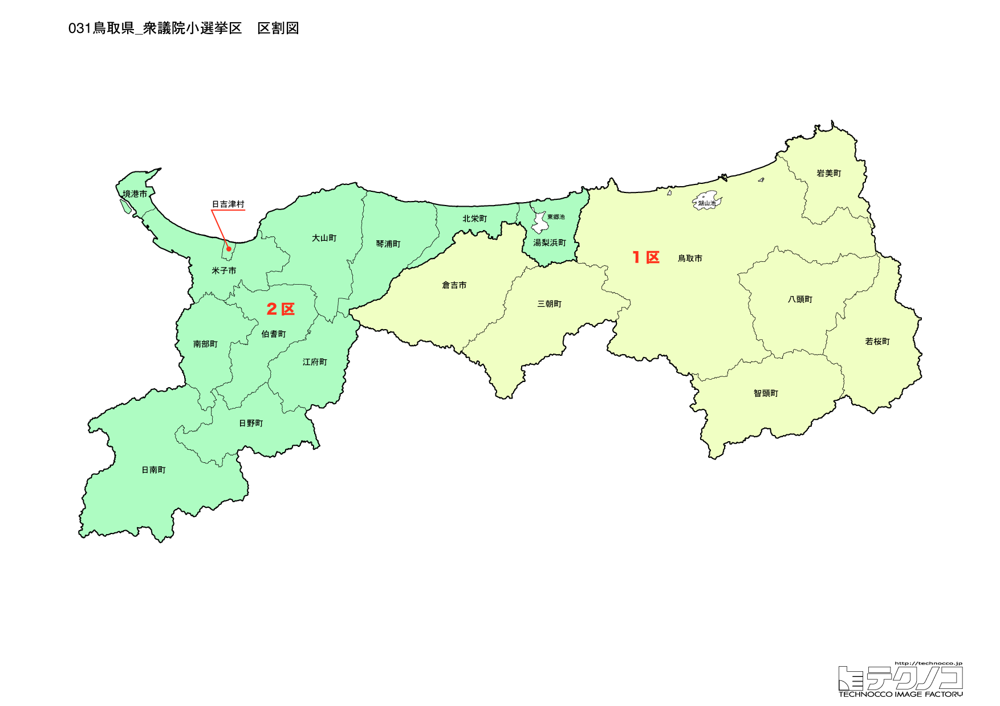

# 鳥取県



---

## 基本情報

鳥取県は中国地方の北東部に位置し、人口は約54万人で全国最少。県庁所在地は鳥取市。日本海に面し、鳥取砂丘が県のシンボル。

歴史的には、因幡の白兎伝説で知られる。鳥取藩32万石の城下町として発展した。大山は中国地方最高峰で、古くから山岳信仰の対象であった。

経済的には、二十世紀梨の生産が有名で、「梨王国」と呼ばれる。らっきょう、松葉ガニも特産品。近年はスタバはないがスナバ（砂場）があるという自虐ネタで話題に。

---

## 鳥取県の政治的争点

### 人口減少対策

全国最少の人口を持つ県として、人口減少対策が最大の課題。移住促進、子育て支援などに力を入れている。

### 地方創生

石破茂元首相が提唱した地方創生の取り組みが地元でどのように実現されるかが注目されている。

### 観光振興

鳥取砂丘、大山、境港など観光資源を活かした振興策が進められている。

---

## 選挙の特徴

鳥取県の衆議院小選挙区は2つ。人口最少県であるため、1票の格差是正の基準となることが多い。

自民党が強い保守的な地域で、2024年の衆院選でも2選挙区とも自民党が勝利した。石破茂元首相の地盤であり、鳥取1区は石破が長年にわたり圧倒的な強さを誇る選挙区である。

2024年の衆院選では、石破茂が首相として選挙を指揮したが、与党は過半数割れを喫した。しかし地元・鳥取では変わらず自民党が2議席を確保している。

**2026年選挙の構図**: 2026年1月27日公示、2月8日投票の衆院選では、立憲民主党と公明党が合流した「中道改革連合」（共同代表：野田佳彦、斉藤鉄夫）が結成され、与党は自民党と日本維新の会の連立（高市早苗首相）となった。元公明党議員は小選挙区から撤退し比例に専念する。鳥取県は自民党の強い保守地盤であり、石破茂元首相の地元として引き続き自民党優位の情勢が予想される。

---

## 第1区

### 地域構成

鳥取1区は鳥取市、岩美町、若桜町、智頭町、八頭町で構成される。県東部（因幡地方）。

- **鳥取市**: 人口約18万人の県庁所在地。鳥取砂丘は日本最大級の砂丘で、らくだに乗れる観光名所。砂の美術館では砂像の展示が行われる。因幡の白兎で知られる白兎神社は縁結びの神様。

- **智頭町**: 智頭杉の産地で、林業のまち。

### 選挙区の特徴

石破茂元首相の牙城であり、全国でも屈指の安定した自民党選挙区。石破は13回連続で当選しており、野党が候補を擁立しても対抗は極めて難しい状況が続いている。地方創生政策の発信地としても注目される。

### 2024年選挙結果

```
石破茂（自民）          ████████████████████  85.2%  106,670票 ✅当選
朝倉浩之（立憲）         ███░░░░░░░░░░░░░░░░░   9.9%   12,389票 
岡田正和（共産）         █░░░░░░░░░░░░░░░░░░░   5.0%    6,220票 
──────────────────────────────────────────────────────────
投票率: 57.2% ｜ 票差: 94,281票（75.3pt差）
```

### 2026年選挙の構図

```
石破茂（自民・前職、69歳）            当選13回
谷川裕美（国民・新人、51歳）          特定行政書士
豊哲也（参政・新人、47歳）            写真会社社長、大山町議
塚田成幸（共産・新人、62歳）          党県書記長
```

2024年に圧勝した石破茂(自民・前職)が14回目の当選を目指す。首相退任後の立場で選挙に臨むが、地元での支持基盤は堅い。国民民主党の谷川裕美(特定行政書士)、参政党の豊哲也(写真会社社長、大山町議)、共産党の塚田成幸の4人の争い。

---

## 第2区

### 地域構成

鳥取2区は米子市、倉吉市、境港市、三朝町、湯梨浜町、琴浦町、北栄町、日吉津村、大山町、南部町、伯耆町、日南町、日野町、江府町で構成される。県西部（伯耆地方）。

- **米子市**: 人口約14万人で県内2位。米子鬼太郎空港は漫画「ゲゲゲの鬼太郎」にちなんで命名。皆生温泉は山陰最大の温泉街。

- **境港市**: 水木しげるの出身地で、水木しげるロードには妖怪のブロンズ像が並ぶ。松葉ガニの水揚げ量日本一。

- **大山**: 中国地方最高峰（1,729m）で、「伯耆富士」と呼ばれる美しい山容。大山寺は古くからの山岳信仰の中心。

- **三朝温泉**（三朝町）: 世界有数のラジウム温泉として知られる。

### 選挙区の特徴

自民党が安定した強さを持つ選挙区。米子市、境港市など県西部の商業・観光都市を含む。大山観光や水木しげるロードなど観光資源が豊富な地域で、観光振興が争点となりやすい。

### 2024年選挙結果

```
赤沢亮正（自民）         ████████████████████  61.8%   81,526票 ✅当選
湯原俊二（立憲）         ███████████░░░░░░░░░  33.1%   43,696票 
福住英行（共産）         █░░░░░░░░░░░░░░░░░░░   5.0%    6,655票 
──────────────────────────────────────────────────────────
投票率: 59.0% ｜ 票差: 37,830票（28.7pt差）
```

### 2026年選挙の構図

```
赤沢亮正（自民・前職、65歳）          当選7回
湯原俊二（中道改革連合・元職、63歳）  当選2回、県議
福住英行（共産・新人、50歳）          党県委員会常任委員
```

2024年に勝利した赤沢亮正(自民・前職)が8回目の当選を目指す。元職の湯原俊二(中道改革連合、元立憲民主党)が再挑戦。共産党の福住英行も加わる3人の争い。赤沢は経済産業相などを歴任し、与党の経済政策を担ってきた。

---
