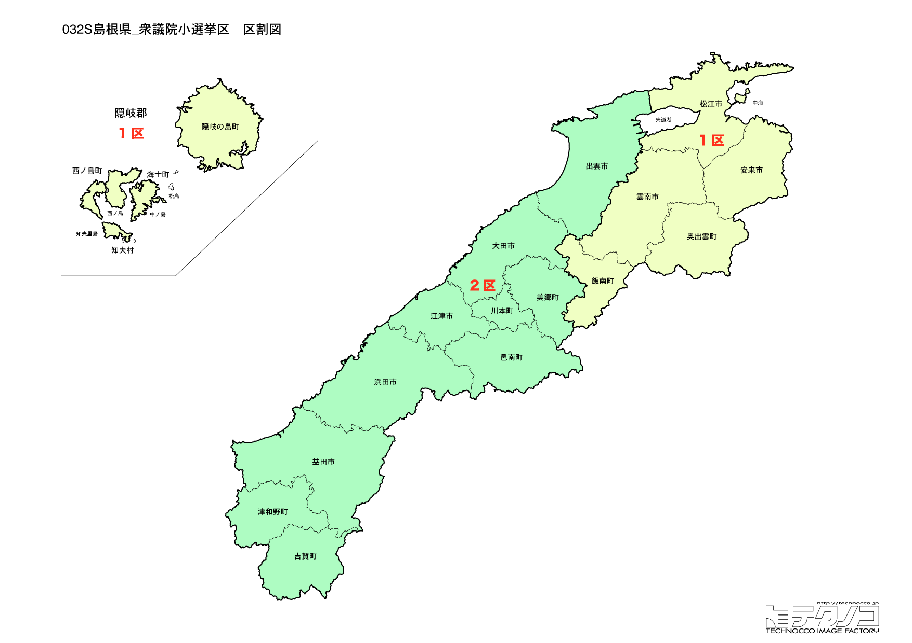

# 島根県



---

## 基本情報

島根県は中国地方の北西部に位置し、人口は約66万人で全国2番目に少ない。県庁所在地は松江市。日本海に面し、出雲大社や石見銀山など歴史的遺産が豊富。

歴史的には、出雲神話の舞台として日本の神話・伝説に深く関わる。石見銀山は戦国時代から江戸時代にかけて世界有数の銀山として栄え、世界遺産に登録されている。松江は松江城を中心とした城下町。

経済的には、しじみ（宍道湖）、のどぐろ、出雲そばなど食の魅力が豊富。隠岐の島は独自の自然と文化を持つ。

---

## 島根県の政治的争点

### 人口減少と過疎対策

全国2番目に人口が少ない県として、人口減少対策が最大の課題。特に中山間地域での過疎化が深刻。

### 原発問題

島根原子力発電所（松江市）の再稼働問題が議論されている。

### 離島振興

隠岐諸島の振興策、航路・航空路の維持が課題。

---

## 選挙の特徴

島根県の衆議院小選挙区は2つ。人口減少が続く中でも選挙区数は維持されているが、1票の格差問題の対象となりやすい。

自民党が強い保守的な地域で、2024年の衆院選でも2選挙区とも自民党が勝利した。細田博之元衆議院議長を輩出するなど、保守政治の伝統が根強い。

2024年には細田博之が死去し、後継者選びが注目される展開となった。

**2026年選挙の構図**: 2026年1月27日公示、2月8日投票の衆院選では、立憲民主党と公明党が合流した「中道改革連合」（共同代表：野田佳彦、斉藤鉄夫）が結成され、与党は自民党と日本維新の会の連立（高市早苗首相）となった。元公明党議員は小選挙区から撤退し比例に専念する。島根県は自民党の強い保守地盤であり、2024年に1区で立憲が勝利したものの、全体としては自民党優位の情勢が続く。

---

## 第1区

### 地域構成

島根1区は松江市、安来市、雲南市、奥出雲町、飯南町で構成される。県東部（出雲地方東部）。

- **松江市**: 人口約20万人の県庁所在地。松江城は現存12天守の一つで国宝。宍道湖は夕日の名所として知られ、しじみの産地。堀川めぐりは城下町の風情を楽しめる。小泉八雲（ラフカディオ・ハーン）が愛した街としても知られる。

- **安来市**: 安来節（どじょうすくい踊り）で有名。足立美術館は日本庭園ランキング20年以上連続日本一。

### 選挙区の特徴

元衆議院議長・細田博之が長年にわたり地盤を築いてきた選挙区。2024年に細田が死去したため、後継者選びが焦点となる。自民党の牙城であり、野党が議席を奪うのは困難な情勢が続いている。

### 2024年選挙結果

```
亀井亜紀子（立憲）        █████████████████░░░  51.1%   73,484票 ✅当選
高階恵美子（自民）        ██████████████░░░░░░  44.0%   63,238票 
錦織功政（自民）         █████████████░░░░░░░  41.2%   57,897票 
村穂江利子（共産）        █░░░░░░░░░░░░░░░░░░░   5.0%    7,142票 
──────────────────────────────────────────────────────────
投票率: 58.1% ｜ 票差: 10,246票（7.1pt差）
```

### 2026年選挙の構図

```
亀井亜紀子（中道改革連合・前職、60歳）      当選3回
高階恵美子（自民・元職、62歳）           当選1回（参議院）
伊藤礼司（参政・新人、42歳）            医療法人理事・管理医師
村穂江利子（共産・新人、57歳）           党県委員会副委員長
```

2024年に小選挙区で勝利した亀井亜紀子(中道改革連合)が再選を目指す。元職の高階恵美子(自民、維新推薦)が元参議院議員として再挑戦、参政党の伊藤礼司(医師)、共産の村穂江利子の4人の争い。2024年補選で細田博之の後継争いを制した亀井氏が優勢だが、高階氏の参院での実績も注目される。

---

## 第2区

### 地域構成

島根2区は出雲市、大田市、浜田市、益田市、江津市、川本町、美郷町、邑南町、津和野町、吉賀町、隠岐の島町、海士町、西ノ島町、知夫村で構成される。県西部と隠岐諸島。

- **出雲市**: 出雲大社があり、縁結びの神様として全国から参拝者が訪れる。神在月（旧暦10月）には全国の神様が集まるとされる。出雲そばは割子そばとして知られる。

- **石見銀山**（大田市）: 戦国時代から江戸時代にかけて世界有数の銀産出量を誇った。2007年に世界遺産に登録。

- **津和野町**: 「山陰の小京都」と呼ばれる城下町。殿町通りの堀には錦鯉が泳ぐ。森鷗外の生誕地。

- **隠岐諸島**: 独自の自然と文化を持つ離島。後鳥羽上皇、後醍醐天皇が流された歴史がある。隠岐ユネスコ世界ジオパークに認定。

### 選挙区の特徴

出雲大社や石見銀山、隠岐諸島など観光・歴史資源が豊富な選挙区。自民党が安定した強さを持つが、離島振興や過疎対策が重要な争点となる。

### 2024年選挙結果

```
高見康裕（自民）         ████████████████████  60.8%   99,829票 ✅当選
大塚聡子（立憲）         ██████████░░░░░░░░░░  30.0%   49,302票 
亀谷優子（共産）         ███░░░░░░░░░░░░░░░░░   9.1%   14,983票 
──────────────────────────────────────────────────────────
投票率: 58.2% ｜ 票差: 50,527票（30.8pt差）
```

### 2026年選挙の構図

```
高見康裕（自民・前職、45歳）            当選2回
大塚聡子（中道改革連合・新人、58歳）     元立憲県連副代表
倉井克幸（参政・新人、43歳）            シャンソン歌手
亀谷優子（共産・新人、39歳）            党県委員会常任委員
```

2024年に小選挙区で勝利した高見康裕(自民、維新推薦)が再選を目指す。元国土交通政務官として実績を持ち、海上自衛官・新聞記者の経歴を持つ。中道改革連合の大塚聡子(元立憲県連副代表)が再挑戦、参政党の倉井克幸、共産の亀谷優子も加わる4人の争い。

---
