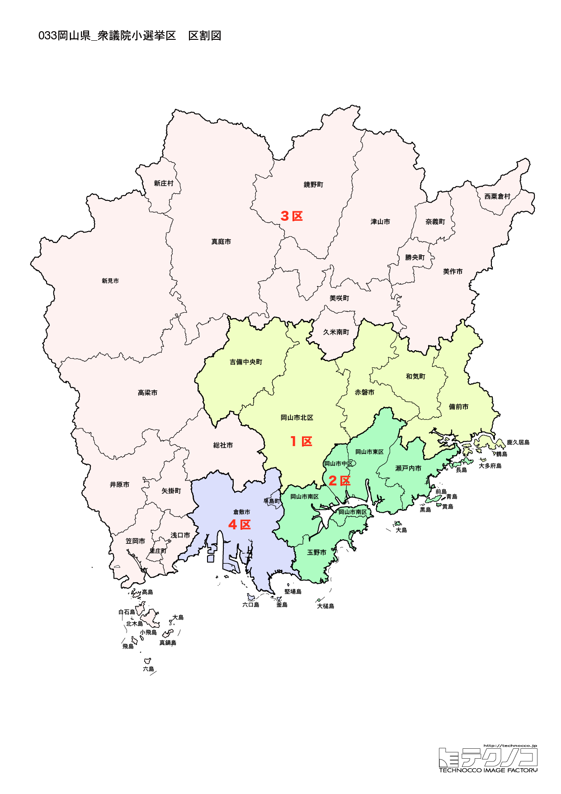

# 岡山県



---

## 基本情報

岡山県は中国地方の南東部に位置し、人口は約187万人で全国20位。県庁所在地は岡山市。瀬戸内海に面し、「晴れの国」として知られる温暖な気候が特徴。

歴史的には、備前、備中、美作の3国からなる。岡山城は「烏城」と呼ばれる黒い城。後楽園は日本三名園の一つ。倉敷美観地区は白壁の蔵造りの街並みが美しい。

経済的には、桃、マスカット、ピオーネなど果物の産地。ままかり、きびだんごが名物。水島工業地帯は石油化学コンビナートが集積。

---

## 岡山県の政治的争点

### 西日本豪雨からの復興

2018年の西日本豪雨で倉敷市真備地区が甚大な被害を受けた。復興とともに防災対策の強化が課題。

### 交通インフラ

岡山空港、瀬戸大橋の活用と、県内交通網の充実が議論されている。

### 農業振興

桃、マスカットなど高品質な果物の生産維持と販路拡大が課題。

---

## 選挙の特徴

岡山県の衆議院小選挙区は5つ。政令指定都市・岡山市と工業都市・倉敷市を擁する中国地方有数の経済県。

自民党が比較的強い地域だが、近年は立憲民主党も議席を確保している。2024年の衆院選では5選挙区中、自民党が3選挙区、立憲民主党が2選挙区を獲得した。

2018年の西日本豪雨で倉敷市真備地区が甚大な被害を受けたことから、防災・復興政策が重要な争点となっている。

---

## 第1区

### 地域構成

岡山1区は岡山市北区の一部、中区、東区、南区で構成される。県庁所在地の中心部。

- **岡山市**: 人口約72万人の政令指定都市。岡山城は「烏城」と呼ばれる黒い天守閣が特徴。後楽園は日本三名園の一つで、岡山城を借景とした庭園美が見事。

### 選挙区の特徴

岡山市中心部を含む都市型選挙区。逢沢一郎が12期連続で当選しており、自民党の牙城となっている。政令指定都市の中心部であり、都市政策や経済活性化が争点となりやすい。

### 2024年選挙結果

```
逢沢一郎（自民）         █████████████░░░░░░░  42.0%   67,710票 ✅当選
原田謙介（立憲）         ██████████░░░░░░░░░░  31.9%   51,535票 
佐々木雄司（国民）        ████░░░░░░░░░░░░░░░░  13.7%   22,152票 
服部千秋（維新）         ██░░░░░░░░░░░░░░░░░░   6.9%   11,094票 
住寄聡美（共産）         █░░░░░░░░░░░░░░░░░░░   5.5%    8,808票 
──────────────────────────────────────────────────────────
投票率: 51.1% ｜ 票差: 16,175票（10.0pt差）
```

### 2026年選挙の構図

逢沢一郎（自民・現職、70歳）と野党候補の対決。

---

## 第2区

### 地域構成

岡山2区は岡山市北区の一部、倉敷市の一部、玉野市、瀬戸内市、赤磐市、早島町、吉備中央町で構成される。岡山市北部と周辺地域。

### 選挙区の特徴

岡山市北部と周辺地域を含む選挙区。山下貴司（元法務大臣）が地盤を持つ。住宅地と農村部が混在しており、地域によって課題が異なる。

### 2024年選挙結果

```
山下貴司（自民）         ███████████████░░░░░  47.7%   95,452票 ✅当選
津村啓介（立憲）         ███████████████░░░░░  45.9%   91,906票 🔄比例
余江雪央（共産）         ██░░░░░░░░░░░░░░░░░░   6.4%   12,762票 
──────────────────────────────────────────────────────────
投票率: 50.2% ｜ 票差: 3,546票（1.8pt差）
```

### 2026年選挙の構図

山下貴司（自民・現職）と野党候補の対決。

---

## 第3区

### 地域構成

岡山3区は津山市、真庭市、美作市、新庄村、鏡野町、勝央町、奈義町、西粟倉村、久米南町、美咲町で構成される。県北部（美作地方）。

- **津山市**: 津山城跡が桜の名所。B'zの稲葉浩志の出身地としても知られる。津山ホルモンうどんはB級グルメとして人気。

- **蒜山高原**（真庭市）: 中国地方を代表する高原リゾート。ジャージー牛の牧場、ひるぜん焼そばが有名。

### 選挙区の特徴

津山市など県北部（美作地方）を含む選挙区。農村・中山間地域が多く、人口減少対策や農業振興が重要な争点。阿部俊子が7期連続で当選している自民党の安定選挙区。

### 2024年選挙結果

```
加藤勝信（自民）         ████████████████████  64.6%  133,389票 ✅当選
はたともこ（立憲）        █████████░░░░░░░░░░░  28.9%   59,781票 
原田亜希子（共産）        ██░░░░░░░░░░░░░░░░░░   6.5%   13,413票 
──────────────────────────────────────────────────────────
投票率: 53.4% ｜ 票差: 73,608票（35.6pt差）
```

### 2026年選挙の構図

阿部俊子（自民・現職）と野党候補の対決。

---

## 第4区

### 地域構成

岡山4区は倉敷市の大部分、総社市、井原市、浅口市、笠岡市、里庄町、矢掛町で構成される。県南西部。

- **倉敷市**: 人口約47万人で県内2位。倉敷美観地区は白壁の蔵造りの街並みが美しく、大原美術館は日本初の西洋美術館。児島はジーンズの聖地として知られる。

- **瀬戸大橋**: 倉敷市（児島）と香川県坂出市を結ぶ世界最大級の橋梁群。

### 選挙区の特徴

倉敷市を中心とする県南西部の選挙区。立憲民主党の柚木道義が6期連続で当選しており、岡山県内では野党が強い選挙区の一つ。2018年の西日本豪雨で真備地区が甚大な被害を受け、復興・防災政策が重要な争点。

### 2024年選挙結果

```
柚木道義（立憲）         ████████████████░░░░  50.3%   89,149票 ✅当選
橋本岳（自民）          ██████████████░░░░░░  42.5%   75,400票 
垣内雄一（共産）         ██░░░░░░░░░░░░░░░░░░   7.1%   12,648票 
──────────────────────────────────────────────────────────
投票率: 46.4% ｜ 票差: 13,749票（7.8pt差）
```

### 2026年選挙の構図

柚木道義（立憲→中道改革連合・現職）と自民党候補の対決。

---

## 第5区

### 地域構成

岡山5区は備前市、高梁市、新見市、和気町で構成される。県東部と県北西部。

- **備前市**: 備前焼の産地として有名。備前焼は日本六古窯の一つで、釉薬を使わない素朴な風合いが特徴。

- **高梁市**: 備中松山城があり、現存12天守の一つ。天空の城として雲海に浮かぶ姿が人気。

### 選挙区の特徴

備前市、高梁市など県東部と県北西部を含む選挙区。立憲民主党の津村啓介が議席を持つ。備前焼の産地や備中松山城（天空の城）など文化・観光資源が豊富な地域。

### 2024年選挙結果

| 候補者 | 党派 | 結果 |
|--------|------|------|
| 津村啓介 | 立憲 | **当選** |

### 2026年選挙の構図

津村啓介（立憲→中道改革連合・現職）と自民党候補の対決。

---
