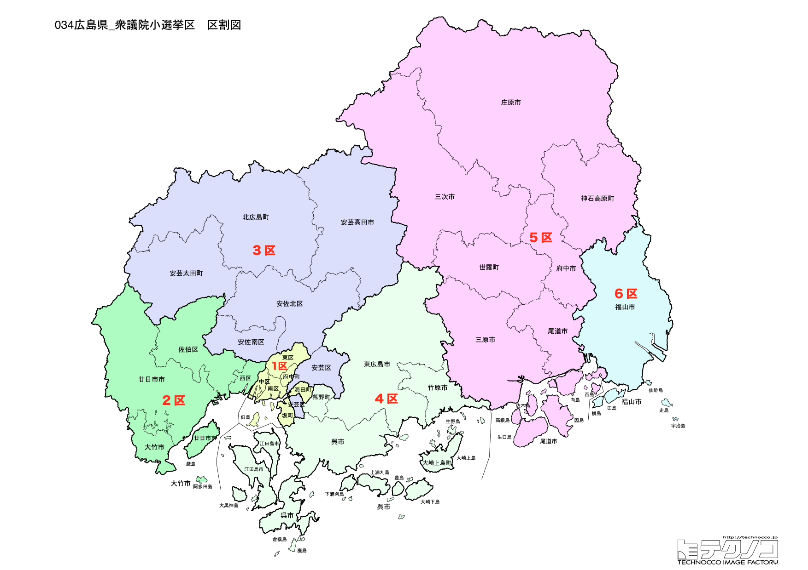

# 広島県



---

## 基本情報

広島県は中国地方の中央南部に位置し、人口は約277万人で全国12位。県庁所在地は広島市。瀬戸内海に面し、原爆ドームと厳島神社の2つの世界遺産を持つ。

歴史的には、毛利氏の本拠地として発展。1945年8月6日に世界初の原子爆弾が投下され、多くの犠牲者を出した。原爆ドーム（広島平和記念碑）は「負の世界遺産」として核廃絶を訴え続けている。

経済的には、マツダ、広島銀行など企業が集積。お好み焼き（広島風）、牡蠣、もみじ饅頭が名物。広島東洋カープ、サンフレッチェ広島は熱狂的なファンを持つ。

---

## 広島県の政治的争点

### 核廃絶と平和

被爆地・広島として、核廃絶と平和の発信が重要な使命。G7広島サミット（2023年）では各国首脳が原爆資料館を訪問した。

### 広島土砂災害からの教訓

2014年の広島土砂災害を教訓とした防災対策の強化が課題。

### 観光振興

原爆ドーム、厳島神社、しまなみ海道など観光資源を活かした振興策が進められている。

---

## 選挙の特徴

広島県の衆議院小選挙区は6つ（2022年の区割り変更で7から6に減少）。岸田文雄前首相の地盤であり、中国地方最大の都市圏を有する。

自民党と野党が拮抗する地域で、2024年の衆院選では6選挙区中、自民党が3選挙区、公明党が1選挙区、野党が2選挙区を獲得した。裏金問題で非公認となった候補が落選するなど、政治とカネの問題が選挙結果に影響を与えた。

被爆地として核廃絶・平和政策が常に重要な争点となる。2023年のG7広島サミットでは各国首脳が原爆資料館を訪問した。

**2026年選挙の構図**: 岸田文雄前首相（1区）の動向に注目。元公明の斉藤鉄夫（3区、中道改革連合共同代表）は小選挙区から撤退し比例に専念、中道は新人を擁立。自民・維新連立vs中道の全面対決。

---

## 第1区

### 地域構成

広島1区は広島市中区、東区、南区で構成される。広島市の中心部。

- **広島市中区**: 原爆ドーム、平和記念公園、広島平和記念資料館がある。毎年8月6日の平和記念式典には多くの人が訪れる。本通りは繁華街。

### 選挙区の特徴

広島市中心部を含む選挙区で、岸田文雄前首相の地盤。原爆ドーム、平和記念公園を擁し、平和政策が特に重要視される。岸田は10期連続で当選しており、自民党の牙城となっている。

### 2024年選挙結果

```
岸田文雄（自民）         █████████████████░░░  52.4%  100,740票 ✅当選
平本浩一（立憲）         ████████░░░░░░░░░░░░  24.2%   46,493票 
山田肇（維新）          ████░░░░░░░░░░░░░░░░  14.0%   26,849票 
中原剛（共産）          ██░░░░░░░░░░░░░░░░░░   6.4%   12,225票 
産原稔文（無所属）        █░░░░░░░░░░░░░░░░░░░   3.1%    5,995票 
──────────────────────────────────────────────────────────
投票率: 48.4% ｜ 票差: 54,247票（28.2pt差）
```

### 2026年選挙の構図

岸田文雄（自民・現職、68歳）は首相退任後の立場で選挙に臨む。

---

## 第2区

### 地域構成

広島2区は広島市西区、佐伯区、大竹市、廿日市市で構成される。広島市西部。

- **廿日市市**: 厳島神社がある宮島を擁する。厳島神社は海上に浮かぶ朱塗りの社殿と大鳥居が美しく、世界遺産に登録されている。日本三景の一つ。

### 選挙区の特徴

広島市西部と厳島神社のある廿日市市を含む選挙区。世界遺産・厳島神社を擁し、観光政策が重要な争点。平口洋が6期連続で当選しており、自民党が安定した強さを持つ。

### 2024年選挙結果

```
平口洋（自民）          ██████████████░░░░░░  45.0%   82,443票 ✅当選
福田玄（国民）          ███████████░░░░░░░░░  33.6%   61,679票 🔄比例
金城政孝（維新）         ███░░░░░░░░░░░░░░░░░  11.9%   21,846票 
岡田博美（共産）         ███░░░░░░░░░░░░░░░░░   9.5%   17,354票 
──────────────────────────────────────────────────────────
投票率: 48.6% ｜ 票差: 20,764票（11.3pt差）
```

### 2026年選挙の構図

平口洋（自民・現職）と野党候補の対決。

---

## 第3区

### 地域構成

広島3区は広島市安佐南区、安佐北区、安芸高田市で構成される。広島市北部と県北部。

- **安芸高田市**: 毛利元就の居城・郡山城跡がある。石丸伸二前市長の議会答弁がSNSで話題になり、2024年東京都知事選にも出馬した。

### 選挙区の特徴

広島市北部と安芸高田市を含む選挙区。公明党の斉藤鉄夫（元国土交通大臣）の地盤。石丸伸二前安芸高田市長の議会答弁がSNSで話題となり、2024年東京都知事選にも出馬した地域として注目される。

### 2024年選挙結果

```
斉藤鉄夫（公明）         ███████████████░░░░░  47.2%   86,654票 ✅当選
東克哉（立憲）          █████████████░░░░░░░  39.2%   71,952票 🔄比例
高見篤己（共産）         ██░░░░░░░░░░░░░░░░░░   7.7%   14,128票 
玉田憲勲（無所属）        █░░░░░░░░░░░░░░░░░░░   5.9%   10,751票 
──────────────────────────────────────────────────────────
投票率: 46.3% ｜ 票差: 14,702票（8.0pt差）
```

### 2026年選挙の構図

斉藤鉄夫（中道改革連合共同代表、73歳）は小選挙区から撤退し比例中国ブロック上位で処遇。中道は新人を擁立し、自民候補と対決。公明票の行方が焦点。

---

## 第4区

### 地域構成

広島4区は呉市、竹原市、東広島市、江田島市、大崎上島町、熊野町で構成される。県南東部。

- **呉市**: 海上自衛隊の基地があり、「海軍のまち」として知られる。大和ミュージアム（呉市海事歴史科学館）は戦艦大和の10分の1模型を展示。

- **東広島市**: 広島大学があり、学園都市として発展。西条は日本酒の産地で、酒蔵通りがある。

### 選挙区の特徴

呉市、東広島市など県南東部を含む選挙区。海上自衛隊の拠点・呉市を擁し、防衛政策が重要な争点となりやすい。広島大学がある東広島市は学園都市として発展している。自民党の新谷正義が5期連続で当選。

### 2024年選挙結果

```
空本誠喜（維新）         ████████████████░░░░  50.5%   93,707票 ✅当選
寺田稔（自民）          ████████████████░░░░  49.5%   91,653票 🔄比例
──────────────────────────────────────────────────────────
投票率: 50.3% ｜ 票差: 2,054票（1.1pt差）
```

### 2026年選挙の構図

新谷正義（自民・現職）と野党候補の対決。

---

## 第5区

### 地域構成

広島5区は三原市、尾道市、府中市、世羅町、神石高原町で構成される。県東部。

- **尾道市**: 坂のまちとして知られ、映画「転校生」「時をかける少女」などの舞台となった。千光寺からの眺望が美しい。しまなみ海道のサイクリングが人気。尾道ラーメンが名物。

- **三原市**: 三原城跡、仏通寺がある。タコ料理が名物。

### 選挙区の特徴

尾道市、三原市など県東部を含む選挙区。しまなみ海道のサイクリングで有名な尾道を擁する。2024年は裏金問題で非公認となった寺田稔が落選し、野党が議席を獲得した激戦区。

### 2024年選挙結果

```
佐藤公治（立憲）         █████████████████░░░  53.4%   82,297票 ✅当選
小島敏文（自民）         █████████████░░░░░░░  39.4%   60,796票 
猪原真弓（共産）         ██░░░░░░░░░░░░░░░░░░   7.2%   11,106票 
──────────────────────────────────────────────────────────
投票率: 53.1% ｜ 票差: 21,501票（13.9pt差）
```

### 2026年選挙の構図

野党候補と自民党候補の対決。

---

## 第6区

### 地域構成

広島6区は福山市で構成される。県東部の中核都市。

- **福山市**: 人口約46万人で県内2位。福山城は新幹線の駅ホームから見える珍しい城。鞆の浦は古い港町の風情が残り、映画「崖の上のポニョ」の舞台とも言われる。

### 選挙区の特徴

福山市を中心とする県東部の選挙区。県内2位の人口を持つ福山市は工業・商業都市として発展している。立憲民主党の佐藤公治が議席を持ち、野党が一定の強さを持つ選挙区。

### 2024年選挙結果

```
小林史明（自民）         ████████████████████  60.1%   97,991票 ✅当選
井上信也（立憲）         ██████████░░░░░░░░░░  32.4%   52,852票 
重村幸司（共産）         ██░░░░░░░░░░░░░░░░░░   7.5%   12,154票 
──────────────────────────────────────────────────────────
投票率: 44.8% ｜ 票差: 45,139票（27.7pt差）
```

### 2026年選挙の構図

佐藤公治（立憲→中道改革連合・現職）と自民党候補の対決。

---
