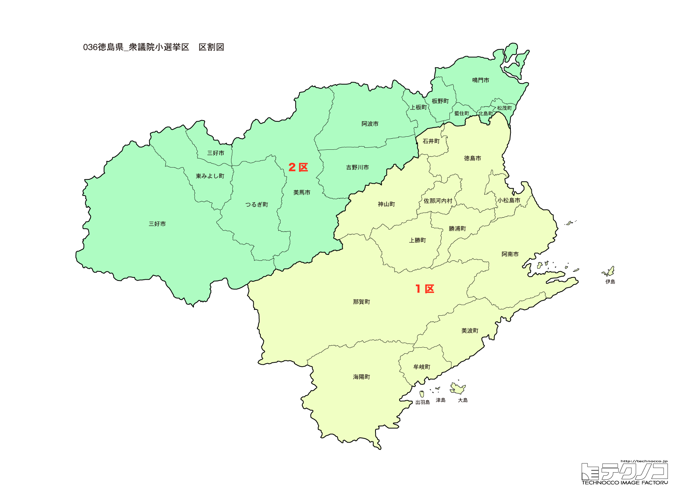

# 徳島県

---

## 基本情報

徳島県は四国地方の東部に位置し、人口は約71万人。県庁所在地は徳島市。紀伊水道と瀬戸内海に面し、四国の東の玄関口として発展してきた。

歴史的には、蜂須賀氏が治めた阿波藩として発展した。阿波おどりは日本三大盆踊りの一つとして全国的に有名。渦潮で知られる鳴門海峡は大鳴門橋で淡路島と結ばれている。

経済的には、すだち、鳴門金時（さつまいも）、阿波尾鶏が特産品。藍染めは伝統産業として知られる。LEDの生産が盛んで、日亜化学工業は青色LEDを開発した企業。

---

## 徳島県の政治的争点

### 人口減少と過疎対策

県全体で人口減少が進み、特に山間部での過疎化が深刻。選挙区が2から1に削減されたのもその影響。

### 南海トラフ地震対策

南海トラフ地震で大きな被害が予想される地域であり、防災対策が重要な課題。

### 交通インフラ

明石海峡大橋・大鳴門橋経由で関西圏とつながっているが、四国新幹線の実現が長年の悲願。

---

## 選挙の特徴

徳島県の衆議院小選挙区は1つ（2022年の区割り変更で2から1に減少）。人口減少の影響で選挙区が削減された代表的な県である。

自民党が強い保守的な地域で、2024年の衆院選でも自民党が勝利した。選挙区削減により、県全域が一つの選挙区となったため、県内の政治力学に変化が生じている。

---

## 第1区

### 地域構成

徳島1区は県全域で構成される。

**徳島市**は人口約25万人の県庁所在地。阿波おどりは毎年8月に開催され、100万人以上の観光客が訪れる。「踊る阿呆に見る阿呆、同じ阿呆なら踊らにゃ損損」の掛け声で有名。眉山は市街地を一望できる。

**鳴門市**は大鳴門橋のたもとにあり、渦潮観光の拠点。鳴門の渦潮は世界三大潮流の一つに数えられる。大塚国際美術館は世界の名画を陶板で再現した美術館。鳴門金時（さつまいも）の産地。

**祖谷**（三好市）は日本三大秘境の一つ。かずら橋は蔓で編んだ吊り橋で、スリル満点。大歩危・小歩危は吉野川の渓谷美が見事。

**阿南市**は日亜化学工業の本社があり、LEDのまちとして知られる。

### 選挙区の特徴

県全域を一つの選挙区とするため、都市部（徳島市）から山間部（祖谷地方）まで多様な地域課題を抱える。後藤田正純（後藤田正晴元官房長官の甥）が国政復帰を果たした選挙区。自民党が安定した強さを持つが、県全域選挙となり選挙戦略が変化している。

### 2024年選挙結果

| 候補者 | 党派 | 結果 |
|--------|------|------|
| 後藤田正純 | 自民 | **当選** |

後藤田正純は元内閣府副大臣で、後藤田正晴元官房長官の甥。前回は徳島県知事選に出馬して当選したが、国政に復帰。

### 2026年選挙の構図

後藤田正純（自民・現職）と野党候補の対決。

---
