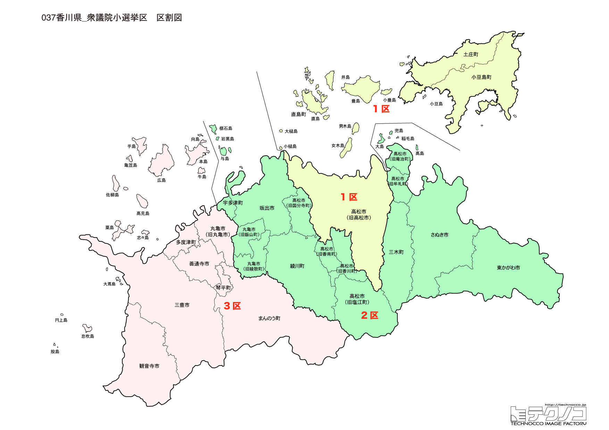

# 香川県



---

## 基本情報

香川県は四国地方の北東部に位置し、人口は約94万人。県庁所在地は高松市。全国で最も面積が小さい県で、瀬戸内海に面している。

歴史的には、讃岐国として発展。金刀比羅宮（こんぴらさん）は海の神様として全国から参拝者が訪れる。小豆島はオリーブの島として知られる。

経済的には、讃岐うどんが全国的に有名で、「うどん県」を自称する。小豆島のオリーブ、醤油も特産品。瀬戸大橋は本州と四国を結ぶ大動脈。

---

## 香川県の政治的争点

### 水資源問題

全国で最も降水量が少ない県の一つで、渇水対策が重要な課題。早明浦ダム（高知県）の水に依存している。

### 瀬戸内海の観光振興

瀬戸内国際芸術祭など、瀬戸内海の島々を活かした観光振興が進められている。

### 四国新幹線

四国新幹線の実現は四国4県共通の悲願だが、採算性が課題。

---

## 選挙の特徴

香川県の衆議院小選挙区は2つ。面積が全国最小ながら、瀬戸大橋の起点として四国の玄関口的な役割を果たす。

自民党が強い保守的な地域だが、2区では国民民主党代表・玉木雄一郎が地盤を持つ。2024年の衆院選では、1区は自民党、2区は国民民主党が勝利した。

国民民主党の動向が全国的に注目される中、玉木代表の地元として香川2区は特に注目される選挙区となっている。

**2026年選挙の構図**: 2026年1月27日公示・2月8日投票の衆院選では、高市早苗首相率いる自民党・維新連立与党に対し、野田佳彦・斉藤鉄夫共同代表の「中道改革連合」（立憲民主党と公明党が合流）が挑む構図となる。四国は自民党が強い保守地盤であり、香川でも与党優位が予想される。元公明党議員は小選挙区から撤退し比例に専念するため、小選挙区では自民党と中道改革連合・国民民主党の対決が中心となる。玉木雄一郎代表率いる国民民主党の動向も注目される。

---

## 第1区

### 地域構成

香川1区は高松市、小豆郡、香川郡で構成される。県庁所在地と小豆島。

- **高松市**: 人口約42万人の県庁所在地。栗林公園は国の特別名勝で、日本庭園の傑作とされる。高松城跡（玉藻公園）は海水を引き込んだ堀が特徴。サンポート高松は高松港周辺の再開発地区。

- **小豆島**: 瀬戸内海で2番目に大きい島。オリーブの日本初の栽培成功地で、「オリーブの島」として知られる。エンジェルロード（天使の散歩道）は潮の満ち引きで現れる砂の道。二十四の瞳映画村は映画のロケ地を保存。

### 選挙区の特徴

県庁所在地・高松市と小豆島を含む都市型選挙区。平井卓也（元デジタル大臣）が9期連続で当選しており、自民党の牙城となっている。デジタル政策の発信地として注目される。

### 2024年選挙結果

```
小川淳也（立憲）         █████████████████░░░  51.3%   82,549票 ✅当選
平井卓也（自民）         ██████████░░░░░░░░░░  32.2%   51,727票 🔄比例
町川順子（維新）         ██░░░░░░░░░░░░░░░░░░   7.3%   11,730票 
小林直美（参政）         █░░░░░░░░░░░░░░░░░░░   5.7%    9,176票 
田辺健一（共産）         █░░░░░░░░░░░░░░░░░░░   3.5%    5,646票 
──────────────────────────────────────────────────────────
投票率: 53.2% ｜ 票差: 30,822票（19.2pt差）
```

### 2026年選挙の構図

平井卓也（自民・現職、66歳）と野党候補の対決。

---

## 第2区

### 地域構成

香川2区は丸亀市、坂出市、善通寺市、観音寺市、さぬき市、東かがわ市、三豊市、木田郡、綾歌郡、仲多度郡で構成される。県西部と県東部。

- **丸亀市**: 丸亀城があり、石垣の美しさで知られる。丸亀製麺の発祥地ではないが、讃岐うどんの名店が多い。

- **金刀比羅宮**（琴平町）: 「こんぴらさん」として親しまれ、785段（奥社まで1,368段）の石段で有名。海の神様として船乗りの信仰を集める。

- **坂出市**: 瀬戸大橋の四国側の起点。瀬戸大橋記念公園がある。

- **直島**（直島町）: 現代アートの島として世界的に有名。ベネッセアートサイト直島、地中美術館など。

### 選挙区の特徴

県西部と県東部を含む選挙区で、国民民主党代表・玉木雄一郎の地盤。全国的に注目される選挙区であり、国民民主党の動向が争点となりやすい。金刀比羅宮や瀬戸大橋など観光資源も豊富。

### 2024年選挙結果

```
玉木雄一郎（国民）        ████████████████████  66.4%   89,899票 ✅当選
瀬戸隆一（自民）         █████████░░░░░░░░░░░  28.8%   39,006票 🔄比例
石田真優（共産）         █░░░░░░░░░░░░░░░░░░░   4.8%    6,466票 
──────────────────────────────────────────────────────────
投票率: 55.0% ｜ 票差: 50,893票（37.6pt差）
```

### 2026年選挙の構図

玉木雄一郎（国民・現職、55歳）は党代表として選挙に臨む。国民民主党の動向に注目。

---
