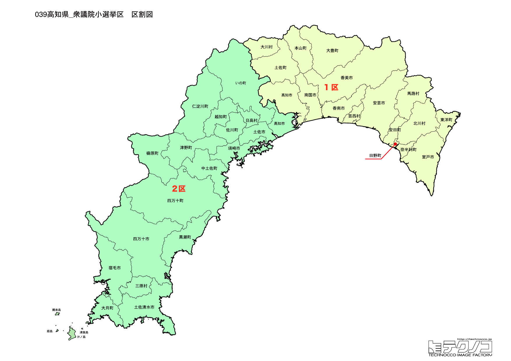

# 高知県

---

## 基本情報

高知県は四国地方の南部に位置し、人口は約68万人で全国45位。県庁所在地は高知市。太平洋に面し、県土の約84%が森林という自然豊かな県である。

歴史的には、土佐藩として発展。坂本龍馬、中岡慎太郎、板垣退助など幕末・明治の志士を多く輩出した。「自由は土佐の山間より」の言葉通り、自由民権運動発祥の地でもある。

経済的には、カツオのたたき、文旦、土佐酒が名物。四万十川は「日本最後の清流」として知られる。よさこい祭りは高知発祥で全国に広がった。

---

## 高知県の政治的争点

### 南海トラフ地震対策

南海トラフ地震で最も大きな被害が予想される県の一つであり、防災対策が最重要課題。

### 人口減少と過疎対策

県全体で人口減少が進み、特に山間部・沿岸部での過疎化が深刻。

### 自然環境の保全と観光振興

四万十川、足摺岬など自然環境を守りながら観光振興を図ることが課題。

---

## 選挙の特徴

高知県の衆議院小選挙区は2つ。坂本龍馬を輩出した「自由民権の地」としての伝統があり、野党が比較的強い地域。

2024年の衆院選では2選挙区中、立憲民主党が1選挙区、自民党が1選挙区を獲得した。1区は自民党の重鎮・中谷元（元防衛大臣）が地盤を持つ一方、2区は立憲民主党が議席を確保している。

南海トラフ地震で最も大きな被害が予想される県の一つであり、防災対策は最重要課題となっている。

---

## 第1区

### 地域構成

高知1区は高知市、室戸市、安芸市、南国市、香南市、香美市、東洋町、奈半利町、田野町、安田町、北川村、馬路村、芸西村、本山町、大豊町、土佐町、大川村で構成される。県東部。

- **高知市**: 人口約32万人の県庁所在地。高知城は現存12天守の一つで、「南海道随一の名城」と称される。はりまや橋は「よさこい節」で歌われる。日曜市は300年以上の歴史を持つ朝市。ひろめ市場はカツオのたたきを楽しめる食のテーマパーク。

- **室戸岬**: 四国の東南端で、空海が修行した御厨人窟がある。室戸世界ジオパークに認定。

### 選挙区の特徴

県庁所在地・高知市を中心とする選挙区。中谷元（元防衛大臣）が11期連続で当選しており、自民党の重鎮として安定した地盤を持つ。防衛・安全保障政策の発信地としても注目される。

### 2024年選挙結果

| 候補者 | 党派 | 結果 |
|--------|------|------|
| 中谷元 | 自民 | **当選**（11選） |

中谷元は元防衛大臣で、自民党の重鎮。

### 2026年選挙の構図

中谷元（自民・現職、66歳）と野党候補の対決。

---

## 第2区

### 地域構成

高知2区は土佐市、須崎市、宿毛市、土佐清水市、四万十市、いの町、仁淀川町、中土佐町、佐川町、越知町、梼原町、日高村、津野町、四万十町、大月町、三原村、黒潮町で構成される。県西部。

- **四万十川**: 「日本最後の清流」として知られる。全長196kmで四国最長の川。沈下橋は増水時に水没する設計の橋で、風情がある。

- **足摺岬**（土佐清水市）: 四国最南端の岬。ジョン万次郎の生誕地としても知られる。

- **佐川町**: 牧野富太郎博士の出身地。NHK連続テレビ小説「らんまん」の舞台となった。牧野植物園は高知市にある。

### 選挙区の特徴

四万十川流域など県西部を含む選挙区。立憲民主党の広田一が議席を持つ。「日本最後の清流」四万十川や足摺岬など自然資源が豊富な地域だが、過疎化が深刻な課題。NHK朝ドラ「らんまん」のモデル・牧野富太郎の出身地でもある。

### 2024年選挙結果

| 候補者 | 党派 | 結果 |
|--------|------|------|
| 広田一 | 立憲 | **当選** |

広田一は元参議院議員で、衆議院に転身。

### 2026年選挙の構図

広田一（立憲→中道改革連合・現職）と自民党候補の対決。

---
