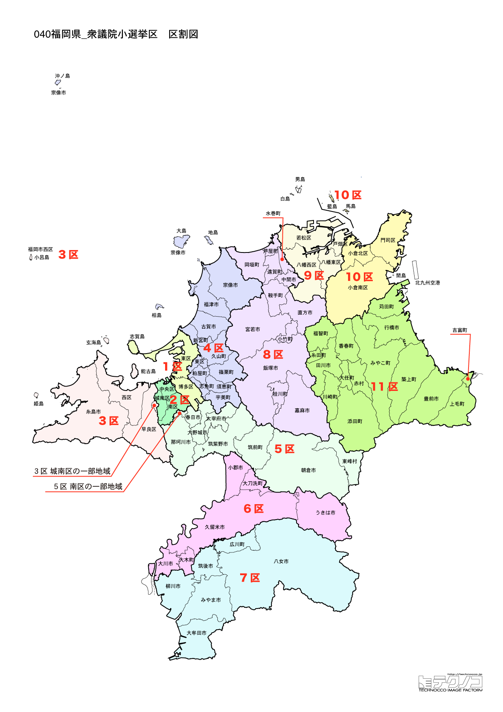

# 福岡県



---

## 基本情報

福岡県は九州地方の北部に位置し、人口は約512万人で全国9位。県庁所在地は福岡市。九州の玄関口として発展し、アジアとの交流拠点でもある。

歴史的には、太宰府が古代日本の外交・軍事の拠点であった。博多は中世から国際貿易港として栄えた。北九州は明治以降、八幡製鉄所を中心に重工業で発展した。

経済的には、福岡市は九州経済の中心で、アジアのゲートウェイとして成長。博多ラーメン、明太子、もつ鍋が名物。北九州市は製造業が盛ん。

---

## 福岡県の政治的争点

### アジアのゲートウェイ

福岡市のアジアとの交流拠点としての発展戦略が議論されている。

### 北九州市の再生

人口減少が続く北九州市の産業・経済の活性化が課題。

### 筑豊地域の振興

炭鉱閉山後の筑豊地域の産業振興、雇用創出が長年の課題。

---

## 選挙の特徴

福岡県の衆議院小選挙区は11。九州最大の都市圏を有し、政令指定都市2つ（福岡市・北九州市）を擁する。

自民党と野党が拮抗する地域で、2024年の衆院選では11選挙区中、自民党が5選挙区、立憲民主党等が6選挙区を獲得した。福岡市では野党が強く、北九州市でも野党が議席を確保している。

麻生太郎元首相（8区）をはじめ、政界の重鎮が多い選挙区を持つ県でもある。

**2026年選挙の構図**: 2026年1月27日公示、2月8日投票の衆院選では、与党（自民党・日本維新の会連立、高市早苗首相）と野党・中道改革連合（立憲民主党と公明党が合流、共同代表：野田佳彦・斉藤鉄夫）の対決となる。元公明党議員は小選挙区から撤退し比例に専念。九州最大の都市圏を持つ福岡では、都市部を中心に中道改革連合が攻勢をかける構図となっている。

---

## 第1区

### 地域構成

福岡1区は福岡市東区、博多区で構成される。福岡市の中心部。

- **博多区**: 博多駅、キャナルシティ博多があり、博多の中心。櫛田神社は博多祇園山笠の舞台。中洲は九州最大の歓楽街。

- **東区**: 福岡空港に近く、香椎宮、筥崎宮がある。

### 選挙区の特徴

福岡市博多区、東区を含む都市型選挙区。博多駅やキャナルシティ博多など九州の商業・観光の中心地を擁する。自民党の井上貴博が5期連続で当選しており、自民党が一定の強さを持つ。

### 2024年選挙結果

```
井上貴博（自民）         ███████████░░░░░░░░░  35.2%   70,408票 ✅当選
丸尾圭祐（立憲）         █████████░░░░░░░░░░░  27.6%   55,343票 
山本剛正（維新）         █████░░░░░░░░░░░░░░░  17.2%   34,346票 
緒方貴恵（参政）         ███░░░░░░░░░░░░░░░░░   9.4%   18,872票 
綿貫英彦（共産）         ██░░░░░░░░░░░░░░░░░░   6.5%   13,107票 
村田峻一（社民）         █░░░░░░░░░░░░░░░░░░░   4.0%    8,067票 
──────────────────────────────────────────────────────────
投票率: 47.0% ｜ 票差: 15,065票（7.5pt差）
```

### 2026年選挙の構図

```
井上たかひろ（自民・前職、63歳）         当選5回
丸尾圭祐（中道改革連合・前職、43歳）       当選1回
山本ごうせい（維新・元職、54歳）         当選2回
岩本よしたか（共産・新人、57歳）
よしとみ景子（参政・新人、37歳）         眼科医師
```

2024年に小選挙区で勝利した井上たかひろ(自民)が6期目を目指す。丸尾圭祐(中道改革連合・前職)、元職の山本ごうせい(維新)、共産の岩本よしたか、参政党のよしとみ景子(眼科医師)の5人の争い。

---

## 第2区

### 地域構成

福岡2区は福岡市中央区、南区、城南区で構成される。福岡市の中心部と南部。

- **中央区**: 天神、大名など繁華街が集中。福岡城跡（舞鶴公園）がある。

### 選挙区の特徴

福岡市中央区、南区、城南区を含む都市型選挙区。天神など福岡の繁華街を擁する。立憲民主党の稲富修二が議席を持ち、野党が強い選挙区。

### 2024年選挙結果

```
稲富修二（立憲）         █████████████░░░░░░░  41.9%   98,837票 ✅当選
鬼木誠（自民）          ████████████░░░░░░░░  36.8%   86,698票 🔄比例
黒石裕子（参政）         ██░░░░░░░░░░░░░░░░░░   7.1%   16,689票 
本司敬宏（維新）         ██░░░░░░░░░░░░░░░░░░   6.8%   16,139票 
松尾律子（共産）         █░░░░░░░░░░░░░░░░░░░   4.3%   10,201票 
沖園理恵（無所属）        █░░░░░░░░░░░░░░░░░░░   3.0%    7,097票 
──────────────────────────────────────────────────────────
投票率: 52.5% ｜ 票差: 12,139票（5.1pt差）
```

### 2026年選挙の構図

稲富修二（立憲→中道改革連合・現職）と自民党候補の対決。

---

## 第3区

### 地域構成

福岡3区は福岡市早良区、西区、糸島市で構成される。福岡市西部。

- **糸島市**: 海沿いのリゾート地として人気。糸島半島の海岸線は絶景スポット。

### 選挙区の特徴

福岡市西部と糸島市を含む選挙区。海沿いのリゾート地・糸島を擁する。自民党の古賀篤が5期連続で当選しており、自民党が安定した強さを持つ。

### 2024年選挙結果

```
古賀篤（自民）          █████████████░░░░░░░  41.2%   95,074票 ✅当選
仁戸田元氣（立憲）        █████████░░░░░░░░░░░  28.5%   65,835票 
瀬尾英昇司（維新）        ███░░░░░░░░░░░░░░░░░  10.1%   23,289票 
奥田芙美代（れいわ）       ███░░░░░░░░░░░░░░░░░   9.8%   22,661票 
重松雄子（参政）         █░░░░░░░░░░░░░░░░░░░   5.6%   12,887票 
山口湧人（共産）         █░░░░░░░░░░░░░░░░░░░   4.8%   11,059票 
──────────────────────────────────────────────────────────
投票率: 53.5% ｜ 票差: 29,239票（12.7pt差）
```

### 2026年選挙の構図

古賀篤（自民・現職）と野党候補の対決。

---

## 第4区

### 地域構成

福岡4区は宗像市、福津市、古賀市、新宮町、粕屋町、宇美町、志免町、須惠町、久山町、篠栗町で構成される。福岡市近郊。

- **宗像市**: 宗像大社があり、「神宿る島」宗像・沖ノ島と関連遺産群は世界遺産。

### 選挙区の特徴

宗像市など福岡市近郊を含む選挙区。世界遺産「神宿る島」宗像・沖ノ島を擁する。自民党の宮内秀樹が5期連続で当選しており、自民党の牙城となっている。

### 2024年選挙結果

```
宮内秀樹（自民）         ███████████░░░░░░░░░  33.6%   68,585票 ✅当選
許斐亮太郎（国民）        ██████░░░░░░░░░░░░░░  19.9%   40,753票 🔄比例
阿部弘樹（維新）         █████░░░░░░░░░░░░░░░  16.9%   34,572票 🔄比例
吉松源昭（無所属）        ████░░░░░░░░░░░░░░░░  14.2%   28,915票 
宗晶子（社民）          ███░░░░░░░░░░░░░░░░░   9.8%   20,051票 
行平佳弘（参政）         █░░░░░░░░░░░░░░░░░░░   5.6%   11,401票 
──────────────────────────────────────────────────────────
投票率: 54.0% ｜ 票差: 27,832票（13.6pt差）
```

### 2026年選挙の構図

宮内秀樹（自民・現職）と野党候補の対決。

---

## 第5区

### 地域構成

福岡5区は筑紫野市、春日市、大野城市、太宰府市、那珂川市で構成される。福岡市南郊。

- **太宰府市**: 太宰府天満宮があり、学問の神様・菅原道真を祀る。九州国立博物館もある。

### 選挙区の特徴

太宰府市など福岡市南郊を含む選挙区。太宰府天満宮（学問の神様）を擁する。立憲民主党の原口一博（元総務大臣）が10期連続で当選しており、野党の牙城となっている。

### 2024年選挙結果

```
栗原渉（自民）          ██████████████░░░░░░  42.9%  105,563票 ✅当選
堤かなめ（立憲）         ███████████░░░░░░░░░  34.0%   83,588票 🔄比例
松尾嘉三（維新）         ███░░░░░░░░░░░░░░░░░   9.6%   23,604票 
タコスキッド（無所属）      ██░░░░░░░░░░░░░░░░░░   7.2%   17,691票 
岡部吉高（参政）         ██░░░░░░░░░░░░░░░░░░   6.4%   15,733票 
──────────────────────────────────────────────────────────
投票率: 55.5% ｜ 票差: 21,975票（8.9pt差）
```

### 2026年選挙の構図

原口一博（立憲→中道改革連合・現職）と自民党候補の対決。

---

## 第6区

### 地域構成

福岡6区は久留米市、大川市、小郡市、うきは市、大刀洗町、大木町で構成される。筑後北部。

- **久留米市**: 人口約30万人で県内3位。ブリヂストン発祥の地。久留米ラーメン、久留米絣が有名。

### 選挙区の特徴

久留米市を中心とする筑後北部の選挙区。ブリヂストン発祥の地・久留米を擁する。鳩山二郎（鳩山邦夫元総務大臣の息子）が議席を持つ。世襲政治家として注目される。

### 2024年選挙結果

```
鳩山二郎（自民）         ████████████████░░░░  48.5%   88,197票 ✅当選
近藤雅彦（国民）         ████████░░░░░░░░░░░░  25.9%   46,997票 
福成健太（維新）         ████░░░░░░░░░░░░░░░░  12.5%   22,779票 
河野一弘（共産）         ██░░░░░░░░░░░░░░░░░░   6.7%   12,091票 
古川恭司（参政）         ██░░░░░░░░░░░░░░░░░░   6.4%   11,651票 
──────────────────────────────────────────────────────────
投票率: 50.9% ｜ 票差: 41,200票（22.7pt差）
```

### 2026年選挙の構図

鳩山二郎（自民・現職）と野党候補の対決。

---

## 第7区

### 地域構成

福岡7区は大牟田市、柳川市、八女市、筑後市、みやま市、広川町で構成される。筑後南部。

- **柳川市**: 川下りで有名。うなぎのせいろ蒸しが名物。

- **大牟田市**: 三池炭鉱の歴史があり、「明治日本の産業革命遺産」の構成資産。

### 選挙区の特徴

大牟田市など筑後南部を含む選挙区。三池炭鉱の歴史を持つ大牟田市や、川下りで有名な柳川市を擁する。自民党の藤丸敏が議席を持つ。

### 2024年選挙結果

```
藤丸敏（自民）          ██████████████████░░  57.0%   79,029票 ✅当選
亀田晃尚（立憲）         ███████████░░░░░░░░░  34.2%   47,444票 
平島史朗（共産）         ██░░░░░░░░░░░░░░░░░░   8.9%   12,307票 
──────────────────────────────────────────────────────────
投票率: 52.0% ｜ 票差: 31,585票（22.8pt差）
```

### 2026年選挙の構図

藤丸敏（自民・現職）と野党候補の対決。

---

## 第8区

### 地域構成

福岡8区は直方市、飯塚市、田川市、宮若市、嘉麻市、鞍手町、小竹町、桂川町、香春町、添田町、糸田町、川崎町、大任町、赤村、福智町で構成される。筑豊地域。

- **飯塚市**: 筑豊炭田の中心地として栄えた。嘉穂劇場は炭鉱全盛期の名残。麻生太郎元首相の地盤。

### 選挙区の特徴

飯塚市を中心とする筑豊地域の選挙区。麻生太郎元首相の地盤であり、全国的に注目される選挙区。旧産炭地として栄えた歴史を持ち、地域振興が重要な課題。麻生は14期連続で当選している超ベテラン。

### 2024年選挙結果

```
麻生太郎（自民）         ██████████████████░░  57.0%   92,534票 ✅当選
河野祥子（共産）         ███████░░░░░░░░░░░░░  21.9%   35,493票 
森田俊文（無所属）        ███████░░░░░░░░░░░░░  21.2%   34,407票 
──────────────────────────────────────────────────────────
投票率: 51.1% ｜ 票差: 57,041票（35.1pt差）
```

### 2026年選挙の構図

麻生太郎（自民・現職、85歳）の去就が注目される。

---

## 第9区

### 地域構成

福岡9区は北九州市八幡東区、八幡西区、戸畑区、若松区で構成される。北九州市西部。

- **八幡**: 八幡製鉄所発祥の地。官営八幡製鉄所は「明治日本の産業革命遺産」の構成資産。

### 選挙区の特徴

北九州市西部（八幡東区、八幡西区、戸畑区、若松区）を含む選挙区。八幡製鉄所発祥の地を擁する。立憲民主党の緒方林太郎が議席を持ち、野党が一定の強さを持つ。

### 2024年選挙結果

```
緒方林太郎（無所属）       ███████████████████░  57.3%  102,885票 ✅当選
三原朝利（無所属）        █████████░░░░░░░░░░░  28.0%   50,252票 
山田博敏（共産）         ██░░░░░░░░░░░░░░░░░░   7.6%   13,662票 
山本直緒美（参政）        ██░░░░░░░░░░░░░░░░░░   7.1%   12,740票 
──────────────────────────────────────────────────────────
投票率: 49.8% ｜ 票差: 52,633票（29.3pt差）
```

### 2026年選挙の構図

緒方林太郎（立憲→中道改革連合・現職）と自民党候補の対決。

---

## 第10区

### 地域構成

福岡10区は北九州市小倉北区、小倉南区で構成される。北九州市東部。

- **小倉**: 北九州市の中心。小倉城、旦過市場がある。

### 選挙区の特徴

北九州市東部（小倉北区、小倉南区）を含む選挙区。北九州市の中心・小倉を擁する。立憲民主党の城井崇が議席を持ち、野党が強い選挙区。

### 2024年選挙結果

```
城井崇（立憲）          ████████████░░░░░░░░  38.6%   71,687票 ✅当選
吉村悠（自民）          █████████░░░░░░░░░░░  29.1%   54,186票 
大石仁人（無所属）        ██████░░░░░░░░░░░░░░  20.4%   37,858票 
一ノ瀬小夜子（共産）       ██░░░░░░░░░░░░░░░░░░   6.0%   11,182票 
福本尭（維新）          █░░░░░░░░░░░░░░░░░░░   5.9%   11,021票 
──────────────────────────────────────────────────────────
投票率: 47.8% ｜ 票差: 17,501票（9.4pt差）
```

### 2026年選挙の構図

城井崇（立憲→中道改革連合・現職）と自民党候補の対決。

---

## 第11区

### 地域構成

福岡11区は北九州市門司区、行橋市、豊前市、中間市、芦屋町、水巻町、岡垣町、遠賀町、苅田町、みやこ町、吉富町、上毛町、築上町で構成される。北九州市東部と周辺。

- **門司港**: レトロな建物が並ぶ観光地。焼きカレーが名物。

### 選挙区の特徴

北九州市門司区と周辺地域を含む選挙区。レトロな門司港を擁する。自民党の武田良太（元総務大臣）が8期連続で当選しており、自民党の牙城となっている。

### 2024年選挙結果

```
村上智信（維新）         ███████████████░░░░░  45.0%   58,842票 ✅当選
武田良太（自民）         ██████████████░░░░░░  43.3%   56,607票 
志岐玲子（社民）         ███░░░░░░░░░░░░░░░░░  11.7%   15,297票 
──────────────────────────────────────────────────────────
投票率: 54.4% ｜ 票差: 2,235票（1.7pt差）
```

### 2026年選挙の構図

武田良太（自民・現職）と野党候補の対決。

---
