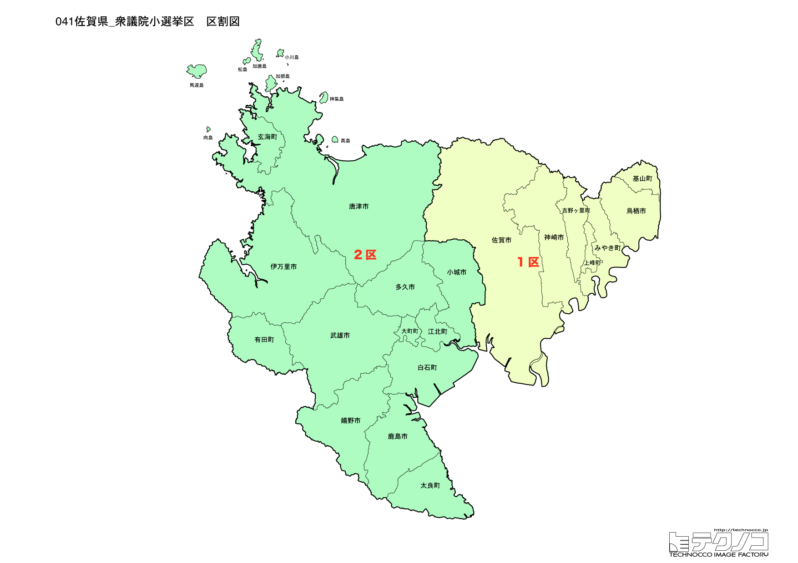

# 佐賀県



---

## 基本情報

佐賀県は九州地方の北西部に位置し、人口は約80万人。県庁所在地は佐賀市。有明海と玄界灘の2つの海に面し、古くから大陸との交流が盛んであった。

歴史的には、鍋島藩として発展。吉野ヶ里遺跡は弥生時代の大規模な環濠集落跡として有名。幕末には佐賀藩が雄藩として活躍し、大隈重信、江藤新平などを輩出した。

経済的には、有田焼、伊万里焼など陶磁器の産地として世界的に有名。佐賀牛、嬉野茶、有明海の海苔も特産品。

---

## 佐賀県の政治的争点

### 佐賀空港へのオスプレイ配備問題

佐賀空港への陸上自衛隊オスプレイ配備計画をめぐり、賛否が分かれている。

### 有明海の再生

諫早湾干拓事業の影響で有明海の漁業が打撃を受けており、海の再生が課題。

### 九州新幹線西九州ルート

武雄温泉～長崎間が開業したが、新鳥栖～武雄温泉間の整備方式が決まらず、フル規格での全線開業が課題。

---

## 選挙の特徴

佐賀県の衆議院小選挙区は2つ。陶磁器の産地として世界的に知られ、歴史・文化資源が豊富な県。

自民党が強い保守的な地域で、2024年の衆院選でも2選挙区とも自民党が勝利した。佐賀空港へのオスプレイ配備問題や九州新幹線西九州ルートの整備など、地域固有の争点がある。

**2026年選挙の構図**: 2026年1月27日公示、2月8日投票の衆院選では、与党（自民党・日本維新の会連立、高市早苗首相）と野党・中道改革連合（立憲民主党と公明党が合流、共同代表：野田佳彦・斉藤鉄夫）の対決となる。元公明党議員は小選挙区から撤退し比例に専念。保守地盤が強い佐賀では自民党が優位だが、中道改革連合が票の上積みを狙う。

---

## 第1区

### 地域構成

佐賀1区は佐賀市、鳥栖市、神埼市、吉野ヶ里町、基山町、上峰町、みやき町で構成される。県東部。

- **佐賀市**: 人口約23万人の県庁所在地。佐賀城跡、佐賀県立博物館がある。バルーンフェスタは毎年秋に開催される熱気球の国際大会。

- **吉野ヶ里遺跡**（吉野ヶ里町）: 弥生時代の大規模な環濠集落跡で、国の特別史跡。

- **鳥栖市**: 九州自動車道と長崎自動車道の結節点で、物流拠点として発展。サガン鳥栖のホームタウン。

### 選挙区の特徴

佐賀市、鳥栖市など県東部を含む選挙区。吉野ヶ里遺跡や物流拠点・鳥栖市を擁する。自民党と野党が競り合う選挙区だが、近年は自民党が優勢。

### 2024年選挙結果

```
原口一博（立憲）         ██████████████████░░  54.6%   96,083票 ✅当選
岩田和親（自民）         ███████████████░░░░░  45.4%   79,723票 🔄比例
──────────────────────────────────────────────────────────
投票率: 54.5% ｜ 票差: 16,360票（9.3pt差）
```

### 2026年選挙の構図

```
岩田かずちか（自民・現職、52歳）         当選5回、内閣府副大臣
原口一博（減税日本・ゆうこく連合・現職、66歳）  当選10回、政党代表
重松たかみ（参政・新人、36歳）           株式会社役員
```

2024年に小選挙区で勝利した原口一博が減税日本・ゆうこく連合に所属を変えて再選を目指す。自民の岩田かずちか(現職、内閣府副大臣)、参政党の重松たかみ(株式会社役員)の3人の争い。

---

## 第2区

### 地域構成

佐賀2区は唐津市、伊万里市、武雄市、鹿島市、小城市、嬉野市、多久市、有田町、大町町、江北町、白石町、太良町、玄海町で構成される。県西部。

- **唐津市**: 唐津城、唐津くんちで有名。唐津くんちの曳山は豪華絢爛でユネスコ無形文化遺産に登録。呼子のイカは活造りで有名。

- **有田町**: 有田焼の産地として世界的に有名。400年以上の歴史を持つ磁器の里。毎年GWの陶器市には多くの観光客が訪れる。

- **武雄市**: 武雄温泉で知られる。楼門は辰野金吾の設計。武雄市図書館は蔦屋書店とのコラボで話題になった。

- **嬉野市**: 嬉野温泉、嬉野茶で有名。日本三大美肌の湯の一つ。

### 選挙区の特徴

唐津市、有田町など県西部を含む選挙区。有田焼の産地や唐津くんちで有名な唐津市を擁する。古川康（元佐賀県知事）が4期連続で当選しており、自民党の牙城となっている。

### 2024年選挙結果

```
大串博志（立憲）         █████████████████░░░  51.2%   95,581票 ✅当選
古川康（自民）          █████████████░░░░░░░  41.0%   76,554票 🔄比例
井上祐輔（共産）         █░░░░░░░░░░░░░░░░░░░   4.1%    7,596票 
下吹越優也（参政）        █░░░░░░░░░░░░░░░░░░░   3.8%    7,108票 
──────────────────────────────────────────────────────────
投票率: 57.5% ｜ 票差: 19,027票（10.2pt差）
```

### 2026年選挙の構図

```
古川やすし（自民・前職、67歳）          当選4回、前国土交通副大臣、自民党佐賀県連会長
大串ひろし（中道改革連合・前職、60歳）     当選7回、政党役員
```

2024年に小選挙区で勝利した大串ひろし(中道改革連合)が再選を目指す。自民の古川やすし(前職、前国土交通副大臣、自民党佐賀県連会長)との一騎打ち。

---
