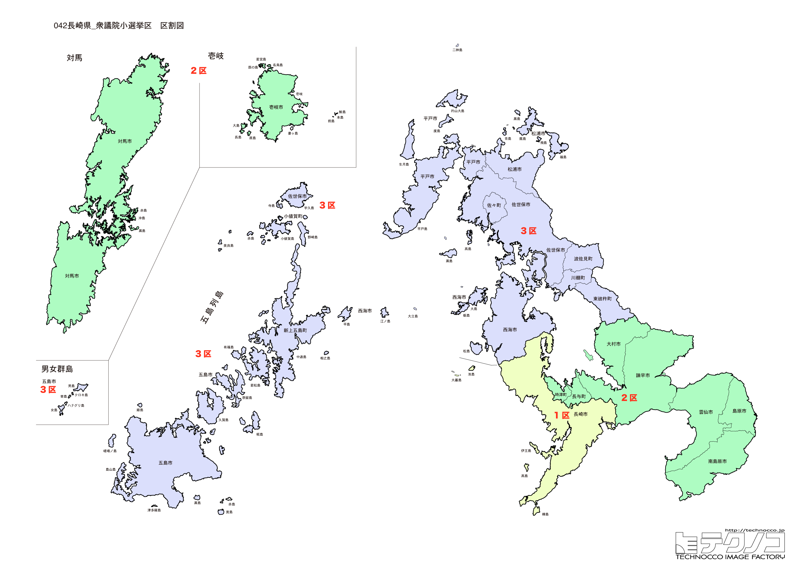

# 長崎県



---

## 基本情報

長崎県は九州地方の北西部に位置し、人口は約128万人。県庁所在地は長崎市。日本一多い971の島を持ち、複雑な海岸線が特徴。

歴史的には、江戸時代に唯一の西洋との窓口・出島があり、異国情緒あふれる街として発展。1945年8月9日に原子爆弾が投下され、多くの犠牲者を出した。潜伏キリシタン関連遺産は世界遺産に登録されている。

経済的には、長崎ちゃんぽん、カステラ、皿うどんが名物。造船業が盛んで、三菱重工長崎造船所は日本を代表する造船所。五島列島は椿油、あご（トビウオ）が特産品。

---

## 長崎県の政治的争点

### 核廃絶と平和

被爆地・長崎として、広島とともに核廃絶と平和の発信が重要な使命。

### 九州新幹線西九州ルート

2022年に武雄温泉～長崎間が開業したが、佐賀県内の整備方式が決まらず、全線開業が課題。

### 離島振興

多くの離島を抱え、航路・航空路の維持、人口流出対策が課題。

---

## 選挙の特徴

長崎県の衆議院小選挙区は3つ（2022年の区割り変更で4から3に減少）。被爆地として広島とともに核廃絶・平和の発信地であり、多くの離島を抱える県でもある。

自民党と野党が拮抗する地域で、2024年の衆院選では3選挙区中、自民党が2選挙区、国民民主党が1選挙区を獲得した。離島振興や九州新幹線西九州ルートの全線開業など、地域固有の争点がある。

**2026年選挙の構図**: 2026年1月27日公示、2月8日投票の衆院選では、与党（自民党・日本維新の会連立、高市早苗首相）と野党・中道改革連合（立憲民主党と公明党が合流、共同代表：野田佳彦・斉藤鉄夫）の対決となる。元公明党議員は小選挙区から撤退し比例に専念。被爆地・長崎では平和政策をめぐる論戦も注目される。

---

## 第1区

### 地域構成

長崎1区は長崎市の大部分で構成される。県庁所在地。

- **長崎市**: 人口約40万人の県庁所在地。原爆資料館、平和公園は被爆の記憶を伝える。グラバー園は幕末の洋館が並ぶ。大浦天主堂は国宝。出島は江戸時代の西洋との窓口。稲佐山からの夜景は「世界新三大夜景」に選ばれた。

### 選挙区の特徴

県庁所在地・長崎市を中心とする選挙区。被爆地として平和政策が重要視される。国民民主党の西岡秀子が議席を持ち、野党が強い選挙区。

### 2024年選挙結果

```
西岡秀子（国民）         █████████████████░░░  52.5%   87,784票 ✅当選
下条博文（自民）         █████████░░░░░░░░░░░  29.0%   48,382票 
山田博司（維新）         ██░░░░░░░░░░░░░░░░░░   7.7%   12,836票 
黒石隆太（参政）         █░░░░░░░░░░░░░░░░░░░   5.6%    9,401票 
内田隆英（共産）         █░░░░░░░░░░░░░░░░░░░   5.2%    8,679票 
──────────────────────────────────────────────────────────
投票率: 50.9% ｜ 票差: 39,402票（23.6pt差）
```

### 2026年選挙の構図

西岡秀子（国民・現職）と自民党候補の対決。

---

## 第2区

### 地域構成

長崎2区は長崎市の一部、諫早市、大村市、島原市、雲仙市、南島原市で構成される。県央・島原半島。

- **島原市**: 島原城、武家屋敷が残る城下町。島原の乱の舞台。雲仙普賢岳は1991年の噴火で大きな被害を出した。

- **雲仙市**: 雲仙温泉で有名。地獄めぐりができる。

### 選挙区の特徴

諫早市、島原市など県央・島原半島を含む選挙区。諫早湾干拓事業の影響で有明海の漁業問題が争点となる。自民党の加藤竜祥が議席を持つ。雲仙普賢岳の噴火災害からの復興も重要な課題。

### 2024年選挙結果

```
加藤竜祥（自民）         ███████████████░░░░░  46.3%   96,095票 ✅当選
山田勝彦（立憲）         █████████████░░░░░░░  39.5%   81,808票 🔄比例
高木聡子（参政）         ██░░░░░░░░░░░░░░░░░░   7.4%   15,365票 
横田朋大（維新）         ██░░░░░░░░░░░░░░░░░░   6.8%   14,098票 
──────────────────────────────────────────────────────────
投票率: 53.4% ｜ 票差: 14,287票（6.9pt差）
```

### 2026年選挙の構図

加藤竜祥（自民・現職）と野党候補の対決。

---

## 第3区

### 地域構成

長崎3区は佐世保市、平戸市、松浦市、西海市、東彼杵町、川棚町、波佐見町、佐々町で構成される。県北部。

- **佐世保市**: 人口約24万人で県内2位。米海軍佐世保基地があり、「海軍のまち」として発展。佐世保バーガーはご当地グルメとして人気。ハウステンボスは日本最大のテーマパーク。

- **平戸市**: 平戸城、オランダ商館跡など異国情緒が残る。日本最西端の駅（たびら平戸口駅）がある。

### 選挙区の特徴

佐世保市など県北部を含む選挙区。米海軍佐世保基地があり、基地問題が争点となりやすい。谷川弥一が7期連続で当選しているが、高齢化が注目される。ハウステンボスなど観光資源も豊富。

### 2024年選挙結果

```
金子容三（自民）         ████████████████░░░░  50.9%   90,930票 ✅当選
末次精一（立憲）         ████████████░░░░░░░░  38.3%   68,494票 
井上翔一朗（維新）        ██████████░░░░░░░░░░  31.6%   24,709票 
井上翔一朗（維新）        ███░░░░░░░░░░░░░░░░░  10.8%   19,217票 
──────────────────────────────────────────────────────────
投票率: 52.9% ｜ 票差: 22,436票（12.6pt差）
```

### 2026年選挙の構図

谷川弥一（自民・現職、82歳）と野党候補の対決。

---
