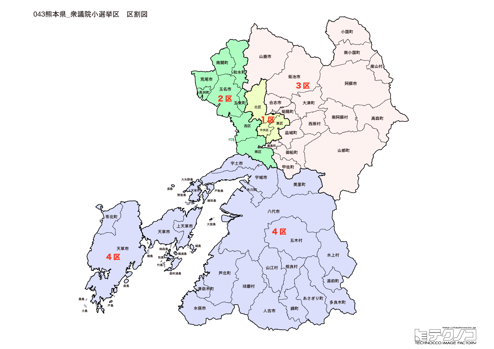

# 熊本県



---

## 基本情報

熊本県は九州地方の中央部に位置し、人口は約173万人で全国23位。県庁所在地は熊本市。阿蘇山を擁し、「火の国」として知られる。

歴史的には、加藤清正が熊本城を築いて以来、肥後藩の城下町として発展。西南戦争では激戦地となった。阿蘇山は活火山として世界的に知られる。

経済的には、馬刺し、辛子蓮根、太平燕（タイピーエン）が名物。トマト、スイカの生産量日本一。TSMC（台湾積体電路製造）の工場進出で半導体産業が注目されている。

---

## 熊本県の政治的争点

### TSMC進出と半導体産業

菊陽町へのTSMC進出は熊本経済に大きな影響を与えている。雇用創出、交通渋滞、地価上昇など様々な課題も。

### 熊本地震からの復興

2016年の熊本地震から復興が進むが、熊本城の完全復旧など課題は残る。

### 令和2年7月豪雨からの復興

球磨川流域で甚大な被害を受け、復興と治水対策が課題。

---

## 選挙の特徴

熊本県の衆議院小選挙区は4つ。阿蘇山を擁する「火の国」であり、TSMC進出で「半導体バブル」と呼ばれる活況を呈している。

自民党が強い保守的な地域で、2024年の衆院選では4選挙区すべてで自民党が勝利した。熊本地震や令和2年7月豪雨からの復興も重要な争点となっている。

**2026年選挙の構図**: 2026年1月27日公示、2月8日投票の衆院選では、与党（自民党・日本維新の会連立、高市早苗首相）と野党・中道改革連合（立憲民主党と公明党が合流、共同代表：野田佳彦・斉藤鉄夫）の対決となる。熊本全4選挙区で自民現職が立候補し、中道改革連合は1区のみ擁立。3区は社民党、4区は維新・国民も参戦し、多党乱戦の様相。TSMC進出で活況を呈する熊本では、半導体産業政策も争点となる。

---

## 第1区

### 地域構成

熊本1区は熊本市中央区、東区、北区で構成される。県庁所在地の中心部。

- **熊本市**: 人口約74万人の政令指定都市。熊本城は加藤清正が築いた名城で、2016年の熊本地震で被害を受けたが復興が進む。水前寺成趣園は日本庭園の名園。

### 選挙区の特徴

政令指定都市・熊本市の中心部を含む選挙区。熊本城や水前寺成趣園など観光資源が豊富。木原稔（元防衛大臣）が6期連続で当選しており、自民党の牙城となっている。熊本地震からの復興が重要課題。

### 2024年選挙結果

```
木原稔（自民）          ██████████████████░░  55.1%  110,068票 ✅当選
出口慎太郎（立憲）        ██████████░░░░░░░░░░  32.2%   64,238票 
重松貴美（参政）         ████░░░░░░░░░░░░░░░░  12.7%   25,325票 
──────────────────────────────────────────────────────────
投票率: 49.3% ｜ 票差: 45,830票（23.0pt差）
```

### 2026年選挙の構図

```
木原稔（自民・前職、56歳）            当選6回
鎌田聡（中道改革連合・新人、61歳）
山口誠太郎（参政・新人、36歳）
```

木原稔(自民・元防衛大臣)が7期目を目指す。中道改革連合は新人の鎌田聡を擁立し政権交代を狙う。参政党の山口誠太郎も加わる3人の争い。木原氏は維新の推薦も受ける。熊本地震からの復興が重要課題。

---

## 第2区

### 地域構成

熊本2区は熊本市西区、南区、宇土市、宇城市、天草市、上天草市、美里町、苓北町で構成される。熊本市南部と天草地方。

- **天草市**: 天草諸島の中心。潜伏キリシタン関連遺産が世界遺産に登録されている。イルカウォッチングが人気。天草五橋で本土と結ばれている。

### 選挙区の特徴

熊本市南部と天草地方を含む選挙区。世界遺産・潜伏キリシタン関連遺産を擁する天草を含む。自民党の西野太亮が議席を持つ。イルカウォッチングなど観光振興も争点。

### 2024年選挙結果

```
西野太亮（自民）         ████████████████████  69.3%  102,624票 ✅当選
近田茜（参政）          █████░░░░░░░░░░░░░░░  17.5%   25,944票 
奥田木の実（共産）        ████░░░░░░░░░░░░░░░░  13.2%   19,469票 
──────────────────────────────────────────────────────────
投票率: 50.1% ｜ 票差: 76,680票（51.8pt差）
```

### 2026年選挙の構図

```
西野太亮（自民・前職、47歳）          当選2回
前田智徳（参政・新人、47歳）
益田牧子（共産・新人、75歳）
```

西野太亮(自民)が3期目を目指す。参政党の前田智徳、共産党の益田牧子(75歳)も立候補。中道改革連合は候補擁立を見送り、西野氏は維新の推薦も受ける。天草地方の世界遺産・潜伏キリシタン関連遺産を擁する選挙区。

---

## 第3区

### 地域構成

熊本3区は荒尾市、玉名市、山鹿市、菊池市、合志市、玉東町、和水町、南関町、長洲町、大津町、菊陽町で構成される。県北部。

**菊陽町**にはTSMC（台湾積体電路製造）の工場が進出し、「半導体バブル」と呼ばれる活況を呈している。

- **山鹿市**: 山鹿温泉、山鹿灯籠まつりで有名。八千代座は明治時代の芝居小屋。

### 選挙区の特徴

菊陽町など県北部を含む選挙区。TSMC進出で「半導体バブル」と呼ばれる活況を呈している地域。坂本哲志（元地方創生担当大臣）が8期連続で当選している自民党の牙城。TSMCの影響による地域変化が注目される。

### 2024年選挙結果

```
坂本哲志（自民）         ████████████████████  63.9%  104,684票 ✅当選
橋村りか（社民）         ███████░░░░░░░░░░░░░  22.0%   36,088票 
植田貴俊（参政）         ████░░░░░░░░░░░░░░░░  14.0%   22,958票 
──────────────────────────────────────────────────────────
投票率: 54.4% ｜ 票差: 68,596票（41.9pt差）
```

### 2026年選挙の構図

```
坂本哲志（自民・前職、75歳）          当選8回
橋村りか（社民・新人、53歳）
霍田和佳（参政・新人、39歳）
```

坂本哲志(自民・元地方創生担当大臣、75歳)が9期目を目指す。社民党の橋村りか、参政党の霍田和佳も立候補。中道改革連合は候補擁立を見送り、坂本氏は維新の推薦も受ける。TSMC進出で「半導体バブル」と呼ばれる菊陽町を含み、地域変化が注目される。

---

## 第4区

### 地域構成

熊本4区は八代市、人吉市、水俣市、御船町、嘉島町、益城町、甲佐町、山都町、氷川町、芦北町、津奈木町、錦町、多良木町、湯前町、水上村、相良村、五木村、山江村、球磨村、あさぎり町で構成される。県南部。

- **阿蘇市・南阿蘇村**: 阿蘇山の麓。阿蘇カルデラは世界有数の規模。草千里、大観峰など絶景スポットが多い。

- **人吉市**: 球磨川沿いの城下町。人吉温泉、球磨焼酎が有名。2020年の豪雨で甚大な被害を受けた。

- **水俣市**: 水俣病の発生地として知られる。環境再生の取り組みが進んでいる。

### 選挙区の特徴

阿蘇地方や八代市、人吉市など県南部を含む選挙区。阿蘇カルデラや球磨川など自然資源が豊富だが、令和2年7月豪雨で甚大な被害を受けた。金子恭之（元総務大臣）が8期連続で当選している。復興と治水対策が重要課題。

### 2024年選挙結果

```
金子恭之（自民）         ███████████████████░  58.3%  119,947票 ✅当選
笹本由紀子（立憲）        ████████░░░░░░░░░░░░  24.1%   49,672票 
矢上雅義（維新）         █████░░░░░░░░░░░░░░░  17.6%   36,203票 
──────────────────────────────────────────────────────────
投票率: 54.8% ｜ 票差: 70,275票（34.2pt差）
```

### 2026年選挙の構図

```
金子恭之（自民・前職、64歳）          当選9回
矢上雅義（維新・元職、65歳）          当選3回
上田至（国民・新人、49歳）
植田貴俊（参政・新人、41歳）
本村久美子（共産・新人、68歳）
```

金子恭之(自民・元総務大臣)が10期目を目指す。元職の矢上雅義(維新)が4期目の復帰を狙い、国民民主党の上田至、参政党の植田貴俊、共産党の本村久美子(68歳)も加わる5人の争い。阿蘇地方や人吉市など県南部を含み、令和2年7月豪雨からの復興と治水対策が重要課題。

---
