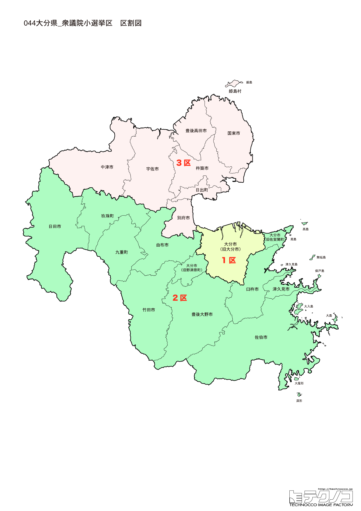

# 大分県



---

## 基本情報

大分県は九州地方の北東部に位置し、人口は約111万人。県庁所在地は大分市。「おんせん県」を自称する温泉大国で、源泉数・湧出量ともに日本一。

歴史的には、戦国時代にキリシタン大名・大友宗麟が治めた。豊後国として独自の文化が発展。別府、湯布院は明治時代から温泉保養地として発展した。

経済的には、かぼす、関あじ・関さば、とり天が名物。日本有数の温泉リゾート地として観光業が重要。

---

## 大分県の政治的争点

### 温泉観光の振興

「おんせん県」として温泉観光の振興が重要だが、コロナ後の観光回復とインバウンド対応が課題。

### 人口減少と過疎対策

県全体で人口減少が進み、特に山間部での過疎化が深刻。

### 地熱発電の推進

温泉資源を活かした地熱発電の推進が期待されている。

---

## 選挙の特徴

大分県の衆議院小選挙区は3つ。「おんせん県」として観光業が重要な産業であり、別府、湯布院など全国的に有名な温泉地を擁する。

自民党と野党が拮抗する地域で、2024年の衆院選では3選挙区中、自民党が2選挙区、立憲民主党が1選挙区を獲得した。温泉観光の振興や地熱発電の推進など、地域資源を活かした政策が争点となりやすい。

**2026年選挙の構図**: 2026年1月27日公示、2月8日投票の衆院選では、与党（自民党・日本維新の会連立、高市早苗首相）と野党・中道改革連合（立憲民主党と公明党が合流、共同代表：野田佳彦・斉藤鉄夫）の対決となる。元公明党議員は小選挙区から撤退し比例に専念。保革拮抗の大分では、中道改革連合が議席増を狙う展開となる。

---

## 第1区

### 地域構成

大分1区は大分市、由布市、臼杵市、津久見市で構成される。県庁所在地と周辺。

- **大分市**: 人口約47万人の県庁所在地。高崎山自然動物園はニホンザルの群れで有名。うみたまご（大分マリーンパレス水族館）も人気。

- **由布市**: 由布院温泉で全国的に有名。由布岳の麓に広がる温泉リゾートは女性に人気。金鱗湖の朝霧は幻想的。

### 選挙区の特徴

県庁所在地・大分市と由布市を含む選挙区。由布院温泉を擁し、観光政策が重要な争点。自民党の穴見陽一が議席を持つ。

### 2024年選挙結果

```
吉良州司（無所属）        ████████████████░░░░  49.1%   96,944票 ✅当選
衛藤博昭（自民）         ███████████░░░░░░░░░  35.8%   70,584票 
野中慎介（参政）         ██░░░░░░░░░░░░░░░░░░   7.9%   15,626票 
山下魁（共産）          ██░░░░░░░░░░░░░░░░░░   7.2%   14,186票 
──────────────────────────────────────────────────────────
投票率: 52.5% ｜ 票差: 26,360票（13.4pt差）
```

### 2026年選挙の構図

穴見陽一（自民・現職）と野党候補の対決。

---

## 第2区

### 地域構成

大分2区は別府市、中津市、豊後高田市、杵築市、宇佐市、国東市、日出町、姫島村で構成される。県北部。

- **別府市**: 人口約11万人で県内2位。温泉湧出量日本一で、「地獄めぐり」は観光の目玉。血の池地獄、海地獄など個性的な温泉が点在。

- **中津市**: 中津城の城下町で、福沢諭吉の故郷。中津からあげは全国的に有名。

- **国東半島**: 六郷満山の仏教文化が残る。宇佐神宮は全国4万社以上ある八幡宮の総本宮。

### 選挙区の特徴

別府市、中津市など県北部を含む選挙区。温泉湧出量日本一の別府市を擁し、温泉観光が重要な争点。衛藤征士郎が13期連続で当選している超ベテランだが、83歳と高齢化が注目される。

### 2024年選挙結果

```
広瀬建（無所属）         ██████████████░░░░░░  42.5%   62,699票 ✅当選
吉川元（立憲）          ████████████░░░░░░░░  38.8%   57,234票 🔄比例
衛藤征士郎（自民）        ██████░░░░░░░░░░░░░░  18.7%   27,553票 
──────────────────────────────────────────────────────────
投票率: 59.2% ｜ 票差: 5,465票（3.7pt差）
```

### 2026年選挙の構図

衛藤征士郎（自民・現職、83歳）の去就が注目される。

---

## 第3区

### 地域構成

大分3区は佐伯市、竹田市、豊後大野市、日田市、玖珠町、九重町で構成される。県西部・南部。

- **日田市**: 天領として栄えた城下町で、豆田町の古い町並みが残る。日田焼きそば、日田下駄が有名。

- **竹田市**: 岡城跡があり、滝廉太郎の「荒城の月」のモデルとされる。長湯温泉は炭酸泉で知られる。

- **九重町**: 九重"夢"大吊橋があり、高さ173mは歩行者専用橋として日本一。くじゅう連山は登山客に人気。

### 選挙区の特徴

日田市、竹田市など県西部・南部を含む選挙区。天領として栄えた日田や、岡城跡（荒城の月のモデル）がある竹田を擁する。立憲民主党の横光克彦が議席を持ち、野党が一定の強さを持つ選挙区。

### 2024年選挙結果

```
岩屋毅（自民）          ██████████████████░░  55.2%   87,301票 ✅当選
小林華弥子（立憲）        ████████████░░░░░░░░  38.1%   60,207票 
大塚光義（共産）         ██░░░░░░░░░░░░░░░░░░   6.7%   10,550票 
──────────────────────────────────────────────────────────
投票率: 56.1% ｜ 票差: 27,094票（17.1pt差）
```

### 2026年選挙の構図

横光克彦（立憲→中道改革連合・現職）と自民党候補の対決。

---
