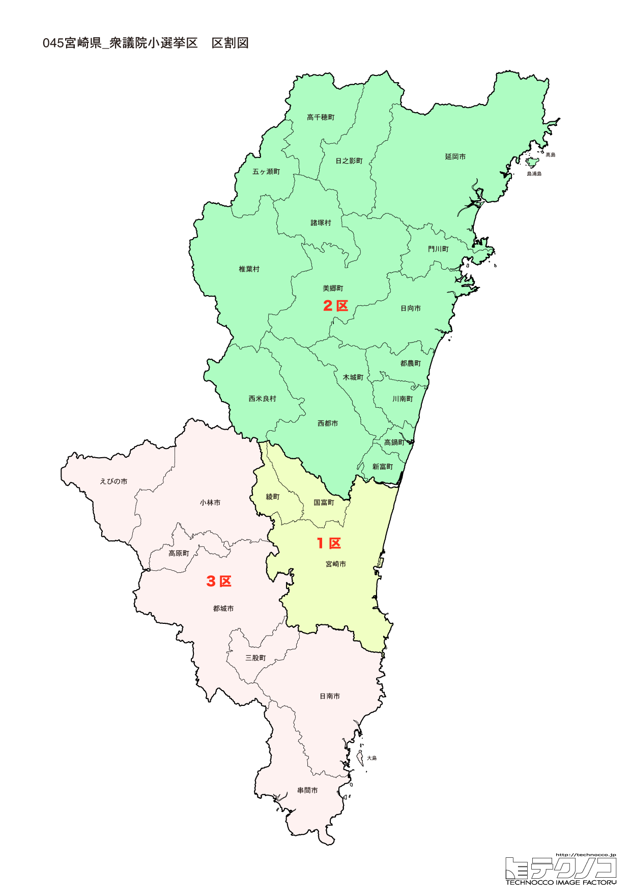

# 宮崎県

---

## 基本情報

宮崎県は九州地方の南東部に位置し、人口は約105万人。県庁所在地は宮崎市。太平洋に面し、温暖な気候から「日向の国」として知られる。

歴史的には、日向国として古代から栄えた。神話の舞台として高千穂が有名。戦後はプロ野球のキャンプ地として発展し、「スポーツランドみやざき」を標榜する。

経済的には、マンゴー、地鶏、宮崎牛が全国的に有名。東国原英夫知事時代に「どげんかせんといかん」が流行語に。焼酎の消費量は全国トップクラス。

---

## 宮崎県の政治的争点

### 南海トラフ地震・火山対策

南海トラフ地震と霧島連山の火山活動への備えが重要な課題。

### 人口減少と若者の県外流出

県全体で人口減少が進み、若者の県外流出を食い止める施策が求められている。

### 農畜産業の振興

宮崎牛、マンゴーなど高品質な農畜産物の生産維持と販路拡大が課題。

---

## 選挙の特徴

宮崎県の衆議院小選挙区は3つ。神話の舞台・高千穂を擁し、「スポーツランドみやざき」として知られる温暖な県。

自民党が強い保守的な地域で、2024年の衆院選でも3選挙区すべてで自民党が勝利した。南海トラフ地震や霧島連山の火山活動への備えが重要な課題となっている。

---

## 第1区

### 地域構成

宮崎1区は宮崎市、国富町、綾町で構成される。県庁所在地と周辺。

**宮崎市**は人口約40万人の県庁所在地。青島は亜熱帯植物が茂る島で、鬼の洗濯板と呼ばれる奇岩が有名。宮崎神宮は神武天皇を祀る。シーガイアはリゾート施設。

**綾町**は照葉樹林が残る自然豊かな町。オーガニック農業が盛ん。

### 選挙区の特徴

県庁所在地・宮崎市を中心とする選挙区。青島など観光資源が豊富。自民党の武井俊輔が議席を持つ。プロ野球キャンプ地としての振興も争点。

### 2024年選挙結果

| 候補者 | 党派 | 結果 |
|--------|------|------|
| 武井俊輔 | 自民 | **当選** |

### 2026年選挙の構図

武井俊輔（自民・現職）と野党候補の対決。

---

## 第2区

### 地域構成

宮崎2区は延岡市、日向市、西都市、日南市、串間市、高鍋町、新富町、木城町、川南町、都農町、門川町、美郷町、諸塚村、椎葉村で構成される。県北部・県南部。

**延岡市**は旭化成の企業城下町として発展。工都延岡とも呼ばれる。

**高千穂町**は日本神話の舞台。天岩戸神社、高千穂峡は神秘的な雰囲気。真名井の滝は絶景。夜神楽は重要無形民俗文化財。

**日南市**は飫肥城の城下町で、飫肥杉、飫肥天が有名。サンメッセ日南のモアイ像は人気スポット。

### 選挙区の特徴

延岡市、高千穂町など県北部と日南市など県南部を含む広大な選挙区。神話の舞台・高千穂や工都・延岡を擁する。江藤拓（元農林水産大臣）が7期連続で当選している自民党の牙城。農畜産業政策が重要な争点。

### 2024年選挙結果

| 候補者 | 党派 | 結果 |
|--------|------|------|
| 江藤拓 | 自民 | **当選**（7選） |

江藤拓は元農林水産大臣。

### 2026年選挙の構図

江藤拓（自民・現職）と野党候補の対決。

---

## 第3区

### 地域構成

宮崎3区は都城市、小林市、えびの市、三股町、高原町で構成される。県西部。

**都城市**は人口約16万人で県内2位。畜産が盛んで、都城和牛、都城産豚「どんぐりの恵み」が有名。焼酎の消費量日本一を自称する。

**えびの市**はえびの高原があり、韓国岳、池めぐりなど自然が豊か。

### 選挙区の特徴

都城市、小林市など県西部を含む選挙区。畜産が盛んな都城市を擁し、農畜産業政策が重要な争点。古川禎久（元法務大臣）が8期連続で当選している自民党の牙城。

### 2024年選挙結果

| 候補者 | 党派 | 結果 |
|--------|------|------|
| 古川禎久 | 自民 | **当選**（8選） |

古川禎久は元法務大臣。

### 2026年選挙の構図

古川禎久（自民・現職）と野党候補の対決。

---
