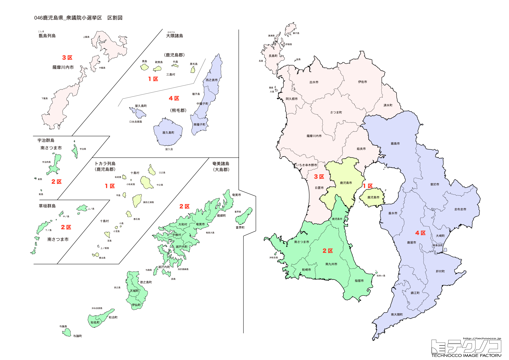

# 鹿児島県



---

## 基本情報

鹿児島県は九州地方の南端に位置し、人口は約158万人で全国24位。県庁所在地は鹿児島市。桜島、屋久島、種子島など特徴的な島々を持ち、南国的な気候が特徴。

歴史的には、島津氏が治めた薩摩藩として発展。幕末には西郷隆盛、大久保利通など明治維新の立役者を輩出した「維新のふるさと」。鹿児島市の仙巌園は島津家の別邸。

経済的には、黒豚、さつまいも（焼酎）、黒牛が名物。屋久杉、奄美大島の大島紬も有名。種子島には宇宙センターがある。

---

## 鹿児島県の政治的争点

### 川内原発の再稼働

九州電力川内原子力発電所は2015年に全国で初めて再稼働した。安全性と地域経済への影響が議論されている。

### 離島振興

屋久島、奄美大島、種子島など多くの離島を抱え、航路・航空路の維持、人口流出対策が課題。

### 桜島の噴火対策

常に噴火を続ける桜島への防災対策が重要な課題。

---

## 選挙の特徴

鹿児島県の衆議院小選挙区は4つ。「維新のふるさと」として歴史遺産が豊富であり、世界自然遺産の屋久島、奄美大島を擁する。

自民党が強い保守的な地域で、2024年の衆院選では4選挙区すべてで自民党が勝利した。川内原発の再稼働問題や離島振興など、地域固有の争点がある。森山裕自民党幹事長（4区）など政界の重鎮を擁する県でもある。

**2026年選挙の構図**: 2026年1月27日公示、2月8日投票の衆院選では、与党（自民党・日本維新の会連立、高市早苗首相）と野党・中道改革連合（立憲民主党と公明党が合流、共同代表：野田佳彦・斉藤鉄夫）の対決となる。元公明党議員は小選挙区から撤退し比例に専念。「維新のふるさと」鹿児島は保守地盤が強く、自民党が優位な構図が続く。

---

## 第1区

### 地域構成

鹿児島1区は鹿児島市で構成される。県庁所在地。

- **鹿児島市**: 人口約59万人の県庁所在地。桜島は市街地の目の前にそびえる活火山で、噴煙を上げ続けている。仙巌園（磯庭園）は島津家の別邸で、世界遺産「明治日本の産業革命遺産」の構成資産。天文館は南九州最大の繁華街。

### 選挙区の特徴

県庁所在地・鹿児島市を中心とする選挙区。桜島を目の前に望む都市型選挙区。保岡宏武（元法務大臣・保岡興治の息子）が議席を持つ。世襲の是非が議論されることも。

### 2024年選挙結果

```
川内博史（立憲）         ███████████████░░░░░  46.0%   80,918票 ✅当選
宮路拓馬（自民）         ██████████████░░░░░░  44.5%   78,221票 🔄比例
昇拓真（参政）          ███░░░░░░░░░░░░░░░░░   9.4%   16,607票 
──────────────────────────────────────────────────────────
投票率: 50.6% ｜ 票差: 2,697票（1.5pt差）
```

### 2026年選挙の構図

```
宮路拓馬（自民・前職）            当選2回
川内博史（中道改革連合・前職）      当選5回
牧野俊一（参政・新人）
小山慎之介（共産・新人）
```

2024年に小選挙区で勝利した川内博史(中道改革連合)が再選を目指す。自民の宮路拓馬(前職)が雪辱を狙い、参政党の牧野俊一、共産の小山慎之介も加わる4人の争い。

---

## 第2区

### 地域構成

鹿児島2区は指宿市、日置市、枕崎市、南さつま市、南九州市、いちき串木野市、三島村、十島村で構成される。県南西部。

- **指宿市**: 指宿温泉、砂むし温泉で有名。菜の花マラソンは1月に開催される。

- **知覧**（南九州市）: 特攻隊の出撃基地があった地で、知覧特攻平和会館がある。武家屋敷群も見どころ。

### 選挙区の特徴

指宿市など県南西部を含む選挙区。指宿温泉や特攻隊の歴史を伝える知覧を擁する。金子万寿夫が5期連続で当選している自民党の牙城。観光振興と平和教育が争点となりやすい。

### 2024年選挙結果

```
三反園訓（無所属）        ███████████████░░░░░  45.9%   80,397票 ✅当選
保岡宏武（自民）         ██████████░░░░░░░░░░  31.3%   54,847票 
辻健太郎（維新）         ███░░░░░░░░░░░░░░░░░  11.2%   19,649票 
松崎真琴（共産）         ██░░░░░░░░░░░░░░░░░░   7.0%   12,255票 
矢竹ゆかり（参政）        █░░░░░░░░░░░░░░░░░░░   4.6%    7,982票 
──────────────────────────────────────────────────────────
投票率: 54.6% ｜ 票差: 25,550票（14.6pt差）
```

### 2026年選挙の構図

```
三反園訓（自民、維新推薦・前職）
高橋徳美（参政・新人）
松崎真琴（共産・新人）
```

2024年に無所属で勝利した三反園訓が自民・維新推薦で再選を目指す。元鹿児島県知事として知名度が高い。参政党の高橋徳美、共産の松崎真琴も加わる3人の争い。

---

## 第3区

### 地域構成

鹿児島3区は薩摩川内市、阿久根市、出水市、伊佐市、霧島市、姶良市、さつま町、長島町、湧水町で構成される。県北部。

- **霧島市**: 霧島温泉郷、霧島神宮で有名。坂本龍馬が新婚旅行で訪れた地として知られる。

- **薩摩川内市**: 九州電力川内原子力発電所がある。

- **出水市**: 出水のツルの渡来地として知られ、毎年1万羽以上のツルが飛来する。

### 選挙区の特徴

霧島市、薩摩川内市など県北部を含む選挙区。川内原発や霧島温泉郷を擁する。宮路拓馬が議席を持つ。原発政策や観光振興が重要な争点。

### 2024年選挙結果

```
野間健（立憲）          ███████████████████░  58.3%  102,762票 ✅当選
小里泰弘（自民）         █████████████░░░░░░░  41.7%   73,630票 
──────────────────────────────────────────────────────────
投票率: 58.1% ｜ 票差: 29,132票（16.5pt差）
```

### 2026年選挙の構図

```
野間健（中道改革連合・前職）      当選3回
小里泰弘（自民・元職）          当選9回
```

2024年に小選挙区で勝利した野間健(中道改革連合)が再選を目指す。元職の小里泰弘(自民)が雪辱を狙う一騎打ち。霧島温泉郷や川内原発を擁する選挙区で、原発政策や観光振興が争点。

---

## 第4区

### 地域構成

鹿児島4区は鹿屋市、垂水市、曽於市、志布志市、西之表市、奄美市、大崎町、東串良町、錦江町、南大隅町、肝付町、中種子町、南種子町、屋久島町、大和村、宇検村、瀬戸内町、龍郷町、喜界町、徳之島町、天城町、伊仙町、和泊町、知名町、与論町で構成される。大隅半島と離島。

- **屋久島**: 屋久杉で有名な世界自然遺産の島。縄文杉は樹齢数千年とも言われる。もののけ姫の森のモデルとも言われる白谷雲水峡が人気。

- **種子島**: JAXA種子島宇宙センターがあり、日本のロケット打ち上げの拠点。鉄砲伝来の地としても知られる。

- **奄美大島**: 2021年に世界自然遺産に登録された。大島紬、黒糖焼酎、鶏飯が有名。

### 選挙区の特徴

大隅半島と屋久島、種子島、奄美大島など離島を含む広大な選挙区。世界自然遺産の屋久島、奄美大島を擁する。森山裕（自民党幹事長）が7期連続で当選している。離島振興が最重要課題であり、森山の政界での影響力が注目される。

### 2024年選挙結果

```
森山裕（自民）          ████████████████████  72.0%  111,484票 ✅当選
山内光典（社民）         █████████░░░░░░░░░░░  28.0%   43,412票 
──────────────────────────────────────────────────────────
投票率: 51.0% ｜ 票差: 68,072票（43.9pt差）
```

### 2026年選挙の構図

```
森山裕（自民、維新推薦・前職）    当選8回
中村寿（国民・新人）
伊藤周平（社民・新人）
桐原郁生（参政・新人）
```

2024年に圧勝した森山裕(自民・党幹事長)が再選を目指す。80歳を超えるベテランで政界での影響力は大きい。国民の中村寿、社民の伊藤周平、参政党の桐原郁生も加わる4人の争い。世界自然遺産の屋久島、奄美大島を擁し、離島振興が最重要課題。

---
