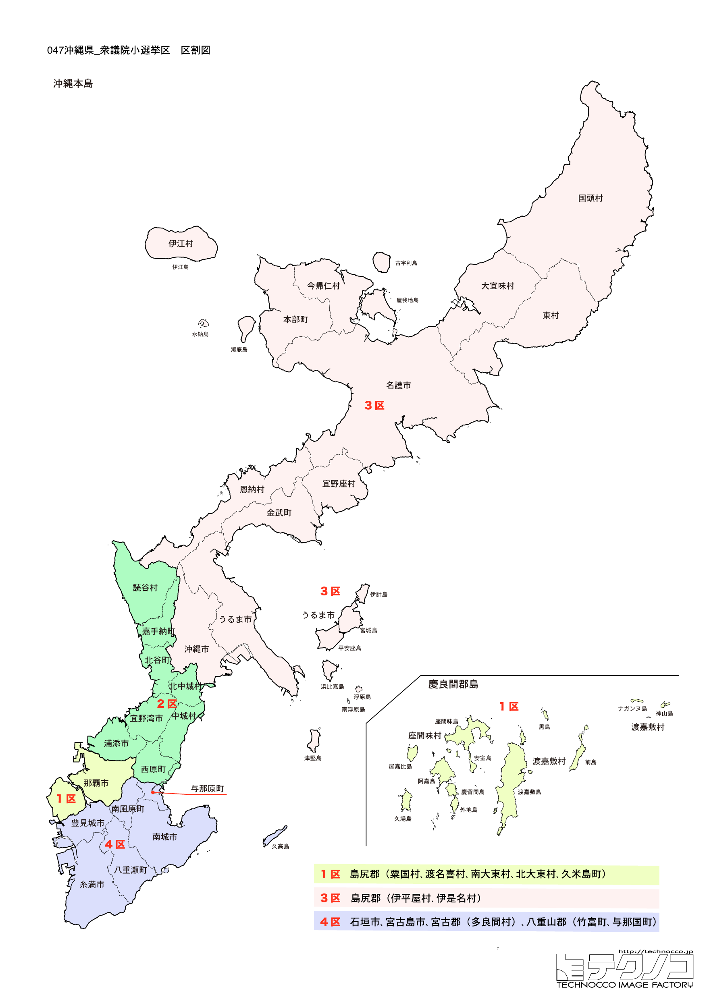

# 沖縄県



---

## 基本情報

沖縄県は日本の最南端・最西端に位置する県で、東シナ海と太平洋に囲まれた160以上の島々から成る。人口は約147万人で、県庁所在地は那覇市。亜熱帯気候に属し、年間を通じて温暖で、独自の自然環境と文化を持つ。

歴史的には、15世紀から19世紀まで琉球王国として独立した国家を形成していた。中国・日本・東南アジアとの中継貿易で栄え、独自の言語・文化・宗教を発展させた。1879年の琉球処分により日本に併合され、沖縄県となった。

第二次世界大戦末期の1945年、沖縄は日本国内で唯一の地上戦の舞台となり、県民の4人に1人が犠牲になったとされる。戦後は27年間にわたりアメリカの統治下に置かれ、1972年に日本に復帰した。

経済的には、観光業が主要産業で、首里城、美ら海水族館、慶良間諸島など多くの観光資源を持つ。泡盛、ゴーヤーチャンプルー、沖縄そばなど独自の食文化も魅力。

---

## 沖縄県の政治的争点

### 辺野古新基地建設問題

普天間飛行場の辺野古移設をめぐる問題は、沖縄政治の最大の争点である。2019年県民投票で43万票が反対（投票者の7割超）を示したが、政府は工事を進めている。

### オール沖縄の現状と課題

「オール沖縄」は保革を超えた勢力として沖縄政治を主導してきたが、保守系・経済界の離脱、中道改革連合の登場など、構図が複雑化している。

### 自衛隊配備強化

中国の海洋進出を背景に、宮古島、石垣島、与那国島での自衛隊配備が急速に進んでいる。「抑止力強化」を歓迎する声と「有事の際に標的になる」と懸念する声が分かれている。

---

## 選挙の特徴

沖縄県の衆議院小選挙区は4つ。2017年の区割り変更で3選挙区から4選挙区に増加した。

本土の保守・革新という二項対立とは異なる独自の政治構図がある。国土面積の約0.6%しかない沖縄に、在日米軍専用施設の約70%が集中しており、基地問題は県政の最大の課題。1990年代以降、米軍基地の整理縮小を求める「オール沖縄」と呼ばれる保革を超えた勢力が形成されたが、近年は保守系・経済界の離脱が進み、勢力図は流動化している。

2024年の衆院選では、共産党が1区、社民党が2区、立憲民主党が3区で勝利し、自民党は4区のみの勝利となった。

**2026年選挙の構図**: 2026年1月27日公示、2月8日投票の衆院選では、与党（自民党・日本維新の会連立、高市早苗首相）と野党・中道改革連合（立憲民主党と公明党が合流、共同代表：野田佳彦・斉藤鉄夫）の対決に加え、沖縄独自の「オール沖縄」勢力が絡む複雑な構図となる。元公明党議員は小選挙区から撤退し比例に専念。従来自民候補を支援してきた公明党・創価学会票の行方が注目される。また、社民党系議員の一部が中道改革連合に参加したことで、オール沖縄内の分裂も懸念される。

---

## 第1区

### 地域構成

沖縄1区は、県庁所在地の那覇市と、周辺離島の渡嘉敷村、座間味村、粟国村、渡名喜村、南大東村、北大東村、久米島町で構成される。県の政治・経済・文化の中心地を含む都市型選挙区である。

- **那覇市**: 人口約32万人の県庁所在地で、沖縄の玄関口である。首里城は琉球王国の王宮として築かれ、2000年に世界遺産に登録された。2019年の火災で正殿などが焼失したが、現在復元工事が進められている。国際通りは約1.6kmのメインストリートで、観光客で賑わう繁華街。

- **渡嘉敷島・座間味島**: 慶良間諸島に属し、「ケラマブルー」と呼ばれる透明度の高い海で知られる。ダイビングやシュノーケリングの聖地として世界的に有名。

- **久米島**: 「球美の島」（美しい島）と讃えられ、久米島紬は国の重要無形文化財。はての浜は東洋一美しいとも言われる砂浜だけの無人島。

### 選挙区の特徴

県庁所在地・那覇市と周辺離島を含む都市型選挙区。首里城を擁し、沖縄の政治・経済・文化の中心地。共産党の赤嶺政賢が9期連続で当選しており、「オール沖縄」の象徴的存在として辺野古新基地建設反対を訴え続けている。公明党・創価学会票の動向が選挙結果を左右する注目選挙区。

### 2024年選挙結果

```
赤嶺政賢（共産）         ████████████░░░░░░░░  38.1%   49,838票 ✅当選
國場幸之助（自民）        ██████████░░░░░░░░░░  32.2%   42,104票 🔄比例
下地幹郎（無所属）        ███████░░░░░░░░░░░░░  22.6%   29,615票 
和田知久（参政）         ██░░░░░░░░░░░░░░░░░░   7.1%    9,271票 
──────────────────────────────────────────────────────────
投票率: 50.8% ｜ 票差: 7,734票（5.9pt差）
```

### 2026年選挙の構図

赤嶺政賢（共産・現職、77歳）と国場幸之助（自民・現職）の対決。公明党・創価学会が中道改革連合に参加したことで、従来自民候補に流れていた学会票の行方が注目される。

---

## 第2区

### 地域構成

沖縄2区は、宜野湾市、浦添市、中頭郡（北中城村、中城村、西原町、北谷町、嘉手納町、読谷村）で構成される。米軍基地が集中する地域であり、基地問題が最も先鋭化する選挙区。

- **宜野湾市**: 人口約10万人で、市の約25%を米軍普天間飛行場が占める。普天間飛行場は住宅密集地の真ん中にあり、「世界一危険な基地」と呼ばれている。

- **北谷町**: 「アメリカンビレッジ」で知られる観光地。米軍基地返還跡地を再開発し、アメリカンテイストの商業施設やビーチリゾートが集まる。

- **嘉手納町**: 町面積の約82%を嘉手納飛行場が占める。嘉手納基地は極東最大の米空軍基地。

- **読谷村**: 人口約4万人の日本一人口が多い村。やちむん（焼き物）の里として知られる。

### 選挙区の特徴

宜野湾市、浦添市など米軍基地が集中する地域を含む選挙区。「世界一危険な基地」と呼ばれる普天間飛行場を擁し、基地問題が最も先鋭化する選挙区。社民党系の新垣邦男が議席を持つが、中道改革連合への参加で「オール沖縄」内に分裂が生じている。

### 2024年選挙結果

```
新垣邦男（社民）         ██████████████░░░░░░  42.0%   61,216票 ✅当選
宮崎政久（自民）         ██████████░░░░░░░░░░  32.5%   47,272票 🔄比例
赤嶺昇（維新）          █████░░░░░░░░░░░░░░░  15.8%   22,959票 
今野麻美（参政）         ██░░░░░░░░░░░░░░░░░░   8.1%   11,813票 
比嘉隆（無所属）         ░░░░░░░░░░░░░░░░░░░░   1.6%    2,374票 
──────────────────────────────────────────────────────────
投票率: 50.4% ｜ 票差: 13,944票（9.6pt差）
```

### 2026年選挙の構図

新垣邦男（中道改革連合・現職）と宮崎政久（自民・現職）の対決。新垣が社民党を離党し中道改革連合に参加したため、社民党が独自候補擁立を検討しており、オール沖縄の分裂選挙となる可能性がある。

---

## 第3区

### 地域構成

沖縄3区は、名護市、沖縄市、うるま市、国頭郡（国頭村、大宜味村、東村、今帰仁村、本部町、恩納村、宜野座村、金武町、伊江村）、島尻郡（伊平屋村、伊是名村）で構成される。

- **名護市**: 沖縄本島北部の中心都市で、人口約6万人。辺野古は名護市に位置し、普天間飛行場の移設先として日米両政府が合意した新基地建設予定地。

- **沖縄市**: 人口約14万人で、県内第2位の都市。かつては「コザ市」と呼ばれ、1970年の「コザ暴動」は沖縄の本土復帰運動を加速させる契機となった。

- **本部町**: 沖縄美ら海水族館の所在地として有名。美ら海水族館は年間約300万人が訪れる沖縄最大の観光施設。

- **国頭村・大宜味村・東村**: 「やんばる」と呼ばれる亜熱帯の森が広がる地域。2021年に世界自然遺産に登録された。

### 選挙区の特徴

名護市、沖縄市、うるま市など沖縄本島中部から北部を含む広大な選挙区。辺野古を含むことから基地問題の最前線となる。立憲民主党の屋良朝博が議席を持つ。やんばる（世界自然遺産）や美ら海水族館など観光資源も豊富。

### 2024年選挙結果

```
島尻安伊子（自民）        ███████████████░░░░░  46.7%   73,226票 ✅当選
屋良朝博（立憲）         ███████████████░░░░░  45.5%   71,457票 🔄比例
新城司（参政）          ██░░░░░░░░░░░░░░░░░░   7.8%   12,242票 
──────────────────────────────────────────────────────────
投票率: 50.3% ｜ 票差: 1,769票（1.1pt差）
```

### 2026年選挙の構図

屋良朝博（中道改革連合・現職）と島尻安伊子（自民・前職）の再戦。辺野古を抱える選挙区で、中道改革連合の曖昧な基地政策がどう評価されるかが注目される。

---

## 第4区

### 地域構成

沖縄4区は、糸満市、豊見城市、南城市、島尻郡（与那原町、南風原町、八重瀬町）、宮古島市、宮古郡（多良間村）、石垣市、八重山郡（竹富町、与那国町）で構成される。

- **糸満市**: 沖縄戦終焉の地。1945年6月23日に日本軍の組織的戦闘が終結した摩文仁の丘には、「平和の礎」がある。毎年6月23日の「慰霊の日」には沖縄全戦没者追悼式が行われる。

- **宮古島市**: 宮古ブルーと呼ばれる透明度の高い海が最大の魅力。与那覇前浜ビーチは「東洋一美しいビーチ」と称される。2019年に陸上自衛隊宮古島駐屯地が開設され、ミサイル部隊が配備されている。

- **石垣市**: 八重山諸島の中心で、台湾まで約270kmという国境の島。2023年には陸上自衛隊石垣駐屯地が開設され、地対艦・地対空ミサイル部隊が配備された。

- **与那国町**: 日本最西端の島で、台湾まで約111km。2016年に陸上自衛隊与那国駐屯地が開設されている。

### 選挙区の特徴

糸満市、豊見城市など本島南部と、宮古島、石垣島など離島を含む広大な選挙区。沖縄戦終焉の地・糸満市や自衛隊配備が進む宮古島・石垣島を擁する。自民党の西銘恒三郎が議席を持つ。離島での自衛隊配備強化への賛否が争点。

### 2024年選挙結果

```
西銘恒三郎（自民）        ██████████████░░░░░░  43.4%   61,289票 ✅当選
金城徹（立憲）          ███████████░░░░░░░░░  33.4%   47,248票 
山川仁（れいわ）         ████░░░░░░░░░░░░░░░░  14.4%   20,284票 🔄比例
山川泰博（維新）         ██░░░░░░░░░░░░░░░░░░   8.8%   12,481票 
──────────────────────────────────────────────────────────
投票率: 48.4% ｜ 票差: 14,041票（9.9pt差）
```

### 2026年選挙の構図

西銘恒三郎（自民・現職）と野党候補の対決。野党候補が乱立する構図となっており、離島での自衛隊配備強化への賛否も争点。

---
